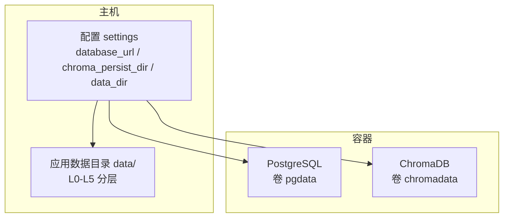
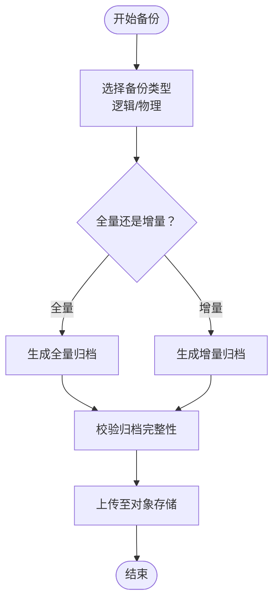
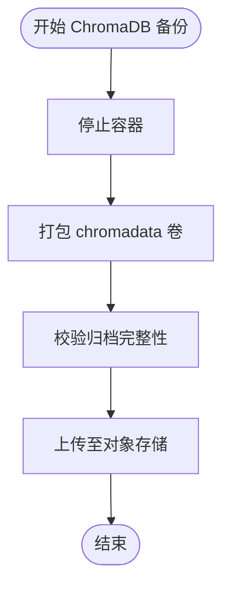
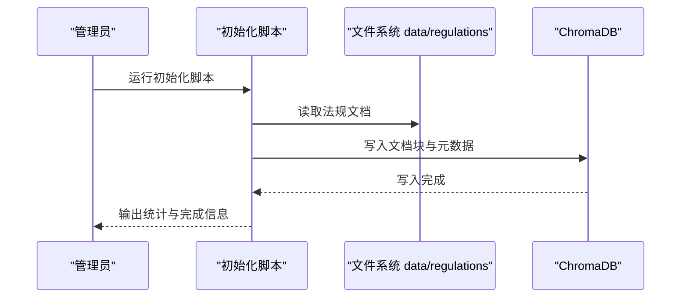
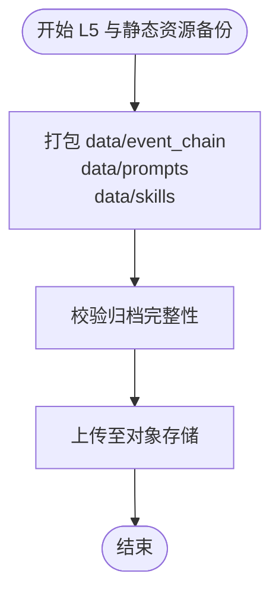
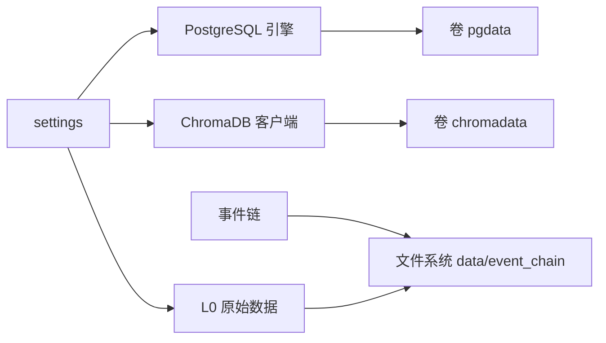

# 备份与恢复

<cite>
**本文引用的文件**
- [docker-compose.yml](file://docker-compose.yml)
- [backend/app/config.py](file://backend/app/config.py)
- [backend/app/models/database.py](file://backend/app/models/database.py)
- [backend/app/knowledge/store.py](file://backend/app/knowledge/store.py)
- [backend/app/storage/raw_store.py](file://backend/app/storage/raw_store.py)
- [backend/app/storage/event_store.py](file://backend/app/storage/event_store.py)
- [backend/scripts/init_knowledge.py](file://backend/scripts/init_knowledge.py)
- [backend/scripts/migrate_storage.py](file://backend/scripts/migrate_storage.py)
- [backend/scripts/fetch_regulations.py](file://backend/scripts/fetch_regulations.py)
- [backend/requirements.txt](file://backend/requirements.txt)
</cite>

## 目录
1. [简介](#简介)
2. [项目结构](#项目结构)
3. [核心组件](#核心组件)
4. [架构总览](#架构总览)
5. [详细组件分析](#详细组件分析)
6. [依赖关系分析](#依赖关系分析)
7. [性能考量](#性能考量)
8. [故障排查指南](#故障排查指南)
9. [结论](#结论)
10. [附录](#附录)

## 简介
本指南围绕数据库、向量数据库、知识库数据、配置与静态资源的备份与恢复策略展开，结合代码库中的配置与实现，给出可落地的备份方案、灾难恢复计划（RTO/RPO）、自动化脚本与恢复测试流程，并覆盖数据迁移与升级过程中的备份要点。

## 项目结构
项目采用分层存储与容器化部署：
- 数据持久化位置
  - PostgreSQL：容器卷 pgdata
  - ChromaDB：容器卷 chromadata
  - 应用数据目录 data/ 下的 L0-L5 分层文件存储
- 关键配置
  - 数据库连接字符串、Chroma 持久化目录、数据根目录等均来自配置对象



图表来源
- [docker-compose.yml:1-31](file://docker-compose.yml#L1-L31)
- [backend/app/config.py:1-75](file://backend/app/config.py#L1-L75)

章节来源
- [docker-compose.yml:1-31](file://docker-compose.yml#L1-L31)
- [backend/app/config.py:1-75](file://backend/app/config.py#L1-L75)

## 核心组件
- 数据库（PostgreSQL）
  - 使用异步 SQLAlchemy 引擎连接数据库，容器化部署并通过卷持久化
- 向量数据库（ChromaDB）
  - 本地持久化客户端，基于配置的持久化目录
- 知识库与事件链
  - 知识库：按市场分集合，文档与元数据写入 ChromaDB
  - 事件链：系统事件与用户操作链以 JSON 文件形式存储于 data/event_chain
- 原始数据存储
  - L0 原始数据以 JSON 文件形式缓存于内存，来源于 data/raw

章节来源
- [backend/app/models/database.py:1-15](file://backend/app/models/database.py#L1-L15)
- [backend/app/knowledge/store.py:1-227](file://backend/app/knowledge/store.py#L1-L227)
- [backend/app/storage/event_store.py:1-269](file://backend/app/storage/event_store.py#L1-L269)
- [backend/app/storage/raw_store.py:1-134](file://backend/app/storage/raw_store.py#L1-L134)
- [backend/app/config.py:1-75](file://backend/app/config.py#L1-L75)

## 架构总览
下图展示备份与恢复涉及的主要数据实体与持久化位置：

```mermaid
graph TB
subgraph "应用层"
APP["FastAPI 应用"]
KNOW["知识库ChromaDB"]
EVT["事件链JSON 文件"]
RAW["原始数据JSON 缓存"]
end
subgraph "数据库层"
PG["PostgreSQL"]
end
subgraph "持久化卷"
V_PG["卷 pgdata"]
V_CH["卷 chromadata"]
end
subgraph "配置"
CFG["settingsdatabase_url / chroma_persist_dir / data_dir"]
end
CFG --> PG
CFG --> V_CH
CFG --> V_PG
CFG --> RAW
APP --> KNOW
APP --> EVT
APP --> RAW
PG <- --> V_PG
KNOW <- --> V_CH
```

图表来源
- [docker-compose.yml:1-31](file://docker-compose.yml#L1-L31)
- [backend/app/config.py:1-75](file://backend/app/config.py#L1-L75)
- [backend/app/knowledge/store.py:1-227](file://backend/app/knowledge/store.py#L1-L227)
- [backend/app/storage/event_store.py:1-269](file://backend/app/storage/event_store.py#L1-L269)
- [backend/app/storage/raw_store.py:1-134](file://backend/app/storage/raw_store.py#L1-L134)

## 详细组件分析

### 数据库备份与恢复（PostgreSQL）
- 持久化位置
  - 容器卷 pgdata 挂载至 PostgreSQL 数据目录
- 备份策略
  - 逻辑备份（推荐）
    - 使用容器内或宿主机上的逻辑导出工具，定期生成 SQL 归档
    - 支持选择性导出（schema、表、数据）与增量标记
  - 物理备份（可选）
    - 在数据库空闲时段停止容器，打包 pgdata 卷
    - 恢复时替换卷内容并重启容器
- 增量与全量
  - 全量：周期性生成完整归档
  - 增量：结合 WAL 归档与时间点恢复（PITR），或基于逻辑导出的差异归档
- RTO/RPO 建议
  - RPO：分钟级（每日全量 + 每小时增量）
  - RTO：小时级（自动化恢复脚本 + 健康检查）
- 恢复流程
  - 逻辑恢复：导入 SQL 归档至新实例或容器
  - 物理恢复：替换 pgdata 卷后启动容器
- 自动化建议
  - 定时任务执行逻辑导出，校验完整性后上传至对象存储
  - 提供一键恢复脚本，包含停止服务、替换数据、启动服务与健康检查



图表来源
- [docker-compose.yml:1-31](file://docker-compose.yml#L1-L31)
- [backend/app/models/database.py:1-15](file://backend/app/models/database.py#L1-L15)

章节来源
- [docker-compose.yml:1-31](file://docker-compose.yml#L1-L31)
- [backend/app/models/database.py:1-15](file://backend/app/models/database.py#L1-L15)

### 向量数据库备份与恢复（ChromaDB）
- 持久化位置
  - 容器卷 chromadata 挂载至 ChromaDB 持久化目录
  - 应用通过配置项设置持久化目录
- 备份策略
  - 物理备份（推荐）
    - 停止容器后打包 chromadata 卷
    - 恢复时替换卷内容并重启容器
  - 逻辑备份（可选）
    - 通过 ChromaDB API 导出集合数据（若支持）
    - 结合元数据与文档重建集合
- RTO/RPO 建议
  - RPO：分钟级（每日全量 + 每小时增量）
  - RTO：小时级（自动化脚本 + 健康检查）
- 恢复流程
  - 物理恢复：替换 chromadata 卷后启动容器
  - 逻辑恢复：重建集合并导入数据
- 自动化建议
  - 定时打包 chromadata 卷，上传对象存储
  - 提供一键恢复脚本，包含停止服务、替换数据、启动服务与健康检查



图表来源
- [docker-compose.yml:20-28](file://docker-compose.yml#L20-L28)
- [backend/app/config.py:39-41](file://backend/app/config.py#L39-L41)
- [backend/app/knowledge/store.py:43-51](file://backend/app/knowledge/store.py#L43-L51)

章节来源
- [docker-compose.yml:20-28](file://docker-compose.yml#L20-L28)
- [backend/app/config.py:39-41](file://backend/app/config.py#L39-L41)
- [backend/app/knowledge/store.py:43-51](file://backend/app/knowledge/store.py#L43-L51)

### 知识库数据备份与恢复（向量化数据与元数据）
- 数据来源与结构
  - 文档分块与元数据来自 data/regulations 目录
  - 写入 ChromaDB，按市场分集合
- 备份策略
  - 向量化数据：依赖 ChromaDB 物理备份
  - 元数据：随文档一起写入，无需单独备份
- 恢复流程
  - 通过 ChromaDB 物理恢复或逻辑重建集合
  - 如需重建，可使用初始化脚本从 data/regulations 重新写入
- 自动化建议
  - 定期备份 chromadata 卷
  - 提供初始化脚本的恢复流程，支持按市场重建



图表来源
- [backend/scripts/init_knowledge.py:1-129](file://backend/scripts/init_knowledge.py#L1-L129)
- [backend/app/knowledge/loader.py:1-142](file://backend/app/knowledge/loader.py#L1-L142)
- [backend/app/knowledge/store.py:81-104](file://backend/app/knowledge/store.py#L81-L104)

章节来源
- [backend/scripts/init_knowledge.py:1-129](file://backend/scripts/init_knowledge.py#L1-L129)
- [backend/app/knowledge/loader.py:1-142](file://backend/app/knowledge/loader.py#L1-L142)
- [backend/app/knowledge/store.py:81-104](file://backend/app/knowledge/store.py#L81-L104)

### 事件链与配置文件的备份与恢复
- 事件链（L5）
  - 以 JSON 文件形式存储于 data/event_chain，结构稳定，适合文件级备份
- 配置文件与静态资源
  - 配置 settings 位于 backend/app/config.py
  - 静态资源位于 data/prompts、data/skills 等目录
- 备份策略
  - 文件级备份：tar/zip 打包 data/event_chain、data/prompts、data/skills 等
  - 配置文件：.env 与 settings.py 变更需纳入版本管理
- 恢复流程
  - 恢复 data/event_chain 与静态资源目录
  - 重启应用后验证事件链与提示词加载
- 自动化建议
  - 定期打包 data/event_chain、data/prompts、data/skills
  - 提供恢复脚本，覆盖文件替换与应用重启



图表来源
- [backend/app/storage/event_store.py:1-269](file://backend/app/storage/event_store.py#L1-L269)
- [backend/app/config.py:45-49](file://backend/app/config.py#L45-L49)

章节来源
- [backend/app/storage/event_store.py:1-269](file://backend/app/storage/event_store.py#L1-L269)
- [backend/app/config.py:45-49](file://backend/app/config.py#L45-L49)

### 原始数据（L0）的备份与恢复
- 存储与加载
  - L0 原始数据以 JSON 文件形式缓存于内存，来源于 data/raw
- 备份策略
  - 文件级备份：备份 data/raw 目录
  - 恢复：替换 data/raw 后，应用热加载或重启
- 自动化建议
  - 定期备份 data/raw
  - 提供恢复脚本与热加载命令

章节来源
- [backend/app/storage/raw_store.py:1-134](file://backend/app/storage/raw_store.py#L1-L134)

### 数据迁移与升级过程中的备份策略
- 迁移脚本
  - 提供数据迁移脚本，将旧结构迁移至 L0-L5 分层
- 备份要点
  - 迁移前对源数据与目标目录进行快照或备份
  - 迁移后验证数据一致性与完整性
- 自动化建议
  - 迁移脚本集成备份与校验步骤
  - 提供回滚脚本，快速恢复到迁移前状态

章节来源
- [backend/scripts/migrate_storage.py:1-99](file://backend/scripts/migrate_storage.py#L1-L99)

## 依赖关系分析
- 组件耦合
  - 应用通过配置对象集中管理数据库与存储路径
  - ChromaDB 依赖持久化目录与容器卷
  - 事件链与原始数据依赖文件系统
- 外部依赖
  - PostgreSQL、ChromaDB 通过容器运行
  - Python 依赖见 requirements.txt



图表来源
- [backend/app/config.py:1-75](file://backend/app/config.py#L1-L75)
- [backend/app/knowledge/store.py:43-51](file://backend/app/knowledge/store.py#L43-L51)
- [backend/app/storage/event_store.py:1-269](file://backend/app/storage/event_store.py#L1-L269)
- [backend/requirements.txt:1-27](file://backend/requirements.txt#L1-L27)

章节来源
- [backend/app/config.py:1-75](file://backend/app/config.py#L1-L75)
- [backend/app/knowledge/store.py:43-51](file://backend/app/knowledge/store.py#L43-L51)
- [backend/app/storage/event_store.py:1-269](file://backend/app/storage/event_store.py#L1-L269)
- [backend/requirements.txt:1-27](file://backend/requirements.txt#L1-L27)

## 性能考量
- 备份窗口
  - 逻辑备份对数据库与 ChromaDB 的影响较小，建议在业务低峰期执行
- 并发与一致性
  - 物理备份需停机或锁定，建议评估停机窗口
- 存储与传输
  - 对大文件进行压缩与分片，提升传输稳定性
- 恢复验证
  - 恢复后进行健康检查与关键查询验证，确保数据可用性

## 故障排查指南
- 数据库
  - 检查容器健康检查与日志
  - 校验逻辑/物理备份归档完整性
- ChromaDB
  - 校验持久化目录权限与空间
  - 恢复后检查集合数量与文档计数
- 事件链与静态资源
  - 校验 data/event_chain、data/prompts、data/skills 目录权限
  - 应用重启后验证事件链与提示词加载
- 原始数据
  - 校验 data/raw 目录完整性
  - 应用热加载或重启后验证数据可用

章节来源
- [docker-compose.yml:14-18](file://docker-compose.yml#L14-L18)
- [backend/app/knowledge/store.py:195-210](file://backend/app/knowledge/store.py#L195-L210)
- [backend/app/storage/event_store.py:160-170](file://backend/app/storage/event_store.py#L160-L170)

## 结论
本指南基于代码库中的配置与实现，提出了数据库与向量数据库的备份与恢复策略、知识库数据的同步备份方法、配置与静态资源的版本管理建议、灾难恢复计划与自动化脚本思路，并覆盖了数据迁移与升级过程中的备份要点。建议结合生产环境的实际负载与合规要求，细化备份频率、恢复流程与演练计划。

## 附录
- 关键配置项
  - 数据库连接字符串、Chroma 持久化目录、数据根目录
- 常用脚本
  - 初始化知识库、迁移脚本、下载法规文档

章节来源
- [backend/app/config.py:17-44](file://backend/app/config.py#L17-L44)
- [backend/scripts/init_knowledge.py:1-129](file://backend/scripts/init_knowledge.py#L1-L129)
- [backend/scripts/migrate_storage.py:1-99](file://backend/scripts/migrate_storage.py#L1-L99)
- [backend/scripts/fetch_regulations.py:1-434](file://backend/scripts/fetch_regulations.py#L1-L434)