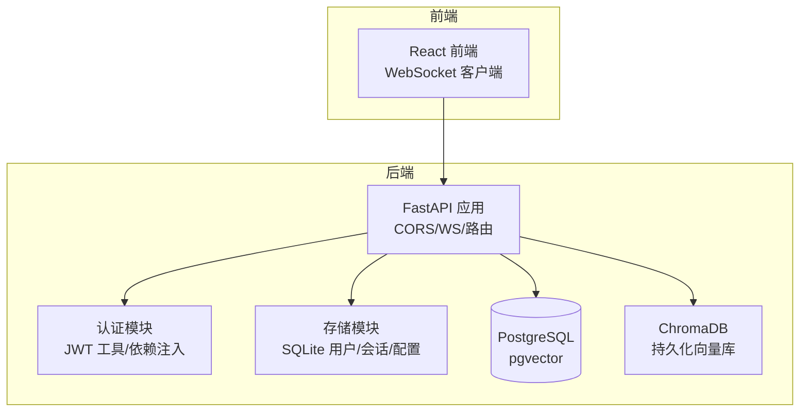
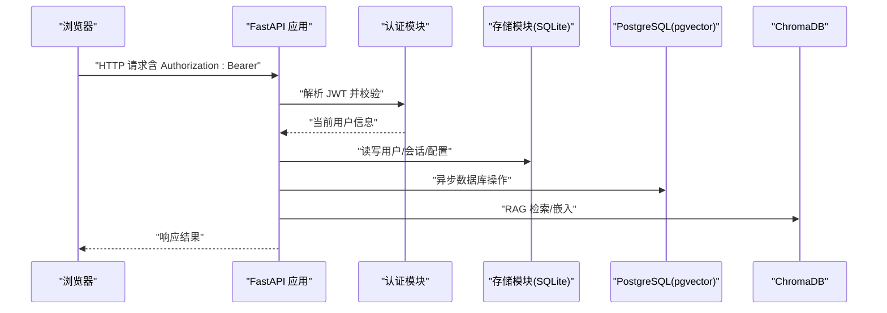
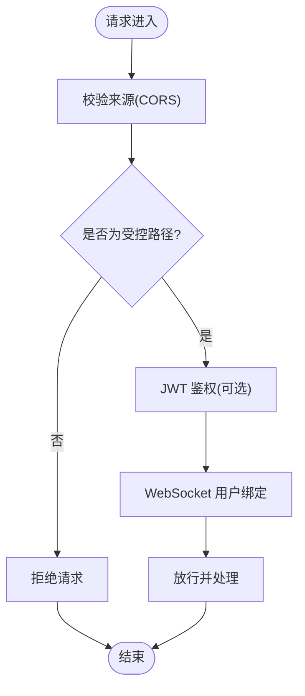
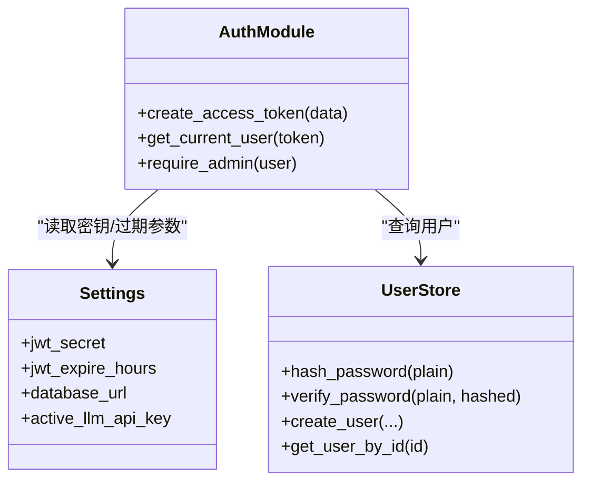
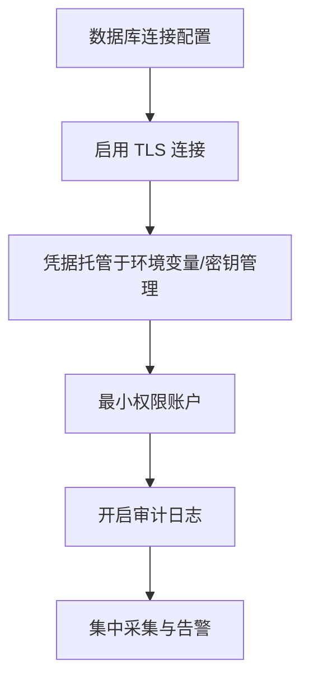
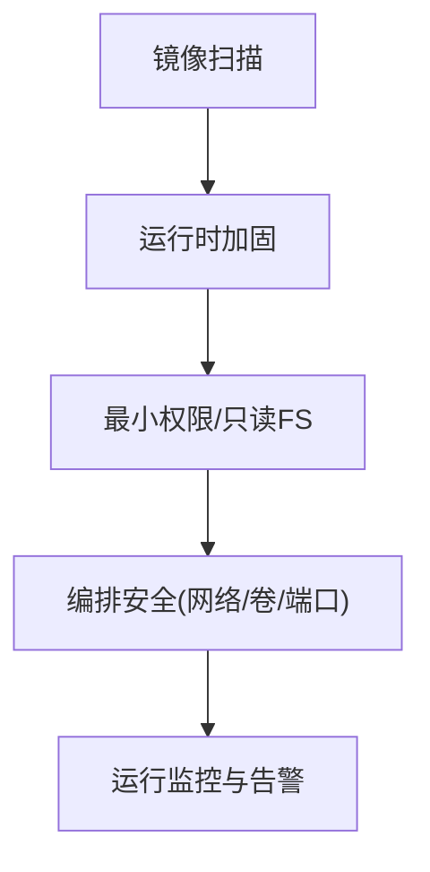
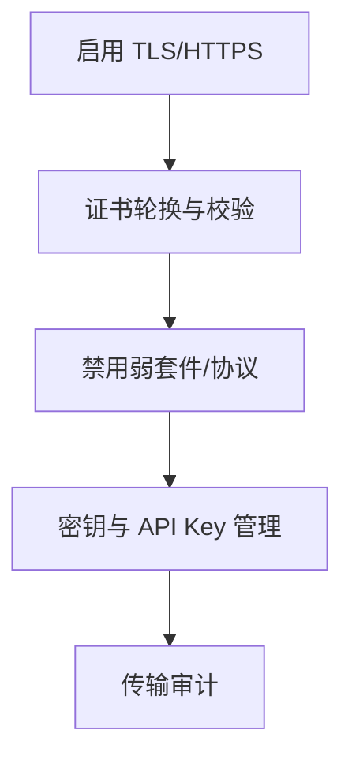
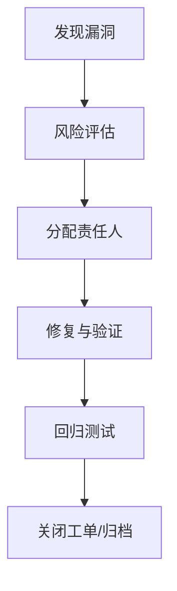
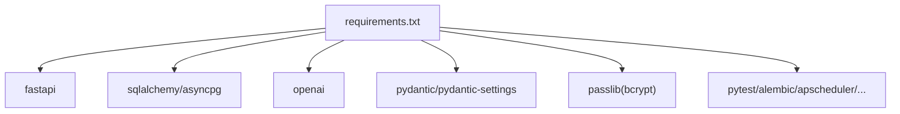

# 安全加固

<cite>
**本文引用的文件**
- [backend/app/main.py](file://backend/app/main.py)
- [backend/app/config.py](file://backend/app/config.py)
- [backend/app/models/database.py](file://backend/app/models/database.py)
- [backend/app/api/auth.py](file://backend/app/api/auth.py)
- [backend/app/core/auth.py](file://backend/app/core/auth.py)
- [backend/app/storage/user_store.py](file://backend/app/storage/user_store.py)
- [backend/docker-compose.yml](file://backend/docker-compose.yml)
- [backend/requirements.txt](file://backend/requirements.txt)
- [README.md](file://README.md)
</cite>

## 目录
1. [简介](#简介)
2. [项目结构](#项目结构)
3. [核心组件](#核心组件)
4. [架构总览](#架构总览)
5. [详细组件分析](#详细组件分析)
6. [依赖分析](#依赖分析)
7. [性能考虑](#性能考虑)
8. [故障排查指南](#故障排查指南)
9. [结论](#结论)
10. [附录](#附录)

## 简介
本实施方案面向“避风港—跨境合规智能体”项目，围绕网络安全、应用安全、数据库安全、容器安全、数据传输安全、漏洞扫描与修复流程以及合规与审计要点，提供一套可落地的安全加固策略。通过对现有代码与配置的分析，识别当前实现中的安全薄弱环节，并给出针对性的改进措施与最佳实践。

## 项目结构
后端采用 FastAPI + SQLAlchemy 异步 ORM + SQLite 存储，结合 ChromaDB 向量库与 Codex SDK 的合规推理能力。前端使用 React + TypeScript，通过 WebSocket 实现实时推送。整体通过 docker-compose 编排数据库与向量库服务。

图表来源
- [backend/app/main.py:1-76](file://backend/app/main.py#L1-L76)
- [backend/docker-compose.yml:1-31](file://backend/docker-compose.yml#L1-L31)

章节来源
- [README.md:92-200](file://README.md#L92-L200)
- [backend/app/main.py:1-76](file://backend/app/main.py#L1-L76)
- [backend/docker-compose.yml:1-31](file://backend/docker-compose.yml#L1-L31)

## 核心组件
- 应用入口与中间件：CORS 配置、WebSocket 端点、生命周期钩子。
- 配置管理：基于 pydantic-settings 的 Settings 类，集中管理数据库连接、LLM 凭据、JWT 密钥等。
- 认证与授权：基于 JWT 的 Bearer Token，OAuth2PasswordBearer 适配，角色校验（admin/user）。
- 存储层：SQLite 用户表（bcrypt 哈希）、会话与配置存储；数据库连接通过 asyncpg。
- 基础设施编排：docker-compose 启动 PostgreSQL（pgvector）与 ChromaDB。

章节来源
- [backend/app/main.py:1-76](file://backend/app/main.py#L1-L76)
- [backend/app/config.py:1-75](file://backend/app/config.py#L1-L75)
- [backend/app/models/database.py:1-15](file://backend/app/models/database.py#L1-L15)
- [backend/app/core/auth.py:1-60](file://backend/app/core/auth.py#L1-L60)
- [backend/app/storage/user_store.py:1-133](file://backend/app/storage/user_store.py#L1-L133)
- [backend/docker-compose.yml:1-31](file://backend/docker-compose.yml#L1-L31)

## 架构总览
下图展示从浏览器到后端 API、数据库与向量库的整体交互路径，以及认证与授权的关键节点。

图表来源
- [backend/app/main.py:1-76](file://backend/app/main.py#L1-L76)
- [backend/app/core/auth.py:1-60](file://backend/app/core/auth.py#L1-L60)
- [backend/app/storage/user_store.py:1-133](file://backend/app/storage/user_store.py#L1-L133)
- [backend/app/models/database.py:1-15](file://backend/app/models/database.py#L1-L15)

## 详细组件分析

### 网络安全与端口管理
- CORS 配置：允许本地开发源（如前端开发服务器端口），生产环境应收紧来源白名单。
- WebSocket 端点：无需认证即可建立连接，但消息推送基于用户维度；建议在接入层增加鉴权与速率限制。
- 端口暴露：docker-compose 将数据库与向量库映射至宿主机，生产环境应避免直接对外暴露，使用内网访问或反向代理。

图表来源
- [backend/app/main.py:13-19](file://backend/app/main.py#L13-L19)
- [backend/app/main.py:40-56](file://backend/app/main.py#L40-L56)

章节来源
- [backend/app/main.py:13-19](file://backend/app/main.py#L13-L19)
- [backend/app/main.py:40-56](file://backend/app/main.py#L40-L56)
- [backend/docker-compose.yml:10-25](file://backend/docker-compose.yml#L10-L25)

### 应用安全：JWT 令牌管理、API 密钥保护与访问控制
- JWT 密钥与过期时间：当前默认密钥与较长有效期，生产环境必须替换为强随机密钥并缩短过期时间。
- 令牌签发与校验：使用 HS256 算法，依赖全局密钥；建议引入密钥轮换与多密钥验证策略。
- 访问控制：提供 require_admin 依赖，确保敏感接口仅管理员可用；建议对所有受保护接口统一添加依赖注入。
- 密码存储：使用 bcrypt 哈希，强度足够；建议强制密码复杂度与定期更换策略。

图表来源
- [backend/app/core/auth.py:1-60](file://backend/app/core/auth.py#L1-L60)
- [backend/app/storage/user_store.py:1-133](file://backend/app/storage/user_store.py#L1-L133)
- [backend/app/config.py:65-68](file://backend/app/config.py#L65-L68)

章节来源
- [backend/app/core/auth.py:14-59](file://backend/app/core/auth.py#L14-L59)
- [backend/app/api/auth.py:54-107](file://backend/app/api/auth.py#L54-L107)
- [backend/app/storage/user_store.py:38-43](file://backend/app/storage/user_store.py#L38-L43)
- [backend/app/config.py:65-68](file://backend/app/config.py#L65-L68)

### 数据库安全配置：连接加密、用户权限与审计
- 连接字符串：当前为明文 URL，建议使用 TLS 连接（如 sslmode=require），并在环境变量中管理。
- 用户权限：数据库用户最小权限原则，分离只读与写入账户；限制 DDL 权限。
- 审计日志：建议开启数据库审计（如审计登录、DDL/DML 操作），并集中采集与告警。

图表来源
- [backend/app/config.py:17-18](file://backend/app/config.py#L17-L18)
- [backend/app/models/database.py:7-8](file://backend/app/models/database.py#L7-L8)

章节来源
- [backend/app/config.py:17-18](file://backend/app/config.py#L17-L18)
- [backend/app/models/database.py:7-8](file://backend/app/models/database.py#L7-L8)

### 容器安全最佳实践：镜像扫描、运行时安全与特权管理
- 镜像扫描：使用 Trivy/Clair/Snyk 等工具对基础镜像与依赖进行漏洞扫描。
- 运行时安全：以非 root 用户运行容器；移除不必要的包与工具；限制资源配额。
- 特权管理：避免 privileged 模式；禁用 sys_admin 能力；挂载只读根文件系统。
- 编排安全：docker-compose 中避免将敏感端口直接映射到宿主；使用网络隔离与只读卷。

图表来源
- [backend/docker-compose.yml:1-31](file://backend/docker-compose.yml#L1-L31)

章节来源
- [backend/docker-compose.yml:1-31](file://backend/docker-compose.yml#L1-L31)

### 数据传输安全：TLS 配置与证书管理
- 传输加密：数据库连接建议启用 SSL/TLS；WebSocket 在生产环境建议走 HTTPS。
- 证书管理：使用受信 CA 签发的证书；定期轮换；禁用弱密码套件与过时协议。
- 机密保护：API Key 与密钥通过环境变量或密钥管理服务注入，避免硬编码。

图表来源
- [backend/app/config.py:17-24](file://backend/app/config.py#L17-L24)
- [backend/app/main.py:13-19](file://backend/app/main.py#L13-L19)

章节来源
- [backend/app/config.py:17-24](file://backend/app/config.py#L17-L24)
- [backend/app/main.py:13-19](file://backend/app/main.py#L13-L19)

### 安全漏洞扫描与修复流程
- 扫描范围：容器镜像、依赖库、配置文件、密钥与凭据。
- 修复优先级：高危>中危>低危；修复前先评估影响与回归风险。
- 流程建议：发现→登记→分配→修复→验证→关闭；建立自动化流水线集成。

图表来源
- [backend/requirements.txt:1-27](file://backend/requirements.txt#L1-L27)

章节来源
- [backend/requirements.txt:1-27](file://backend/requirements.txt#L1-L27)

### 合规性要求与安全审计要点
- 认证与授权：强制管理员账户密码复杂度与轮换；最小权限原则；审计登录与敏感操作。
- 数据保护：敏感数据加密存储；传输加密；备份加密与访问控制。
- 日志与审计：集中采集、保留期限、不可抵赖；异常行为告警。
- 第三方组件：定期更新与补丁；供应链安全；依赖许可证合规。

章节来源
- [backend/app/core/auth.py:55-59](file://backend/app/core/auth.py#L55-L59)
- [backend/app/storage/user_store.py:122-132](file://backend/app/storage/user_store.py#L122-L132)
- [README.md:299-312](file://README.md#L299-L312)

## 依赖分析
后端依赖中包含 FastAPI、SQLAlchemy、asyncpg、OpenAI SDK、Pydantic/Settings、Passlib(bcrypt) 等。建议：
- 锁定依赖版本，定期扫描 CVE；
- 使用 pip-audit 或类似工具进行依赖扫描；
- 对第三方 SDK 的网络访问进行白名单与超时控制。

图表来源
- [backend/requirements.txt:1-27](file://backend/requirements.txt#L1-L27)

章节来源
- [backend/requirements.txt:1-27](file://backend/requirements.txt#L1-L27)

## 性能考虑
- 数据库连接池与异步 I/O：合理设置连接池大小，避免阻塞；对高频查询建立索引。
- WebSocket：按用户维度连接管理，避免广播风暴；对消息长度与频率做限制。
- 认证缓存：对频繁校验的用户信息做短期缓存，降低数据库压力。
- 依赖更新：及时更新依赖以获得性能与安全修复。

## 故障排查指南
- CORS 问题：确认 allow_origins 是否包含前端地址；生产环境严格限定来源。
- JWT 401：检查密钥一致性、过期时间、客户端携带方式；核对用户是否存在。
- 数据库连接失败：检查连接字符串、网络连通性、SSL 参数与证书；查看容器健康检查。
- 密码相关错误：确认 bcrypt 哈希算法一致；避免明文密码；关注唯一约束冲突。
- WebSocket 断连：检查客户端重连逻辑与服务端连接管理；关注异常捕获与清理。

章节来源
- [backend/app/main.py:13-19](file://backend/app/main.py#L13-L19)
- [backend/app/core/auth.py:28-52](file://backend/app/core/auth.py#L28-L52)
- [backend/app/models/database.py:7-8](file://backend/app/models/database.py#L7-L8)
- [backend/app/storage/user_store.py:54-65](file://backend/app/storage/user_store.py#L54-L65)
- [backend/docker-compose.yml:14-18](file://backend/docker-compose.yml#L14-L18)

## 结论
本方案针对“避风港—跨境合规智能体”的现有实现，提出了从网络、应用、数据库、容器、传输到漏洞治理与合规审计的全链路安全加固建议。建议优先完成密钥与凭据的托管、CORS 与端口收敛、数据库 TLS 与最小权限、容器运行时加固与镜像扫描，并建立持续的漏洞扫描与修复流程，以满足生产环境的安全与合规要求。

## 附录
- 快速检查清单
  - 替换默认 JWT 密钥并缩短过期时间
  - 生产环境收紧 CORS 白名单
  - 数据库连接启用 TLS
  - docker-compose 不直接映射敏感端口至宿主
  - 引入依赖与镜像扫描
  - 建立审计与告警机制
  - 强制密码复杂度与轮换策略