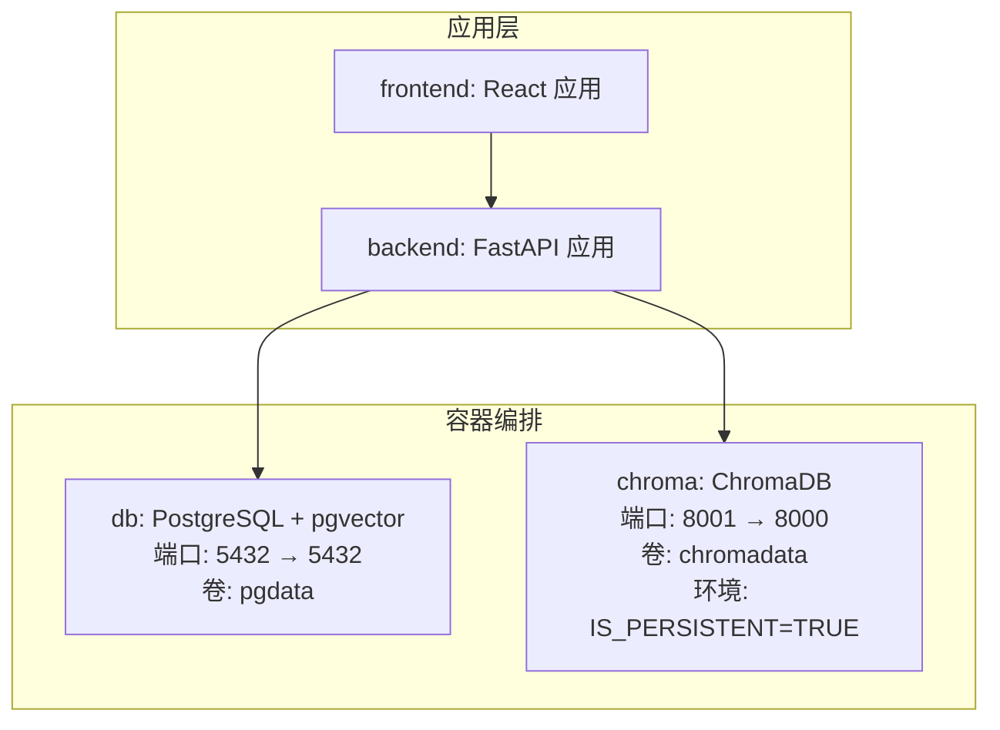
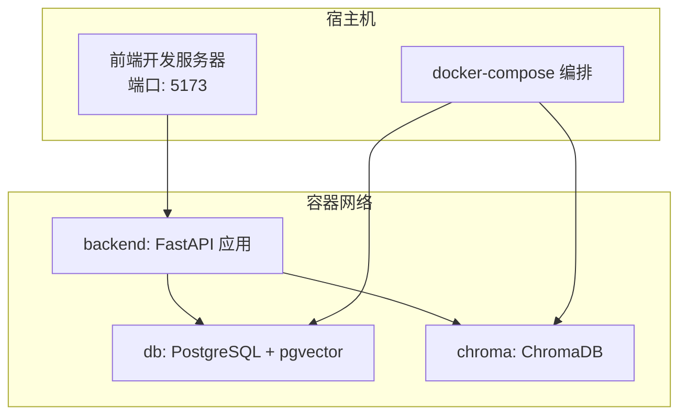
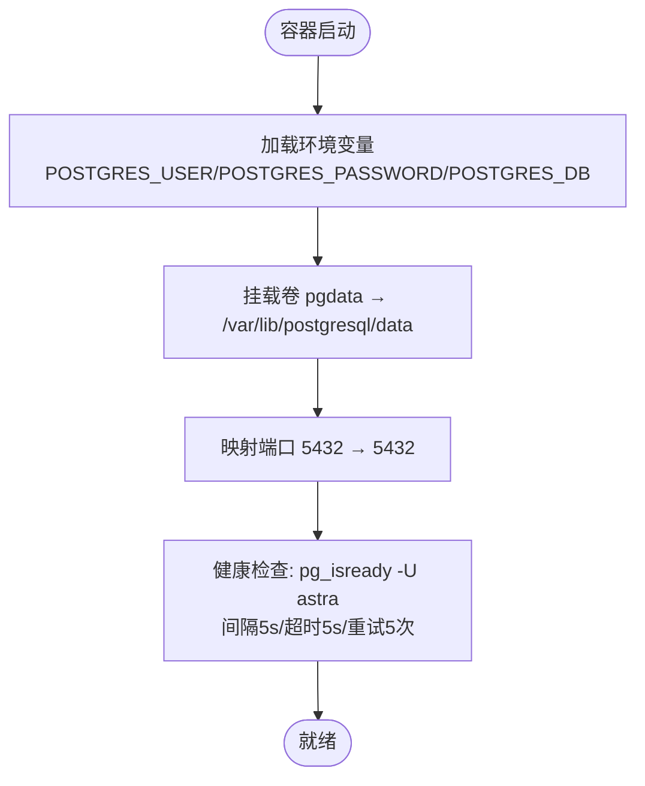
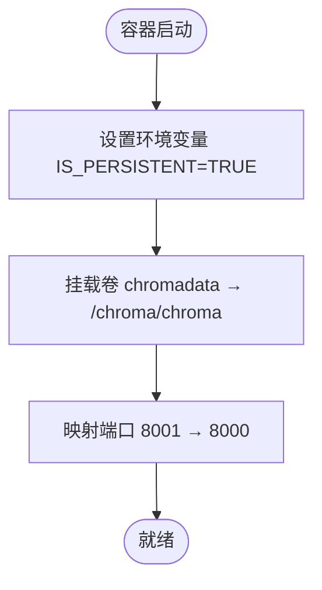
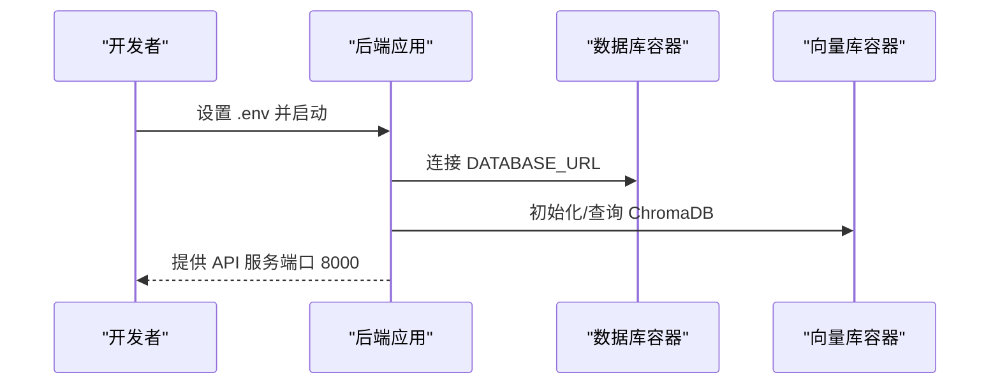
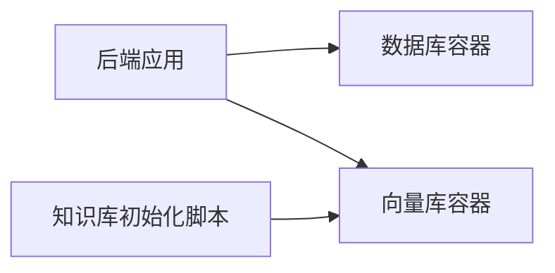

# 容器化部署

<cite>
**本文引用的文件**
- [docker-compose.yml](file://docker-compose.yml)
- [.env.example](file://.env.example)
- [README.md](file://README.md)
- [DEVELOPMENT_PLAN.md](file://DEVELOPMENT_PLAN.md)
- [backend/requirements.txt](file://backend/requirements.txt)
- [backend/app/config.py](file://backend/app/config.py)
- [backend/app/knowledge/store.py](file://backend/app/knowledge/store.py)
- [backend/scripts/init_knowledge.py](file://backend/scripts/init_knowledge.py)
</cite>

## 目录
1. [简介](#简介)
2. [项目结构](#项目结构)
3. [核心组件](#核心组件)
4. [架构总览](#架构总览)
5. [组件详解](#组件详解)
6. [依赖关系分析](#依赖关系分析)
7. [性能考量](#性能考量)
8. [故障排查指南](#故障排查指南)
9. [结论](#结论)
10. [附录](#附录)

## 简介
本指南面向本地开发与生产环境，提供针对本项目的容器化部署实践，重点解析 docker-compose.yml 中数据库（PostgreSQL + pgvector）、向量数据库（ChromaDB）的容器配置，涵盖环境变量、端口映射、卷挂载与健康检查机制，并给出本地与生产差异化的部署策略、容器间通信与依赖管理、启动顺序、故障排查与性能优化建议，以及 Dockerfile 最佳实践与镜像构建优化技巧。

## 项目结构
本项目采用前后端分离与基础设施容器化的方式组织：
- 基础设施：PostgreSQL（pgvector 扩展）与 ChromaDB 通过 docker-compose 编排
- 后端：FastAPI 应用，负责业务逻辑、RAG、规则引擎、认证与定时任务
- 前端：React + TypeScript + Vite，提供聊天与合规展示界面
- 知识库：ChromaDB 持久化向量库，按市场拆分 collection

图表来源
- [docker-compose.yml:1-31](file://docker-compose.yml#L1-L31)

章节来源
- [README.md:33-76](file://README.md#L33-L76)
- [docker-compose.yml:1-31](file://docker-compose.yml#L1-L31)

## 核心组件
- 数据库服务（db）
  - 镜像：pgvector/pgvector:pg16
  - 环境变量：POSTGRES_USER、POSTGRES_PASSWORD、POSTGRES_DB
  - 端口映射：5432 → 5432
  - 卷挂载：pgdata → /var/lib/postgresql/data
  - 健康检查：pg_isready -U astra，间隔5s，超时5s，重试5次
- 向量数据库服务（chroma）
  - 镜像：chromadb/chroma:latest
  - 端口映射：8001 → 8000
  - 卷挂载：chromadata → /chroma/chroma
  - 环境变量：IS_PERSISTENT=TRUE
- 后端服务（backend）
  - 通过 .env 配置数据库连接、LLM 与 Chroma 持久化目录等
  - 通过 init_knowledge.py 初始化 ChromaDB 知识库
- 前端服务（frontend）
  - 通过 Vite 开发服务器提供本地调试体验

章节来源
- [docker-compose.yml:4-27](file://docker-compose.yml#L4-L27)
- [.env.example:1-6](file://.env.example#L1-L6)
- [backend/app/config.py:17-40](file://backend/app/config.py#L17-L40)
- [backend/scripts/init_knowledge.py:1-129](file://backend/scripts/init_knowledge.py#L1-L129)

## 架构总览
容器化部署围绕“基础设施容器 + 应用容器”的模式展开，后端应用通过环境变量与容器内网络访问数据库与向量库，前端通过后端 API 进行交互。

图表来源
- [docker-compose.yml:1-31](file://docker-compose.yml#L1-L31)
- [README.md:70-76](file://README.md#L70-L76)

## 组件详解

### 数据库服务（PostgreSQL + pgvector）
- 镜像与版本：pgvector/pgvector:pg16
- 环境变量
  - POSTGRES_USER：数据库用户名
  - POSTGRES_PASSWORD：数据库密码
  - POSTGRES_DB：数据库名
- 端口映射：5432 → 5432（宿主:容器）
- 卷挂载：pgdata → /var/lib/postgresql/data（持久化）
- 健康检查：pg_isready -U astra，每5秒检查一次，超时5秒，最多重试5次

图表来源
- [docker-compose.yml:6-18](file://docker-compose.yml#L6-L18)

章节来源
- [docker-compose.yml:4-18](file://docker-compose.yml#L4-L18)

### 向量数据库服务（ChromaDB）
- 镜像与版本：chromadb/chroma:latest
- 环境变量：IS_PERSISTENT=TRUE（启用持久化）
- 端口映射：8001 → 8000（宿主:容器）
- 卷挂载：chromadata → /chroma/chroma（持久化）

图表来源
- [docker-compose.yml:20-27](file://docker-compose.yml#L20-L27)

章节来源
- [docker-compose.yml:20-27](file://docker-compose.yml#L20-L27)

### 后端服务（FastAPI 应用）
- 环境变量
  - DATABASE_URL：数据库连接串（默认指向 localhost:5432）
  - OPENROUTER_API_KEY / OPENROUTER_BASE_URL / LLM_MODEL：LLM 配置
  - DEBUG：调试开关
- 依赖与运行
  - 依赖安装：pip install -r backend/requirements.txt
  - 初始化知识库：python backend/scripts/init_knowledge.py
  - 启动后端：uvicorn app.main:app --reload --port 8000
- 配置要点
  - 数据库连接：settings.database_url
  - Chroma 持久化目录：settings.chroma_persist_dir
  - 环境文件：.env（由 pydantic-settings 读取）

图表来源
- [.env.example:1-6](file://.env.example#L1-L6)
- [backend/app/config.py:17-40](file://backend/app/config.py#L17-L40)
- [backend/scripts/init_knowledge.py:1-129](file://backend/scripts/init_knowledge.py#L1-L129)

章节来源
- [.env.example:1-6](file://.env.example#L1-L6)
- [backend/app/config.py:17-40](file://backend/app/config.py#L17-L40)
- [backend/requirements.txt:1-27](file://backend/requirements.txt#L1-L27)
- [README.md:41-68](file://README.md#L41-L68)

### 前端服务（React 应用）
- 启动命令：npm install && npm run dev（端口 5173）
- 与后端交互：通过 /api/* 路由转发至后端服务

章节来源
- [README.md:70-76](file://README.md#L70-L76)

## 依赖关系分析
- 容器间通信
  - 后端通过 DATABASE_URL 访问 db 容器（默认 localhost:5432）
  - ChromaDB 通过持久化卷与后端共享数据
- 依赖管理
  - 后端依赖：FastAPI、SQLAlchemy、asyncpg、chromadb、langchain、pytest 等
  - ChromaDB 初始化脚本负责将法规文档分块、向量化并写入对应 collection

图表来源
- [backend/requirements.txt:1-27](file://backend/requirements.txt#L1-L27)
- [backend/scripts/init_knowledge.py:1-129](file://backend/scripts/init_knowledge.py#L1-L129)
- [backend/app/knowledge/store.py:1-227](file://backend/app/knowledge/store.py#L1-L227)

章节来源
- [backend/requirements.txt:1-27](file://backend/requirements.txt#L1-L27)
- [backend/app/knowledge/store.py:1-227](file://backend/app/knowledge/store.py#L1-L227)
- [backend/scripts/init_knowledge.py:1-129](file://backend/scripts/init_knowledge.py#L1-L129)

## 性能考量
- 数据库性能
  - 使用 pgvector 扩展以支持高效相似度检索
  - 建议在生产环境为 db 容器设置 CPU/内存限制，避免资源争用
- 向量库性能
  - ChromaDB 使用本地嵌入模型（sentence-transformers），首次使用会下载模型，建议离线部署或预热
  - 生产环境建议为 chroma 容器设置卷配额与资源限制
- 应用性能
  - 后端使用异步数据库驱动（asyncpg），建议开启连接池与合理的并发限制
  - LLM 调用应考虑限流与缓存策略，避免频繁请求导致延迟上升
- 端口与网络
  - 仅暴露必要端口（db:5432、chroma:8001、后端:8000、前端:5173），生产环境建议使用反向代理统一入口

[本节为通用性能建议，无需特定文件引用]

## 故障排查指南
- 数据库无法连接
  - 检查 .env 中 DATABASE_URL 是否正确（默认 localhost:5432）
  - 确认 db 容器健康状态与日志
- 向量库不可用
  - 确认 chroma 容器已就绪且持久化卷正常
  - 运行知识库初始化脚本，确认文档写入成功
- 健康检查失败
  - db 的健康检查依赖 pg_isready，确认凭据与数据库初始化完成
- 端口冲突
  - 若宿主机端口被占用，调整映射或释放端口

章节来源
- [docker-compose.yml:14-18](file://docker-compose.yml#L14-L18)
- [backend/scripts/init_knowledge.py:1-129](file://backend/scripts/init_knowledge.py#L1-L129)

## 结论
本指南提供了从 docker-compose.yml 到后端配置与知识库初始化的完整容器化部署路径。通过明确的环境变量、端口映射、卷挂载与健康检查，结合本地与生产的差异化策略，可稳定地运行数据库与向量库，并在此基础上扩展后端与前端服务。建议在生产环境中进一步完善资源限制、网络隔离与安全加固。

[本节为总结性内容，无需特定文件引用]

## 附录

### 本地开发与生产环境差异
- 本地开发
  - 使用 docker-compose 启动 db 与 chroma
  - 后端通过 .env 指向本地 db（localhost:5432）
  - 前端通过 npm run dev 提供热更新
- 生产环境
  - 使用独立数据库与向量库实例，或通过云托管服务
  - 通过反向代理暴露必要端口，隐藏内部服务细节
  - 为容器设置资源限制与健康检查，确保稳定性

章节来源
- [README.md:33-76](file://README.md#L33-L76)
- [docker-compose.yml:1-31](file://docker-compose.yml#L1-L31)

### 容器启动顺序与依赖管理
- 启动顺序
  1) 启动 db 容器（等待健康检查通过）
  2) 启动 chroma 容器（等待健康检查通过）
  3) 初始化知识库（执行 init_knowledge.py）
  4) 启动后端应用（uvicorn）
  5) 启动前端开发服务器（npm run dev）
- 依赖管理
  - 后端通过 .env 与 requirements.txt 管理依赖与配置
  - ChromaDB 通过持久化卷与懒加载嵌入函数提升启动效率

章节来源
- [README.md:35-76](file://README.md#L35-L76)
- [backend/requirements.txt:1-27](file://backend/requirements.txt#L1-L27)
- [backend/app/knowledge/store.py:31-51](file://backend/app/knowledge/store.py#L31-L51)

### Dockerfile 最佳实践与镜像构建优化
- 分层缓存
  - 将依赖安装与源码复制分层，减少重复构建
- 多阶段构建
  - 使用构建阶段安装依赖，运行阶段仅包含最小运行时
- 运行时镜像
  - 使用精简的基础镜像（如 alpine），减少镜像体积
- 安全与权限
  - 使用非 root 用户运行应用，限制权限
- 健康检查与资源限制
  - 在 docker-compose 中为容器设置健康检查与资源限制，提升稳定性

[本节为通用最佳实践，无需特定文件引用]