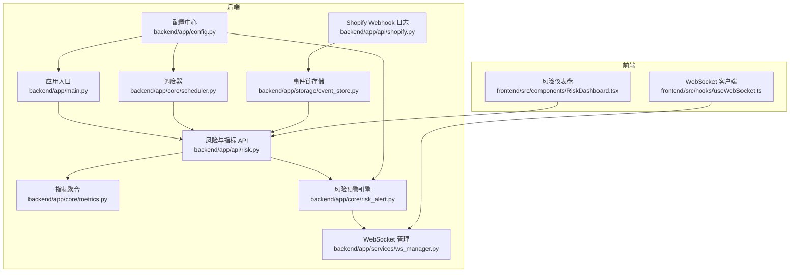
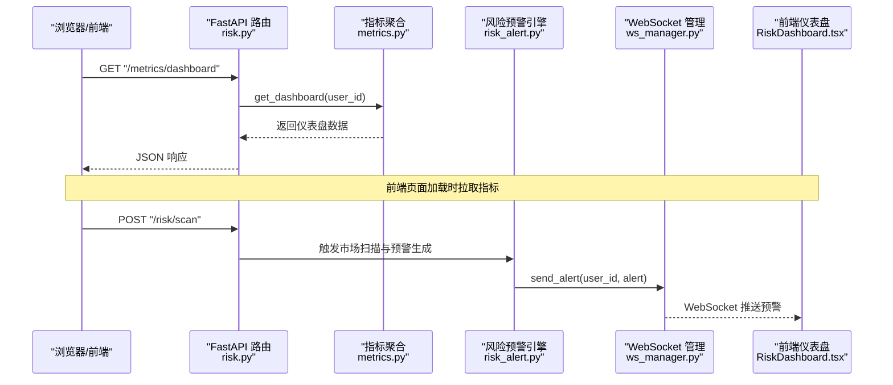
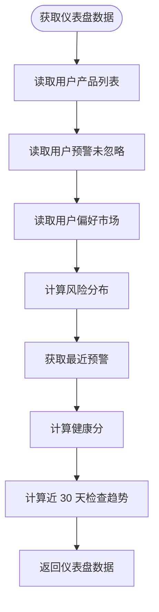
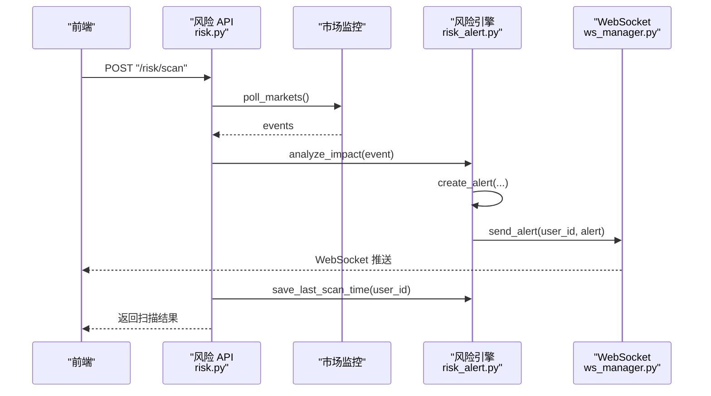
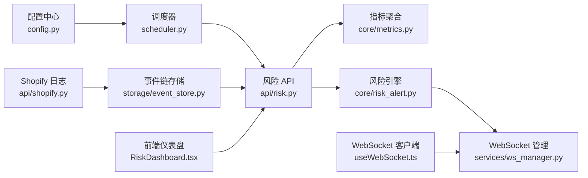

# 监控与日志

<cite>
**本文引用的文件**
- [backend/app/main.py](file://backend/app/main.py)
- [backend/app/api/risk.py](file://backend/app/api/risk.py)
- [backend/app/core/metrics.py](file://backend/app/core/metrics.py)
- [backend/app/core/risk_alert.py](file://backend/app/core/risk_alert.py)
- [backend/app/storage/event_store.py](file://backend/app/storage/event_store.py)
- [backend/app/services/ws_manager.py](file://backend/app/services/ws_manager.py)
- [backend/app/core/scheduler.py](file://backend/app/core/scheduler.py)
- [backend/app/config.py](file://backend/app/config.py)
- [backend/app/api/shopify.py](file://backend/app/api/shopify.py)
- [frontend/src/components/RiskDashboard.tsx](file://frontend/src/components/RiskDashboard.tsx)
- [frontend/src/hooks/useWebSocket.ts](file://frontend/src/hooks/useWebSocket.ts)
</cite>

## 目录
1. [简介](#简介)
2. [项目结构](#项目结构)
3. [核心组件](#核心组件)
4. [架构总览](#架构总览)
5. [详细组件分析](#详细组件分析)
6. [依赖分析](#依赖分析)
7. [性能考虑](#性能考虑)
8. [故障排查指南](#故障排查指南)
9. [结论](#结论)
10. [附录](#附录)

## 简介
本指南围绕“监控与日志”主题，结合代码库中的健康检查、指标采集、实时告警、事件链与风险预警、日志落盘与聚合、以及前端可视化等能力，给出可落地的监控与日志管理实践建议。内容涵盖：
- 健康检查端点与服务可用性保障
- 性能指标采集与仪表盘展示
- 告警机制与实时推送
- 日志分类、格式与存储策略
- 日志聚合与分析（ELK Stack 方案）
- 关键性能指标（KPI）定义与监控
- 分布式追踪与链路监控
- 监控仪表板配置与可视化
- 日志轮转、归档与清理策略

## 项目结构
后端采用 FastAPI 应用，通过路由模块组织功能，核心监控与日志相关模块分布如下：
- 应用入口与健康检查：backend/app/main.py
- 风险与指标 API：backend/app/api/risk.py
- 指标聚合：backend/app/core/metrics.py
- 风险预警引擎：backend/app/core/risk_alert.py
- 事件链存储：backend/app/storage/event_store.py
- WebSocket 管理：backend/app/services/ws_manager.py
- 调度器：backend/app/core/scheduler.py
- 配置中心：backend/app/config.py
- Shopify Webhook 日志：backend/app/api/shopify.py
- 前端仪表盘与 WebSocket 客户端：frontend/src/components/RiskDashboard.tsx、frontend/src/hooks/useWebSocket.ts

图表来源
- [backend/app/main.py:1-76](file://backend/app/main.py#L1-L76)
- [backend/app/api/risk.py:1-154](file://backend/app/api/risk.py#L1-L154)
- [backend/app/core/metrics.py:1-176](file://backend/app/core/metrics.py#L1-L176)
- [backend/app/core/risk_alert.py:1-181](file://backend/app/core/risk_alert.py#L1-L181)
- [backend/app/storage/event_store.py:1-269](file://backend/app/storage/event_store.py#L1-L269)
- [backend/app/services/ws_manager.py:1-95](file://backend/app/services/ws_manager.py#L1-L95)
- [backend/app/core/scheduler.py:1-54](file://backend/app/core/scheduler.py#L1-L54)
- [backend/app/config.py:1-75](file://backend/app/config.py#L1-L75)
- [backend/app/api/shopify.py:216-256](file://backend/app/api/shopify.py#L216-L256)
- [frontend/src/components/RiskDashboard.tsx:1-31](file://frontend/src/components/RiskDashboard.tsx#L1-L31)
- [frontend/src/hooks/useWebSocket.ts:1-67](file://frontend/src/hooks/useWebSocket.ts#L1-L67)

章节来源
- [backend/app/main.py:1-76](file://backend/app/main.py#L1-L76)
- [backend/app/api/risk.py:1-154](file://backend/app/api/risk.py#L1-L154)
- [backend/app/core/metrics.py:1-176](file://backend/app/core/metrics.py#L1-L176)
- [backend/app/core/risk_alert.py:1-181](file://backend/app/core/risk_alert.py#L1-L181)
- [backend/app/storage/event_store.py:1-269](file://backend/app/storage/event_store.py#L1-L269)
- [backend/app/services/ws_manager.py:1-95](file://backend/app/services/ws_manager.py#L1-L95)
- [backend/app/core/scheduler.py:1-54](file://backend/app/core/scheduler.py#L1-L54)
- [backend/app/config.py:1-75](file://backend/app/config.py#L1-L75)
- [backend/app/api/shopify.py:216-256](file://backend/app/api/shopify.py#L216-L256)
- [frontend/src/components/RiskDashboard.tsx:1-31](file://frontend/src/components/RiskDashboard.tsx#L1-L31)
- [frontend/src/hooks/useWebSocket.ts:1-67](file://frontend/src/hooks/useWebSocket.ts#L1-L67)

## 核心组件
- 健康检查端点：提供服务可用性探测，便于负载均衡与编排平台进行存活/就绪探针。
- 指标仪表盘：聚合用户级合规指标（产品总数、风险分布、最近预警、活跃市场、健康分、趋势），供前端展示。
- 风险预警引擎：生成、持久化、查询预警，并通过 WebSocket 实时推送。
- 事件链存储：统一记录系统事件与用户操作链，支撑审计、回溯与可视化。
- WebSocket 管理：维护用户连接池，支持单播与广播，推送预警与扫描状态。
- 调度器：定时触发市场监控与指标收集，驱动数据更新。
- 配置中心：集中管理应用配置，包括数据目录、LLM 参数、调度间隔等。
- Shopify Webhook 日志：对 Shopify Webhook 请求进行安全校验与结构化日志落盘。

章节来源
- [backend/app/main.py:33-35](file://backend/app/main.py#L33-L35)
- [backend/app/api/risk.py:131-136](file://backend/app/api/risk.py#L131-L136)
- [backend/app/core/metrics.py:20-46](file://backend/app/core/metrics.py#L20-L46)
- [backend/app/core/risk_alert.py:32-81](file://backend/app/core/risk_alert.py#L32-L81)
- [backend/app/storage/event_store.py:59-220](file://backend/app/storage/event_store.py#L59-L220)
- [backend/app/services/ws_manager.py:20-95](file://backend/app/services/ws_manager.py#L20-L95)
- [backend/app/core/scheduler.py:24-54](file://backend/app/core/scheduler.py#L24-L54)
- [backend/app/config.py:5-75](file://backend/app/config.py#L5-L75)
- [backend/app/api/shopify.py:216-256](file://backend/app/api/shopify.py#L216-L256)

## 架构总览
下图展示了从请求进入、指标聚合、风险预警到前端可视化的完整链路，以及调度器驱动的数据更新流程。

图表来源
- [backend/app/api/risk.py:131-136](file://backend/app/api/risk.py#L131-L136)
- [backend/app/core/metrics.py:20-46](file://backend/app/core/metrics.py#L20-L46)
- [backend/app/core/risk_alert.py:32-81](file://backend/app/core/risk_alert.py#L32-L81)
- [backend/app/services/ws_manager.py:46-68](file://backend/app/services/ws_manager.py#L46-L68)
- [frontend/src/components/RiskDashboard.tsx:10-15](file://frontend/src/components/RiskDashboard.tsx#L10-L15)

## 详细组件分析

### 健康检查端点
- 能力：提供服务健康状态，支持负载均衡与容器编排平台的探针。
- 配置：在应用入口定义，返回服务名称与版本信息。
- 建议：将该端点纳入生产环境的存活/就绪探针，确保自动扩缩容与滚动更新的稳定性。

章节来源
- [backend/app/main.py:33-35](file://backend/app/main.py#L33-L35)

### 指标仪表盘与 KPI
- 能力：聚合用户级合规指标，包括产品总数、风险分布、最近预警、活跃市场、健康分、趋势。
- 数据来源：项目记忆（产品信息）、风险预警（未忽略预警）、用户记忆（偏好市场）。
- KPI 建议：
  - 响应时间：接口耗时（P50/P95/P99）与 WebSocket 延迟
  - 吞吐量：QPS（按路径与用户维度统计）
  - 错误率：HTTP 5xx 比例与异常告警占比
  - 健康分：合规健康评分（0-100），反映风险与合规检查频率
  - 趋势：近 30 天合规检查次数变化
- 可视化：前端 RiskDashboard 通过 API 拉取数据并渲染颜色等级与图表。

图表来源
- [backend/app/core/metrics.py:20-46](file://backend/app/core/metrics.py#L20-L46)
- [backend/app/core/metrics.py:94-160](file://backend/app/core/metrics.py#L94-L160)

章节来源
- [backend/app/api/risk.py:131-136](file://backend/app/api/risk.py#L131-L136)
- [backend/app/core/metrics.py:20-176](file://backend/app/core/metrics.py#L20-L176)
- [frontend/src/components/RiskDashboard.tsx:10-31](file://frontend/src/components/RiskDashboard.tsx#L10-L31)

### 风险预警与实时告警
- 能力：生成、持久化、查询预警；通过 WebSocket 实时推送；支持手动触发扫描与保存扫描时间。
- 数据落盘：以 JSON 文件形式存储于风险预警目录，按用户隔离。
- 推送协议：JSON 消息，包含类型与载荷；前端 WebSocket 客户端监听并渲染。
- 扫描流程：触发扫描 → 拉取外部事件 → 影响分析 → 生成预警 → 推送与持久化 → 更新扫描时间。

图表来源
- [backend/app/api/risk.py:63-108](file://backend/app/api/risk.py#L63-L108)
- [backend/app/core/risk_alert.py:32-81](file://backend/app/core/risk_alert.py#L32-L81)
- [backend/app/services/ws_manager.py:46-68](file://backend/app/services/ws_manager.py#L46-L68)
- [frontend/src/hooks/useWebSocket.ts:24-50](file://frontend/src/hooks/useWebSocket.ts#L24-L50)

章节来源
- [backend/app/api/risk.py:25-127](file://backend/app/api/risk.py#L25-L127)
- [backend/app/core/risk_alert.py:32-181](file://backend/app/core/risk_alert.py#L32-L181)
- [backend/app/services/ws_manager.py:20-95](file://backend/app/services/ws_manager.py#L20-L95)
- [frontend/src/hooks/useWebSocket.ts:1-67](file://frontend/src/hooks/useWebSocket.ts#L1-L67)

### 事件链与审计追踪
- 能力：统一记录系统事件与用户操作链，支持按类型、来源、严重度筛选与读取。
- 存储：系统事件与用户事件分别存放于不同目录，便于审计与回溯。
- 用途：审计追踪、事件时间线、决策链路展示。

章节来源
- [backend/app/storage/event_store.py:1-269](file://backend/app/storage/event_store.py#L1-L269)

### 调度器与定时任务
- 能力：启动时注册定时任务，周期性触发市场轮询与指标收集。
- 配置：可通过配置中心控制是否启用与轮询间隔。
- 影响：驱动风险预警与指标数据的更新。

章节来源
- [backend/app/core/scheduler.py:24-54](file://backend/app/core/scheduler.py#L24-L54)
- [backend/app/config.py:51-54](file://backend/app/config.py#L51-L54)

### 配置中心
- 能力：集中管理应用配置，包括数据目录、LLM 参数、调度开关与轮询间隔、Shopify 配置等。
- 作用：保证监控与日志相关路径与参数的一致性与可运维性。

章节来源
- [backend/app/config.py:5-75](file://backend/app/config.py#L5-L75)

### Shopify Webhook 日志
- 能力：接收 Webhook 请求，进行 HMAC 校验，记录结构化日志至 JSONL 文件，便于后续审计与分析。
- 建议：将日志目录纳入日志聚合系统，设置轮转与保留策略。

章节来源
- [backend/app/api/shopify.py:216-256](file://backend/app/api/shopify.py#L216-L256)

## 依赖分析
- 组件耦合：
  - 风险 API 依赖指标聚合与风险引擎；指标聚合依赖数据目录下的产品与用户数据；风险引擎依赖配置中心与数据目录；WebSocket 管理器被风险引擎调用以推送消息。
  - 调度器独立运行，但会触发风险扫描与指标收集，间接影响前端展示。
- 外部依赖：
  - 配置中心提供路径与参数；APScheduler 提供异步调度能力；FastAPI 提供路由与 WebSocket。

图表来源
- [backend/app/config.py:5-75](file://backend/app/config.py#L5-L75)
- [backend/app/core/scheduler.py:24-54](file://backend/app/core/scheduler.py#L24-L54)
- [backend/app/api/risk.py:1-154](file://backend/app/api/risk.py#L1-L154)
- [backend/app/core/metrics.py:1-176](file://backend/app/core/metrics.py#L1-L176)
- [backend/app/core/risk_alert.py:1-181](file://backend/app/core/risk_alert.py#L1-L181)
- [backend/app/services/ws_manager.py:1-95](file://backend/app/services/ws_manager.py#L1-L95)
- [backend/app/storage/event_store.py:1-269](file://backend/app/storage/event_store.py#L1-L269)
- [backend/app/api/shopify.py:216-256](file://backend/app/api/shopify.py#L216-L256)
- [frontend/src/components/RiskDashboard.tsx:1-31](file://frontend/src/components/RiskDashboard.tsx#L1-L31)
- [frontend/src/hooks/useWebSocket.ts:1-67](file://frontend/src/hooks/useWebSocket.ts#L1-L67)

## 性能考虑
- 指标聚合复杂度：读取用户产品与预警列表，排序与统计，整体为 O(n log n) 与 O(n)，适合小中规模数据。
- WebSocket 推送：逐连接发送，异常连接会被清理，避免阻塞；建议限制单用户并发连接数与消息队列长度。
- 调度频率：市场轮询与指标收集间隔可在配置中心调整，避免高负载时段集中触发。
- I/O 优化：事件链与预警文件采用 JSON 存储，建议在高并发场景下引入缓存与批量写入策略。

## 故障排查指南
- 健康检查失败
  - 现象：探针返回异常
  - 排查：确认应用启动完成、路由注册正常、CORS 配置允许来源
- 指标为空或异常
  - 现象：仪表盘显示空数据或健康分异常
  - 排查：检查数据目录是否存在、产品与用户数据是否正确；确认调度器已启动且任务已执行
- 预警未推送
  - 现象：前端未收到 WebSocket 预警
  - 排查：确认用户连接状态、WebSocket 管理器连接池、消息序列化与异常连接清理
- Webhook 日志缺失
  - 现象：Webhook 请求未落盘
  - 排查：确认 HMAC 校验通过、日志目录权限、JSONL 写入成功

章节来源
- [backend/app/main.py:33-35](file://backend/app/main.py#L33-L35)
- [backend/app/core/metrics.py:49-92](file://backend/app/core/metrics.py#L49-L92)
- [backend/app/services/ws_manager.py:30-44](file://backend/app/services/ws_manager.py#L30-L44)
- [backend/app/api/shopify.py:223-250](file://backend/app/api/shopify.py#L223-L250)

## 结论
本项目已具备完善的健康检查、指标聚合、风险预警与实时推送能力，并通过事件链存储与配置中心实现了可观测性的基础框架。建议在此基础上引入日志聚合与分析（ELK Stack）、完善 KPI 监控与告警、扩展分布式追踪与链路监控，并制定日志轮转与归档策略，以满足生产环境的监控与运维需求。

## 附录

### 日志配置与分类
- 访问日志
  - 来源：FastAPI 应用层（可接入中间件）
  - 建议：统一 JSON 格式，包含时间戳、请求路径、方法、耗时、状态码、用户标识
- 错误日志
  - 来源：风险引擎与事件链存储的异常捕获
  - 建议：区分级别（ERROR/WARNING/INFO），包含堆栈与上下文
- 业务日志
  - 来源：Shopify Webhook 日志（JSONL）
  - 建议：包含主题、商店域、原始数据摘要与时间戳

章节来源
- [backend/app/core/risk_alert.py:109-115](file://backend/app/core/risk_alert.py#L109-L115)
- [backend/app/storage/event_store.py:224-268](file://backend/app/storage/event_store.py#L224-L268)
- [backend/app/api/shopify.py:235-250](file://backend/app/api/shopify.py#L235-L250)

### 日志聚合与分析（ELK Stack 方案）
- Filebeat：采集 JSON/JSONL 日志文件
- Logstash：清洗与结构化解析（如 JSON 字段提取）
- Elasticsearch：索引与检索
- Kibana：可视化与仪表板
- 建议：为不同日志类型建立独立索引模板，设置生命周期策略（热温冷模型）

### 关键性能指标（KPI）定义与监控
- 响应时间：接口 P50/P95/P99；WebSocket 延迟
- 吞吐量：QPS（按路径、用户、来源）
- 错误率：HTTP 5xx 比例、异常告警占比
- 健康分：合规健康评分（0-100）
- 趋势：近 30 天合规检查次数变化

章节来源
- [backend/app/core/metrics.py:112-143](file://backend/app/core/metrics.py#L112-L143)

### 分布式追踪与链路监控
- 建议：在 FastAPI 路由与核心服务（风险引擎、事件链存储）埋点，记录 TraceId/ SpanId
- 工具：OpenTelemetry（Python SDK）+ Jaeger/Zipkin
- 场景：端到端链路追踪、慢调用定位、依赖关系可视化

### 监控仪表板配置与可视化
- 指标面板：健康分趋势、风险分布、未读预警数、扫描状态
- 前端集成：前端组件通过 API 拉取数据并渲染颜色等级与图表
- 建议：将关键指标接入 Prometheus/Grafana，实现告警与历史趋势分析

章节来源
- [frontend/src/components/RiskDashboard.tsx:10-31](file://frontend/src/components/RiskDashboard.tsx#L10-L31)

### 日志轮转、归档与清理策略
- 轮转：按大小或时间轮转，保留最近 N 份副本
- 归档：压缩历史日志，移至低成本存储
- 清理：基于保留期（如 90 天）自动清理过期日志
- 建议：与日志聚合系统联动，避免重复备份