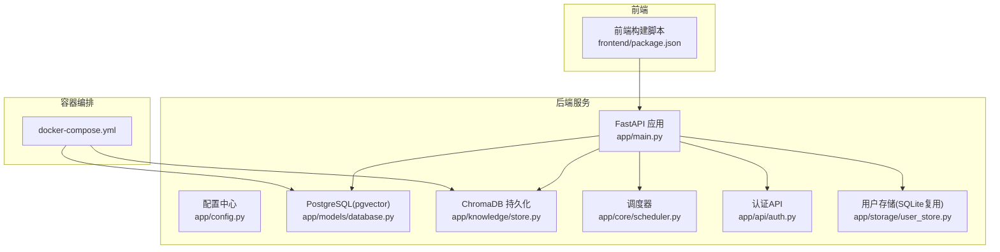
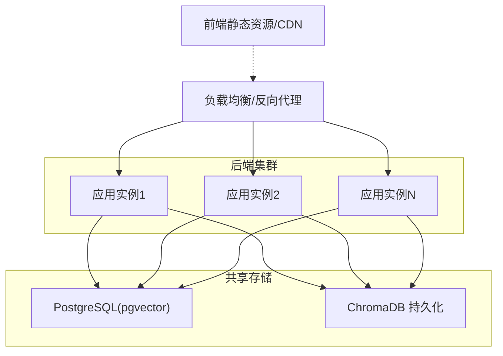
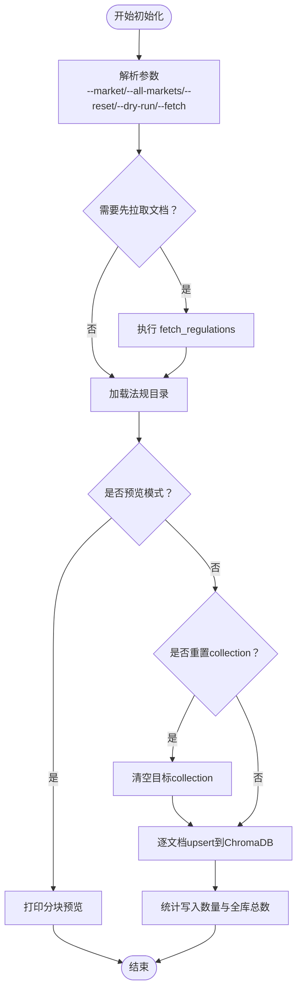
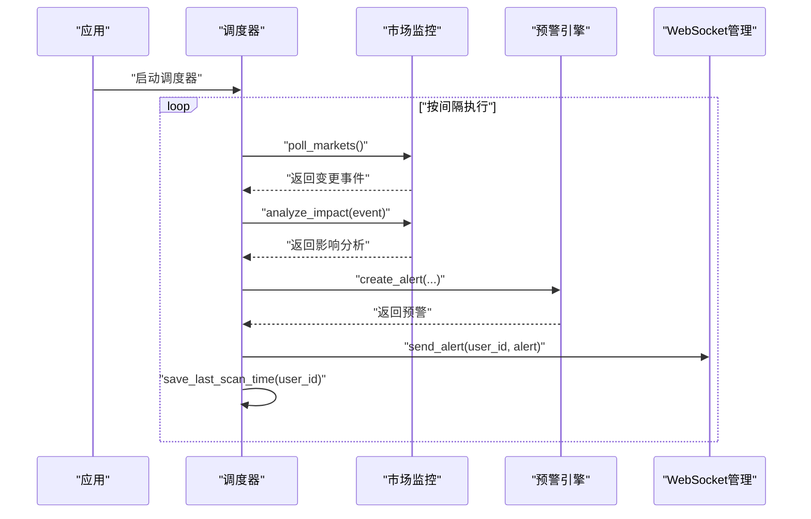
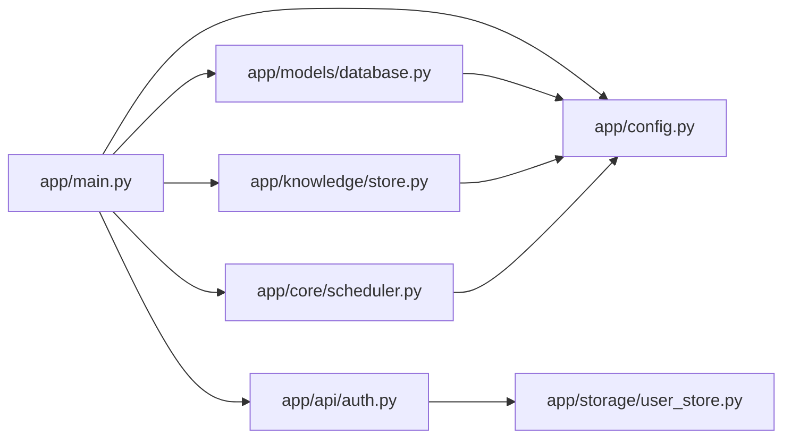

# 部署运维

<cite>
**本文引用的文件**
- [docker-compose.yml](file://docker-compose.yml)
- [README.md](file://README.md)
- [backend/app/main.py](file://backend/app/main.py)
- [backend/app/config.py](file://backend/app/config.py)
- [backend/requirements.txt](file://backend/requirements.txt)
- [backend/app/models/database.py](file://backend/app/models/database.py)
- [backend/app/knowledge/store.py](file://backend/app/knowledge/store.py)
- [backend/scripts/init_knowledge.py](file://backend/scripts/init_knowledge.py)
- [backend/scripts/migrate_storage.py](file://backend/scripts/migrate_storage.py)
- [backend/app/storage/user_store.py](file://backend/app/storage/user_store.py)
- [backend/app/core/scheduler.py](file://backend/app/core/scheduler.py)
- [backend/app/api/auth.py](file://backend/app/api/auth.py)
- [frontend/package.json](file://frontend/package.json)
</cite>

## 目录
1. [简介](#简介)
2. [项目结构](#项目结构)
3. [核心组件](#核心组件)
4. [架构总览](#架构总览)
5. [详细组件分析](#详细组件分析)
6. [依赖关系分析](#依赖关系分析)
7. [性能考量](#性能考量)
8. [故障排除指南](#故障排除指南)
9. [结论](#结论)
10. [附录](#附录)

## 简介
本指南面向生产环境的部署与运维，围绕容器化部署、环境变量与数据库迁移、知识库初始化、监控与日志、备份与恢复、扩展性与高可用、安全加固以及自动化与CI/CD集成等方面进行系统化说明。文档同时给出基于仓库现有实现的可落地步骤与最佳实践，帮助团队稳定、安全地交付与运营“避风港”合规智能体平台。

## 项目结构
项目采用前后端分离架构，后端以FastAPI为核心，提供REST与WebSocket能力；数据库采用PostgreSQL（pgvector扩展），向量库采用ChromaDB；前端使用React+Vite。容器编排通过docker-compose实现，便于快速搭建开发与演示环境。

图表来源
- [docker-compose.yml:1-31](file://docker-compose.yml#L1-L31)
- [backend/app/main.py:1-76](file://backend/app/main.py#L1-L76)
- [backend/app/config.py:1-75](file://backend/app/config.py#L1-L75)
- [backend/app/models/database.py:1-15](file://backend/app/models/database.py#L1-L15)
- [backend/app/knowledge/store.py:1-227](file://backend/app/knowledge/store.py#L1-L227)
- [backend/app/core/scheduler.py:1-152](file://backend/app/core/scheduler.py#L1-L152)
- [backend/app/api/auth.py:1-108](file://backend/app/api/auth.py#L1-L108)
- [backend/app/storage/user_store.py:1-133](file://backend/app/storage/user_store.py#L1-L133)
- [frontend/package.json:1-22](file://frontend/package.json#L1-L22)

章节来源
- [README.md:1-316](file://README.md#L1-L316)
- [docker-compose.yml:1-31](file://docker-compose.yml#L1-L31)

## 核心组件
- 容器编排与基础设施
  - PostgreSQL(pgvector)：提供结构化数据与向量检索能力，支持健康检查与持久化卷。
  - ChromaDB：本地持久化向量库，支持多collection（按市场划分）。
- 后端服务
  - FastAPI应用：提供REST API、WebSocket、CORS与健康检查端点。
  - 配置中心：统一读取环境变量，支持LLM提供商切换、JWT密钥、Chroma持久化目录等。
  - 数据库：异步SQLAlchemy引擎，支持调试模式下的SQL输出。
  - 知识库：ChromaDB封装，支持按市场collection检索与降级策略。
  - 调度器：APScheduler驱动的定时任务，周期性市场扫描与指标采集。
  - 认证与用户：JWT认证、用户CRUD、默认管理员初始化。
- 前端
  - Vite+React开发与构建脚本，支持开发服务器与产物构建。

章节来源
- [docker-compose.yml:1-31](file://docker-compose.yml#L1-L31)
- [backend/app/main.py:1-76](file://backend/app/main.py#L1-L76)
- [backend/app/config.py:1-75](file://backend/app/config.py#L1-L75)
- [backend/app/models/database.py:1-15](file://backend/app/models/database.py#L1-L15)
- [backend/app/knowledge/store.py:1-227](file://backend/app/knowledge/store.py#L1-L227)
- [backend/app/core/scheduler.py:1-152](file://backend/app/core/scheduler.py#L1-L152)
- [backend/app/api/auth.py:1-108](file://backend/app/api/auth.py#L1-L108)
- [backend/app/storage/user_store.py:1-133](file://backend/app/storage/user_store.py#L1-L133)
- [frontend/package.json:1-22](file://frontend/package.json#L1-L22)

## 架构总览
下图展示生产环境典型拓扑：反向代理/负载均衡前置，后端服务通过容器编排部署，数据库与向量库分别挂载持久化卷，前端静态资源由Web服务器或CDN提供。

图表来源
- [docker-compose.yml:1-31](file://docker-compose.yml#L1-L31)
- [backend/app/main.py:1-76](file://backend/app/main.py#L1-L76)
- [backend/app/knowledge/store.py:1-227](file://backend/app/knowledge/store.py#L1-L227)

## 详细组件分析

### 容器编排与服务配置
- PostgreSQL服务
  - 镜像：pgvector/pgvector:pg16
  - 环境变量：数据库用户、密码、库名
  - 端口映射：5432
  - 健康检查：使用pg_isready探测
  - 卷：pgdata持久化
- ChromaDB服务
  - 镜像：chromadb/chroma:latest
  - 端口映射：8001
  - 环境变量：IS_PERSISTENT=TRUE
  - 卷：chromadata持久化
- 卷
  - pgdata：PostgreSQL数据目录
  - chromadata：ChromaDB数据目录

章节来源
- [docker-compose.yml:1-31](file://docker-compose.yml#L1-L31)

### 环境变量与配置
- 配置来源：pydantic-settings从.env文件加载
- 关键配置项
  - 应用与调试：app_name、debug
  - 数据库：database_url（默认指向localhost:5432）
  - LLM与嵌入：llm_*、openrouter_*、embedding_model
  - Chroma：chroma_persist_dir
  - 知识库与提示：data_dir、prompt_dir
  - 调度器：scheduler_enabled、market_poll_interval_minutes
  - Shopify：client_id、client_secret、redirect_uri、scopes、api_version
  - 风险预警：risk_alert_dir
  - JWT：jwt_secret、jwt_expire_hours
- 生产建议
  - 强制设置独立的jwt_secret并定期轮换
  - 将database_url指向生产数据库地址
  - 配置主LLM优先级与备用LLM，确保API Key与Base URL正确
  - 设置scheduler_enabled与轮询间隔以平衡成本与时效

章节来源
- [backend/app/config.py:1-75](file://backend/app/config.py#L1-L75)

### 数据库与ORM
- 引擎：异步SQLAlchemy引擎，echo根据debug开关控制
- 会话：AsyncSession，expire_on_commit=False
- 使用方式：依赖注入提供get_db，供API路由使用

章节来源
- [backend/app/models/database.py:1-15](file://backend/app/models/database.py#L1-L15)

### 知识库与向量检索
- 多collection设计：eu_knowledge、us_knowledge、jp_knowledge、kr_knowledge
- 懒加载嵌入函数：paraphrase-multilingual-MiniLM-L12-v2，本地文件优先
- 写入策略：upsert，使用{regulation_id}_{chunk_index}作为ID，幂等
- 查询策略：按市场collection检索，失败时降级为空结果，不影响主流程
- 初始化脚本：支持按市场批量初始化、重置、预览、拉取文档后再初始化

图表来源
- [backend/scripts/init_knowledge.py:1-129](file://backend/scripts/init_knowledge.py#L1-L129)
- [backend/app/knowledge/store.py:1-227](file://backend/app/knowledge/store.py#L1-L227)

章节来源
- [backend/scripts/init_knowledge.py:1-129](file://backend/scripts/init_knowledge.py#L1-L129)
- [backend/app/knowledge/store.py:1-227](file://backend/app/knowledge/store.py#L1-L227)

### 数据迁移脚本
- 迁移范围：原始数据文件（hs_codes、vat_rates、regulations.md）到L0目录
- 事件链迁移：从旧目录迁移到L5事件链存储
- 认证矩阵：cert_matrix.json位置校验与提示

章节来源
- [backend/scripts/migrate_storage.py:1-99](file://backend/scripts/migrate_storage.py#L1-L99)

### 认证与用户管理
- 认证API：登录、注册（admin）、当前用户、修改密码
- 用户存储：SQLite表users，bcrypt哈希密码
- 默认管理员：应用启动时若用户表为空，自动创建admin/admin123

章节来源
- [backend/app/api/auth.py:1-108](file://backend/app/api/auth.py#L1-L108)
- [backend/app/storage/user_store.py:1-133](file://backend/app/storage/user_store.py#L1-L133)
- [backend/app/main.py:60-70](file://backend/app/main.py#L60-L70)

### 调度器与定时任务
- 启停：应用启动时初始化并启动调度器；关闭时停止
- 任务：
  - 市场轮询：按间隔扫描，Codex联网搜索→影响分析→生成预警→WebSocket推送
  - 指标采集：按用户聚合仪表盘指标（仅记录，数据实时读取）

图表来源
- [backend/app/core/scheduler.py:1-152](file://backend/app/core/scheduler.py#L1-L152)

章节来源
- [backend/app/core/scheduler.py:1-152](file://backend/app/core/scheduler.py#L1-L152)

### 健康检查与WebSocket
- 健康检查端点：/api/v1/health，返回服务状态与版本
- WebSocket端点：/api/v1/ws，用于实时预警推送

章节来源
- [backend/app/main.py:33-56](file://backend/app/main.py#L33-L56)

## 依赖关系分析
- 外部依赖
  - FastAPI、Uvicorn、Pydantic、SQLAlchemy、asyncpg、chromadb、langchain、openai、apscheduler、pyyaml、ShopifyAPI、httpx、codex-client
- 内部模块耦合
  - app/main.py 依赖 CORS、WebSocket、调度器启动、默认管理员与模型配置初始化
  - app/config.py 为全局配置源，被数据库、知识库、调度器等模块引用
  - app/knowledge/store.py 依赖 app/config.py 与市场路由，负责ChromaDB封装
  - app/core/scheduler.py 依赖 app/config.py 与市场监控、预警引擎、WebSocket管理
  - app/api/auth.py 依赖 app/storage/user_store.py 与认证工具
  - app/models/database.py 依赖 app/config.py 提供的database_url

图表来源
- [backend/app/main.py:1-76](file://backend/app/main.py#L1-L76)
- [backend/app/config.py:1-75](file://backend/app/config.py#L1-L75)
- [backend/app/models/database.py:1-15](file://backend/app/models/database.py#L1-L15)
- [backend/app/knowledge/store.py:1-227](file://backend/app/knowledge/store.py#L1-L227)
- [backend/app/core/scheduler.py:1-152](file://backend/app/core/scheduler.py#L1-L152)
- [backend/app/api/auth.py:1-108](file://backend/app/api/auth.py#L1-L108)
- [backend/app/storage/user_store.py:1-133](file://backend/app/storage/user_store.py#L1-L133)

章节来源
- [backend/requirements.txt:1-27](file://backend/requirements.txt#L1-L27)
- [backend/app/main.py:1-76](file://backend/app/main.py#L1-L76)
- [backend/app/config.py:1-75](file://backend/app/config.py#L1-L75)

## 性能考量
- 向量检索降级：当ChromaDB不可用时返回空结果，避免阻塞主流程，提升系统韧性
- 懒加载嵌入函数：首次使用时才加载本地模型，减少启动时间与网络依赖
- 调度器间隔：通过market_poll_interval_minutes与APScheduler控制扫描频率，兼顾成本与时效
- 数据库异步：使用异步SQLAlchemy引擎，降低I/O等待
- 前端构建：Vite提供快速开发与优化构建，适合生产CDN部署

章节来源
- [backend/app/knowledge/store.py:1-227](file://backend/app/knowledge/store.py#L1-L227)
- [backend/app/core/scheduler.py:1-152](file://backend/app/core/scheduler.py#L1-L152)
- [backend/app/models/database.py:1-15](file://backend/app/models/database.py#L1-L15)
- [frontend/package.json:1-22](file://frontend/package.json#L1-L22)

## 故障排除指南
- 健康检查失败
  - 检查PostgreSQL健康检查命令与端口映射
  - 确认数据库卷挂载与权限
- ChromaDB不可用
  - 检查IS_PERSISTENT与持久化目录权限
  - 观察日志中ChromaDB查询异常并确认模型是否成功加载
- 认证问题
  - 确认JWT密钥与过期时间配置
  - 首次登录后立即修改默认管理员密码
- 数据库连接失败
  - 校验database_url与网络连通性
  - 检查asyncpg版本与SSL设置
- 调度器不工作
  - 检查scheduler_enabled与轮询间隔
  - 确认APScheduler日志与异常堆栈

章节来源
- [docker-compose.yml:1-31](file://docker-compose.yml#L1-L31)
- [backend/app/config.py:1-75](file://backend/app/config.py#L1-L75)
- [backend/app/knowledge/store.py:1-227](file://backend/app/knowledge/store.py#L1-L227)
- [backend/app/api/auth.py:1-108](file://backend/app/api/auth.py#L1-L108)
- [backend/app/models/database.py:1-15](file://backend/app/models/database.py#L1-L15)
- [backend/app/core/scheduler.py:1-152](file://backend/app/core/scheduler.py#L1-L152)

## 结论
本指南基于仓库现有实现，提供了从容器编排、配置管理、知识库初始化、数据库与向量库运维，到监控日志、备份恢复、扩展与高可用、安全加固及自动化部署的全栈运维建议。建议在生产环境中严格区分环境变量、强化密钥轮换、完善监控告警与日志采集，并结合负载均衡与容器编排实现水平扩展与高可用。

## 附录

### 生产部署策略与步骤
- 环境变量配置
  - 在生产环境设置独立的JWT密钥、数据库URL、LLM API Key与Base URL、Chroma持久化目录
  - 配置调度器开关与轮询间隔，按业务需求调整
- 数据库迁移
  - 使用迁移脚本将旧数据结构迁移至L0-L5分层存储
  - 确认迁移后清理旧文件并验证数据完整性
- 知识库初始化
  - 使用初始化脚本按市场批量构建向量库，支持重置与预览
  - 首次部署建议先拉取法规文档再初始化
- 健康检查与探活
  - 使用/health端点配合负载均衡健康检查
  - ChromaDB与PostgreSQL均具备健康检查配置

章节来源
- [backend/app/config.py:1-75](file://backend/app/config.py#L1-L75)
- [backend/scripts/migrate_storage.py:1-99](file://backend/scripts/migrate_storage.py#L1-L99)
- [backend/scripts/init_knowledge.py:1-129](file://backend/scripts/init_knowledge.py#L1-L129)
- [backend/app/main.py:33-35](file://backend/app/main.py#L33-L35)
- [docker-compose.yml:14-18](file://docker-compose.yml#L14-L18)

### 监控与日志管理
- 应用日志
  - 使用Uvicorn标准输出，结合容器日志收集（如Filebeat/Fluent Bit）与集中式日志平台（如ELK/Graylog/Loki+Grafana）
  - ChromaDB与APScheduler均有日志输出，建议开启INFO级别并按需调整
- 错误追踪
  - 建议接入结构化错误上报（如Sentry/OpenTelemetry），捕获异常堆栈与上下文
- 性能监控
  - 指标采集：结合APScheduler任务与RAG检索耗时，建立Prometheus/Grafana面板
  - 健康检查：/health端点可用于LB探活与自愈

章节来源
- [backend/app/knowledge/store.py:1-227](file://backend/app/knowledge/store.py#L1-L227)
- [backend/app/core/scheduler.py:1-152](file://backend/app/core/scheduler.py#L1-L152)
- [backend/app/main.py:33-35](file://backend/app/main.py#L33-L35)

### 备份与恢复策略
- 数据库备份
  - 使用pg_dump逻辑备份或pgBackRest物理备份，定期校验与异地归档
- 向量库备份
  - 复制ChromaDB持久化目录（如chroma/chroma）至安全存储
- 配置文件管理
  - .env与docker-compose.yml纳入版本管理，敏感信息使用密钥管理服务（如Vault/KMS）
- 恢复演练
  - 定期进行恢复演练，验证备份完整性与恢复时间目标（RTO/RPO）

章节来源
- [docker-compose.yml:12-25](file://docker-compose.yml#L12-L25)

### 扩展性与高可用
- 负载均衡
  - 使用Nginx/HAProxy/云负载均衡，结合/health端点进行健康检查
- 水平扩展
  - 多实例后端，共享数据库与ChromaDB持久化目录（注意并发写入一致性）
- 高可用
  - PostgreSQL主从复制与自动故障转移
  - ChromaDB单实例部署，必要时评估集群方案或外部向量服务

章节来源
- [backend/app/main.py:33-35](file://backend/app/main.py#L33-L35)
- [docker-compose.yml:1-31](file://docker-compose.yml#L1-L31)

### 安全加固
- 网络安全
  - 限制数据库与ChromaDB端口暴露，仅允许内网访问
  - 使用反向代理强制HTTPS与TLS终止
- 访问控制
  - 强制JWT密钥轮换，缩短过期时间
  - 最小权限原则：数据库与向量库只授予必要账户权限
- 数据保护
  - 对敏感日志脱敏，限制日志保留周期
  - 备份加密与访问控制

章节来源
- [backend/app/config.py:65-67](file://backend/app/config.py#L65-L67)
- [backend/app/api/auth.py:1-108](file://backend/app/api/auth.py#L1-L108)

### 自动化部署与CI/CD集成
- 构建与镜像
  - 使用Dockerfile构建后端镜像，前端使用Vite构建产物交由Web服务器或CDN
- CI/CD流水线
  - 测试阶段：pytest与OpenAPI契约校验
  - 构建阶段：打包后端依赖与前端产物
  - 部署阶段：docker-compose或Kubernetes编排，配合滚动更新与健康检查
- 发布策略
  - 蓝绿/金丝雀发布，结合/health端点与探活时间窗口

章节来源
- [backend/requirements.txt:1-27](file://backend/requirements.txt#L1-L27)
- [README.md:80-90](file://README.md#L80-L90)
- [frontend/package.json:6-9](file://frontend/package.json#L6-L9)