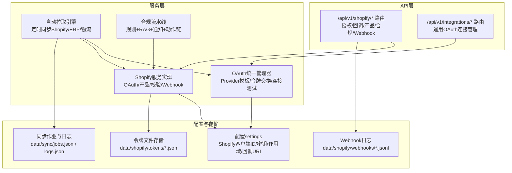
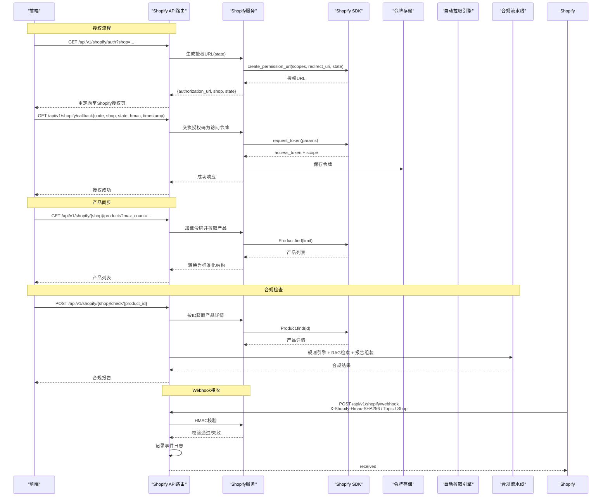
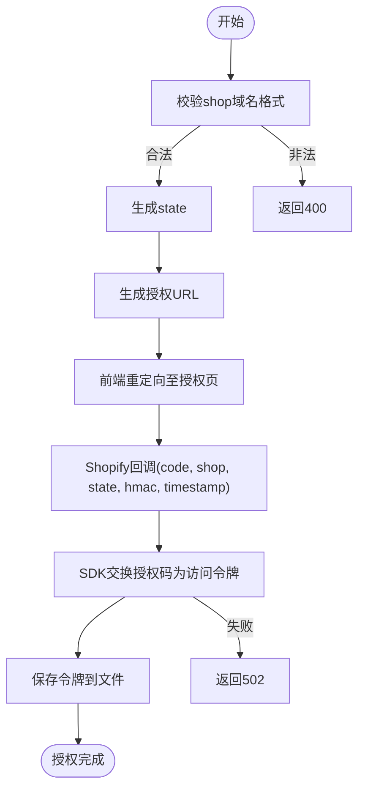
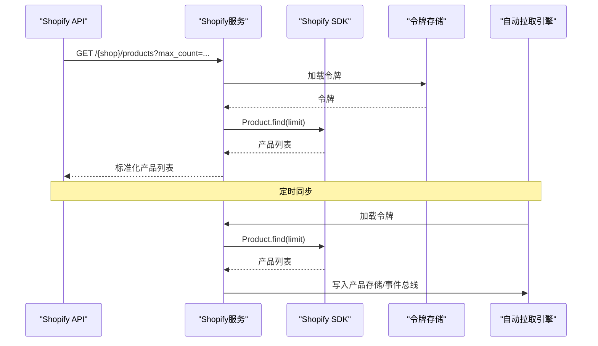
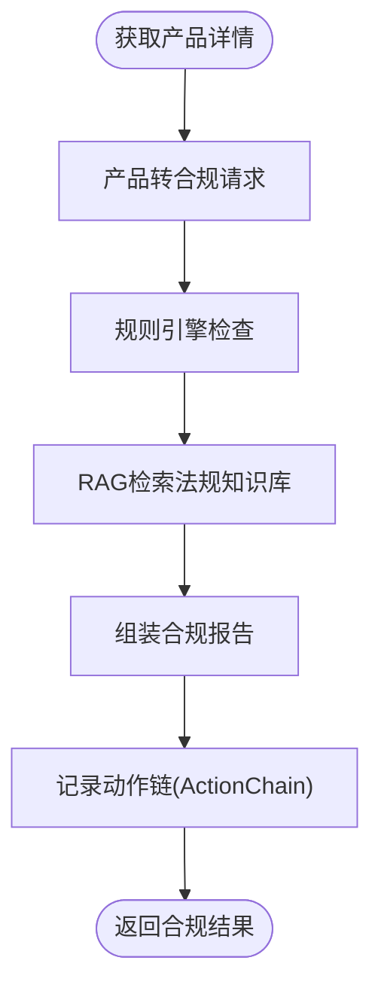
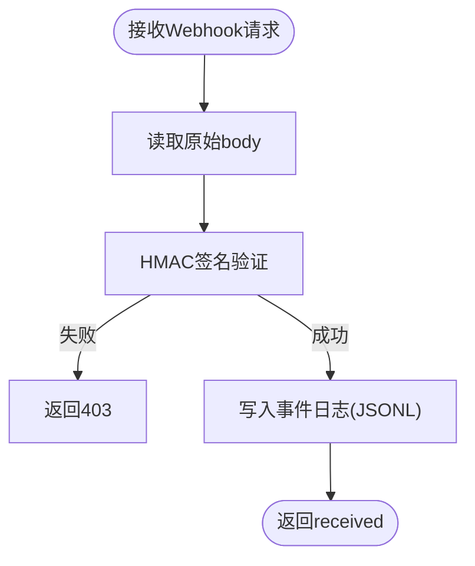
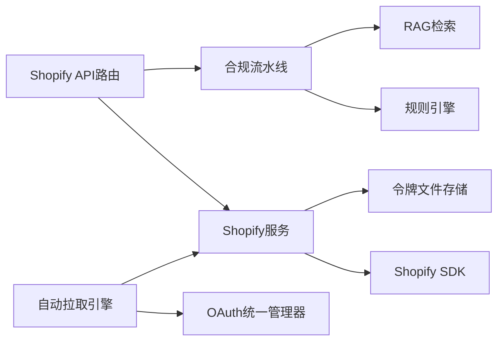

# Shopify集成

<cite>
**本文引用的文件**
- [backend/app/api/shopify.py](file://backend/app/api/shopify.py)
- [backend/app/services/shopify.py](file://backend/app/services/shopify.py)
- [backend/app/core/oauth_manager.py](file://backend/app/core/oauth_manager.py)
- [backend/app/core/auto_pull_engine.py](file://backend/app/core/auto_pull_engine.py)
- [backend/app/core/compliance_flow.py](file://backend/app/core/compliance_flow.py)
- [backend/app/api/integrations.py](file://backend/app/api/integrations.py)
</cite>

## 目录
1. [简介](#简介)
2. [项目结构](#项目结构)
3. [核心组件](#核心组件)
4. [架构总览](#架构总览)
5. [详细组件分析](#详细组件分析)
6. [依赖分析](#依赖分析)
7. [性能考虑](#性能考虑)
8. [故障排除指南](#故障排除指南)
9. [结论](#结论)
10. [附录](#附录)

## 简介
本文件面向Shopify电商集成系统，围绕以下目标展开：  
- OAuth 2.0授权流程实现：授权URL生成、回调处理、访问令牌交换  
- 产品数据同步机制：产品列表获取、产品详情查询、批量数据处理  
- 合规检查集成流程：将Shopify产品数据转换为合规检查请求  
- Webhook接收与处理：HMAC签名验证、事件类型处理、错误恢复  
- 完整API端点说明、参数定义与响应格式  
- 实际集成示例、配置指南与故障排除方法  

## 项目结构
系统采用分层架构，核心围绕FastAPI路由层、服务层、核心能力模块与配置设置协同工作。Shopify相关能力主要分布在API路由、服务实现、OAuth统一管理、自动拉取引擎与合规流水线中。

图表来源
- [backend/app/api/shopify.py:1-257](file://backend/app/api/shopify.py#L1-L257)
- [backend/app/api/integrations.py:1-264](file://backend/app/api/integrations.py#L1-L264)
- [backend/app/services/shopify.py:1-427](file://backend/app/services/shopify.py#L1-L427)
- [backend/app/core/oauth_manager.py:1-559](file://backend/app/core/oauth_manager.py#L1-L559)
- [backend/app/core/auto_pull_engine.py:1-547](file://backend/app/core/auto_pull_engine.py#L1-L547)
- [backend/app/core/compliance_flow.py:1-473](file://backend/app/core/compliance_flow.py#L1-L473)

章节来源
- [backend/app/api/shopify.py:1-257](file://backend/app/api/shopify.py#L1-L257)
- [backend/app/api/integrations.py:1-264](file://backend/app/api/integrations.py#L1-L264)

## 核心组件
- Shopify API路由层：提供授权、回调、产品列表、合规检查、Webhook接收等端点，负责参数解析、错误处理与响应组装。
- Shopify服务层：封装Shopify SDK调用，负责OAuth授权URL生成、令牌交换、产品数据拉取、Webhook HMAC校验与产品转合规请求。
- OAuth统一管理器：抽象多Provider OAuth流程，支持Shopify、飞书、钉钉、Slack、ERPNext、Listmonk等，提供连接创建、授权URL生成、回调令牌交换、连接测试与状态汇总。
- 自动拉取引擎：定时同步Shopify产品/订单/库存等，增量游标推进，写入事件总线与产品存储，记录作业与日志。
- 合规流水线：事件驱动的六阶段闭环（感知→检查→推荐→告知→交互→处理），结合规则引擎与RAG检索生成合规报告与可执行动作。

章节来源
- [backend/app/services/shopify.py:1-427](file://backend/app/services/shopify.py#L1-L427)
- [backend/app/core/oauth_manager.py:1-559](file://backend/app/core/oauth_manager.py#L1-L559)
- [backend/app/core/auto_pull_engine.py:1-547](file://backend/app/core/auto_pull_engine.py#L1-L547)
- [backend/app/core/compliance_flow.py:1-473](file://backend/app/core/compliance_flow.py#L1-L473)

## 架构总览
下图展示了Shopify集成的关键交互路径：授权流程、产品同步、合规检查与Webhook处理。

图表来源
- [backend/app/api/shopify.py:41-257](file://backend/app/api/shopify.py#L41-L257)
- [backend/app/services/shopify.py:144-393](file://backend/app/services/shopify.py#L144-L393)
- [backend/app/core/auto_pull_engine.py:250-384](file://backend/app/core/auto_pull_engine.py#L250-L384)
- [backend/app/core/compliance_flow.py:200-247](file://backend/app/core/compliance_flow.py#L200-L247)

## 详细组件分析

### OAuth 2.0授权流程
- 授权URL生成
  - 输入：shop域名（需以.myshopify.com结尾）、可选state
  - 处理：基于Shopify SDK生成授权URL，包含作用域与回调地址
  - 输出：授权URL、shop、state
- 回调处理与令牌交换
  - 输入：code、shop、state、timestamp、hmac
  - 处理：SDK内部自动验证HMAC；使用授权码交换长期访问令牌
  - 输出：授权成功、shop、scope
- 错误处理
  - 未授权或令牌交换失败时返回HTTP 502
  - 域名格式错误返回HTTP 400

图表来源
- [backend/app/api/shopify.py:41-94](file://backend/app/api/shopify.py#L41-L94)
- [backend/app/services/shopify.py:144-200](file://backend/app/services/shopify.py#L144-L200)

章节来源
- [backend/app/api/shopify.py:41-94](file://backend/app/api/shopify.py#L41-L94)
- [backend/app/services/shopify.py:144-200](file://backend/app/services/shopify.py#L144-L200)

### 产品数据同步机制
- 产品列表获取
  - 输入：shop、max_count（上限250）
  - 处理：加载令牌，调用SDK Product.find(limit)，转换为内部结构
  - 输出：标准化产品列表
- 产品详情查询
  - 输入：shop、product_id
  - 处理：SDK Product.find(id)，异常返回None
  - 输出：标准化产品详情
- 批量数据处理
  - 自动拉取引擎定时同步产品/订单/库存，增量游标推进，写入事件总线与产品存储
  - 手动触发同步：/api/v1/sync/run?provider=shopify&sync_type=products&connection_id=...

图表来源
- [backend/app/api/shopify.py:107-125](file://backend/app/api/shopify.py#L107-L125)
- [backend/app/services/shopify.py:257-360](file://backend/app/services/shopify.py#L257-L360)
- [backend/app/core/auto_pull_engine.py:250-313](file://backend/app/core/auto_pull_engine.py#L250-L313)

章节来源
- [backend/app/api/shopify.py:107-125](file://backend/app/api/shopify.py#L107-L125)
- [backend/app/services/shopify.py:257-360](file://backend/app/services/shopify.py#L257-L360)
- [backend/app/core/auto_pull_engine.py:250-313](file://backend/app/core/auto_pull_engine.py#L250-L313)

### 合规检查集成流程
- 将Shopify产品转换为合规请求
  - 输入：ShopifyProduct、目标市场
  - 处理：拼接标题、类型、描述、最低价格与标签，构造查询
  - 输出：合规检查请求字典
- 执行合规检查
  - 规则引擎：check_compliance(产品名, 目标市场)
  - RAG检索：retrieve_context + format_context_for_assistant
  - 报告组装：format_compliance_report + 溯源信息
- 动作链记录：ActionChain记录导入、规则检查、RAG检索与最终报告

图表来源
- [backend/app/api/shopify.py:127-201](file://backend/app/api/shopify.py#L127-L201)
- [backend/app/services/shopify.py:400-427](file://backend/app/services/shopify.py#L400-L427)
- [backend/app/core/compliance_flow.py:200-247](file://backend/app/core/compliance_flow.py#L200-L247)

章节来源
- [backend/app/api/shopify.py:127-201](file://backend/app/api/shopify.py#L127-L201)
- [backend/app/services/shopify.py:400-427](file://backend/app/services/shopify.py#L400-L427)
- [backend/app/core/compliance_flow.py:200-247](file://backend/app/core/compliance_flow.py#L200-L247)

### Webhook接收与处理机制
- 接收端点：POST /api/v1/shopify/webhook
- 请求头：X-Shopify-Hmac-SHA256、X-Shopify-Topic、X-Shopify-Shop
- HMAC验证：verify_webhook使用客户端密钥计算SHA256哈希，支持十六进制与Base64两种编码
- 事件记录：将topic、shop、原始数据写入JSONL日志文件（按shop域名命名）
- 错误处理：HMAC校验失败返回HTTP 403

图表来源
- [backend/app/api/shopify.py:203-257](file://backend/app/api/shopify.py#L203-L257)
- [backend/app/services/shopify.py:367-393](file://backend/app/services/shopify.py#L367-L393)

章节来源
- [backend/app/api/shopify.py:203-257](file://backend/app/api/shopify.py#L203-L257)
- [backend/app/services/shopify.py:367-393](file://backend/app/services/shopify.py#L367-L393)

### API端点说明
- GET /api/v1/shopify/auth
  - 查询参数：shop（必填，需为.myshopify.com）
  - 响应：authorization_url、shop、state
- GET /api/v1/shopify/callback
  - 查询参数：code、shop、state、timestamp、hmac
  - 响应：status、shop、scope、message
- GET /api/v1/shopify/shops
  - 响应：已连接店铺列表（shop、scope）
- GET /api/v1/shopify/{shop}/products
  - 查询参数：max_count（默认50，上限250）
  - 响应：产品列表（标准化字段）
- POST /api/v1/shopify/{shop}/check/{product_id}
  - 请求体：ShopifyComplianceCheckRequest（包含target_market）
  - 响应：ChatResponse（合规结果、来源、会话ID等）
- POST /api/v1/shopify/webhook
  - 请求头：X-Shopify-Hmac-SHA256、X-Shopify-Topic、X-Shopify-Shop
  - 响应：status、topic、shop

章节来源
- [backend/app/api/shopify.py:41-257](file://backend/app/api/shopify.py#L41-L257)

## 依赖分析
- 组件耦合
  - API路由依赖服务层（build_authorization_url、exchange_code_for_token、fetch_products、fetch_product_by_id、verify_webhook、product_to_compliance_request）
  - 服务层依赖Shopify SDK与本地令牌存储
  - 自动拉取引擎依赖OAuth统一管理器与产品存储
  - 合规流水线依赖规则引擎、RAG检索与通知引擎
- 外部依赖
  - Shopify Admin API（OAuth + REST/GraphQL）
  - httpx（HTTP客户端）
  - html2text（HTML转文本）

图表来源
- [backend/app/api/shopify.py:25-36](file://backend/app/api/shopify.py#L25-L36)
- [backend/app/services/shopify.py:21-29](file://backend/app/services/shopify.py#L21-L29)
- [backend/app/core/auto_pull_engine.py:252-258](file://backend/app/core/auto_pull_engine.py#L252-L258)
- [backend/app/core/oauth_manager.py:350-359](file://backend/app/core/oauth_manager.py#L350-L359)

章节来源
- [backend/app/api/shopify.py:25-36](file://backend/app/api/shopify.py#L25-L36)
- [backend/app/services/shopify.py:21-29](file://backend/app/services/shopify.py#L21-L29)
- [backend/app/core/auto_pull_engine.py:252-258](file://backend/app/core/auto_pull_engine.py#L252-L258)
- [backend/app/core/oauth_manager.py:350-359](file://backend/app/core/oauth_manager.py#L350-L359)

## 性能考虑
- 异步执行：服务层通过线程池运行SDK同步调用，避免阻塞事件循环
- 限制批量：产品列表最大250，防止单次请求过大
- 增量同步：自动拉取引擎使用游标推进，减少重复数据传输
- 超时控制：RAG检索设置超时保护，避免阻塞主流程
- 日志轮转：同步日志保留最近500条，Webhook日志按shop分文件追加

## 故障排除指南
- 授权失败
  - 检查shop域名格式是否为.myshopify.com
  - 确认回调参数完整性（code、shop、state、timestamp、hmac）
  - 核对客户端ID/密钥与作用域配置
- 数据同步延迟
  - 确认令牌文件存在且未过期
  - 检查自动拉取引擎状态与任务配置
  - 手动触发同步以验证连通性
- Webhook验证错误
  - 确认X-Shopify-Hmac-SHA256与原始body一致
  - 核对客户端密钥配置
  - 查看Webhook日志文件定位异常

章节来源
- [backend/app/api/shopify.py:51-58](file://backend/app/api/shopify.py#L51-L58)
- [backend/app/api/shopify.py:84-94](file://backend/app/api/shopify.py#L84-L94)
- [backend/app/services/shopify.py:367-393](file://backend/app/services/shopify.py#L367-L393)
- [backend/app/core/auto_pull_engine.py:494-517](file://backend/app/core/auto_pull_engine.py#L494-L517)

## 结论
本系统通过清晰的分层设计与Shopify官方SDK集成，实现了从OAuth授权、产品数据同步到合规检查与Webhook处理的完整闭环。配合统一的OAuth管理器与自动拉取引擎，能够稳定支撑多Provider与多业务场景下的数据一致性与合规性需求。

## 附录
- 配置项（示例）
  - shopify_client_id：Shopify应用客户端ID
  - shopify_client_secret：Shopify应用客户端密钥
  - shopify_scopes：授权作用域（逗号分隔）
  - shopify_redirect_uri：回调地址
  - shopify_api_version：Shopify API版本
- 连接管理（通用OAuth）
  - /api/v1/integrations/providers：Provider模板列表
  - /api/v1/integrations：创建/查询连接
  - /api/v1/oauth/{conn_id}/test：测试连接有效性
  - /api/v1/sync/run：手动触发同步

章节来源
- [backend/app/core/oauth_manager.py:101-178](file://backend/app/core/oauth_manager.py#L101-L178)
- [backend/app/api/integrations.py:29-135](file://backend/app/api/integrations.py#L29-L135)
- [backend/app/api/integrations.py:238-243](file://backend/app/api/integrations.py#L238-L243)