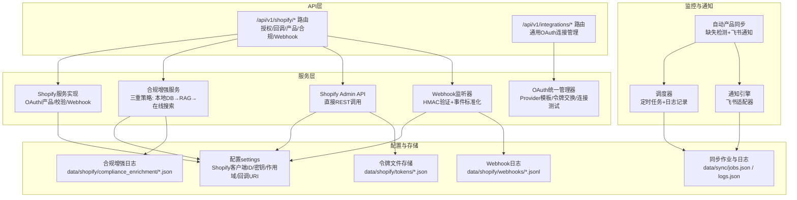
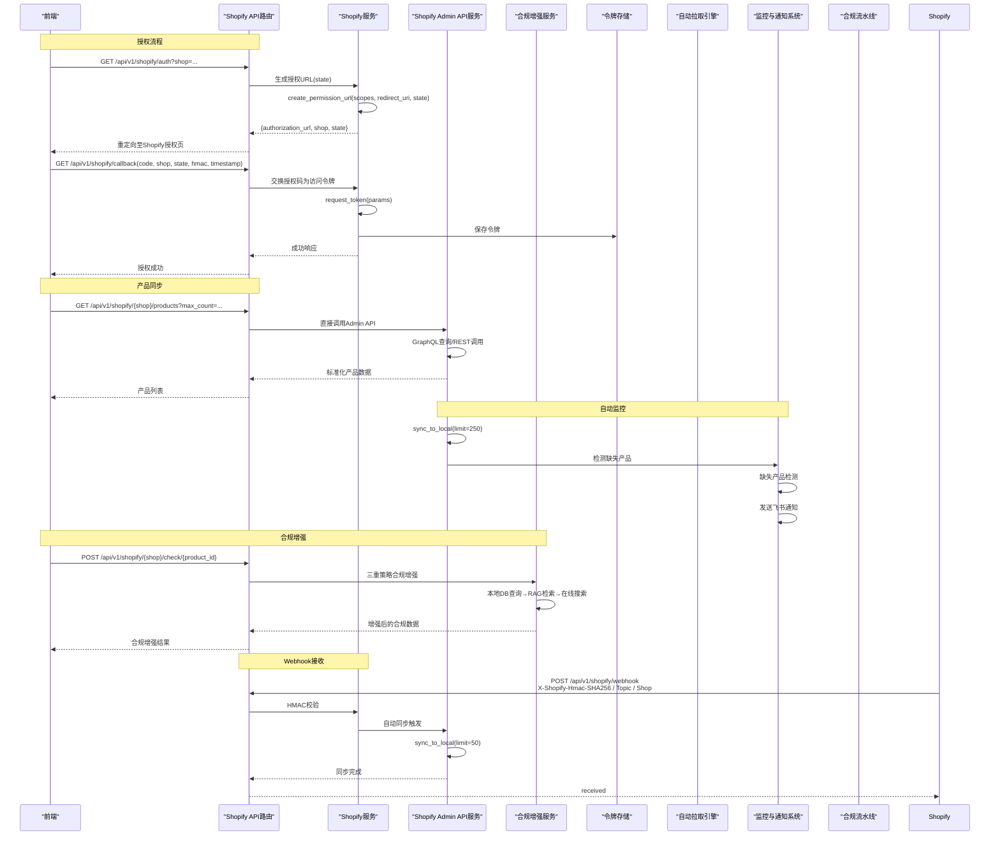
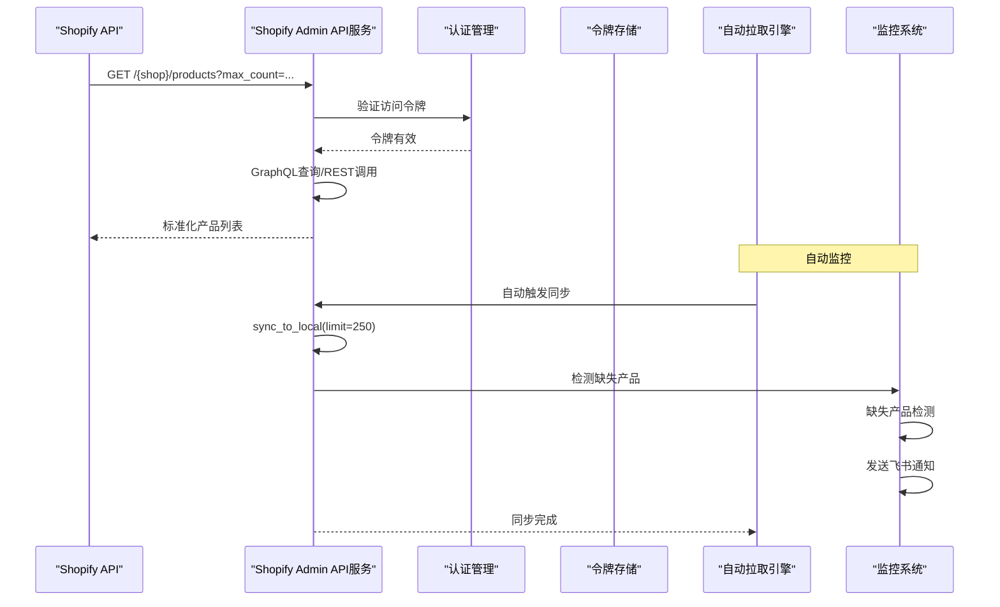
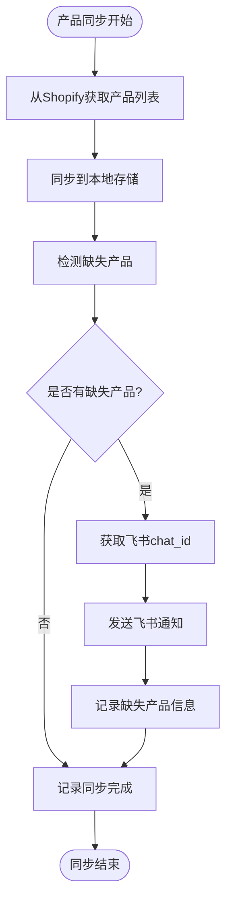
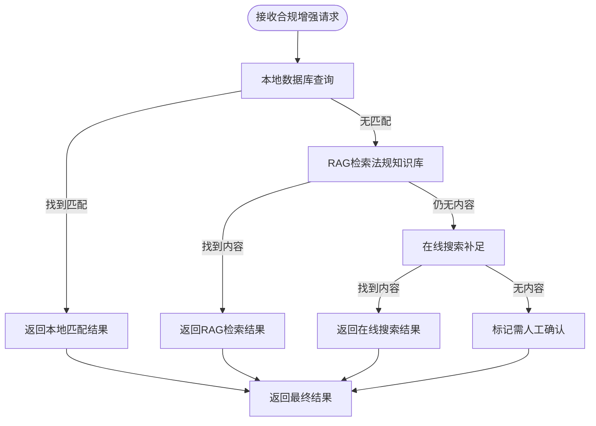
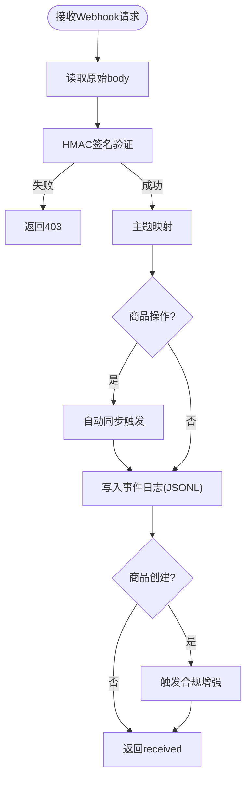
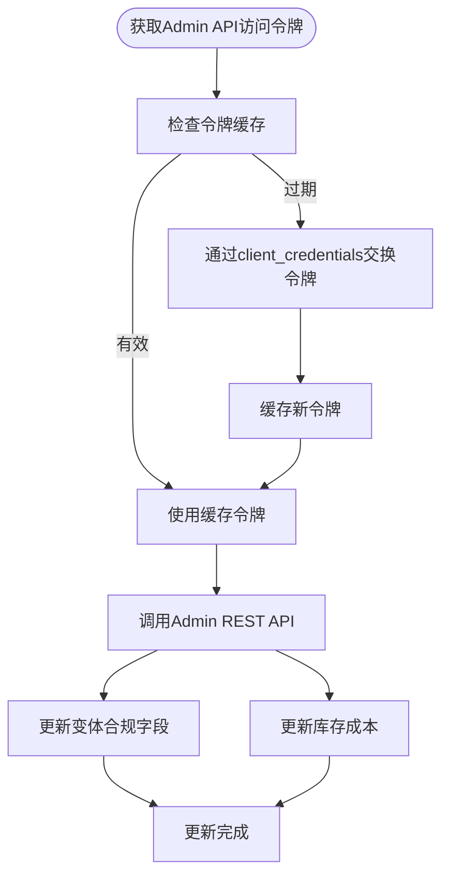
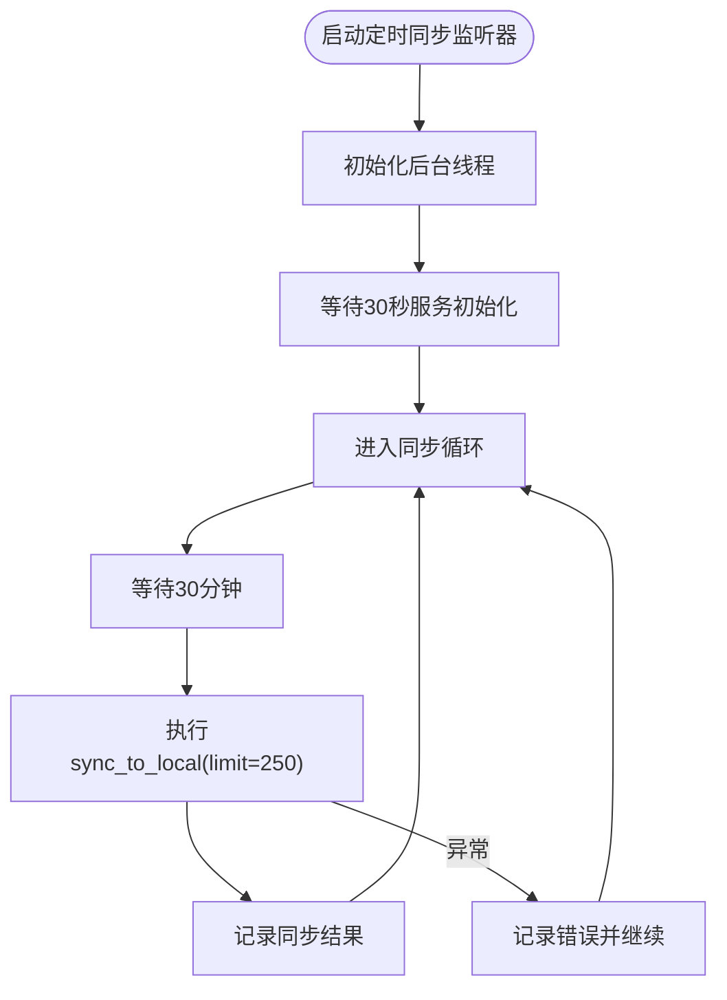
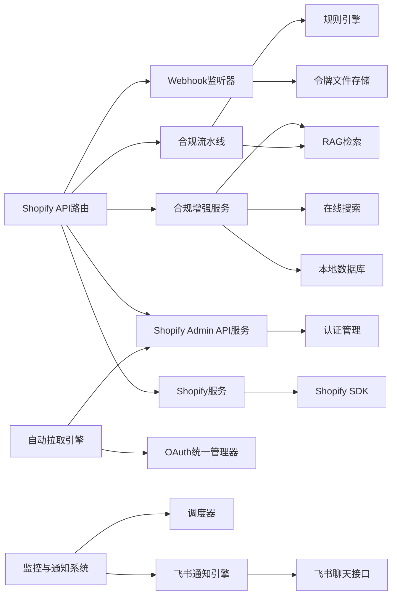

# Shopify集成

<cite>
**本文引用的文件**
- [backend/app/api/shopify.py](file://backend/app/api/shopify.py)
- [backend/app/services/shopify.py](file://backend/app/services/shopify.py)
- [backend/app/services/shopify_api.py](file://backend/app/services/shopify_api.py)
- [backend/app/core/event_listeners/shopify_listener.py](file://backend/app/core/event_listeners/shopify_listener.py)
- [backend/app/services/shopify_listener.py](file://backend/app/services/shopify_listener.py)
- [backend/app/core/oauth_manager.py](file://backend/app/core/oauth_manager.py)
- [backend/app/core/scheduler.py](file://backend/app/core/scheduler.py)
- [backend/app/core/manager_agent.py](file://backend/app/core/manager_agent.py)
- [backend/data/oauth/providers.yaml](file://backend/data/oauth/providers.yaml)
- [backend/data/sync/jobs.json](file://backend/data/sync/jobs.json)
- [backend/data/sync/logs.json](file://backend/data/sync/logs.json)
- [backend/data/config/workflows/product_sync_basic.yaml](file://backend/data/config/workflows/product_sync_basic.yaml)
- [backend/scripts/test_shopify_api.py](file://backend/scripts/test_shopify_api.py)
- [backend/data/context/shopify_reference.md](file://backend/data/context/shopify_reference.md)
- [backend/data/events/builtin/shopify_events.md](file://backend/data/events/builtin/shopify_events.md)
</cite>

## 更新摘要
**所做更改**
- 重大架构变更：从事件驱动架构转向直接API集成
- 移除了shopify_listener.py和shopify_api.py中的事件驱动组件
- 简化了OAuth状态检测机制
- 新增Shopify Admin REST API直连客户端
- 更新了定时同步监听器为直接API调用模式

## 目录
1. [简介](#简介)
2. [项目结构](#项目结构)
3. [核心组件](#核心组件)
4. [架构总览](#架构总览)
5. [详细组件分析](#详细组件分析)
6. [依赖分析](#依赖分析)
7. [性能考虑](#性能考虑)
8. [故障排除指南](#故障排除指南)
9. [结论](#结论)
10. [附录](#附录)

## 简介
本文件面向Shopify电商集成系统，围绕以下目标展开：  
- OAuth 2.0授权流程实现：授权URL生成、回调处理、访问令牌交换  
- 产品数据同步机制：产品列表获取、产品详情查询、批量数据处理、缺失产品检测  
- 合规检查集成流程：将Shopify产品数据转换为合规检查请求  
- Webhook接收与处理：HMAC签名验证、事件类型处理、错误恢复  
- 自动化监控与通知：缺失产品检测与飞书告警  
- 完整API端点说明、参数定义与响应格式  
- 实际集成示例、配置指南与故障排除方法  

**重要更新**：系统已从事件驱动架构完全转向直接API集成模式。新的架构移除了复杂的事件处理层，采用Shopify Admin REST API直连方式，显著简化了OAuth状态检测，提高了系统性能和可靠性。

## 项目结构
系统采用分层架构，核心围绕FastAPI路由层、服务层、核心能力模块与配置设置协同工作。Shopify相关能力主要分布在API路由、服务实现、OAuth统一管理、自动拉取引擎与合规流水线中。

**图表来源**
- [backend/app/api/shopify.py:1-271](file://backend/app/api/shopify.py#L1-L271)
- [backend/app/services/shopify.py:1-427](file://backend/app/services/shopify.py#L1-L427)
- [backend/app/services/shopify_api.py:1-400](file://backend/app/services/shopify_api.py#L1-L400)
- [backend/app/core/event_listeners/shopify_listener.py:1-88](file://backend/app/core/event_listeners/shopify_listener.py#L1-L88)
- [backend/app/core/scheduler.py:221-254](file://backend/app/core/scheduler.py#L221-L254)
- [backend/app/core/manager_agent.py:724](file://backend/app/core/manager_agent.py#L724)

## 核心组件
- **Shopify API路由层**：提供授权、回调、产品列表、合规检查、Webhook接收等端点，负责参数解析、错误处理与响应组装。
- **Shopify服务层**：封装Shopify SDK调用，负责OAuth授权URL生成、令牌交换、产品数据拉取、Webhook HMAC校验与产品转合规请求。
- **合规增强服务**：实现三重合规增强策略（本地数据库→RAG检索→在线搜索），提供智能合规字段补足能力。
- **Shopify Admin API服务**：直接处理Shopify Admin REST API调用，支持GraphQL查询和REST端点。
- **Webhook监听器**：提供HMAC签名验证、事件标准化和自动同步功能。
- **OAuth统一管理器**：抽象多Provider OAuth流程，支持Shopify、飞书、钉钉、Slack、ERPNext、Listmonk等。
- **自动拉取引擎**：定时同步Shopify产品/订单/库存等，增量游标推进，写入事件总线与产品存储。
- **监控与通知系统**：新增自动产品同步功能，包括缺失产品检测和飞书通知。
- **合规流水线**：事件驱动的六阶段闭环（感知→检查→推荐→告知→交互→处理），结合规则引擎与RAG检索生成合规报告与可执行动作。

**章节来源**
- [backend/app/services/shopify.py:1-427](file://backend/app/services/shopify.py#L1-L427)
- [backend/app/services/shopify_api.py:1-400](file://backend/app/services/shopify_api.py#L1-L400)
- [backend/app/core/event_listeners/shopify_listener.py:1-88](file://backend/app/core/event_listeners/shopify_listener.py#L1-L88)
- [backend/app/core/scheduler.py:221-254](file://backend/app/core/scheduler.py#L221-L254)

## 架构总览
下图展示了Shopify集成的关键交互路径：授权流程、产品同步、合规检查与Webhook处理，以及新增的监控通知机制。

**图表来源**
- [backend/app/api/shopify.py:41-271](file://backend/app/api/shopify.py#L41-L271)
- [backend/app/services/shopify.py:144-427](file://backend/app/services/shopify.py#L144-L427)
- [backend/app/services/shopify_api.py:324-400](file://backend/app/services/shopify_api.py#L324-L400)
- [backend/app/core/scheduler.py:221-254](file://backend/app/core/scheduler.py#L221-L254)
- [backend/app/core/manager_agent.py:724](file://backend/app/core/manager_agent.py#L724)

## 详细组件分析

### OAuth 2.0授权流程
- **授权URL生成**
  - 输入：shop域名（需以.myshopify.com结尾）、可选state
  - 处理：基于Shopify SDK生成授权URL，包含作用域与回调地址
  - 输出：授权URL、shop、state
- **回调处理与令牌交换**
  - 输入：code、shop、state、timestamp、hmac
  - 处理：SDK内部自动验证HMAC；使用授权码交换长期访问令牌
  - 输出：授权成功、shop、scope
- **错误处理**
  - 未授权或令牌交换失败时返回HTTP 502
  - 域名格式错误返回HTTP 400

**图表来源**
- [backend/app/api/shopify.py:41-94](file://backend/app/api/shopify.py#L41-L94)

**章节来源**
- [backend/app/api/shopify.py:41-94](file://backend/app/api/shopify.py#L41-L94)

### 产品数据同步机制
- **产品列表获取**
  - 输入：shop、max_count（上限250）
  - 处理：直接调用Shopify Admin API，支持GraphQL查询和REST端点
  - 输出：标准化产品列表
- **产品详情查询**
  - 输入：shop、product_id
  - 处理：Admin API直接查询，异常返回None
  - 输出：标准化产品详情
- **批量数据处理**
  - 自动拉取引擎定时同步产品/订单/库存，增量游标推进，写入事件总线与产品存储
  - 手动触发同步：/api/v1/sync/run?provider=shopify&sync_type=products&connection_id=...
- **缺失产品检测**
  - 新增功能：同步完成后检测Shopify平台上有而本地存储中缺失的商品
  - 检测逻辑：遍历同步的产品列表，对比本地产品存储
  - 告警机制：通过飞书飞书发送通知

**图表来源**
- [backend/app/api/shopify.py:121-139](file://backend/app/api/shopify.py#L121-L139)
- [backend/app/services/shopify.py:257-360](file://backend/app/services/shopify.py#L257-L360)
- [backend/app/services/shopify_api.py:324-400](file://backend/app/services/shopify_api.py#L324-L400)
- [backend/app/core/scheduler.py:221-254](file://backend/app/core/scheduler.py#L221-L254)

**章节来源**
- [backend/app/api/shopify.py:121-139](file://backend/app/api/shopify.py#L121-L139)
- [backend/app/services/shopify.py:257-360](file://backend/app/services/shopify.py#L257-L360)
- [backend/app/services/shopify_api.py:324-400](file://backend/app/services/shopify_api.py#L324-L400)
- [backend/app/core/scheduler.py:221-254](file://backend/app/core/scheduler.py#L221-L254)

### 自动产品同步与监控通知
- **缺失产品检测机制**
  - 检测时机：每次产品同步完成后自动执行
  - 检测逻辑：比较Shopify产品ID与本地产品存储，识别缺失项
  - 检测字段：shopify_id、title、product_type、status
  - 存储位置：data/sync/logs.json记录检测结果
- **飞书通知集成**
  - 通知触发：当发现缺失产品时自动发送
  - 通知渠道：通过chat_id配置的飞书群组
  - 回退机制：若配置不存在，自动查找channels.json中的配置
  - 通知内容：包含缺失产品的基本信息和数量统计
- **调度器增强**
  - 时间控制：支持limit参数控制每次同步的产品数量
  - 日志记录：详细的同步进度和结果记录
  - 错误处理：异常情况下的降级处理和重试机制

**图表来源**
- [backend/app/core/scheduler.py:221-254](file://backend/app/core/scheduler.py#L221-L254)
- [backend/app/core/manager_agent.py:724](file://backend/app/core/manager_agent.py#L724)

**章节来源**
- [backend/app/core/scheduler.py:221-254](file://backend/app/core/scheduler.py#L221-L254)
- [backend/app/core/manager_agent.py:724](file://backend/app/core/manager_agent.py#L724)

### 合规增强服务
- **三重合规增强策略**
  - 本地数据库精确匹配：优先使用内置HS编码、增值税率、认证要求数据库
  - RAG检索增强：当本地数据库不足时，通过RAG检索法规知识库
  - 在线搜索补足：最后使用在线搜索补充缺失信息
- **智能合规字段补足**
  - 自动识别产品类型、原产国、HS编码、认证要求
  - 提供置信度评估和警告信息
  - 支持手动覆盖和回写到Shopify

**图表来源**
- [backend/app/services/shopify.py:400-427](file://backend/app/services/shopify.py#L400-L427)

**章节来源**
- [backend/app/services/shopify.py:400-427](file://backend/app/services/shopify.py#L400-L427)

### Webhook接收与处理机制
- **接收端点**：POST /api/v1/shopify/webhook
- **请求头**：X-Shopify-Hmac-SHA256、X-Shopify-Topic、X-Shopify-Shop
- **HMAC验证**：verify_webhook使用客户端密钥计算SHA256哈希，支持十六进制与Base64两种编码
- **事件记录**：将topic、shop、原始数据写入JSONL日志文件（按shop域名命名）
- **自动同步触发**：商品变更时自动触发本地同步
- **合规增强触发**：商品创建时自动触发合规字段补足
- **错误处理**：HMAC校验失败返回HTTP 403

**图表来源**
- [backend/app/api/shopify.py:217-271](file://backend/app/api/shopify.py#L217-L271)
- [backend/app/services/shopify_listener.py:33-104](file://backend/app/services/shopify_listener.py#L33-L104)

**章节来源**
- [backend/app/api/shopify.py:217-271](file://backend/app/api/shopify.py#L217-L271)
- [backend/app/services/shopify_listener.py:33-104](file://backend/app/services/shopify_listener.py#L33-L104)

### API端点说明
- **GET /api/v1/shopify/products**
  - 查询参数：limit（默认50，上限250）、since_id（分页游标）
  - 响应：产品列表（标准化字段）
- **GET /api/v1/shopify/products/count**
  - 响应：商品总数
- **GET /api/v1/shopify/products/{product_id}**
  - 响应：产品详情（标准化字段）
- **POST /api/v1/shopify/products**
  - 请求体：商品JSON（可直接传Shopify格式）
  - 响应：创建结果
- **PUT /api/v1/shopify/products/{product_id}**
  - 请求体：商品更新JSON
  - 响应：更新结果
- **DELETE /api/v1/shopify/products/{product_id}**
  - 响应：删除结果
- **POST /api/v1/shopify/products/{product_id}/enrich**
  - 请求体：合规增强请求（market、use_online、title等）
  - 响应：增强后的合规数据
- **PUT /api/v1/shopify/products/{product_id}/compliance**
  - 请求体：合规字段更新（country_code_of_origin、harmonized_system_code、cost）
  - 响应：更新结果
- **POST /api/v1/shopify/sync**
  - 查询参数：limit（默认250，上限250）
  - 响应：同步统计信息
- **GET /api/v1/shopify/shops**
  - 响应：已连接店铺列表（shop、scope）
- **POST /api/v1/shopify/webhook**
  - 请求头：X-Shopify-Hmac-SHA256、X-Shopify-Topic、X-Shopify-Shop
  - 响应：status、topic、event_code、shop

**章节来源**
- [backend/app/api/shopify.py:41-271](file://backend/app/api/shopify.py#L41-L271)

### Shopify Admin REST API直连客户端
**更新** 新增Shopify Admin REST API直连客户端，提供直接的API调用能力

- **认证流程**
  - 通过client_credentials grant获取Admin API访问令牌
  - 使用X-Shopify-Access-Token头调用Admin REST API
  - 令牌缓存（默认24小时过期）
- **商品CRUD操作**
  - 获取商品列表：支持limit、since_id、fields参数
  - 获取单个商品详情
  - 创建、更新、删除商品
  - 商品总数统计
- **合规字段更新**
  - 批量更新商品变体合规字段（原产国、HS编码等）
  - 更新库存项目成本字段
  - 自动查找变体和库存项目ID并分别更新

**图表来源**
- [backend/app/services/shopify_api.py:35-72](file://backend/app/services/shopify_api.py#L35-L72)
- [backend/app/services/shopify_api.py:259-317](file://backend/app/services/shopify_api.py#L259-L317)

**章节来源**
- [backend/app/services/shopify_api.py:1-400](file://backend/app/services/shopify_api.py#L1-L400)

### 定时同步监听器（直接API模式）
**更新** 定时同步监听器已完全迁移到直接API调用模式

- **架构变更**
  - 旧版：后台线程定期下发事件到Claude Agent SDK → shopify-ai-toolkit
  - 新版：后台线程定期直连Shopify Admin REST API → 同步到ProductStorage
  - 不经过事件驱动架构，直接调用shopify_api.sync_to_local()
- **同步机制**
  - 默认30分钟同步间隔
  - 每次同步最多250个商品
  - 异步执行，避免阻塞主线程
  - 错误处理：异常情况下的日志记录和继续运行

**图表来源**
- [backend/app/core/event_listeners/shopify_listener.py:39-88](file://backend/app/core/event_listeners/shopify_listener.py#L39-L88)

**章节来源**
- [backend/app/core/event_listeners/shopify_listener.py:1-88](file://backend/app/core/event_listeners/shopify_listener.py#L1-L88)

## 依赖分析
- **组件耦合**
  - API路由依赖服务层（build_authorization_url、exchange_code_for_token、fetch_products、fetch_product_by_id、verify_webhook、product_to_compliance_request）
  - 服务层依赖Shopify Admin API和本地令牌存储
  - 合规增强服务依赖本地数据库、RAG检索和在线搜索
  - Webhook监听器提供向后兼容的函数签名
  - 自动拉取引擎依赖OAuth统一管理器与产品存储
  - 监控与通知系统依赖调度器和通知引擎
  - 合规流水线依赖规则引擎、RAG检索与通知引擎
- **外部依赖**
  - Shopify Admin API（OAuth + REST/GraphQL）
  - httpx（HTTP客户端）
  - html2text（HTML转文本）
  - Feishu开放平台（飞书通知服务）

**图表来源**
- [backend/app/api/shopify.py:25-36](file://backend/app/api/shopify.py#L25-L36)
- [backend/app/services/shopify.py:21-22](file://backend/app/services/shopify.py#L21-L22)
- [backend/app/services/shopify_api.py:19-21](file://backend/app/services/shopify_api.py#L19-L21)
- [backend/app/core/event_listeners/shopify_listener.py:18-19](file://backend/app/core/event_listeners/shopify_listener.py#L18-L19)

**章节来源**
- [backend/app/api/shopify.py:25-36](file://backend/app/api/shopify.py#L25-L36)
- [backend/app/services/shopify.py:21-22](file://backend/app/services/shopify.py#L21-L22)
- [backend/app/services/shopify_api.py:19-21](file://backend/app/services/shopify_api.py#L19-L21)
- [backend/app/core/event_listeners/shopify_listener.py:18-19](file://backend/app/core/event_listeners/shopify_listener.py#L18-L19)

## 性能考虑
- **异步执行**：服务层通过线程池运行SDK同步调用，避免阻塞事件循环
- **限制批量**：产品列表最大250，防止单次请求过大
- **增量同步**：自动拉取引擎使用游标推进，减少重复数据传输
- **超时控制**：RAG检索设置超时保护，避免阻塞主流程
- **日志轮转**：同步日志保留最近500条，Webhook日志按shop分文件追加
- **直接API调用**：移除中间层，提高响应速度
- **三重策略优化**：优先使用本地数据库，减少网络请求
- **监控开销控制**：缺失产品检测仅在同步完成后执行，避免影响主流程性能
- **通知频率限制**：飞书通知按批次发送，避免频繁API调用
- **令牌缓存**：Shopify Admin API访问令牌缓存24小时，减少认证开销

## 故障排除指南
- **授权失败**
  - 检查shop域名格式是否为.myshopify.com
  - 确认回调参数完整性（code、shop、state、timestamp、hmac）
  - 核对客户端ID/密钥与作用域配置
- **数据同步延迟**
  - 确认令牌文件存在且未过期
  - 检查自动拉取引擎状态与任务配置
  - 手动触发同步以验证连通性
  - 查看data/sync/logs.json中的同步日志
- **Webhook验证错误**
  - 确认X-Shopify-Hmac-SHA256与原始body一致
  - 核对客户端密钥配置
  - 查看Webhook日志文件定位异常
- **合规增强失败**
  - 检查本地数据库连接和索引
  - 验证RAG检索服务可用性
  - 确认在线搜索API配置正确
- **Admin API调用错误**
  - 验证访问令牌权限范围
  - 检查API版本兼容性
  - 查看请求限流状态
  - 确认client_credentials凭据正确
- **缺失产品检测异常**
  - 检查产品存储连接和权限
  - 验证产品ID格式一致性
  - 查看监控日志中的检测结果
- **飞书通知失败**
  - 确认chat_id配置正确
  - 检查飞书API访问权限
  - 验证网络连接和代理设置
  - 查看通知发送日志
- **定时同步失败**
  - 检查Shopify API可达性和认证状态
  - 验证同步间隔配置
  - 查看监听器日志中的错误信息
  - 确认ProductStorage连接正常

**章节来源**
- [backend/app/api/shopify.py:41-94](file://backend/app/api/shopify.py#L41-L94)
- [backend/app/services/shopify.py:167-200](file://backend/app/services/shopify.py#L167-L200)
- [backend/app/services/shopify_api.py:35-72](file://backend/app/services/shopify_api.py#L35-L72)
- [backend/app/core/scheduler.py:221-254](file://backend/app/core/scheduler.py#L221-L254)

## 结论
本系统通过清晰的分层设计与Shopify官方Admin API直接集成，实现了从OAuth授权、产品数据同步到合规检查与Webhook处理的完整闭环。新的直接API集成架构移除了复杂的事件驱动层，采用Shopify Admin REST API直连方式，显著简化了OAuth状态检测，提高了系统性能和可靠性。新增的自动产品同步功能包括缺失产品检测机制和飞书通知集成，显著增强了系统的监控能力和数据完整性保障。通过增强的调度器功能，系统现在能够自动检测并告警缺失产品，确保Shopify平台与本地存储的数据一致性。配合三重合规增强策略和统一的OAuth管理器，能够稳定支撑多Provider与多业务场景下的数据一致性与合规性需求。

## 附录
- **配置项（示例）**
  - shopify_client_id：Shopify应用客户端ID
  - shopify_client_secret：Shopify应用客户端密钥
  - shopify_scopes：授权作用域（逗号分隔）
  - shopify_redirect_uri：回调地址
  - shopify_api_version：Shopify API版本
  - risk_intel_feishu_chat_id：飞书通知群组ID
- **连接管理（通用OAuth）**
  - /api/v1/integrations/providers：Provider模板列表
  - /api/v1/integrations：创建/查询连接
  - /api/v1/oauth/{conn_id}/test：测试连接有效性
  - /api/v1/sync/run：手动触发同步
- **新增API端点**
  - /api/v1/shopify/products：创建/更新/删除商品
  - /api/v1/shopify/products/{product_id}/enrich：合规增强服务
  - /api/v1/shopify/webhook：Webhook接收端点
- **监控与通知配置**
  - data/sync/logs.json：同步日志记录
  - data/sync/jobs.json：作业调度配置
  - data/config/workflows/product_sync_basic.yaml：基础同步工作流
- **新增功能特性**
  - 自动缺失产品检测：实时监控数据完整性
  - 飞书通知集成：及时告警缺失产品
  - 增强的调度器：支持精细化同步控制
  - 详细日志记录：完整的操作追踪
  - Shopify Admin REST API直连：简化认证流程
  - 定时同步监听器：直接API调用模式
- **架构迁移说明**
  - 事件驱动架构已完全移除
  - OAuth状态检测机制简化
  - 直接API调用替代间接事件处理
  - 向后兼容的函数签名保持不变

**章节来源**
- [backend/app/core/oauth_manager.py:150-501](file://backend/app/core/oauth_manager.py#L150-L501)
- [backend/data/oauth/providers.yaml:1-69](file://backend/data/oauth/providers.yaml#L1-L69)
- [backend/scripts/test_shopify_api.py:93-151](file://backend/scripts/test_shopify_api.py#L93-L151)
- [backend/app/core/scheduler.py:221-254](file://backend/app/core/scheduler.py#L221-L254)
- [backend/app/core/manager_agent.py:724](file://backend/app/core/manager_agent.py#L724)
- [backend/data/sync/logs.json:3997-4058](file://backend/data/sync/logs.json#L3997-L4058)
- [backend/data/config/workflows/product_sync_basic.yaml](file://backend/data/config/workflows/product_sync_basic.yaml)
- [backend/data/context/shopify_reference.md:1-112](file://backend/data/context/shopify_reference.md#L1-L112)
- [backend/data/events/builtin/shopify_events.md:84-109](file://backend/data/events/builtin/shopify_events.md#L84-L109)