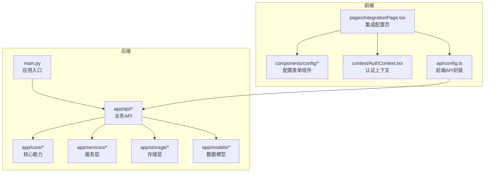
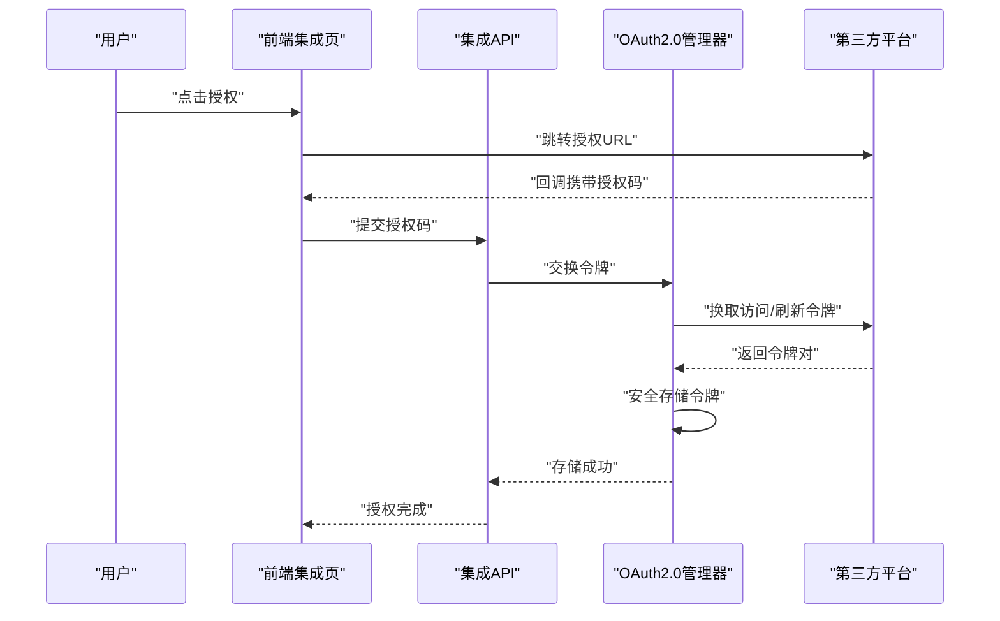
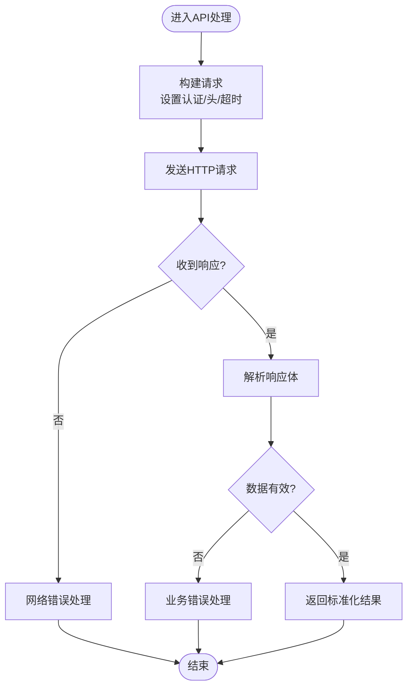
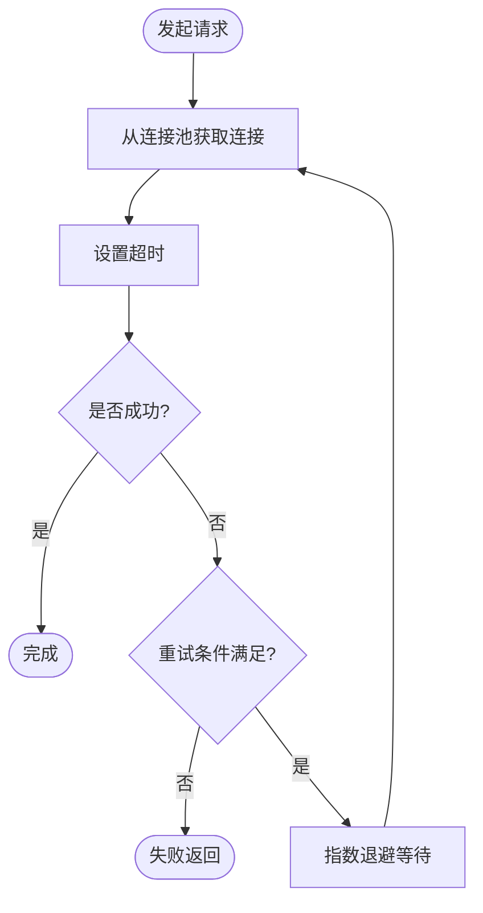
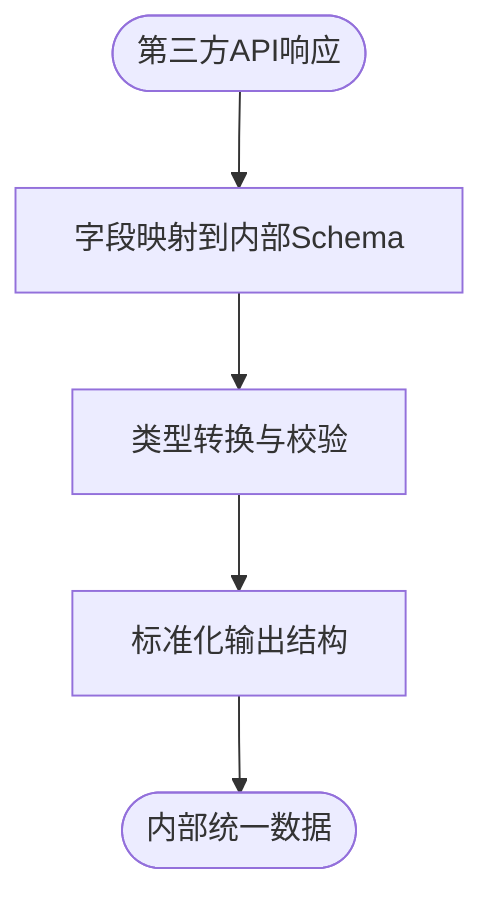
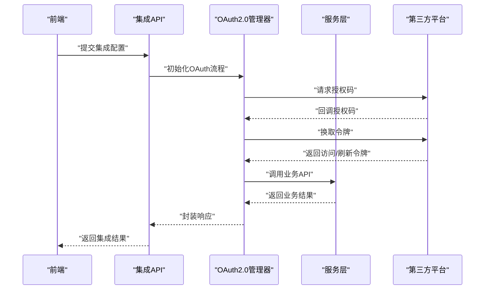
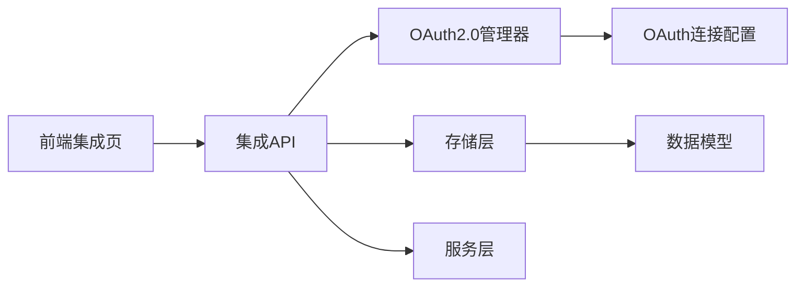

# 外部API集成

<cite>
**本文引用的文件**
- [backend/app/api/integrations.py](file://backend/app/api/integrations.py)
- [backend/data/config/oauth_connections.json](file://backend/data/config/oauth_connections.json)
- [backend/app/core/oauth_manager.py](file://backend/app/core/oauth_manager.py)
- [backend/app/api/auth.py](file://backend/app/api/auth.py)
- [backend/app/api/admin.py](file://backend/app/api/admin.py)
- [backend/app/api/products.py](file://backend/app/api/products.py)
- [backend/app/api/events.py](file://backend/app/api/events.py)
- [backend/app/api/knowledge.py](file://backend/app/api/knowledge.py)
- [backend/app/api/metrics.py](file://backend/app/api/metrics.py)
- [backend/app/api/notifications.py](file://backend/app/api/notifications.py)
- [backend/app/api/sessions.py](file://backend/app/api/sessions.py)
- [backend/app/api/sdk_sessions.py](file://backend/app/api/sdk_sessions.py)
- [backend/app/api/shopify.py](file://backend/app/api/shopify.py)
- [backend/app/core/channel_adapter.py](file://backend/app/core/channel_adapter.py)
- [backend/app/core/event_bus.py](file://backend/app/core/event_bus.py)
- [backend/app/core/local_store.py](file://backend/app/core/local_store.py)
- [backend/app/models/database.py](file://backend/app/models/database.py)
- [backend/app/models/schemas.py](file://backend/app/models/schemas.py)
- [backend/app/storage/session_store.py](file://backend/app/storage/session_store.py)
- [backend/app/storage/user_store.py](file://backend/app/storage/user_store.py)
- [backend/app/storage/project_memory.py](file://backend/app/storage/project_memory.py)
- [backend/app/storage/session_memory.py](file://backend/app/storage/session_memory.py)
- [backend/app/storage/user_memory.py](file://backend/app/storage/user_memory.py)
- [backend/app/storage/raw_store.py](file://backend/app/storage/raw_store.py)
- [backend/app/storage/event_store.py](file://backend/app/storage/event_store.py)
- [backend/app/storage/agent_config_store.py](file://backend/app/storage/agent_config_store.py)
- [backend/app/services/compliance.py](file://backend/app/services/compliance.py)
- [backend/app/services/metaso_search.py](file://backend/app/services/metaso_search.py)
- [backend/app/services/astra_tools.py](file://backend/app/services/astra_tools.py)
- [backend/app/services/shopify.py](file://backend/app/services/shopify.py)
- [backend/app/services/ws_manager.py](file://backend/app/services/ws_manager.py)
- [backend/main.py](file://backend/main.py)
- [frontend/src/pages/IntegrationPage.tsx](file://frontend/src/pages/IntegrationPage.tsx)
- [frontend/src/components/config/ConfigForm.tsx](file://frontend/src/components/config/ConfigForm.tsx)
- [frontend/src/context/AuthContext.tsx](file://frontend/src/context/AuthContext.tsx)
- [frontend/src/api/config.ts](file://frontend/src/api/config.ts)
- [后端api.md](file://后端api.md)
- [前后端api交互.md](file://前后端api交互.md)
- [前端api.md](file://前端api.md)
</cite>

## 目录
1. [简介](#简介)
2. [项目结构](#项目结构)
3. [核心组件](#核心组件)
4. [架构总览](#架构总览)
5. [详细组件分析](#详细组件分析)
6. [依赖关系分析](#依赖关系分析)
7. [性能考量](#性能考量)
8. [故障排除指南](#故障排除指南)
9. [结论](#结论)
10. [附录](#附录)

## 简介
本文件面向外部API集成系统，围绕OAuth2.0认证流程（授权码流程、令牌刷新与安全存储）、RESTful API调用封装（请求构建、响应解析、错误处理）、连接管理（连接池、超时与重试）、数据映射与转换、限流与配额管理、第三方服务集成模板与示例、安全最佳实践以及常见问题排查进行系统化说明。文档以仓库中的后端API模块、核心OAuth管理器、存储层与前端页面为依据，结合配置文件与接口文档，形成可操作的集成指南。

## 项目结构
后端采用Python FastAPI框架，按功能域划分API路由与核心模块；前端采用TypeScript/Vue生态，提供集成配置页面与认证上下文。数据与配置主要通过JSON文件与数据库模型进行持久化。

**图表来源**
- [backend/main.py](file://backend/main.py)
- [backend/app/api/integrations.py](file://backend/app/api/integrations.py)
- [backend/app/core/oauth_manager.py](file://backend/app/core/oauth_manager.py)
- [backend/app/storage/session_store.py](file://backend/app/storage/session_store.py)
- [frontend/src/pages/IntegrationPage.tsx](file://frontend/src/pages/IntegrationPage.tsx)
- [frontend/src/context/AuthContext.tsx](file://frontend/src/context/AuthContext.tsx)

**章节来源**
- [backend/main.py](file://backend/main.py)
- [后端api.md](file://后端api.md)

## 核心组件
- OAuth2.0管理器：负责授权码流程、令牌刷新与安全存储，支持多平台连接配置。
- API路由层：提供集成配置、认证、事件、知识、指标、通知等REST接口。
- 存储层：会话、用户、事件、项目记忆等数据持久化，支撑集成状态与配置。
- 服务层：合规、搜索、工具集、Shopify对接等业务服务。
- 前端集成页：提供第三方服务配置界面与认证上下文。

**章节来源**
- [backend/app/core/oauth_manager.py](file://backend/app/core/oauth_manager.py)
- [backend/app/api/integrations.py](file://backend/app/api/integrations.py)
- [backend/data/config/oauth_connections.json](file://backend/data/config/oauth_connections.json)
- [backend/app/storage/session_store.py](file://backend/app/storage/session_store.py)
- [frontend/src/pages/IntegrationPage.tsx](file://frontend/src/pages/IntegrationPage.tsx)

## 架构总览
系统采用“前端页面 + API路由 + 核心管理器 + 存储层 + 服务层”的分层架构。OAuth2.0流程在后端核心模块中统一实现，前端通过集成页提交配置并通过认证上下文发起受控请求。

```mermaid
graph TB
FE["前端集成页<br/>IntegrationPage.tsx"] --> AUTH["认证上下文<br/>AuthContext.tsx"]
AUTH --> API_INTEGR["集成API<br/>integrations.py"]
API_INTEGR --> OAUTH["OAuth2.0管理器<br/>oauth_manager.py"]
API_INTEGR --> STORE["存储层<br/>session_store/user_store"]
API_INTEGR --> SVC["服务层<br/>compliance/metaso_search/astra_tools"]
OAUTH --> CFG["OAuth连接配置<br/>oauth_connections.json"]
```

**图表来源**
- [frontend/src/pages/IntegrationPage.tsx](file://frontend/src/pages/IntegrationPage.tsx)
- [frontend/src/context/AuthContext.tsx](file://frontend/src/context/AuthContext.tsx)
- [backend/app/api/integrations.py](file://backend/app/api/integrations.py)
- [backend/app/core/oauth_manager.py](file://backend/app/core/oauth_manager.py)
- [backend/data/config/oauth_connections.json](file://backend/data/config/oauth_connections.json)
- [backend/app/storage/session_store.py](file://backend/app/storage/session_store.py)

## 详细组件分析

### OAuth2.0认证流程（授权码、刷新与安全存储）
- 授权码流程：前端引导用户跳转至第三方平台授权，回调后由后端接收授权码并换取访问令牌与刷新令牌，随后安全存储于会话或专用存储中。
- 令牌刷新：当访问令牌即将过期时，使用刷新令牌向第三方平台申请新令牌，更新本地存储并返回给前端。
- 安全存储：令牌与密钥通过安全存储组件持久化，避免明文落盘；同时在内存中仅保留必要生命周期的令牌副本。

**图表来源**
- [backend/app/core/oauth_manager.py](file://backend/app/core/oauth_manager.py)
- [backend/app/api/integrations.py](file://backend/app/api/integrations.py)
- [backend/data/config/oauth_connections.json](file://backend/data/config/oauth_connections.json)

**章节来源**
- [backend/app/core/oauth_manager.py](file://backend/app/core/oauth_manager.py)
- [backend/app/api/integrations.py](file://backend/app/api/integrations.py)
- [backend/data/config/oauth_connections.json](file://backend/data/config/oauth_connections.json)

### RESTful API调用封装（请求构建、响应解析、错误处理）
- 请求构建：统一在API路由中构造HTTP请求，设置认证头、内容类型与超时参数，必要时进行参数签名或时间戳校验。
- 响应解析：对第三方API响应进行结构化解析，提取关键字段并进行类型转换与校验。
- 错误处理：捕获网络异常、HTTP状态码异常与业务错误，返回标准化错误信息并记录日志。

**图表来源**
- [backend/app/api/integrations.py](file://backend/app/api/integrations.py)
- [backend/app/services/compliance.py](file://backend/app/services/compliance.py)

**章节来源**
- [backend/app/api/integrations.py](file://backend/app/api/integrations.py)
- [backend/app/services/compliance.py](file://backend/app/services/compliance.py)

### API连接管理（连接池、超时与重试）
- 连接池：对外部HTTP客户端进行连接池复用，减少握手开销，提升并发性能。
- 超时设置：为请求设置连接超时与读取超时，避免阻塞线程资源。
- 重试策略：对瞬时性错误（如网络抖动、5xx）进行指数退避重试，限制最大重试次数与总等待时间。

**图表来源**
- [backend/app/api/integrations.py](file://backend/app/api/integrations.py)

**章节来源**
- [backend/app/api/integrations.py](file://backend/app/api/integrations.py)

### 数据映射与转换（标准化外部API数据）
- 字段映射：将第三方API返回字段映射到内部统一Schema，确保字段名与类型一致。
- 类型转换：对数值、日期、枚举等进行严格转换与校验，防止脏数据进入下游。
- 标准化输出：统一返回结构，包含元数据、错误码与提示信息，便于前端与上层系统消费。

**图表来源**
- [backend/app/models/schemas.py](file://backend/app/models/schemas.py)
- [backend/app/api/integrations.py](file://backend/app/api/integrations.py)

**章节来源**
- [backend/app/models/schemas.py](file://backend/app/models/schemas.py)
- [backend/app/api/integrations.py](file://backend/app/api/integrations.py)

### 限流与配额管理（最佳实践）
- 平台限流：遵循第三方平台的速率限制，设置并发上限与QPS阈值，避免触发限流封禁。
- 自身限流：在网关或API层实施令牌桶/漏桶算法，对不同租户与IP进行差异化限流。
- 配额监控：记录调用次数、字节数与错误率，建立告警阈值，动态调整配额。

**章节来源**
- [backend/app/api/integrations.py](file://backend/app/api/integrations.py)
- [backend/app/services/compliance.py](file://backend/app/services/compliance.py)

### 第三方服务集成模板与示例
- 集成模板：提供标准OAuth2.0与API调用模板，包括配置项定义、回调处理、错误回退与日志记录。
- 示例代码：以Shopify为例，展示授权码交换、Webhook订阅与库存查询的完整流程。

**图表来源**
- [backend/app/api/integrations.py](file://backend/app/api/integrations.py)
- [backend/app/core/oauth_manager.py](file://backend/app/core/oauth_manager.py)
- [backend/app/services/shopify.py](file://backend/app/services/shopify.py)

**章节来源**
- [backend/app/api/integrations.py](file://backend/app/api/integrations.py)
- [backend/app/core/oauth_manager.py](file://backend/app/core/oauth_manager.py)
- [backend/app/services/shopify.py](file://backend/app/services/shopify.py)

### 安全考虑（敏感数据保护、传输加密、访问控制）
- 敏感数据保护：令牌与密钥仅在内存与安全存储中存在，避免明文写入配置文件；使用环境变量或密钥管理服务注入。
- 传输加密：强制HTTPS通信，证书校验与TLS版本升级，防止中间人攻击。
- 访问控制：基于角色的权限控制（RBAC），对集成配置与调用进行最小权限授权与审计日志。

**章节来源**
- [backend/app/api/auth.py](file://backend/app/api/auth.py)
- [backend/app/api/admin.py](file://backend/app/api/admin.py)
- [backend/app/core/rbac.py](file://backend/app/core/rbac.py)

## 依赖关系分析
后端API路由依赖核心OAuth管理器与存储层；服务层提供业务能力；前端通过集成页与认证上下文与后端交互。

**图表来源**
- [backend/app/api/integrations.py](file://backend/app/api/integrations.py)
- [backend/app/core/oauth_manager.py](file://backend/app/core/oauth_manager.py)
- [backend/app/storage/session_store.py](file://backend/app/storage/session_store.py)
- [backend/app/models/schemas.py](file://backend/app/models/schemas.py)

**章节来源**
- [backend/app/api/integrations.py](file://backend/app/api/integrations.py)
- [backend/app/core/oauth_manager.py](file://backend/app/core/oauth_manager.py)
- [backend/app/storage/session_store.py](file://backend/app/storage/session_store.py)
- [backend/app/models/schemas.py](file://backend/app/models/schemas.py)

## 性能考量
- 连接池复用：减少TCP握手与TLS协商开销，提升高并发场景下的吞吐量。
- 超时与重试：合理设置超时与指数退避，避免雪崩效应与资源浪费。
- 缓存与批处理：对只读数据进行缓存，批量请求降低网络往返次数。
- 异步与并发：在I/O密集场景采用异步处理与并发调度，提升整体响应速度。

[本节为通用性能建议，无需特定文件引用]

## 故障排除指南
- 认证失败：检查授权码是否过期、回调地址是否正确、平台Scope是否匹配；核对存储中的令牌状态。
- 网络超时：增大超时阈值、启用重试、检查代理与防火墙；定位DNS与路由问题。
- 数据格式不匹配：核对第三方API版本变更、字段映射规则与Schema差异；增加输入校验与容错处理。
- 限流触发：降低并发、增加退避等待、申请更高配额；监控调用频率与错误率。

**章节来源**
- [backend/app/api/integrations.py](file://backend/app/api/integrations.py)
- [backend/app/core/oauth_manager.py](file://backend/app/core/oauth_manager.py)
- [backend/app/services/compliance.py](file://backend/app/services/compliance.py)

## 结论
本系统通过统一的OAuth2.0管理器与RESTful API封装，实现了对多种第三方服务的安全、稳定与可扩展集成。配合连接池、超时与重试策略，以及标准化的数据映射与转换，能够有效应对高并发与复杂业务场景。建议在生产环境中进一步完善限流与配额监控、强化安全审计与密钥管理，并持续优化错误处理与可观测性。

[本节为总结性内容，无需特定文件引用]

## 附录
- 前后端API交互参考：[前后端api交互.md](file://前后端api交互.md)
- 前端API说明：[前端api.md](file://前端api.md)
- 后端API说明：[后端api.md](file://后端api.md)