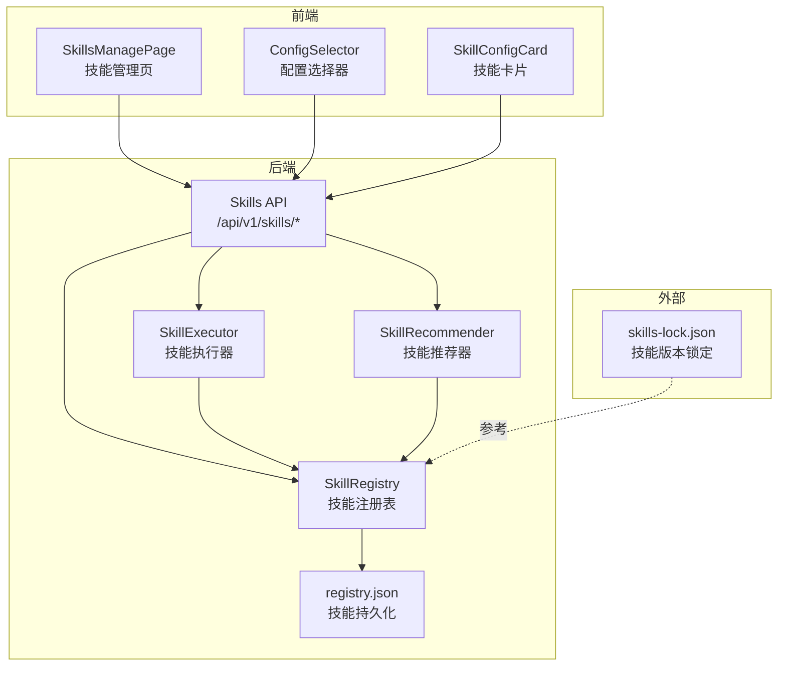
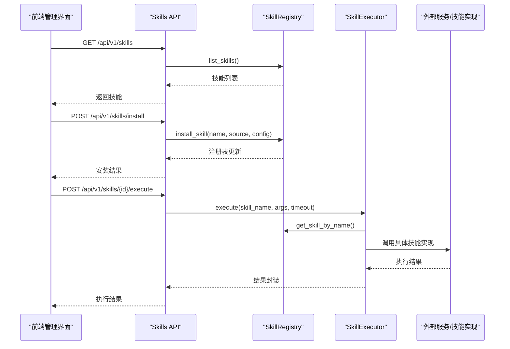
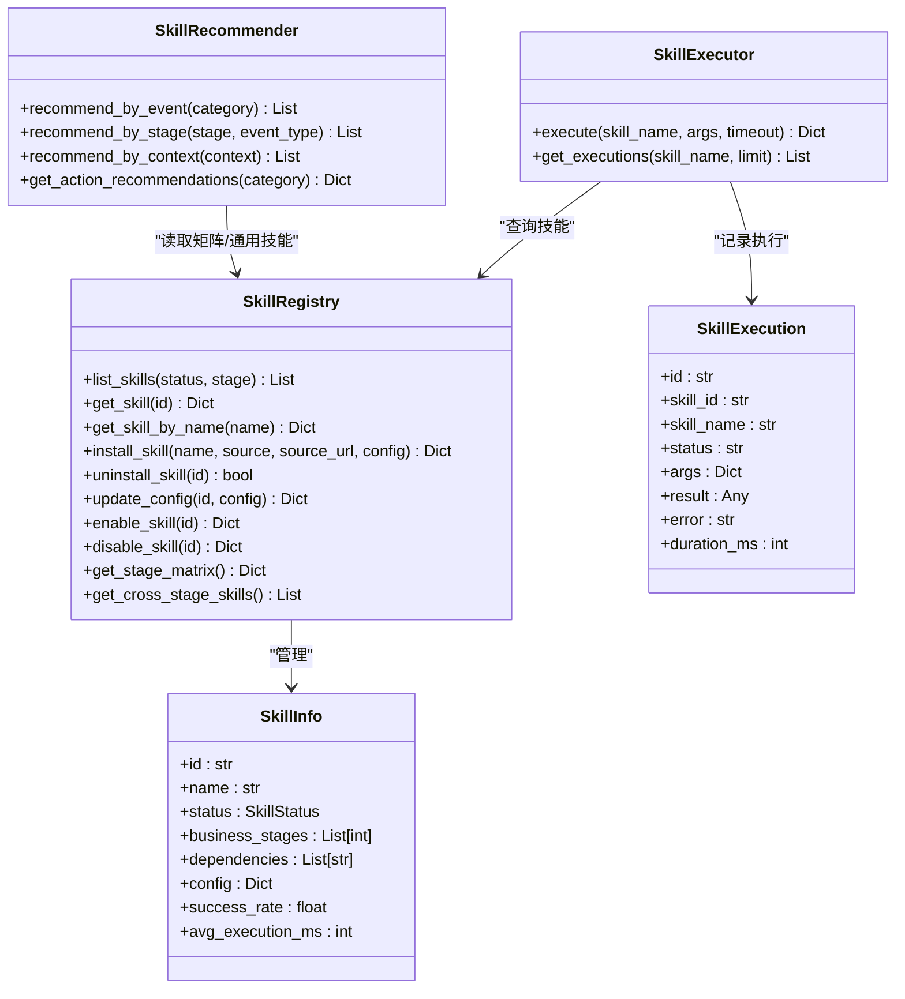
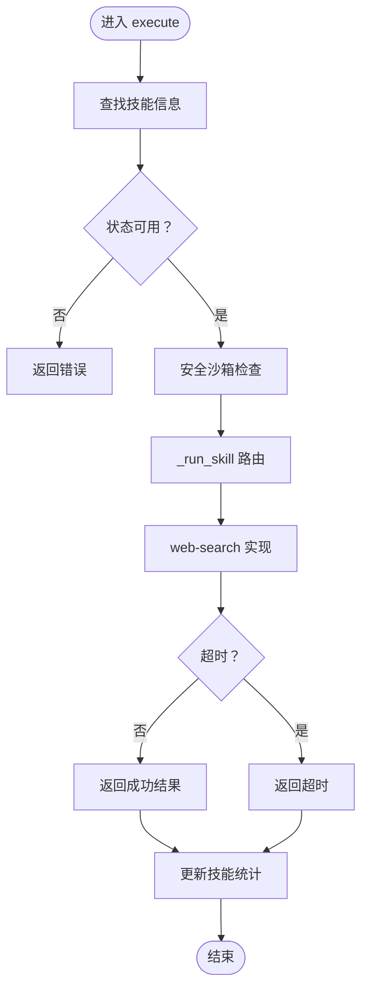
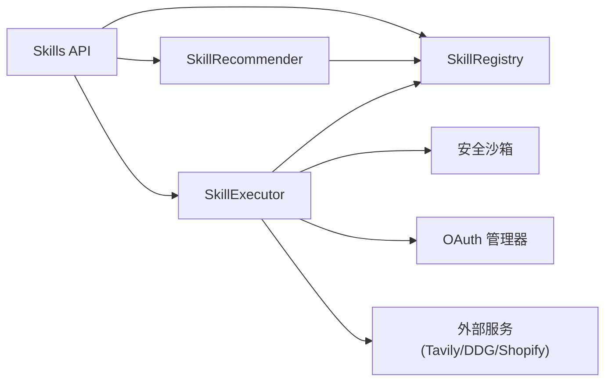

# 技能系统

<cite>
**本文引用的文件**
- [skill_registry.py](file://backend/app/core/skill_registry.py)
- [skills.py](file://backend/app/api/skills.py)
- [skills-lock.json](file://skills-lock.json)
- [registry.json](file://backend/data/config/skills/registry.json)
- [SkillsManagePage.tsx](file://frontend/src/pages/config/SkillsManagePage.tsx)
- [ConfigSelector.tsx](file://frontend/src/components/config/ConfigSelector.tsx)
- [SkillConfigCard.tsx](file://frontend/src/components/config/SkillConfigCard.tsx)
- [test_full_business_flow.py](file://backend/tests/test_full_business_flow.py)
- [test_comprehensive_flow.py](file://backend/tests/test_comprehensive_flow.py)
</cite>

## 目录
1. [简介](#简介)
2. [项目结构](#项目结构)
3. [核心组件](#核心组件)
4. [架构总览](#架构总览)
5. [详细组件分析](#详细组件分析)
6. [依赖分析](#依赖分析)
7. [性能考虑](#性能考虑)
8. [故障排除指南](#故障排除指南)
9. [结论](#结论)
10. [附录](#附录)

## 简介
本技术文档围绕技能系统进行系统化梳理，覆盖技能注册表架构、技能生命周期、执行器实现、技能分类与组织、技能锁机制（skills-lock.json）、开发与发布流程、编排与组合最佳实践，以及常见问题排查。目标是帮助开发者与运维人员快速理解并高效使用该技能体系。

## 项目结构
技能系统主要由后端核心模块、API 接口层、持久化存储、前端管理界面与测试用例构成。核心文件分布如下：
- 后端核心：技能注册表、执行器、推荐器、单例工厂
- API 层：技能管理、执行、推荐、矩阵查询等接口
- 持久化：技能注册表 JSON、执行历史 JSON
- 前端：技能管理页面、配置选择器、技能卡片组件
- 锁定机制：skills-lock.json
- 测试：端到端与综合流程测试

图表来源
- [skill_registry.py:239-967](file://backend/app/core/skill_registry.py#L239-L967)
- [skills.py:1-162](file://backend/app/api/skills.py#L1-L162)
- [registry.json:1-503](file://backend/data/config/skills/registry.json#L1-L503)
- [skills-lock.json:1-84](file://skills-lock.json#L1-L84)
- [SkillsManagePage.tsx:108-139](file://frontend/src/pages/config/SkillsManagePage.tsx#L108-L139)
- [ConfigSelector.tsx:1-33](file://frontend/src/components/config/ConfigSelector.tsx#L1-L33)
- [SkillConfigCard.tsx:1-29](file://frontend/src/components/config/SkillConfigCard.tsx#L1-L29)

章节来源
- [skill_registry.py:1-967](file://backend/app/core/skill_registry.py#L1-L967)
- [skills.py:1-162](file://backend/app/api/skills.py#L1-L162)
- [registry.json:1-503](file://backend/data/config/skills/registry.json#L1-L503)
- [skills-lock.json:1-84](file://skills-lock.json#L1-L84)
- [SkillsManagePage.tsx:108-139](file://frontend/src/pages/config/SkillsManagePage.tsx#L108-L139)
- [ConfigSelector.tsx:1-33](file://frontend/src/components/config/ConfigSelector.tsx#L1-L33)
- [SkillConfigCard.tsx:1-29](file://frontend/src/components/config/SkillConfigCard.tsx#L1-L29)

## 核心组件
- 技能注册表（SkillRegistry）
  - 负责技能的安装、卸载、启用/禁用、配置更新、查询与持久化
  - 内置技能自动注入，支持安全扫描与事件发布
- 技能执行器（SkillExecutor）
  - 负责执行技能、超时控制、结果处理、统计更新
  - 支持多种内置技能路由（如 web-search、summarize、brandkit、skill-vetter、shopify 系列）
- 技能推荐器（SkillRecommender）
  - 基于业务阶段与事件类型进行三层动作推荐（Skill/CLI/API）
  - 维护 Skills×阶段映射矩阵与跨阶段通用技能
- API 层
  - 提供技能列表、安装、执行、配置、推荐、矩阵查询、执行历史等接口
- 前端管理
  - 技能管理页、配置选择器、技能卡片组件，支持编辑、删除、刷新等操作

章节来源
- [skill_registry.py:239-967](file://backend/app/core/skill_registry.py#L239-L967)
- [skills.py:1-162](file://backend/app/api/skills.py#L1-L162)

## 架构总览
技能系统采用“注册表 + 执行器 + 推荐器”的分层设计，配合 API 层与前端管理界面，形成闭环的技能生命周期管理。技能元数据持久化至本地 JSON 文件，执行历史独立存储，便于审计与监控。

图表来源
- [skills.py:42-162](file://backend/app/api/skills.py#L42-L162)
- [skill_registry.py:296-479](file://backend/app/core/skill_registry.py#L296-L479)

## 详细组件分析

### 技能注册表（SkillRegistry）
职责与特性
- 内置技能自动注入：启动时确保内置技能已注册，避免重复安装
- 安全扫描：对远程来源安装前进行安全扫描，阻止高危模式
- 事件发布：安装成功后异步发布系统事件
- 持久化：统一读写 registry.json，保证元数据一致性
- 配置管理：支持按技能 ID 更新配置，记录更新时间

关键数据结构
- SkillInfo：技能元数据（含状态、版本、来源、依赖、权限、统计指标等）
- SkillExecution：执行记录（含参数、结果、错误、耗时等）

图表来源
- [skill_registry.py:33-96](file://backend/app/core/skill_registry.py#L33-L96)
- [skill_registry.py:239-408](file://backend/app/core/skill_registry.py#L239-L408)
- [skill_registry.py:413-479](file://backend/app/core/skill_registry.py#L413-L479)
- [skill_registry.py:877-938](file://backend/app/core/skill_registry.py#L877-L938)

章节来源
- [skill_registry.py:239-408](file://backend/app/core/skill_registry.py#L239-L408)
- [skill_registry.py:413-479](file://backend/app/core/skill_registry.py#L413-L479)
- [skill_registry.py:877-938](file://backend/app/core/skill_registry.py#L877-L938)

### 技能执行器（SkillExecutor）
职责与特性
- 超时控制：默认超时秒数可配置，防止阻塞
- 安全检查：调用安全沙箱进行工具调用检查
- 执行路由：根据技能名路由到具体实现（shopify 系列、web-search、summarize、brandkit、skill-vetter）
- 统计更新：成功/失败均更新技能成功率、平均耗时与最后使用时间
- 结果封装：统一返回状态、耗时、结果或错误信息

执行流程（以 web-search 为例）

图表来源
- [skill_registry.py:422-479](file://backend/app/core/skill_registry.py#L422-L479)
- [skill_registry.py:504-568](file://backend/app/core/skill_registry.py#L504-L568)

章节来源
- [skill_registry.py:413-479](file://backend/app/core/skill_registry.py#L413-L479)
- [skill_registry.py:504-568](file://backend/app/core/skill_registry.py#L504-L568)

### 技能推荐器（SkillRecommender）
职责与特性
- 事件动作推荐：三层动作（Skill/CLI/API）映射
- 阶段技能推荐：基于 Skills×阶段映射矩阵与跨阶段通用技能
- 上下文推荐：综合业务阶段、事件类别与产品类型进行去重与排序
- 动作清单：提供事件类别对应的完整动作推荐

章节来源
- [skill_registry.py:877-938](file://backend/app/core/skill_registry.py#L877-L938)

### API 层（Skills API）
能力概览
- 列表与详情：获取技能列表与指定技能详情
- 安装与卸载：支持按名称安装、按 ID 安装、删除/卸载
- 刷新：刷新技能文件（用于同步外部来源）
- 执行：按技能 ID 执行，支持超时设置
- 配置：获取与更新技能配置
- 推荐：按业务阶段与事件类别推荐
- 矩阵：获取 Skills×阶段映射矩阵与跨阶段通用技能
- 历史：查询执行历史

章节来源
- [skills.py:1-162](file://backend/app/api/skills.py#L1-L162)

### 前端管理界面
- 技能管理页：展示技能列表，支持编辑、删除、刷新
- 配置选择器：在 Agent/工作流配置中选择关联的技能
- 技能卡片：显示技能来源、版本等信息

章节来源
- [SkillsManagePage.tsx:108-139](file://frontend/src/pages/config/SkillsManagePage.tsx#L108-L139)
- [ConfigSelector.tsx:1-33](file://frontend/src/components/config/ConfigSelector.tsx#L1-L33)
- [SkillConfigCard.tsx:1-29](file://frontend/src/components/config/SkillConfigCard.tsx#L1-L29)

## 依赖分析
- 内部耦合
  - SkillExecutor 依赖 SkillRegistry 获取技能信息与更新统计
  - SkillRecommender 依赖 SkillRegistry 的阶段矩阵与通用技能
  - API 层聚合注册表、执行器、推荐器，提供统一入口
- 外部依赖
  - 安全沙箱：用于安装前安全扫描与执行时工具调用检查
  - OAuth 管理器：Shopify 技能执行依赖 OAuth 凭证
  - 外部服务：web-search 可调用 Tavily 或 DuckDuckGo；shopify 系列调用 Shopify Admin GraphQL

图表来源
- [skill_registry.py:413-479](file://backend/app/core/skill_registry.py#L413-L479)
- [skill_registry.py:569-662](file://backend/app/core/skill_registry.py#L569-L662)
- [skills.py:1-162](file://backend/app/api/skills.py#L1-L162)

章节来源
- [skill_registry.py:413-479](file://backend/app/core/skill_registry.py#L413-L479)
- [skill_registry.py:569-662](file://backend/app/core/skill_registry.py#L569-L662)
- [skills.py:1-162](file://backend/app/api/skills.py#L1-L162)

## 性能考虑
- 超时控制：执行器默认超时秒数可配置，避免长时间阻塞
- 异步执行：执行器内部使用异步等待，提升并发能力
- 统计驱动：通过成功率与平均耗时指导技能选择与优化
- 缓存与持久化：注册表与执行历史本地 JSON，减少数据库压力
- 外部调用：web-search 优先使用配置的搜索 API，回退到轻量级接口，降低失败率

## 故障排除指南
常见问题与定位思路
- 技能未找到或状态不可用
  - 检查技能是否已安装且处于可用/激活状态
  - 章节来源
    - [skill_registry.py:422-431](file://backend/app/core/skill_registry.py#L422-L431)
- 执行超时
  - 调整执行器超时参数或优化外部服务响应
  - 章节来源
    - [skill_registry.py:467-472](file://backend/app/core/skill_registry.py#L467-L472)
- 外部服务异常
  - 检查 Tavily/DuckDuckGo 等接口连通性与凭据
  - 章节来源
    - [skill_registry.py:514-568](file://backend/app/core/skill_registry.py#L514-L568)
- Shopify 凭证缺失
  - 确认 OAuth 中已配置 Shopify 凭证
  - 章节来源
    - [skill_registry.py:575-596](file://backend/app/core/skill_registry.py#L575-L596)
- 安全拦截
  - 检查安全沙箱返回的拦截原因，必要时调整技能实现
  - 章节来源
    - [skill_registry.py:433-440](file://backend/app/core/skill_registry.py#L433-L440)

## 结论
技能系统通过注册表、执行器与推荐器的协同，实现了技能的全生命周期管理与智能化推荐。结合 API 层与前端管理界面，用户可以便捷地安装、配置、执行与维护技能。skills-lock.json 提供了技能版本锁定与来源校验能力，有助于在多环境间保持一致性与可追溯性。

## 附录

### 技能生命周期管理
- 加载：启动时从 registry.json 加载技能元数据，确保内置技能存在
- 激活：启用技能使其可被调度与执行
- 执行：通过 API 触发，执行器进行安全检查与路由调用
- 卸载：支持卸载自定义技能或禁用内置技能

章节来源
- [skill_registry.py:266-292](file://backend/app/core/skill_registry.py#L266-L292)
- [skill_registry.py:385-399](file://backend/app/core/skill_registry.py#L385-L399)
- [skills.py:88-104](file://backend/app/api/skills.py#L88-L104)

### 技能分类与组织
- 内置技能：系统预置，覆盖多个业务阶段与事件类型
- 自定义技能：通过安装接口注册，支持配置与版本管理
- 第三方技能：通过 source/source_url 指定来源，安装前进行安全扫描

章节来源
- [skill_registry.py:243-259](file://backend/app/core/skill_registry.py#L243-L259)
- [skill_registry.py:314-363](file://backend/app/core/skill_registry.py#L314-L363)

### 技能锁机制（skills-lock.json）
- 版本锁定：记录各技能来源、类型与内容哈希
- 依赖管理：明确技能来源仓库与路径
- 冲突解决：通过哈希校验识别来源变更，提示人工复核

章节来源
- [skills-lock.json:1-84](file://skills-lock.json#L1-L84)

### 开发与发布流程
- 开发环境
  - 启动后端服务，确保数据目录可写
  - 在 .agents/skills 下放置技能源码（通常为 SKILL.md）
- 安装与测试
  - 通过 API 安装技能，或在前端管理页导入
  - 使用测试用例验证安装、推荐与执行链路
- 部署策略
  - 生产环境建议使用 skills-lock.json 锁定版本
  - 通过 API 进行灰度发布与回滚

章节来源
- [skills.py:49-75](file://backend/app/api/skills.py#L49-L75)
- [SkillsManagePage.tsx:123-127](file://frontend/src/pages/config/SkillsManagePage.tsx#L123-L127)
- [test_full_business_flow.py:385-409](file://backend/tests/test_full_business_flow.py#L385-L409)
- [test_comprehensive_flow.py:1187-1217](file://backend/tests/test_comprehensive_flow.py#L1187-L1217)

### 技能编排与组合最佳实践
- 基于阶段矩阵与事件类别进行技能组合
- 使用推荐器生成三层动作清单（Skill/CLI/API），提升自动化程度
- 通过执行历史与统计指标持续优化技能选择

章节来源
- [skill_registry.py:903-930](file://backend/app/core/skill_registry.py#L903-L930)
- [skills.py:136-154](file://backend/app/api/skills.py#L136-L154)

### 具体示例与配置模板
- 安装示例
  - 请求体包含技能名称、来源、来源地址与配置
  - 章节来源
    - [skills.py:17-21](file://backend/app/api/skills.py#L17-L21)
    - [skills.py:49-57](file://backend/app/api/skills.py#L49-L57)
- 执行示例
  - 按技能 ID 执行，传入参数与超时
  - 章节来源
    - [skills.py:88-96](file://backend/app/api/skills.py#L88-L96)
- 推荐示例
  - 按业务阶段与事件类别获取推荐
  - 章节来源
    - [skills.py:136-147](file://backend/app/api/skills.py#L136-L147)