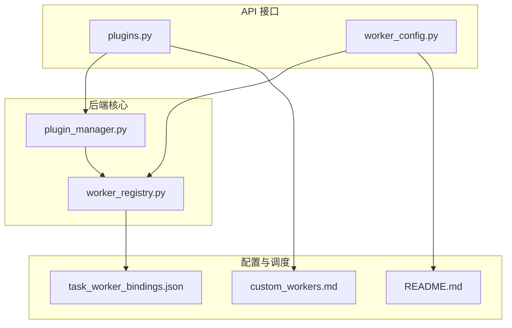
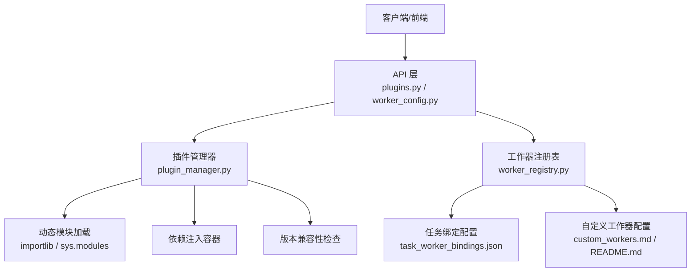
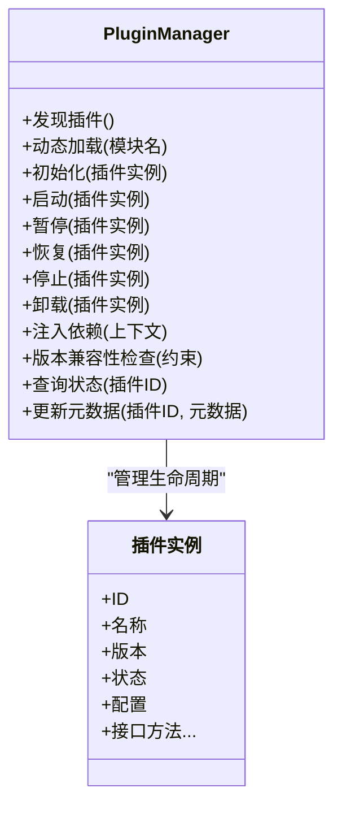
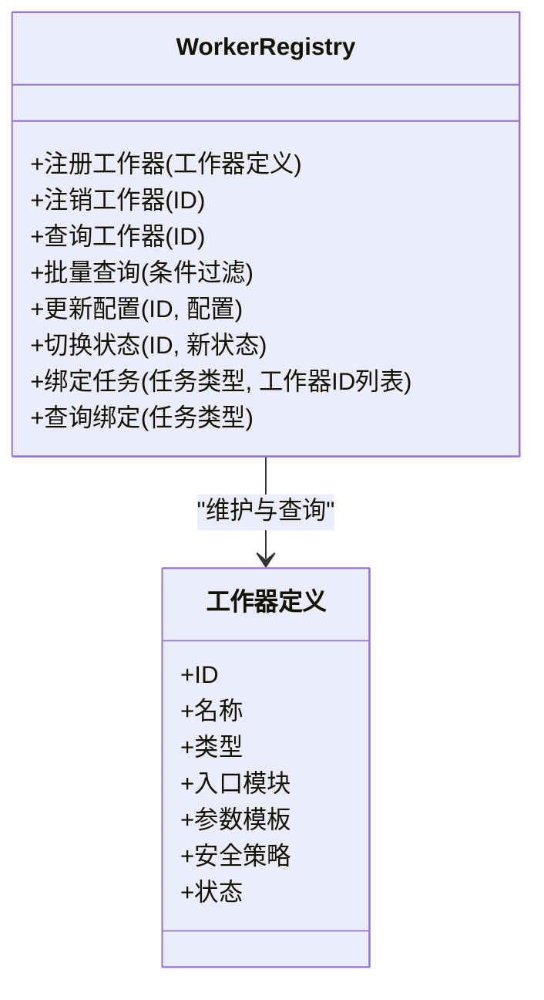
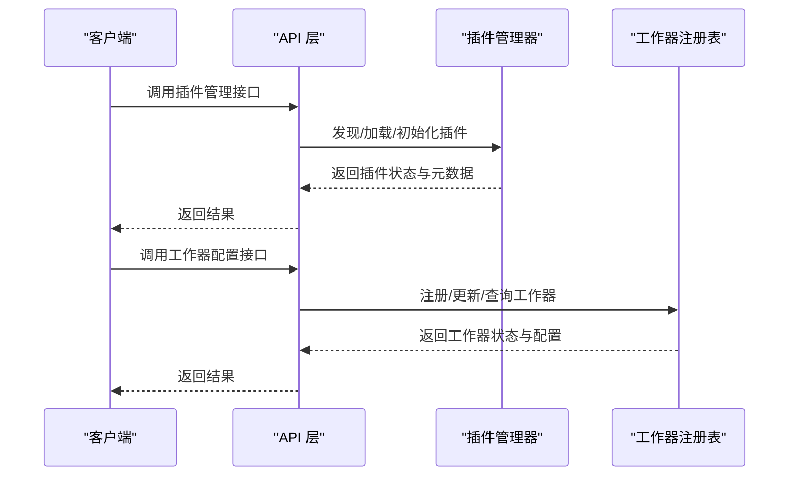
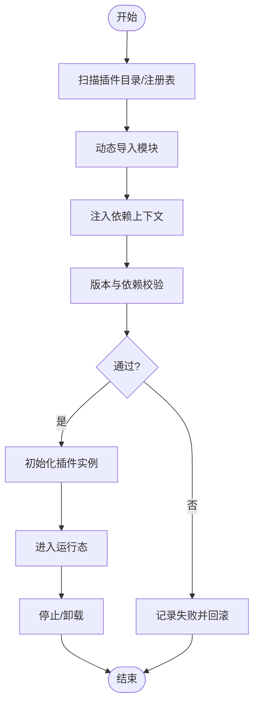
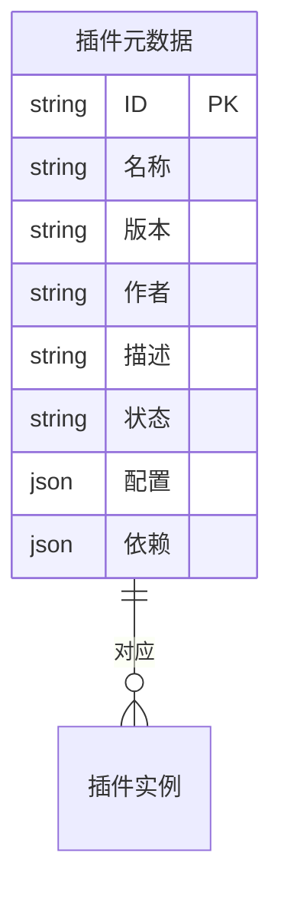
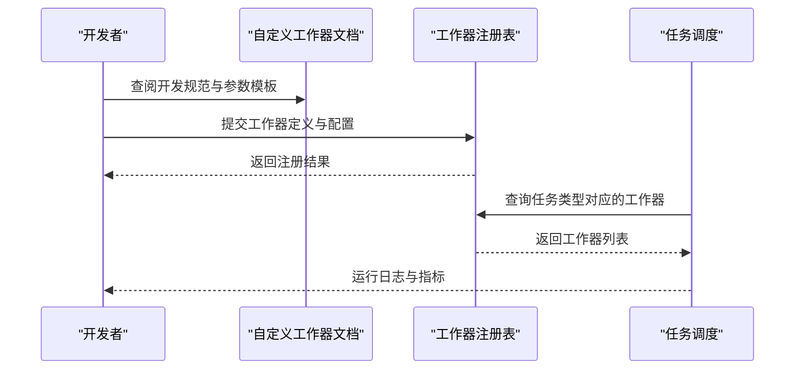

# 插件系统

<cite>
**本文引用的文件**
- [plugin_manager.py](file://backend/app/core/plugin_manager.py)
- [plugins.py](file://backend/app/api/plugins.py)
- [worker_registry.py](file://backend/app/core/worker_registry.py)
- [worker_config.py](file://backend/app/api/worker_config.py)
- [custom_workers.md](file://backend/data/config/workers/custom_workers.md)
- [README.md](file://backend/data/config/workers/README.md)
- [task_worker_bindings.json](file://backend/data/config/scheduler/task_worker_bindings.json)
</cite>

## 目录
1. [简介](#简介)
2. [项目结构](#项目结构)
3. [核心组件](#核心组件)
4. [架构总览](#架构总览)
5. [详细组件分析](#详细组件分析)
6. [依赖关系分析](#依赖关系分析)
7. [性能考量](#性能考量)
8. [故障排查指南](#故障排查指南)
9. [结论](#结论)
10. [附录](#附录)

## 简介
本文件面向插件系统的架构与实现，聚焦于插件管理器的设计模式、插件发现与加载机制、生命周期管理、接口规范与标准协议、动态加载（模块导入、依赖注入、版本兼容性）、插件注册表（元数据存储、状态与配置管理），以及自定义工作器的开发流程与最佳实践。文档同时提供常见问题的解决方案与部署建议。

## 项目结构
本仓库后端采用分层组织：核心逻辑位于 app/core，API 层位于 app/api，配置与调度位于 backend/data/config。与插件系统直接相关的文件主要分布在：
- 核心：plugin_manager.py（插件管理器）、worker_registry.py（工作器注册表）
- API：plugins.py（插件相关接口）、worker_config.py（工作器配置接口）
- 配置：workers 目录下的自定义工作器文档与任务绑定配置

**图表来源**
- [plugin_manager.py](file://backend/app/core/plugin_manager.py)
- [worker_registry.py](file://backend/app/core/worker_registry.py)
- [plugins.py](file://backend/app/api/plugins.py)
- [worker_config.py](file://backend/app/api/worker_config.py)
- [custom_workers.md](file://backend/data/config/workers/custom_workers.md)
- [README.md](file://backend/data/config/workers/README.md)
- [task_worker_bindings.json](file://backend/data/config/scheduler/task_worker_bindings.json)

**章节来源**
- [plugin_manager.py](file://backend/app/core/plugin_manager.py)
- [worker_registry.py](file://backend/app/core/worker_registry.py)
- [plugins.py](file://backend/app/api/plugins.py)
- [worker_config.py](file://backend/app/api/worker_config.py)
- [custom_workers.md](file://backend/data/config/workers/custom_workers.md)
- [README.md](file://backend/data/config/workers/README.md)
- [task_worker_bindings.json](file://backend/data/config/scheduler/task_worker_bindings.json)

## 核心组件
- 插件管理器（Plugin Manager）：负责插件发现、加载、生命周期管理与卸载；维护插件注册表与状态；协调依赖注入与版本兼容性检查。
- 工作器注册表（Worker Registry）：管理内置与自定义工作器的注册、状态与配置；支持任务绑定与运行时调度。
- API 层（plugins.py、worker_config.py）：对外暴露插件与工作器的管理接口，供前端或外部系统调用。
- 配置与调度（custom_workers.md、README.md、task_worker_bindings.json）：定义自定义工作器开发规范、配置项与任务绑定策略。

**章节来源**
- [plugin_manager.py](file://backend/app/core/plugin_manager.py)
- [worker_registry.py](file://backend/app/core/worker_registry.py)
- [plugins.py](file://backend/app/api/plugins.py)
- [worker_config.py](file://backend/app/api/worker_config.py)
- [custom_workers.md](file://backend/data/config/workers/custom_workers.md)
- [README.md](file://backend/data/config/workers/README.md)
- [task_worker_bindings.json](file://backend/data/config/scheduler/task_worker_bindings.json)

## 架构总览
下图展示插件系统在后端的整体交互：API 层接收请求，调用插件管理器与工作器注册表；插件管理器通过模块导入与依赖注入加载插件；工作器注册表负责工作器的注册与任务绑定；配置文件提供开发与部署指导。

**图表来源**
- [plugins.py](file://backend/app/api/plugins.py)
- [worker_config.py](file://backend/app/api/worker_config.py)
- [plugin_manager.py](file://backend/app/core/plugin_manager.py)
- [worker_registry.py](file://backend/app/core/worker_registry.py)
- [task_worker_bindings.json](file://backend/data/config/scheduler/task_worker_bindings.json)
- [custom_workers.md](file://backend/data/config/workers/custom_workers.md)
- [README.md](file://backend/data/config/workers/README.md)

## 详细组件分析

### 插件管理器（Plugin Manager）
职责与能力
- 插件发现：扫描插件目录或注册表，识别可加载的插件包与入口。
- 动态加载：使用模块导入机制加载插件模块，建立插件实例。
- 生命周期管理：初始化、启动、暂停、恢复、停止与卸载。
- 依赖注入：向插件注入上下文服务（如日志、事件总线、配置中心等）。
- 版本兼容性：校验插件声明的最低版本、依赖约束与运行环境兼容性。
- 注册表维护：记录插件元数据（名称、版本、作者、描述、状态、配置）。

设计要点
- 使用模块导入与符号解析确保插件接口一致性。
- 通过状态机管理插件生命周期，避免重复初始化与资源泄漏。
- 以配置驱动的方式控制插件启用/禁用与参数覆盖。

**图表来源**
- [plugin_manager.py](file://backend/app/core/plugin_manager.py)

**章节来源**
- [plugin_manager.py](file://backend/app/core/plugin_manager.py)

### 工作器注册表（Worker Registry）
职责与能力
- 注册内置与自定义工作器，维护工作器清单与元数据。
- 管理工作器状态（可用、不可用、运行中、异常）。
- 维护配置（默认参数、运行时参数、安全策略）。
- 与调度配置联动，根据任务类型选择合适的工作器。

**图表来源**
- [worker_registry.py](file://backend/app/core/worker_registry.py)

**章节来源**
- [worker_registry.py](file://backend/app/core/worker_registry.py)

### API 层（插件与工作器接口）
- 插件接口（plugins.py）：提供插件的安装、启用/禁用、卸载、查询与配置更新等接口。
- 工作器配置接口（worker_config.py）：提供工作器注册、配置更新、任务绑定查询与修改等接口。

**图表来源**
- [plugins.py](file://backend/app/api/plugins.py)
- [worker_config.py](file://backend/app/api/worker_config.py)
- [plugin_manager.py](file://backend/app/core/plugin_manager.py)
- [worker_registry.py](file://backend/app/core/worker_registry.py)

**章节来源**
- [plugins.py](file://backend/app/api/plugins.py)
- [worker_config.py](file://backend/app/api/worker_config.py)

### 插件接口规范与标准协议
- 必须实现的接口与属性（示例维度）
  - 基础信息：ID、名称、版本、作者、描述、许可证、依赖声明。
  - 生命周期钩子：初始化、启动、暂停、恢复、停止、卸载。
  - 配置接口：默认配置、参数校验、热更新支持。
  - 事件与日志：事件订阅/发布、日志输出接口。
  - 安全与隔离：沙箱/权限声明、资源限制、超时控制。
- 协议与约定
  - 模块命名空间与导出接口统一。
  - 配置项采用键值对形式，支持 JSON Schema 校验。
  - 版本语义化，兼容性声明遵循最小版本要求。

（本节为规范说明，不直接分析具体源码）

### 动态加载机制
- 模块导入：通过模块导入器加载插件模块，解析导出接口与元数据。
- 依赖注入：将上下文服务（如日志、事件总线、配置中心）注入插件实例。
- 版本兼容性：读取插件声明的最低版本与依赖，结合运行环境进行匹配校验。
- 安全与隔离：在沙箱或受限环境中执行插件代码，限制系统调用与资源访问。

**图表来源**
- [plugin_manager.py](file://backend/app/core/plugin_manager.py)

**章节来源**
- [plugin_manager.py](file://backend/app/core/plugin_manager.py)

### 插件注册表实现原理
- 元数据存储：以字典或数据库形式存储插件 ID、名称、版本、状态、配置、依赖等。
- 状态管理：基于状态机维护插件生命周期状态，防止非法转换。
- 配置管理：支持默认配置与用户覆盖配置合并，提供热更新能力。

**图表来源**
- [plugin_manager.py](file://backend/app/core/plugin_manager.py)

**章节来源**
- [plugin_manager.py](file://backend/app/core/plugin_manager.py)

### 自定义工作器开发流程
- 接口实现：实现工作器接口（名称、类型、入口模块、参数模板、安全策略）。
- 配置定义：在配置文件中声明工作器参数与默认值，参考自定义工作器文档。
- 开发与测试：编写单元测试与集成测试，验证工作器在不同输入下的行为与稳定性。
- 部署与绑定：将工作器注册到注册表，配置任务绑定，观察运行日志与指标。

**图表来源**
- [worker_registry.py](file://backend/app/core/worker_registry.py)
- [custom_workers.md](file://backend/data/config/workers/custom_workers.md)
- [README.md](file://backend/data/config/workers/README.md)
- [task_worker_bindings.json](file://backend/data/config/scheduler/task_worker_bindings.json)

**章节来源**
- [worker_registry.py](file://backend/app/core/worker_registry.py)
- [custom_workers.md](file://backend/data/config/workers/custom_workers.md)
- [README.md](file://backend/data/config/workers/README.md)
- [task_worker_bindings.json](file://backend/data/config/scheduler/task_worker_bindings.json)

## 依赖关系分析
- 插件管理器依赖工作器注册表以获取任务绑定与工作器状态。
- API 层同时依赖插件管理器与工作器注册表，作为统一入口。
- 配置文件为开发与部署提供约束与规范，影响插件与工作器的行为。

**图表来源**
- [plugins.py](file://backend/app/api/plugins.py)
- [worker_config.py](file://backend/app/api/worker_config.py)
- [plugin_manager.py](file://backend/app/core/plugin_manager.py)
- [worker_registry.py](file://backend/app/core/worker_registry.py)
- [task_worker_bindings.json](file://backend/data/config/scheduler/task_worker_bindings.json)
- [custom_workers.md](file://backend/data/config/workers/custom_workers.md)
- [README.md](file://backend/data/config/workers/README.md)

**章节来源**
- [plugins.py](file://backend/app/api/plugins.py)
- [worker_config.py](file://backend/app/api/worker_config.py)
- [plugin_manager.py](file://backend/app/core/plugin_manager.py)
- [worker_registry.py](file://backend/app/core/worker_registry.py)
- [task_worker_bindings.json](file://backend/data/config/scheduler/task_worker_bindings.json)
- [custom_workers.md](file://backend/data/config/workers/custom_workers.md)
- [README.md](file://backend/data/config/workers/README.md)

## 性能考量
- 模块缓存：复用已加载的模块对象，减少导入开销。
- 异步加载：对非关键路径采用异步加载与延迟初始化。
- 资源池：对共享资源（如连接池、线程池）进行集中管理与复用。
- 监控与告警：在插件与工作器中埋点关键指标，及时发现性能瓶颈。
- 内存管理：避免闭包捕获大对象，定期清理临时数据与缓存。

（本节提供通用指导，不直接分析具体源码）

## 故障排查指南
- 循环依赖
  - 现象：插件加载卡死或栈溢出。
  - 处理：检查插件间导入链路，拆分公共模块，使用延迟导入。
- 内存泄漏
  - 现象：长时间运行后内存持续增长。
  - 处理：确保插件在停止/卸载时释放全局引用与定时器；使用弱引用避免持有对象。
- 并发安全
  - 现象：多线程或多进程场景下状态不一致。
  - 处理：使用锁或无锁数据结构保护共享状态；避免在插件中直接操作全局可变状态。
- 版本冲突
  - 现象：插件与运行环境不兼容导致崩溃。
  - 处理：严格遵循版本兼容性检查；在升级前进行灰度验证。

（本节提供通用指导，不直接分析具体源码）

## 结论
本插件系统通过“插件管理器 + 工作器注册表”的双引擎架构，实现了插件的发现、加载、生命周期管理与动态配置；配合 API 层与配置文件，形成从开发到部署的完整闭环。遵循接口规范与标准协议、落实依赖注入与版本兼容性检查、强化状态与配置管理，是保障系统稳定与可扩展性的关键。

## 附录
- 开发示例与部署指南
  - 参考自定义工作器文档与 README，按步骤完成工作器开发、注册与任务绑定。
  - 在任务绑定配置中明确任务类型与工作器映射，确保调度正确性。
- 最佳实践
  - 明确插件接口与配置 Schema，提供详尽的错误处理与日志输出。
  - 对高风险插件实施沙箱与资源限制，定期进行安全审计。
  - 建立灰度发布与回滚机制，降低升级风险。

**章节来源**
- [custom_workers.md](file://backend/data/config/workers/custom_workers.md)
- [README.md](file://backend/data/config/workers/README.md)
- [task_worker_bindings.json](file://backend/data/config/scheduler/task_worker_bindings.json)