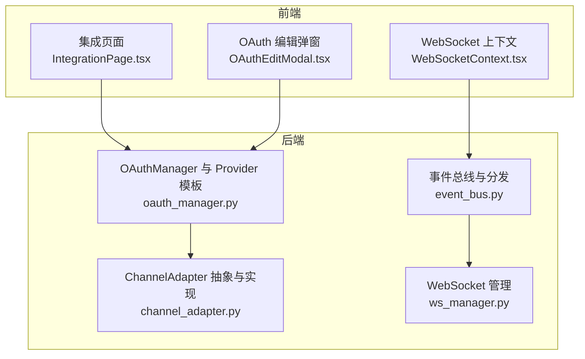
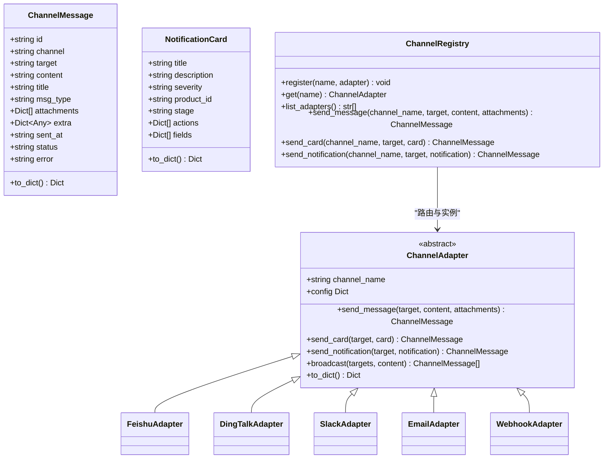
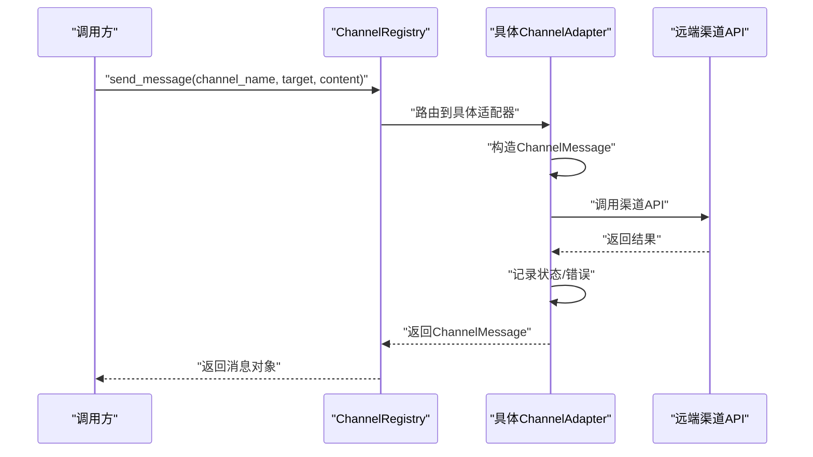
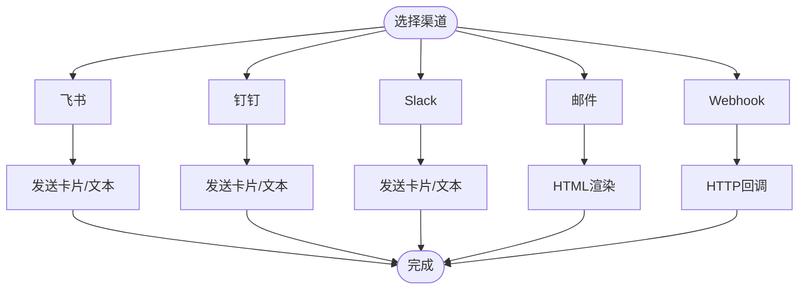
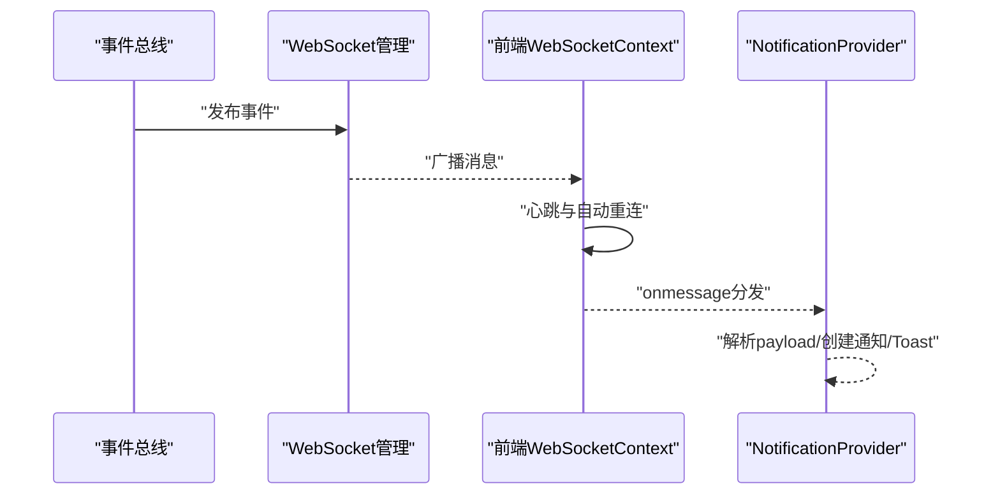
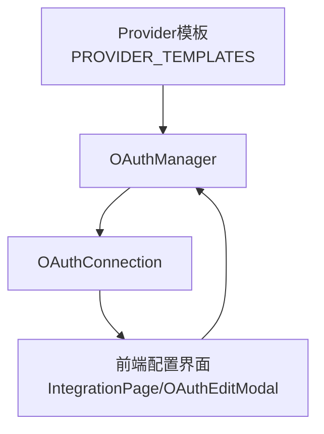
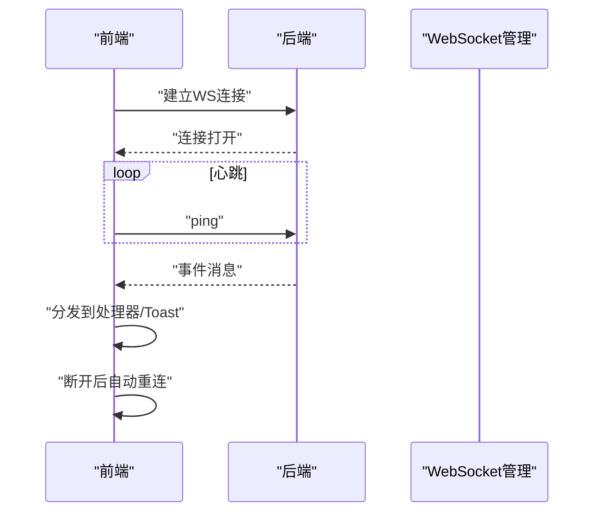
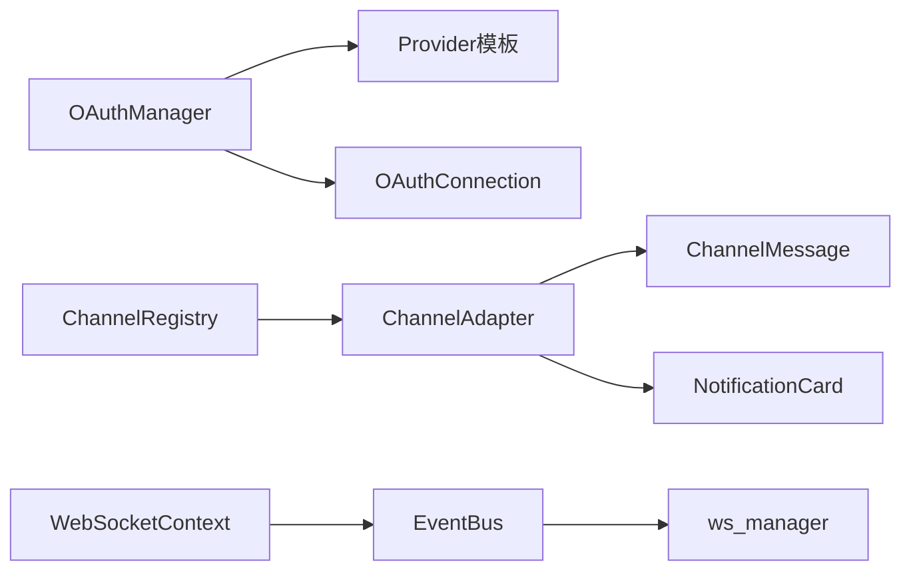

# 渠道适配器

<cite>
**本文引用的文件**
- [channel_adapter.py](file://backend/app/core/channel_adapter.py)
- [oauth_manager.py](file://backend/app/core/oauth_manager.py)
- [event_bus.py](file://backend/app/core/event_bus.py)
- [ws_manager.py](file://backend/app/services/ws_manager.py)
- [IntegrationPage.tsx](file://frontend/src/pages/IntegrationPage.tsx)
- [WebSocketContext.tsx](file://frontend/src/context/WebSocketContext.tsx)
- [OAuthEditModal.tsx](file://frontend/src/components/config/OAuthEditModal.tsx)
- [前后端api交互.md](file://前后端api交互.md)
- [测试规范.md](file://backend/tests/测试规范.md)
- [AutoPullEngine.py](file://backend/app/core/auto_pull_engine.py)
</cite>

## 目录
1. [引言](#引言)
2. [项目结构](#项目结构)
3. [核心组件](#核心组件)
4. [架构总览](#架构总览)
5. [详细组件分析](#详细组件分析)
6. [依赖关系分析](#依赖关系分析)
7. [性能考量](#性能考量)
8. [故障排查指南](#故障排查指南)
9. [结论](#结论)
10. [附录](#附录)

## 引言
本文件面向渠道适配器系统，提供从架构设计到实现细节的全景式说明。重点涵盖：
- 渠道适配器的抽象设计模式：统一接口、消息格式标准化、协议转换机制
- 多渠道支持策略：微信、Slack、Discord、邮件等适配要点
- 消息路由与分发：事件总线、WebSocket、通知管道
- 配置管理：连接参数、认证信息、行为设置
- 实时通信：WebSocket、心跳、自动重连
- 开发指南：接口实现、测试方法、部署流程
- 集成示例与配置模板：基于现有Provider模板与前端配置界面
- 常见问题：连接断开、消息丢失、格式不兼容

## 项目结构
渠道适配器相关代码主要分布在后端核心模块与前端配置页面中：
- 后端核心
  - 渠道适配器抽象与实现：backend/app/core/channel_adapter.py
  - OAuth连接与Provider模板：backend/app/core/oauth_manager.py
  - 事件总线与通知分发：backend/app/core/event_bus.py
  - WebSocket管理：backend/app/services/ws_manager.py
- 前端配置
  - 集成页面与Provider展示：frontend/src/pages/IntegrationPage.tsx
  - WebSocket上下文与自动重连：frontend/src/context/WebSocketContext.tsx
  - OAuth编辑弹窗与动态字段渲染：frontend/src/components/config/OAuthEditModal.tsx
- 文档与测试
  - 前后端交互与实时推送：前后端api交互.md
  - 测试规范与端点契约：backend/tests/测试规范.md

图表来源
- [channel_adapter.py:1-693](file://backend/app/core/channel_adapter.py#L1-L693)
- [oauth_manager.py:101-558](file://backend/app/core/oauth_manager.py#L101-L558)
- [event_bus.py:138-804](file://backend/app/core/event_bus.py#L138-L804)
- [ws_manager.py](file://backend/app/services/ws_manager.py)
- [IntegrationPage.tsx:1-242](file://frontend/src/pages/IntegrationPage.tsx#L1-L242)
- [WebSocketContext.tsx:26-98](file://frontend/src/context/WebSocketContext.tsx#L26-L98)
- [OAuthEditModal.tsx:226-252](file://frontend/src/components/config/OAuthEditModal.tsx#L226-L252)

章节来源
- [channel_adapter.py:1-693](file://backend/app/core/channel_adapter.py#L1-L693)
- [oauth_manager.py:101-558](file://backend/app/core/oauth_manager.py#L101-L558)
- [event_bus.py:138-804](file://backend/app/core/event_bus.py#L138-L804)
- [ws_manager.py](file://backend/app/services/ws_manager.py)
- [IntegrationPage.tsx:1-242](file://frontend/src/pages/IntegrationPage.tsx#L1-L242)
- [WebSocketContext.tsx:26-98](file://frontend/src/context/WebSocketContext.tsx#L26-L98)
- [OAuthEditModal.tsx:226-252](file://frontend/src/components/config/OAuthEditModal.tsx#L226-L252)

## 核心组件
- 渠道适配器抽象与消息模型
  - ChannelMessage：统一消息载体，包含渠道、目标、内容、类型、附件、额外字段、时间戳、状态与错误信息
  - NotificationCard：交互式通知卡片，支持严重级别、产品ID深度链接、业务阶段、操作按钮与字段集合
  - ChannelAdapter 抽象基类：定义 send_message、send_card、send_notification、broadcast 等统一接口，并内置消息日志与通用通知封装
  - ChannelRegistry：适配器注册与路由，按渠道名选择具体实现并支持单例获取
- OAuth连接与Provider模板
  - OAuthConnection：连接实体，包含Provider、配置、令牌、状态与更新时间
  - PROVIDER_TEMPLATES：Provider配置模板，定义认证类型、授权URL、令牌URL、作用域、配置字段、图标与描述
  - OAuthManager：连接管理与Provider模板聚合，提供连接查询、统计与单例
- 事件总线与通知分发
  - GlobalEventBus：事件发布、标准化、路由与订阅分发，支持产品级事件链与最近事件缓存
  - ws_manager：WebSocket广播与连接管理（在后端服务中使用）
- 前端集成与实时通信
  - IntegrationPage：展示Provider与连接状态，支持测试连接与刷新
  - WebSocketContext：WebSocket连接、心跳、自动重连与消息分发
  - OAuthEditModal：根据Provider模板动态渲染配置字段，支持敏感字段密码输入

章节来源
- [channel_adapter.py:1-693](file://backend/app/core/channel_adapter.py#L1-L693)
- [oauth_manager.py:81-558](file://backend/app/core/oauth_manager.py#L81-L558)
- [event_bus.py:138-804](file://backend/app/core/event_bus.py#L138-L804)
- [IntegrationPage.tsx:1-242](file://frontend/src/pages/IntegrationPage.tsx#L1-L242)
- [WebSocketContext.tsx:26-98](file://frontend/src/context/WebSocketContext.tsx#L26-L98)
- [OAuthEditModal.tsx:226-252](file://frontend/src/components/config/OAuthEditModal.tsx#L226-L252)

## 架构总览
渠道适配器采用“抽象基类 + 具体实现 + 注册路由”的模式，结合OAuth模板与事件总线实现多渠道消息的统一发送与实时通知。

图表来源
- [channel_adapter.py:36-693](file://backend/app/core/channel_adapter.py#L36-L693)

章节来源
- [channel_adapter.py:36-693](file://backend/app/core/channel_adapter.py#L36-L693)

## 详细组件分析

### 渠道适配器抽象与消息格式
- 统一接口
  - send_message：发送文本消息，支持附件
  - send_card：发送交互式卡片（含标题、描述、严重级别、产品ID深度链接、业务阶段、操作按钮与字段）
  - send_notification：封装通知为卡片并发送
  - broadcast：批量广播至多个目标
- 消息格式标准化
  - ChannelMessage：标准化消息载体，包含状态与错误信息，便于统一记录与回溯
  - NotificationCard：标准化通知卡片，支持深度链接与字段扩展
- 协议转换机制
  - 不同渠道在具体实现中负责协议转换（如Slack Block Kit、邮件HTML渲染等），抽象层屏蔽差异

图表来源
- [channel_adapter.py:104-120](file://backend/app/core/channel_adapter.py#L104-L120)
- [channel_adapter.py:674-682](file://backend/app/core/channel_adapter.py#L674-L682)

章节来源
- [channel_adapter.py:36-693](file://backend/app/core/channel_adapter.py#L36-L693)

### 多渠道适配策略
- 飞书（FeishuAdapter）
  - 支持Webhook与Bot API；发送卡片时使用Slack Block Kit风格的Markdown与字段布局
- 钉钉（DingTalkAdapter）
  - 支持Webhook与工作通知；发送卡片时同样使用Markdown与字段布局
- Slack（SlackAdapter）
  - 支持Webhook与Bot API；发送卡片时使用Slack Block Kit
- 邮件（EmailAdapter）
  - 基于Listmonk SMTP；渲染HTML卡片，包含标题、描述、产品ID与字段
- Webhook（WebhookAdapter）
  - 通用HTTP回调；发送文本或卡片消息

图表来源
- [channel_adapter.py:300-541](file://backend/app/core/channel_adapter.py#L300-L541)

章节来源
- [channel_adapter.py:300-541](file://backend/app/core/channel_adapter.py#L300-L541)

### 消息路由与分发机制
- 事件总线（EventBus）
  - 发布标准化事件，写入全局事件总线，路由到产品级事件链，分发给匹配处理器与订阅者
- WebSocket实时推送
  - 前端WebSocketContext维护连接、心跳与自动重连；后端通过ws_manager进行广播
  - 通知从事件总线经ws_manager到达WebSocket，再由前端NotificationProvider消费

图表来源
- [event_bus.py:150-170](file://backend/app/core/event_bus.py#L150-L170)
- [前后端api交互.md:365-442](file://前后端api交互.md#L365-L442)
- [WebSocketContext.tsx:26-98](file://frontend/src/context/WebSocketContext.tsx#L26-L98)

章节来源
- [event_bus.py:138-804](file://backend/app/core/event_bus.py#L138-L804)
- [前后端api交互.md:365-442](file://前后端api交互.md#L365-L442)
- [WebSocketContext.tsx:26-98](file://frontend/src/context/WebSocketContext.tsx#L26-L98)

### 渠道配置管理
- Provider模板与OAuth连接
  - PROVIDER_TEMPLATES定义每个Provider的认证类型、授权/令牌URL、作用域与配置字段
  - OAuthConnection封装连接配置、令牌与状态，支持序列化/反序列化
  - OAuthManager聚合模板与连接，提供连接统计与单例
- 前端配置界面
  - IntegrationPage展示Provider与连接状态，支持测试连接
  - OAuthEditModal根据Provider模板动态渲染配置字段，敏感字段以密码输入

图表来源
- [oauth_manager.py:101-558](file://backend/app/core/oauth_manager.py#L101-L558)
- [IntegrationPage.tsx:15-24](file://frontend/src/pages/IntegrationPage.tsx#L15-L24)
- [OAuthEditModal.tsx:226-252](file://frontend/src/components/config/OAuthEditModal.tsx#L226-L252)

章节来源
- [oauth_manager.py:81-558](file://backend/app/core/oauth_manager.py#L81-L558)
- [IntegrationPage.tsx:15-24](file://frontend/src/pages/IntegrationPage.tsx#L15-L24)
- [OAuthEditModal.tsx:226-252](file://frontend/src/components/config/OAuthEditModal.tsx#L226-L252)

### 实时通信实现
- WebSocket连接生命周期
  - 前端在用户登录后建立连接，定期发送心跳（ping），断开后自动重连
  - 后端事件总线发布事件，ws_manager广播到已连接客户端
- 通知管道
  - 前端解析消息类型，分发到对应处理器或通配符处理器，创建通知项与Toast

图表来源
- [前后端api交互.md:365-442](file://前后端api交互.md#L365-L442)
- [WebSocketContext.tsx:26-98](file://frontend/src/context/WebSocketContext.tsx#L26-L98)

章节来源
- [前后端api交互.md:365-442](file://前后端api交互.md#L365-L442)
- [WebSocketContext.tsx:26-98](file://frontend/src/context/WebSocketContext.tsx#L26-L98)

### 开发指南
- 接口实现
  - 继承ChannelAdapter，实现send_message/send_card，处理渠道特有协议与错误
  - 在ChannelRegistry中注册新适配器，确保按channel_name正确路由
- 测试方法
  - 使用测试规范中的契约测试与集成测试，验证端点注册、参数校验与响应结构
  - 通过ASGI直连测试完整请求链路，确保异步与并发安全
- 部署流程
  - 前端：构建并部署静态资源，确保WebSocket地址与后端一致
  - 后端：启动服务，配置Provider模板与连接参数，启用事件总线与WebSocket广播

章节来源
- [channel_adapter.py:73-120](file://backend/app/core/channel_adapter.py#L73-L120)
- [测试规范.md:60-271](file://backend/tests/测试规范.md#L60-L271)

### 集成示例与配置模板
- Provider模板字段
  - 示例：飞书、钉钉、Slack、Listmonk等Provider的配置字段、认证URL与作用域
- 前端配置界面
  - 集成页面展示Provider与连接状态，支持测试连接
  - OAuth编辑弹窗根据Provider模板动态渲染字段，敏感字段以密码输入

章节来源
- [oauth_manager.py:101-171](file://backend/app/core/oauth_manager.py#L101-L171)
- [IntegrationPage.tsx:217-242](file://frontend/src/pages/IntegrationPage.tsx#L217-L242)
- [OAuthEditModal.tsx:226-252](file://frontend/src/components/config/OAuthEditModal.tsx#L226-L252)

## 依赖关系分析
- 组件耦合
  - ChannelAdapter与具体渠道实现解耦，通过ChannelRegistry路由
  - OAuthManager与Provider模板解耦，通过模板驱动配置
  - 事件总线与WebSocket管理解耦，事件驱动通知分发
- 外部依赖
  - 渠道API（飞书、钉钉、Slack、Listmonk等）
  - WebSocket服务端与客户端库
- 循环依赖
  - 当前结构未发现直接循环依赖；若新增模块需避免相互导入

图表来源
- [oauth_manager.py:101-558](file://backend/app/core/oauth_manager.py#L101-L558)
- [channel_adapter.py:36-120](file://backend/app/core/channel_adapter.py#L36-L120)
- [event_bus.py:138-804](file://backend/app/core/event_bus.py#L138-L804)
- [ws_manager.py](file://backend/app/services/ws_manager.py)
- [WebSocketContext.tsx:26-98](file://frontend/src/context/WebSocketContext.tsx#L26-L98)

章节来源
- [oauth_manager.py:101-558](file://backend/app/core/oauth_manager.py#L101-L558)
- [channel_adapter.py:36-120](file://backend/app/core/channel_adapter.py#L36-L120)
- [event_bus.py:138-804](file://backend/app/core/event_bus.py#L138-L804)
- [ws_manager.py](file://backend/app/services/ws_manager.py)
- [WebSocketContext.tsx:26-98](file://frontend/src/context/WebSocketContext.tsx#L26-L98)

## 性能考量
- 并发与批处理
  - broadcast支持批量发送，建议在具体适配器中实现并发限制与速率控制
- 心跳与重连
  - WebSocket心跳间隔与重连延迟需平衡网络波动与资源消耗
- 事件总线
  - 最近事件缓存大小限制（内存占用与查询性能的权衡）

## 故障排查指南
- 连接断开
  - 检查WebSocket心跳是否持续，前端自动重连是否生效；后端事件总线是否正常广播
- 消息丢失
  - 核对ChannelMessage状态与错误字段，定位具体渠道API返回；检查事件总线分发链路
- 格式不兼容
  - 针对Slack Block Kit、邮件HTML等格式，核对NotificationCard字段与渲染逻辑
- OAuth配置错误
  - 根据Provider模板核对配置字段与URL；前端OAuth编辑弹窗是否正确渲染敏感字段

章节来源
- [前后端api交互.md:365-442](file://前后端api交互.md#L365-L442)
- [channel_adapter.py:36-120](file://backend/app/core/channel_adapter.py#L36-L120)
- [oauth_manager.py:101-171](file://backend/app/core/oauth_manager.py#L101-L171)

## 结论
渠道适配器系统通过抽象基类与注册路由实现多渠道统一接入，结合OAuth模板与事件总线，形成从配置、发送到实时通知的完整闭环。建议在生产环境中强化并发控制、错误恢复与监控告警，确保高可用与可运维性。

## 附录
- 自动拉取引擎（与渠道集成协同）
  - 定期遍历活跃连接，增量拉取数据并写入记忆树，同时发布同步事件
  - 与事件总线配合，支撑下游通知与展示

章节来源
- [AutoPullEngine.py:1434-1478](file://backend/app/core/auto_pull_engine.py#L1434-L1478)