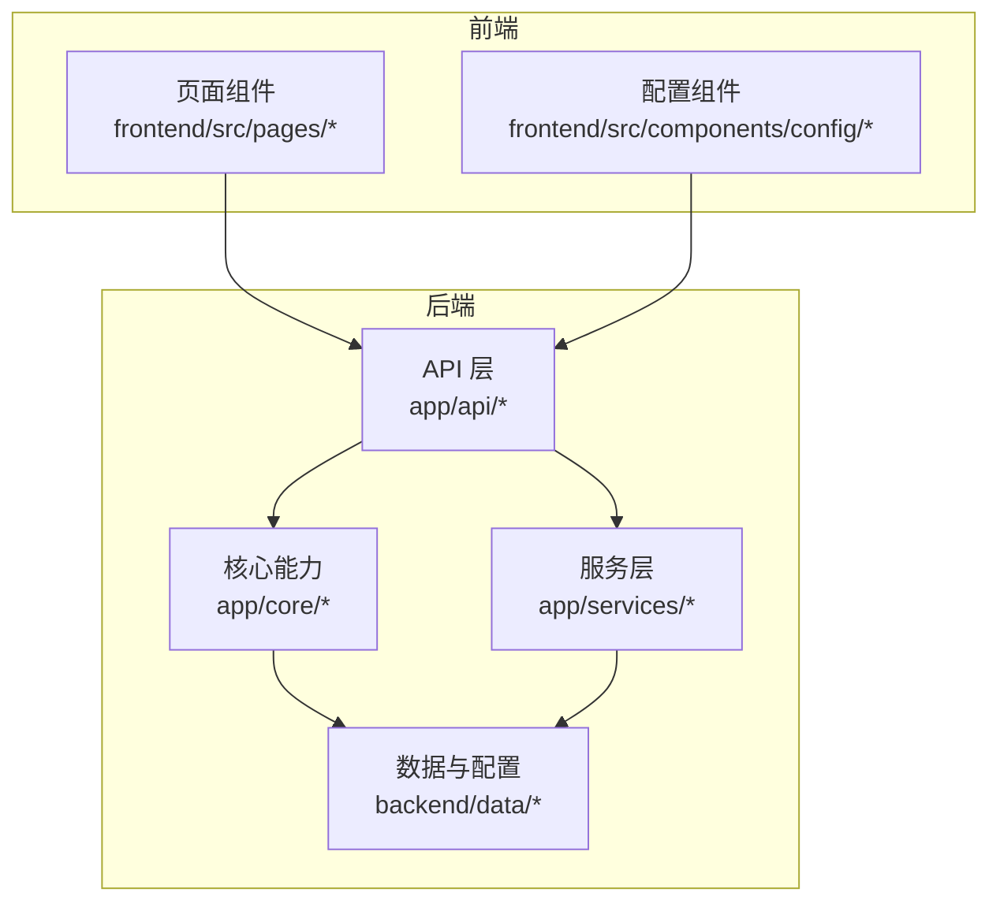
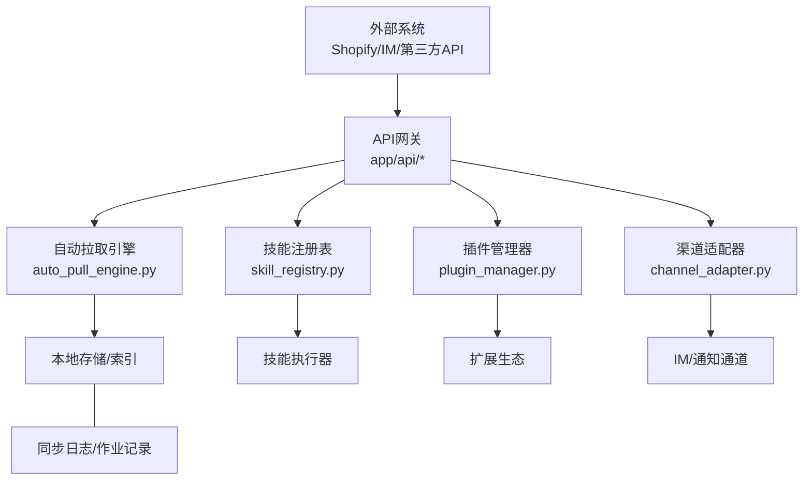
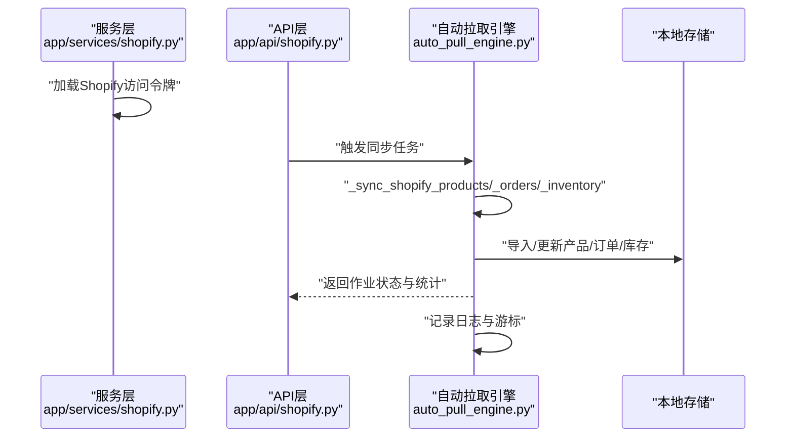
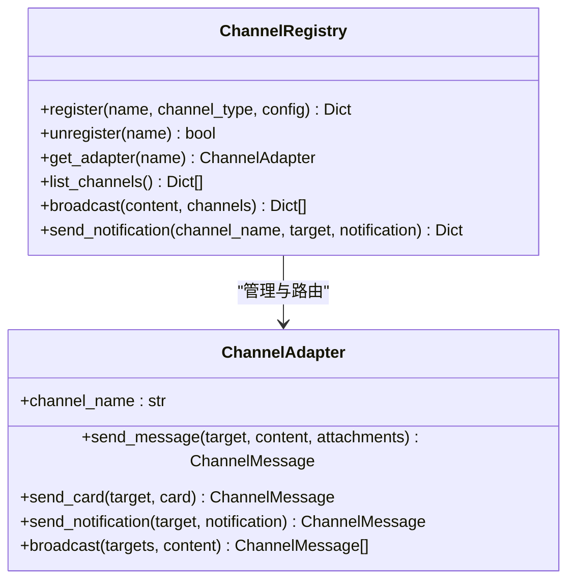
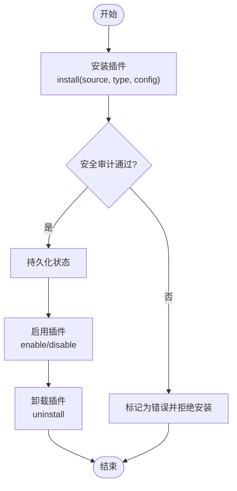
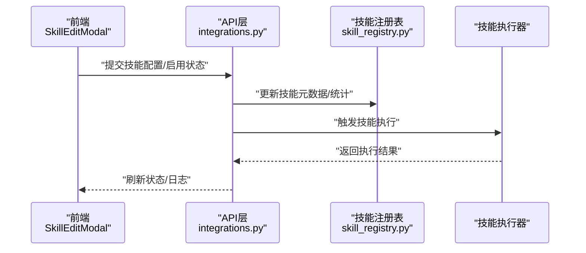
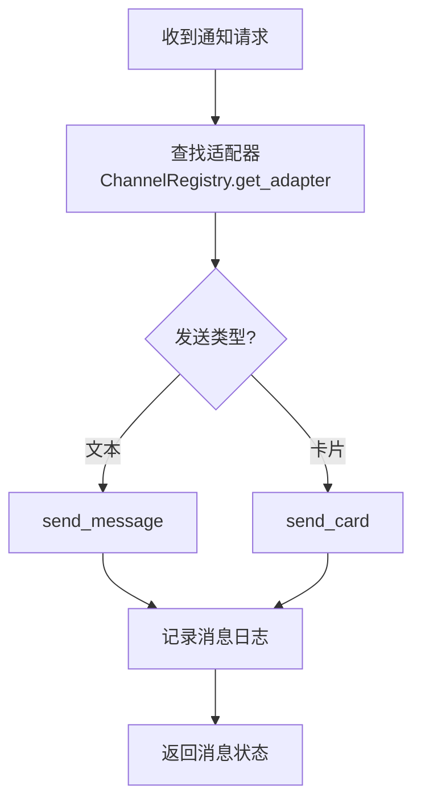
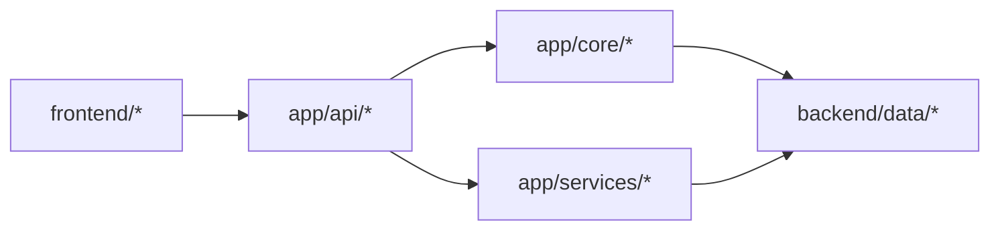

# 集成与扩展

<cite>
**本文引用的文件**
- [backend/app/api/shopify.py](file://backend/app/api/shopify.py)
- [backend/app/services/shopify.py](file://backend/app/services/shopify.py)
- [backend/app/core/auto_pull_engine.py](file://backend/app/core/auto_pull_engine.py)
- [backend/data/sync/jobs.json](file://backend/data/sync/jobs.json)
- [backend/data/sync/logs.json](file://backend/data/sync/logs.json)
- [backend/app/core/channel_adapter.py](file://backend/app/core/channel_adapter.py)
- [backend/app/core/plugin_manager.py](file://backend/app/core/plugin_manager.py)
- [backend/app/core/skill_registry.py](file://backend/app/core/skill_registry.py)
- [backend/app/api/plugins.py](file://backend/app/api/plugins.py)
- [backend/app/api/integrations.py](file://backend/app/api/integrations.py)
- [backend/data/config/channels.json](file://backend/data/config/channels.json)
- [backend/data/config/oauth_connections.json](file://backend/data/config/oauth_connections.json)
- [backend/data/config/skills/registry.json](file://backend/data/config/skills/registry.json)
- [backend/data/config/agent_extensions.json](file://backend/data/config/agent_extensions.json)
- [backend/data/config/tools.json](file://backend/data/config/tools.json)
- [backend/data/config/workers/custom_workers.md](file://backend/data/config/workers/custom_workers.md)
- [backend/data/config/events/system_events.md](file://backend/data/config/events/system_events.md)
- [backend/data/config/events/order_events.md](file://backend/data/config/events/order_events.md)
- [backend/data/config/events/risk_alert_events.md](file://backend/data/config/events/risk_alert_events.md)
- [backend/data/config/events/lifecycle_events.md](file://backend/data/config/events/lifecycle_events.md)
- [backend/data/config/events/certification_events.md](file://backend/data/config/events/certification_events.md)
- [backend/data/config/events/custom_events.md](file://backend/data/config/events/custom_events.md)
- [backend/data/config/scheduler/task_worker_bindings.json](file://backend/data/config/scheduler/task_worker_bindings.json)
- [frontend/src/pages/IntegrationPage.tsx](file://frontend/src/pages/IntegrationPage.tsx)
- [frontend/src/components/config/SkillEditModal.tsx](file://frontend/src/components/config/SkillEditModal.tsx)
- [后端api.md](file://后端api.md)
- [前后端api交互.md](file://前后端api交互.md)
</cite>

## 目录
1. [简介](#简介)
2. [项目结构](#项目结构)
3. [核心组件](#核心组件)
4. [架构总览](#架构总览)
5. [详细组件分析](#详细组件分析)
6. [依赖关系分析](#依赖关系分析)
7. [性能考量](#性能考量)
8. [故障排查指南](#故障排查指南)
9. [结论](#结论)
10. [附录](#附录)

## 简介
本文件面向避风港平台的集成与扩展体系，围绕以下目标展开：  
- Shopify 集成：实现电商产品、订单与库存的自动同步与事件驱动处理。  
- 外部API集成：基于统一适配器与事件总线的设计模式，确保可扩展性与可观测性。  
- 插件系统：提供安全审计、动态安装/卸载、启停控制与生命周期事件。  
- 渠道适配器：抽象多渠道消息路由与广播能力，支持飞书等外部IM。  
- 技能系统：技能注册、执行、统计与推荐，支撑业务事件驱动的自动化动作。  
- 最佳实践与安全：OAuth连接、令牌管理、错误处理与可观测日志。  
- 配置与示例：提供可操作的配置清单与集成步骤，便于快速落地。

## 项目结构
后端采用分层与按功能域划分的组织方式，核心集成逻辑集中在 core、services、api 三个子模块；前端提供集成页面与技能编辑界面；data 下存放运行时配置与同步作业记录。

图表来源
- [backend/app/api/shopify.py](file://backend/app/api/shopify.py)
- [backend/app/core/auto_pull_engine.py](file://backend/app/core/auto_pull_engine.py)
- [backend/app/core/channel_adapter.py](file://backend/app/core/channel_adapter.py)
- [backend/app/core/plugin_manager.py](file://backend/app/core/plugin_manager.py)
- [backend/app/core/skill_registry.py](file://backend/app/core/skill_registry.py)

章节来源
- [后端api.md](file://后端api.md)
- [前后端api交互.md](file://前后端api交互.md)

## 核心组件
- 自动拉取引擎：负责定时/触发式从Shopify拉取产品、订单、库存，并写入本地存储与日志。  
- 渠道适配器：统一消息通道抽象，支持飞书等外部IM的卡片与文本消息发送。  
- 插件管理器：提供插件安装、启用/禁用、卸载与安全审计的完整生命周期管理。  
- 技能注册表：维护技能元数据、执行统计与推荐策略，支撑事件驱动的动作编排。  
- 集成API：对外暴露Shopify、插件、集成配置等接口，供前端与调度系统调用。  

章节来源
- [backend/app/core/auto_pull_engine.py:295-382](file://backend/app/core/auto_pull_engine.py#L295-L382)
- [backend/app/core/channel_adapter.py:71-693](file://backend/app/core/channel_adapter.py#L71-L693)
- [backend/app/core/plugin_manager.py:171-243](file://backend/app/core/plugin_manager.py#L171-L243)
- [backend/app/core/skill_registry.py:855-966](file://backend/app/core/skill_registry.py#L855-L966)
- [backend/app/api/integrations.py](file://backend/app/api/integrations.py)
- [backend/app/api/plugins.py](file://backend/app/api/plugins.py)

## 架构总览
下图展示从“外部系统”到“内部处理”的端到端链路：  
- 外部系统通过REST/GraphQL或Webhook接入；  
- 平台通过API接收请求并触发事件；  
- 自动拉取引擎按配置周期执行同步任务；  
- 渠道适配器将通知广播至各IM；  
- 技能系统根据事件推荐并执行动作；  
- 插件管理器保障扩展的安全与可控。

图表来源
- [backend/app/core/auto_pull_engine.py:295-382](file://backend/app/core/auto_pull_engine.py#L295-L382)
- [backend/app/core/skill_registry.py:855-966](file://backend/app/core/skill_registry.py#L855-L966)
- [backend/app/core/plugin_manager.py:171-243](file://backend/app/core/plugin_manager.py#L171-L243)
- [backend/app/core/channel_adapter.py:71-693](file://backend/app/core/channel_adapter.py#L71-L693)
- [backend/data/sync/jobs.json:1-498](file://backend/data/sync/jobs.json#L1-L498)
- [backend/data/sync/logs.json:1126-1195](file://backend/data/sync/logs.json#L1126-L1195)

## 详细组件分析

### Shopify 集成与同步
- 数据源与令牌：通过服务层加载Shopify访问令牌，避免硬编码与重复获取。  
- 同步类型：产品、订单、库存三类，分别使用REST与GraphQL接口，支持游标增量更新。  
- 错误处理：捕获异常并记录失败计数与错误日志，保证作业状态可追踪。  
- 作业与日志：作业记录包含起止时间、成功/失败计数、游标等；日志包含每类同步的开始与完成信息。

图表来源
- [backend/app/services/shopify.py](file://backend/app/services/shopify.py)
- [backend/app/api/shopify.py](file://backend/app/api/shopify.py)
- [backend/app/core/auto_pull_engine.py:295-382](file://backend/app/core/auto_pull_engine.py#L295-L382)
- [backend/data/sync/jobs.json:1-498](file://backend/data/sync/jobs.json#L1-L498)
- [backend/data/sync/logs.json:1126-1195](file://backend/data/sync/logs.json#L1126-L1195)

章节来源
- [backend/app/core/auto_pull_engine.py:295-382](file://backend/app/core/auto_pull_engine.py#L295-L382)
- [backend/data/sync/jobs.json:1-498](file://backend/data/sync/jobs.json#L1-L498)
- [backend/data/sync/logs.json:1126-1195](file://backend/data/sync/logs.json#L1126-L1195)

### 外部API集成设计模式
- 统一适配器：以抽象类定义消息发送契约，具体实现封装不同通道差异。  
- 注册表：集中管理已配置的适配器实例，支持动态注册/注销与广播。  
- 事件驱动：通过事件总线与配置化规则，将业务事件转化为通知动作。  
- 可观测性：消息发送结果与错误被记录在消息日志中，便于回溯。

图表来源
- [backend/app/core/channel_adapter.py:71-693](file://backend/app/core/channel_adapter.py#L71-L693)

章节来源
- [backend/app/core/channel_adapter.py:71-693](file://backend/app/core/channel_adapter.py#L71-L693)
- [backend/data/config/channels.json](file://backend/data/config/channels.json)

### 插件系统架构与生命周期
- 动态安装：支持从PyPI或其他源安装，内置安全审计，高风险直接拒绝。  
- 生命周期：安装→启用/禁用→卸载，持久化状态并通过事件广播。  
- 安全审计：对插件进行风险评估，记录审计报告，防止高危插件进入生产环境。  
- 前端支持：提供插件管理UI，便于查看、启用/禁用与卸载。

图表来源
- [backend/app/core/plugin_manager.py:171-243](file://backend/app/core/plugin_manager.py#L171-L243)
- [backend/app/api/plugins.py](file://backend/app/api/plugins.py)

章节来源
- [backend/app/core/plugin_manager.py:171-243](file://backend/app/core/plugin_manager.py#L171-L243)
- [backend/app/api/plugins.py](file://backend/app/api/plugins.py)

### 技能系统的扩展机制
- 注册与统计：技能注册表维护安装次数、成功率、平均耗时与最后使用时间。  
- 推荐策略：根据事件类别推荐动作（技能/CLI/API），形成事件驱动的自动化闭环。  
- 执行器：统一调度与执行入口，结合前端技能编辑弹窗进行可视化管理。  
- 配置化：技能注册表与工具集配置位于data/config，便于版本化管理。

图表来源
- [backend/app/core/skill_registry.py:855-966](file://backend/app/core/skill_registry.py#L855-L966)
- [frontend/src/components/config/SkillEditModal.tsx:144-180](file://frontend/src/components/config/SkillEditModal.tsx#L144-L180)
- [backend/app/api/integrations.py](file://backend/app/api/integrations.py)

章节来源
- [backend/app/core/skill_registry.py:855-966](file://backend/app/core/skill_registry.py#L855-L966)
- [frontend/src/components/config/SkillEditModal.tsx:144-180](file://frontend/src/components/config/SkillEditModal.tsx#L144-L180)
- [backend/data/config/skills/registry.json](file://backend/data/config/skills/registry.json)
- [backend/data/config/tools.json](file://backend/data/config/tools.json)

### 渠道适配器的抽象与多渠道支持
- 抽象设计：ChannelAdapter定义统一的消息发送接口，支持文本与卡片两类消息。  
- 多渠道：通过注册表集中管理不同类型的适配器实例，支持飞书等外部IM。  
- 消息路由：根据目标通道名称选择适配器，实现点对点与广播两种模式。  
- 错误处理：发送失败时记录错误码或异常字符串，便于定位问题。

图表来源
- [backend/app/core/channel_adapter.py:71-693](file://backend/app/core/channel_adapter.py#L71-L693)

章节来源
- [backend/app/core/channel_adapter.py:71-693](file://backend/app/core/channel_adapter.py#L71-L693)
- [backend/data/config/channels.json](file://backend/data/config/channels.json)

## 依赖关系分析
- API层依赖核心模块：Shopify API依赖服务层加载令牌；插件与技能API依赖各自注册表与执行器。  
- 核心模块依赖配置：渠道适配器依赖channels.json；技能系统依赖skills/registry.json与tools.json。  
- 数据依赖：同步作业与日志文件作为运行时状态载体，供前端与运维查询。

图表来源
- [backend/app/api/shopify.py](file://backend/app/api/shopify.py)
- [backend/app/api/plugins.py](file://backend/app/api/plugins.py)
- [backend/app/api/integrations.py](file://backend/app/api/integrations.py)
- [backend/app/core/channel_adapter.py:71-693](file://backend/app/core/channel_adapter.py#L71-L693)
- [backend/app/core/skill_registry.py:855-966](file://backend/app/core/skill_registry.py#L855-L966)
- [backend/app/core/plugin_manager.py:171-243](file://backend/app/core/plugin_manager.py#L171-L243)

章节来源
- [backend/app/api/shopify.py](file://backend/app/api/shopify.py)
- [backend/app/api/plugins.py](file://backend/app/api/plugins.py)
- [backend/app/api/integrations.py](file://backend/app/api/integrations.py)
- [backend/app/core/channel_adapter.py:71-693](file://backend/app/core/channel_adapter.py#L71-L693)
- [backend/app/core/skill_registry.py:855-966](file://backend/app/core/skill_registry.py#L855-L966)
- [backend/app/core/plugin_manager.py:171-243](file://backend/app/core/plugin_manager.py#L171-L243)

## 性能考量
- 异步I/O：同步引擎使用异步HTTP客户端，降低阻塞，提升吞吐。  
- 增量同步：基于游标(last_cursor)仅拉取变更，减少重复传输。  
- 批量处理：订单与库存接口限制单次拉取数量，避免超时与限流。  
- 缓存与重试：建议在适配器层引入轻量缓存与指数退避重试策略（当前实现以日志为主）。  
- 资源隔离：插件沙箱与执行器并发控制，避免资源争用影响稳定性。

## 故障排查指南
- Shopify同步失败  
  - 检查令牌是否有效与过期；确认API版本与权限范围。  
  - 查看作业记录与日志，定位失败条目与错误码。  
  - 若游标异常导致重复或遗漏，调整游标字段与时间窗口。  

- 渠道消息发送失败  
  - 核对目标URL与鉴权头；检查HTTP状态码与响应体。  
  - 查看消息日志，确认失败原因（网络/鉴权/格式）。  

- 插件安装被拒绝  
  - 查看安全审计报告，修复高风险项或更换来源。  
  - 确认插件兼容性与依赖版本。  

- 技能执行异常  
  - 在技能执行器处增加重试与熔断；记录执行耗时与成功率。  
  - 通过前端技能编辑弹窗刷新状态，核对配置与启用状态。  

章节来源
- [backend/data/sync/jobs.json:1-498](file://backend/data/sync/jobs.json#L1-L498)
- [backend/data/sync/logs.json:1126-1195](file://backend/data/sync/logs.json#L1126-L1195)
- [backend/app/core/channel_adapter.py:579-596](file://backend/app/core/channel_adapter.py#L579-L596)
- [backend/app/core/plugin_manager.py:238-243](file://backend/app/core/plugin_manager.py#L238-L243)
- [backend/app/core/skill_registry.py:855-866](file://backend/app/core/skill_registry.py#L855-L866)

## 结论
本集成与扩展体系以“事件+适配器+注册表+插件”为核心，实现了对Shopify等外部系统的稳定接入与可观测同步，同时提供了多渠道消息路由、技能驱动的自动化动作与安全可控的插件生态。通过配置化与日志化，平台可在不侵入核心代码的前提下持续扩展与演进。

## 附录

### 第三方服务集成最佳实践
- OAuth连接管理：集中存储与轮换令牌，定期刷新与失效检测。  
- API版本与限流：固定API版本，遵守速率限制，必要时引入队列与背压。  
- 数据一致性：使用游标与幂等键，避免重复处理与数据漂移。  
- 安全与合规：对敏感参数脱敏，审计日志留痕，最小权限原则。  

章节来源
- [backend/data/config/oauth_connections.json](file://backend/data/config/oauth_connections.json)
- [backend/app/services/shopify.py](file://backend/app/services/shopify.py)

### 配置清单与示例
- 渠道配置：channels.json定义各通道类型与参数，注册表据此创建适配器实例。  
- 技能注册：skills/registry.json与tools.json定义可用技能与工具集。  
- 工作器绑定：scheduler/task_worker_bindings.json定义任务与工作器映射。  
- 事件规则：events/*.md定义系统事件、订单事件、风控事件等分类与动作映射。  
- 前端集成页：IntegrationPage.tsx提供集成配置入口，配合后端API完成配置下发与校验。  

章节来源
- [backend/data/config/channels.json](file://backend/data/config/channels.json)
- [backend/data/config/skills/registry.json](file://backend/data/config/skills/registry.json)
- [backend/data/config/tools.json](file://backend/data/config/tools.json)
- [backend/data/config/scheduler/task_worker_bindings.json](file://backend/data/config/scheduler/task_worker_bindings.json)
- [backend/data/config/events/system_events.md](file://backend/data/config/events/system_events.md)
- [backend/data/config/events/order_events.md](file://backend/data/config/events/order_events.md)
- [backend/data/config/events/risk_alert_events.md](file://backend/data/config/events/risk_alert_events.md)
- [backend/data/config/events/lifecycle_events.md](file://backend/data/config/events/lifecycle_events.md)
- [backend/data/config/events/certification_events.md](file://backend/data/config/events/certification_events.md)
- [backend/data/config/events/custom_events.md](file://backend/data/config/events/custom_events.md)
- [frontend/src/pages/IntegrationPage.tsx](file://frontend/src/pages/IntegrationPage.tsx)