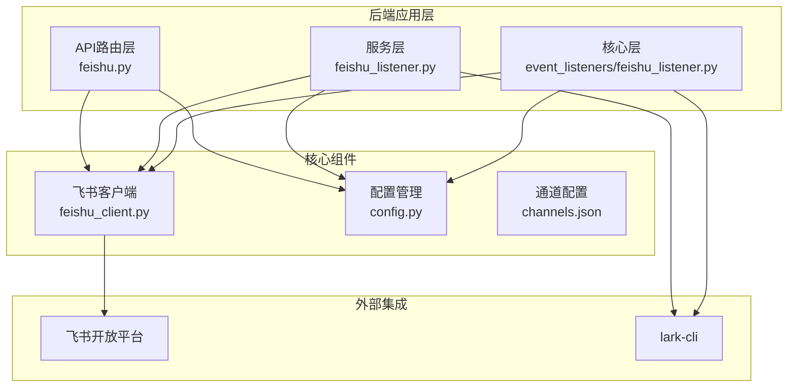
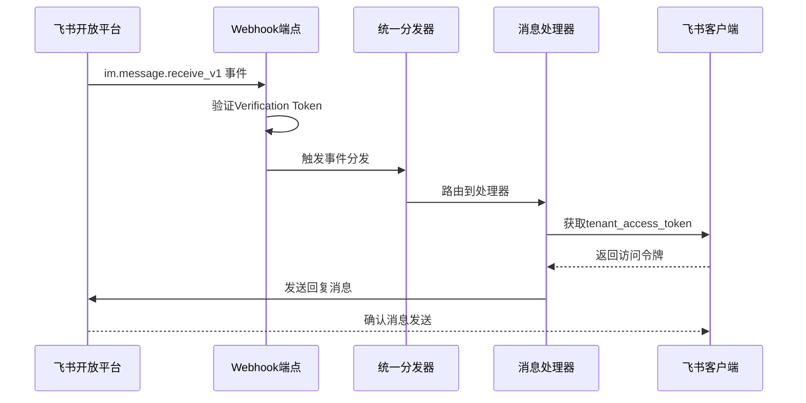
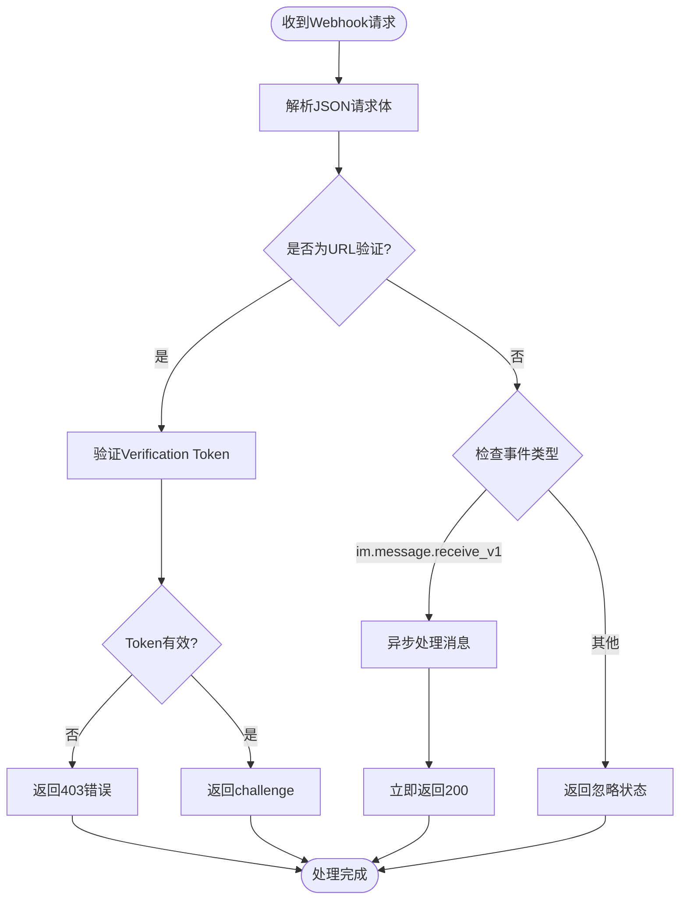
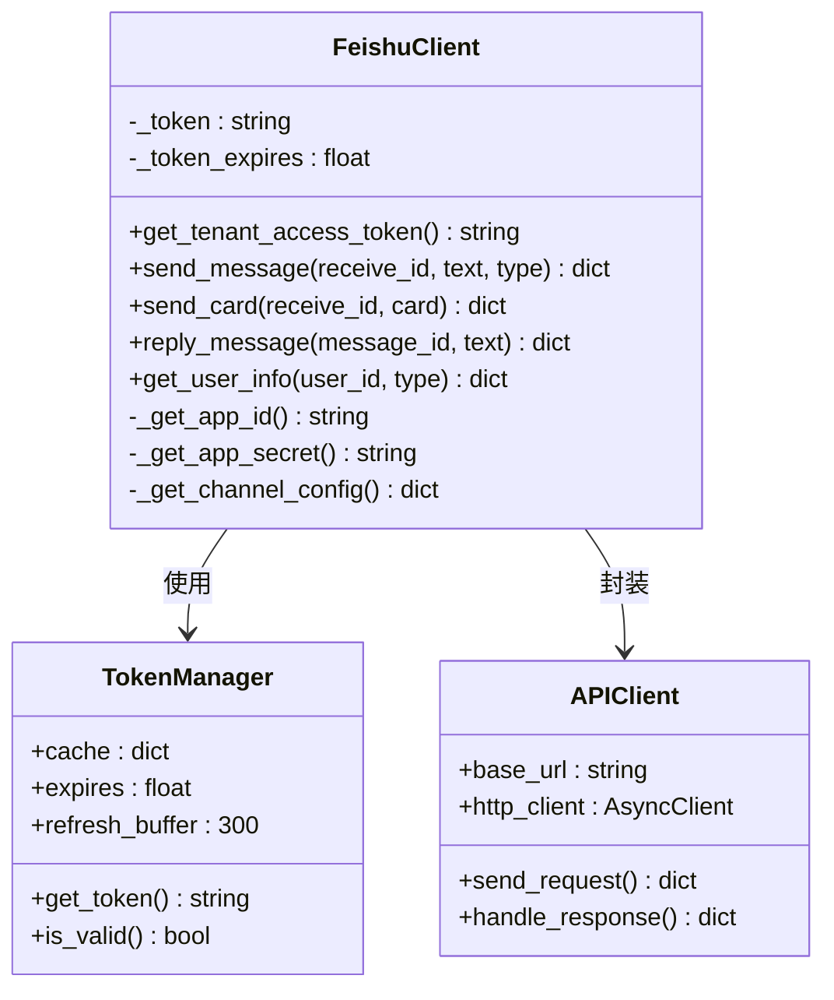
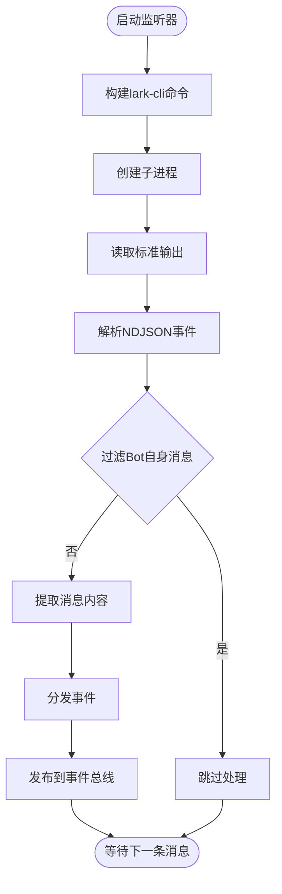
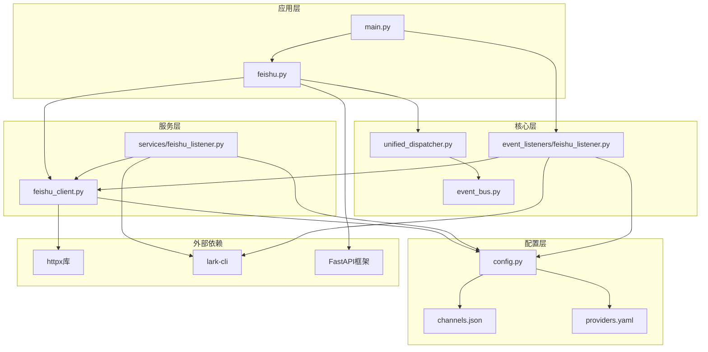

# 飞书集成系统

<cite>
**本文档引用的文件**
- [backend/app/api/feishu.py](file://backend/app/api/feishu.py)
- [backend/app/core/feishu_client.py](file://backend/app/core/feishu_client.py)
- [backend/app/core/event_listeners/feishu_listener.py](file://backend/app/core/event_listeners/feishu_listener.py)
- [backend/app/services/feishu_listener.py](file://backend/app/services/feishu_listener.py)
- [backend/app/main.py](file://backend/app/main.py)
- [backend/app/config.py](file://backend/app/config.py)
- [backend/data/config/channels.json](file://backend/data/config/channels.json)
- [backend/data/oauth/providers.yaml](file://backend/data/oauth/providers.yaml)
</cite>

## 目录
1. [简介](#简介)
2. [项目结构](#项目结构)
3. [核心组件](#核心组件)
4. [架构概览](#架构概览)
5. [详细组件分析](#详细组件分析)
6. [依赖关系分析](#依赖关系分析)
7. [性能考虑](#性能考虑)
8. [故障排除指南](#故障排除指南)
9. [结论](#结论)

## 简介

飞书集成系统是避风港OS级合规智能体的重要组成部分，负责处理飞书开放平台的消息事件和Bot通信。该系统实现了完整的飞书消息接收、验证、路由和响应机制，支持多种消息类型（文本、富文本、交互式卡片等），并通过统一的事件分发器将消息路由到相应的处理链路。

系统采用模块化设计，包含Webhook事件接收端点、Bot API客户端、消息监听器等多个核心组件，能够与后端的QAAgent、ManagerAgent等智能体进行无缝集成。

## 项目结构

飞书集成系统在代码库中的组织结构如下：

**图表来源**
- [backend/app/api/feishu.py:1-168](file://backend/app/api/feishu.py#L1-L168)
- [backend/app/core/feishu_client.py:1-211](file://backend/app/core/feishu_client.py#L1-L211)
- [backend/app/services/feishu_listener.py:1-333](file://backend/app/services/feishu_listener.py#L1-L333)

**章节来源**
- [backend/app/api/feishu.py:1-168](file://backend/app/api/feishu.py#L1-L168)
- [backend/app/core/feishu_client.py:1-211](file://backend/app/core/feishu_client.py#L1-L211)
- [backend/app/services/feishu_listener.py:1-333](file://backend/app/services/feishu_listener.py#L1-L333)

## 核心组件

飞书集成系统包含以下核心组件：

### 1. Webhook事件接收端点
- **功能**：接收飞书开放平台推送的事件回调
- **特性**：支持URL验证、消息事件接收、异步处理
- **安全**：包含Verification Token验证机制

### 2. 飞书Bot API客户端
- **功能**：封装飞书Bot API调用
- **特性**：tenant_access_token管理、消息发送、卡片消息、用户信息获取
- **缓存**：内置token缓存和自动刷新机制

### 3. 消息监听器
- **功能**：实时监听飞书群/私聊消息
- **特性**：支持lark-cli event consume、NDJSON解析、消息过滤
- **兼容性**：Windows平台特殊处理，支持多事件循环

### 4. 统一事件分发器
- **功能**：将飞书消息路由到处理链路
- **特性**：事件驱动架构、可扩展的处理器注册

**章节来源**
- [backend/app/api/feishu.py:125-156](file://backend/app/api/feishu.py#L125-L156)
- [backend/app/core/feishu_client.py:22-211](file://backend/app/core/feishu_client.py#L22-L211)
- [backend/app/core/event_listeners/feishu_listener.py:27-264](file://backend/app/core/event_listeners/feishu_listener.py#L27-L264)

## 架构概览

飞书集成系统采用事件驱动的架构模式，实现了从消息接收到底层处理的完整流程：

**图表来源**
- [backend/app/api/feishu.py:125-156](file://backend/app/api/feishu.py#L125-L156)
- [backend/app/core/feishu_client.py:52-91](file://backend/app/core/feishu_client.py#L52-L91)
- [backend/app/services/feishu_listener.py:278-291](file://backend/app/services/feishu_listener.py#L278-L291)

系统架构的关键特点：

1. **双路径设计**：同时支持Webhook接收和lark-cli监听两种方式
2. **事件驱动**：通过统一的事件分发器处理各种消息类型
3. **异步处理**：采用异步编程模型提高并发处理能力
4. **错误处理**：完善的异常捕获和错误恢复机制

## 详细组件分析

### Webhook事件接收端点

Webhook端点是飞书集成系统的主要入口，负责处理来自飞书开放平台的事件回调：

**图表来源**
- [backend/app/api/feishu.py:125-156](file://backend/app/api/feishu.py#L125-L156)

**章节来源**
- [backend/app/api/feishu.py:125-156](file://backend/app/api/feishu.py#L125-L156)

### 飞书Bot API客户端

Bot API客户端提供了完整的飞书Bot功能封装：

**图表来源**
- [backend/app/core/feishu_client.py:22-211](file://backend/app/core/feishu_client.py#L22-L211)

**章节来源**
- [backend/app/core/feishu_client.py:22-211](file://backend/app/core/feishu_client.py#L22-L211)

### 消息监听器组件

消息监听器实现了实时消息监听功能，支持多种平台和事件循环：

**图表来源**
- [backend/app/services/feishu_listener.py:85-128](file://backend/app/services/feishu_listener.py#L85-L128)

**章节来源**
- [backend/app/services/feishu_listener.py:32-333](file://backend/app/services/feishu_listener.py#L32-L333)

### 配置管理系统

系统通过多种配置方式支持飞书集成：

| 配置项 | 来源 | 用途 | 默认值 |
|--------|------|------|--------|
| feishu_app_id | settings.py | 飞书应用ID | "" |
| feishu_app_secret | settings.py | 飞书应用密钥 | "" |
| feishu_verification_token | settings.py | 验证令牌 | "" |
| webhook_url | channels.json | Webhook地址 | "" |
| msg_type | channels.json | 消息类型 | "" |

**章节来源**
- [backend/app/config.py:167-177](file://backend/app/config.py#L167-L177)
- [backend/data/config/channels.json:8-23](file://backend/data/config/channels.json#L8-L23)

## 依赖关系分析

飞书集成系统的依赖关系呈现清晰的层次结构：

**图表来源**
- [backend/app/main.py:144-156](file://backend/app/main.py#L144-L156)
- [backend/app/api/feishu.py:20](file://backend/app/api/feishu.py#L20)
- [backend/app/core/feishu_client.py:14](file://backend/app/core/feishu_client.py#L14)

**章节来源**
- [backend/app/main.py:144-156](file://backend/app/main.py#L144-L156)
- [backend/app/api/feishu.py:20](file://backend/app/api/feishu.py#L20)

## 性能考虑

飞书集成系统在设计时充分考虑了性能优化：

### 异步处理策略
- **非阻塞I/O**：所有网络请求采用异步HTTP客户端
- **事件循环兼容**：支持Windows ProactorEventLoop和SelectorEventLoop
- **并发控制**：合理使用asyncio任务和线程池

### 缓存机制
- **Token缓存**：tenant_access_token缓存2小时，提前5分钟刷新
- **连接复用**：HTTP客户端连接池管理
- **内存优化**：及时释放临时对象和缓冲区

### 错误处理
- **重试机制**：网络异常时的自动重试
- **超时控制**：合理的请求超时设置
- **降级策略**：SDK禁用时的本地处理模式

## 故障排除指南

### 常见问题及解决方案

| 问题类型 | 症状 | 可能原因 | 解决方案 |
|----------|------|----------|----------|
| 认证失败 | 401错误 | App ID/Secret配置错误 | 检查settings.py配置 |
| 网络超时 | 请求超时 | 网络连接问题 | 检查防火墙和代理设置 |
| 事件丢失 | 消息未到达 | lark-cli未启动 | 启动监听器服务 |
| 消息重复 | 重复处理消息 | 事件总线配置问题 | 检查事件处理器注册 |

### 调试方法

1. **日志分析**：查看系统日志中的错误信息
2. **状态检查**：使用/status端点检查服务状态
3. **配置验证**：验证channels.json和settings.py配置
4. **网络测试**：测试飞书API的连通性

**章节来源**
- [backend/app/api/feishu.py:159-168](file://backend/app/api/feishu.py#L159-L168)
- [backend/app/services/feishu_listener.py:314-333](file://backend/app/services/feishu_listener.py#L314-L333)

## 结论

飞书集成系统展现了现代企业级应用的优秀设计实践，具有以下突出特点：

1. **架构完整性**：从Webhook接收到底层处理形成完整的事件处理链
2. **平台兼容性**：支持多种平台和事件循环，特别是Windows平台的特殊处理
3. **可扩展性**：模块化设计便于功能扩展和维护
4. **可靠性**：完善的错误处理和重试机制确保系统稳定性
5. **性能优化**：异步处理和缓存机制提升系统响应速度

该系统为避风港OS级合规智能体提供了强大的即时通讯能力，能够有效支撑跨境合规业务的自动化处理需求。通过统一的事件分发机制，飞书消息可以无缝集成到整个智能体生态系统中，实现从消息接收、智能处理到业务执行的完整闭环。