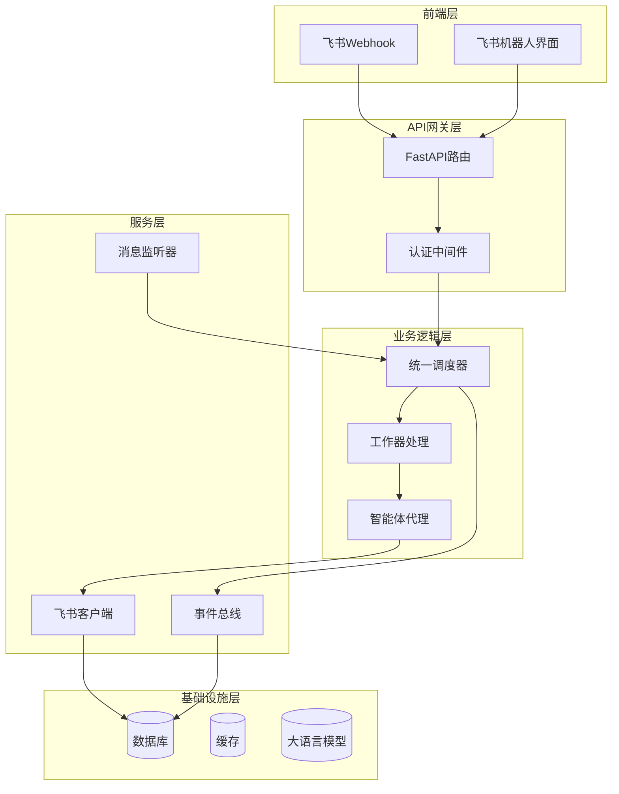
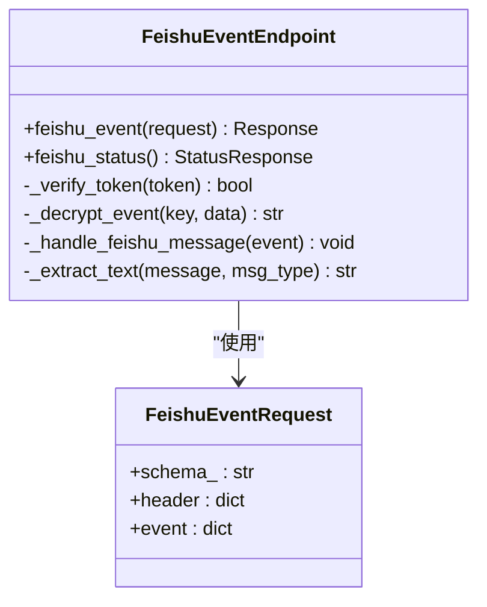
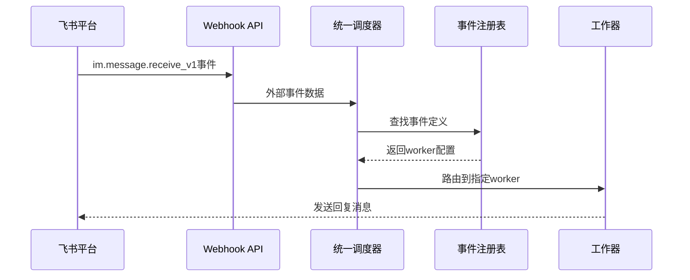
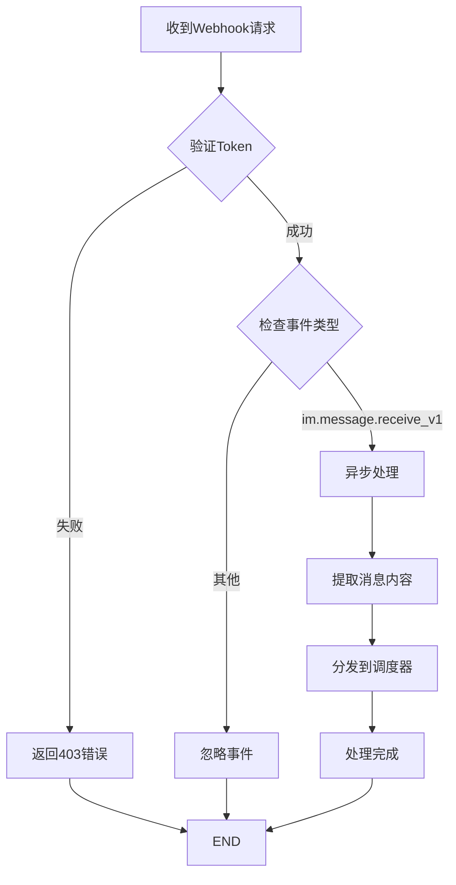
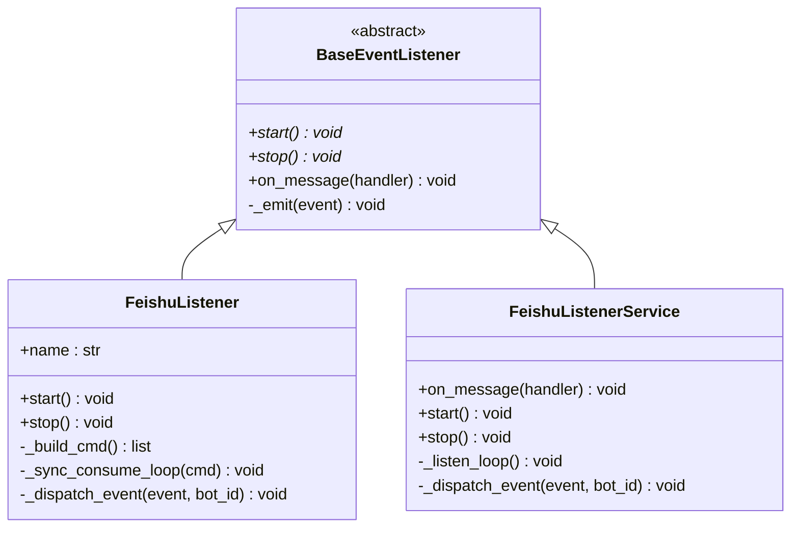
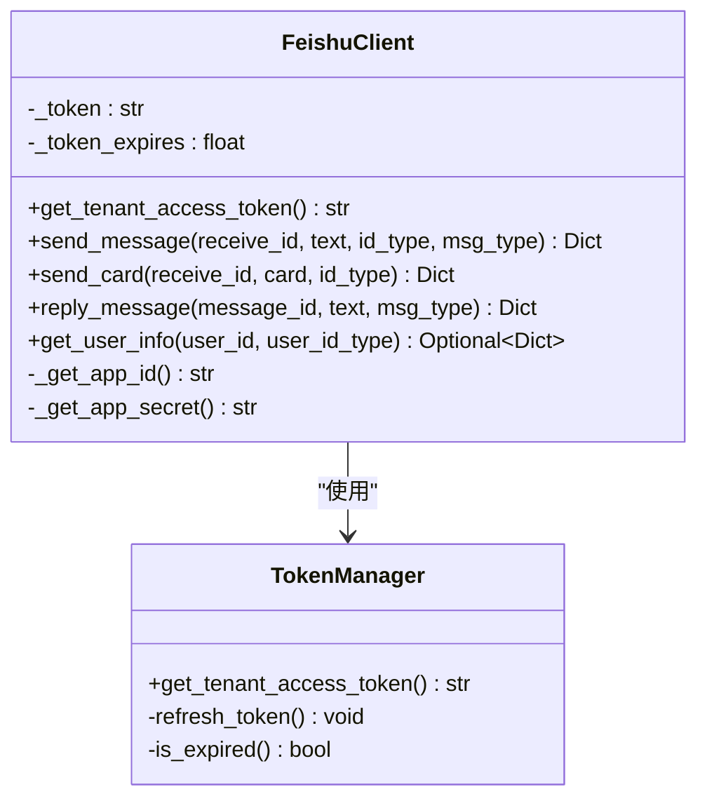
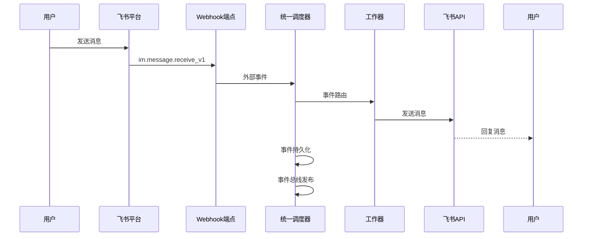
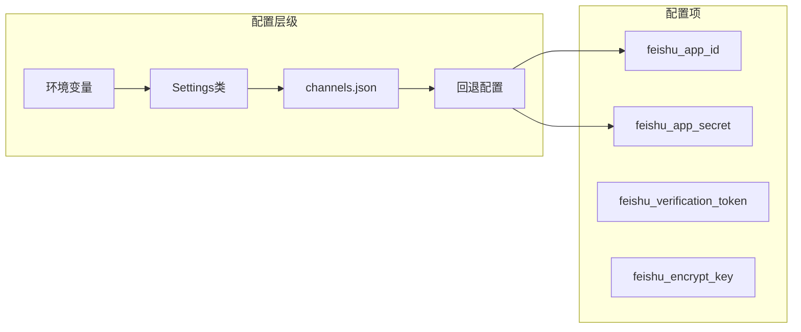
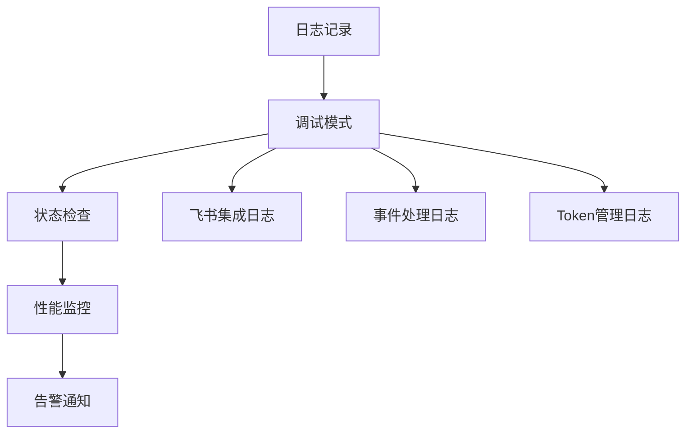

# 飞书集成系统

<cite>
**本文档引用的文件**
- [feishu.py](file://backend/app/api/feishu.py)
- [feishu_client.py](file://backend/app/core/feishu_client.py)
- [feishu_listener.py](file://backend/app/core/event_listeners/feishu_listener.py)
- [feishu_listener.py](file://backend/app/services/feishu_listener.py)
- [config.py](file://backend/app/config.py)
- [unified_dispatcher.py](file://backend/app/core/unified_dispatcher.py)
- [event_bus.py](file://backend/app/core/event_bus.py)
- [events.py](file://backend/app/api/events.py)
- [channels.json](file://backend/data/config/channels.json)
- [README.md](file://README.md)
</cite>

## 目录
1. [项目概述](#项目概述)
2. [系统架构](#系统架构)
3. [核心组件分析](#核心组件分析)
4. [飞书Webhook集成](#飞书webhook集成)
5. [飞书消息监听器](#飞书消息监听器)
6. [飞书客户端](#飞书客户端)
7. [事件处理流程](#事件处理流程)
8. [配置管理](#配置管理)
9. [部署与集成指南](#部署与集成指南)
10. [故障排除](#故障排除)

## 项目概述

避风港是一个面向中小出海企业的合规智能体平台，集成了飞书机器人作为主要的用户交互入口。该系统采用多Agent协同架构，结合规则引擎和LLM混合推理，为企业提供全生命周期的跨境电商合规解决方案。

### 系统特性
- **多Agent调度与Skills扩展体系**
- **合规规则引擎 + LLM混合推理**
- **实时消息处理与响应**
- **多渠道集成支持**
- **事件驱动架构**

**章节来源**
- [README.md:1-180](file://README.md#L1-L180)

## 系统架构

飞书集成系统采用分层架构设计，主要包含以下几个核心层次：



**图表来源**
- [feishu.py:125-156](file://backend/app/api/feishu.py#L125-L156)
- [feishu_client.py:22-211](file://backend/app/core/feishu_client.py#L22-L211)
- [feishu_listener.py:32-333](file://backend/app/services/feishu_listener.py#L32-L333)

## 核心组件分析

### 飞书Webhook API端点

系统提供了专门的Webhook端点来接收飞书开放平台的消息推送：



**图表来源**
- [feishu.py:115-168](file://backend/app/api/feishu.py#L115-L168)

### 统一调度器

统一调度器负责将外部事件路由到相应的处理程序：



**图表来源**
- [unified_dispatcher.py:88-147](file://backend/app/core/unified_dispatcher.py#L88-L147)

**章节来源**
- [feishu.py:1-168](file://backend/app/api/feishu.py#L1-L168)
- [unified_dispatcher.py:88-147](file://backend/app/core/unified_dispatcher.py#L88-L147)

## 飞书Webhook集成

### Webhook端点配置

系统实现了完整的飞书Webhook接收和验证机制：

| 功能特性 | 实现细节 | 安全性 |
|---------|---------|--------|
| URL验证 | 支持challenge响应 | Verification Token验证 |
| 消息接收 | 异步处理im.message.receive_v1 | HMAC签名验证 |
| 加密支持 | Encrypt Key解密 | 可选加密处理 |
| 错误处理 | 完善的异常捕获 | 400/403状态码 |

### 消息处理流程



**图表来源**
- [feishu.py:125-156](file://backend/app/api/feishu.py#L125-L156)

**章节来源**
- [feishu.py:125-156](file://backend/app/api/feishu.py#L125-L156)

## 飞书消息监听器

### 监听器架构

系统提供了两种飞书消息监听器实现，分别针对不同的使用场景：



**图表来源**
- [feishu_listener.py:27-263](file://backend/app/core/event_listeners/feishu_listener.py#L27-L263)
- [feishu_listener.py:32-333](file://backend/app/services/feishu_listener.py#L32-L333)

### Windows兼容性处理

监听器特别针对Windows系统的事件循环进行了优化：

| 特性 | 实现方式 | 优势 |
|------|---------|------|
| 事件循环兼容 | 自动检测ProactorEventLoop | 支持Windows平台 |
| 子进程管理 | 线程池桥接机制 | 避免NotImplementedError |
| 日志监控 | 独立stderr线程 | 防止管道缓冲区溢出 |
| 自动重启 | 3秒延迟重试机制 | 提高稳定性 |

**章节来源**
- [feishu_listener.py:27-263](file://backend/app/core/event_listeners/feishu_listener.py#L27-L263)
- [feishu_listener.py:32-333](file://backend/app/services/feishu_listener.py#L32-L333)

## 飞书客户端

### 客户端功能

飞书客户端封装了所有Bot API操作，提供统一的消息发送接口：



**图表来源**
- [feishu_client.py:22-211](file://backend/app/core/feishu_client.py#L22-L211)

### Token管理机制

客户端实现了智能的Token管理策略：

| Token类型 | 有效期 | 刷新策略 | 获取方式 |
|-----------|--------|----------|----------|
| Tenant Access Token | 2小时 | 提前5分钟刷新 | POST /auth/v3/tenant_access_token/internal |
| 缓存策略 | 内存缓存 | 过期时间检查 | 自动缓存管理 |
| Fallback机制 | 配置文件 | channels.json | 备用配置源 |

**章节来源**
- [feishu_client.py:22-211](file://backend/app/core/feishu_client.py#L22-L211)

## 事件处理流程

### 完整处理链路

系统采用事件驱动架构，实现了完整的消息处理链路：



**图表来源**
- [feishu.py:43-75](file://backend/app/api/feishu.py#L43-L75)
- [unified_dispatcher.py:100-133](file://backend/app/core/unified_dispatcher.py#L100-L133)

### 事件定义与路由

系统通过事件注册表实现灵活的路由配置：

| 事件类型 | 事件代码 | 处理器 | 触发条件 |
|----------|----------|--------|----------|
| 消息接收 | feishu:message_received | 统一调度器 | im.message.receive_v1 |
| 事件总线 | system:feishu:* | 事件总线 | 所有飞书事件 |
| 产品事件 | product:feishu:* | 产品级处理 | 关联产品消息 |

**章节来源**
- [feishu.py:43-75](file://backend/app/api/feishu.py#L43-L75)
- [unified_dispatcher.py:100-133](file://backend/app/core/unified_dispatcher.py#L100-L133)

## 配置管理

### 配置文件结构

系统支持多种配置方式，确保灵活性和可维护性：



**图表来源**
- [config.py:7-188](file://backend/app/config.py#L7-L188)
- [channels.json:67-72](file://backend/data/config/channels.json#L67-L72)

### 配置优先级

配置系统遵循严格的优先级顺序：

1. **环境变量** - 最高优先级
2. **Settings类属性** - 次优先级  
3. **channels.json配置** - 第三优先级
4. **硬编码默认值** - 最低优先级

**章节来源**
- [config.py:7-188](file://backend/app/config.py#L7-L188)
- [channels.json:67-72](file://backend/data/config/channels.json#L67-L72)

## 部署与集成指南

### 集成步骤

1. **飞书平台配置**
   - 创建企业自建应用
   - 配置机器人权限
   - 设置Webhook URL
   - 获取App ID和App Secret

2. **系统配置**
   ```bash
   # 设置环境变量
   export FEISHU_APP_ID=your_app_id
   export FEISHU_APP_SECRET=your_app_secret
   export FEISHU_VERIFICATION_TOKEN=your_token
   ```

3. **启动服务**
   ```bash
   # 后端服务
   uvicorn app.main:app --host 0.0.0.0 --port 8001
   
   # 飞书监听器
   python -m app.services.feishu_listener
   ```

### 集成验证

系统提供了状态检查端点：

```python
# GET /api/v1/feishu/status
{
    "status": "running",  # 或 "stopped"
    "service": "feishu_listener"
}
```

**章节来源**
- [feishu.py:159-168](file://backend/app/api/feishu.py#L159-L168)

## 故障排除

### 常见问题诊断

| 问题类型 | 症状 | 可能原因 | 解决方案 |
|----------|------|----------|----------|
| 认证失败 | 403 Forbidden | Verification Token错误 | 检查Verification Token配置 |
| Token过期 | API调用失败 | Tenant Access Token过期 | 检查Token刷新机制 |
| 消息丢失 | 无响应 | Webhook URL配置错误 | 验证Webhook回调地址 |
| 监听器崩溃 | 服务中断 | Windows事件循环问题 | 检查ProactorEventLoop支持 |

### 调试工具

系统提供了完善的日志记录和状态监控：



**章节来源**
- [feishu.py:27-32](file://backend/app/api/feishu.py#L27-L32)
- [feishu_client.py:52-90](file://backend/app/core/feishu_client.py#L52-L90)