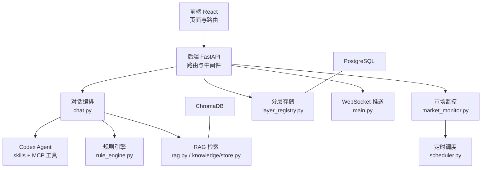
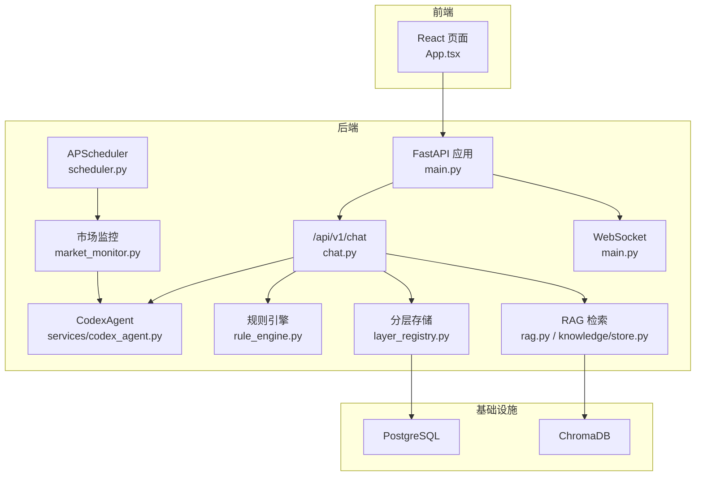
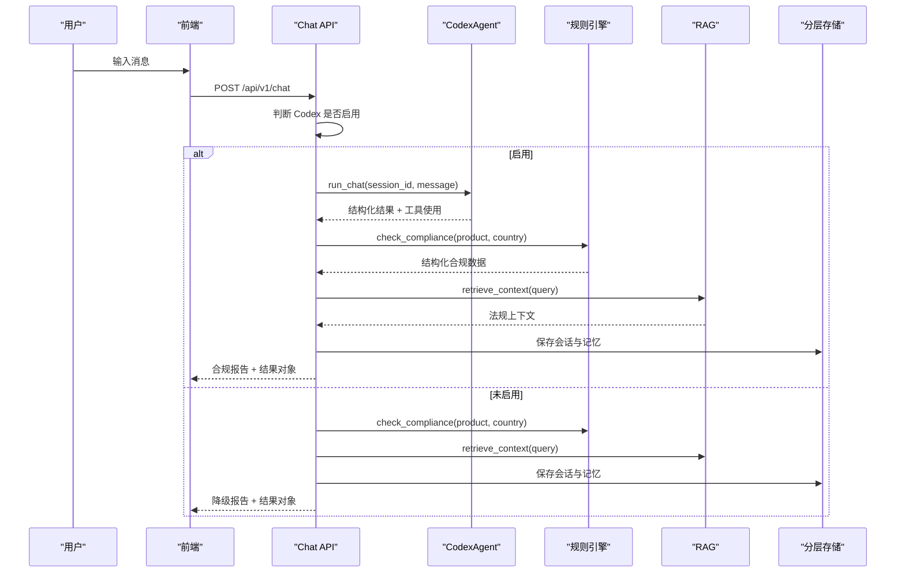
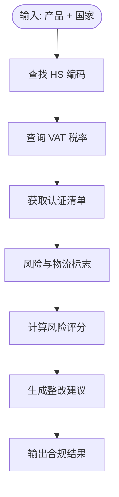
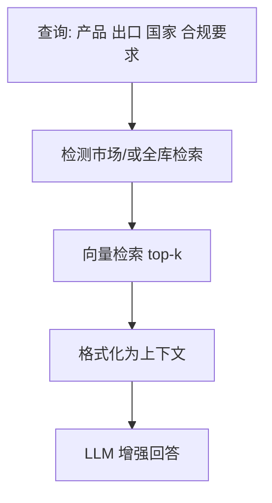
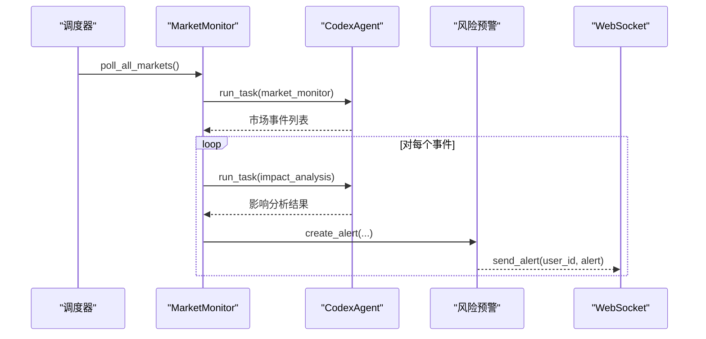
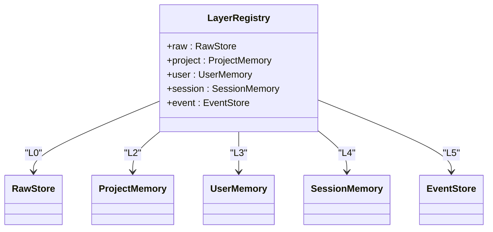
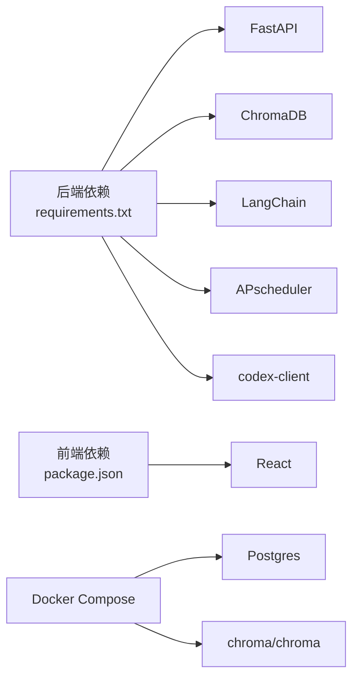

# 项目概述

<cite>
**本文引用的文件**
- [README.md](file://README.md)
- [backend/app/main.py](file://backend/app/main.py)
- [backend/app/config.py](file://backend/app/config.py)
- [backend/requirements.txt](file://backend/requirements.txt)
- [backend/app/api/chat.py](file://backend/app/api/chat.py)
- [backend/app/core/rule_engine.py](file://backend/app/core/rule_engine.py)
- [backend/app/core/rag.py](file://backend/app/core/rag.py)
- [backend/app/knowledge/store.py](file://backend/app/knowledge/store.py)
- [backend/app/core/market_monitor.py](file://backend/app/core/market_monitor.py)
- [backend/app/services/codex_agent.py](file://backend/app/services/codex_agent.py)
- [backend/app/storage/layer_registry.py](file://backend/app/storage/layer_registry.py)
- [backend/app/core/scheduler.py](file://backend/app/core/scheduler.py)
- [frontend/src/App.tsx](file://frontend/src/App.tsx)
- [frontend/package.json](file://frontend/package.json)
- [docker-compose.yml](file://docker-compose.yml)
</cite>

## 目录
1. [引言](#引言)
2. [项目结构](#项目结构)
3. [核心组件](#核心组件)
4. [架构总览](#架构总览)
5. [详细组件分析](#详细组件分析)
6. [依赖分析](#依赖分析)
7. [性能考虑](#性能考虑)
8. [故障排查指南](#故障排查指南)
9. [结论](#结论)
10. [附录](#附录)

## 引言
避风港跨境合规智能体是一个专为中国中小出海企业打造的AI合规助手。其核心价值主张是：通过自然语言输入“产品+目标国家”，在秒级内生成HS编码、税率、认证清单与合规报告，并结合规则引擎、RAG知识库与市场监控实现持续的风险预警与合规治理。

项目提供从对话入口到合规编排的完整闭环：前端React界面、后端FastAPI服务、Codex SDK对话引擎、规则引擎、RAG检索系统、市场监控与定时调度、以及分层存储与WebSocket推送。它既适合初学者快速上手，也为有经验的开发者提供了清晰的架构设计与扩展点。

## 项目结构
项目采用前后端分离与多层存储架构：
- 后端（Python/FastAPI）：负责API路由、认证、对话编排、规则引擎、RAG检索、市场监控、定时调度与存储管理。
- 前端（React/TypeScript）：提供仪表盘、聊天对话、合规查询、知识库、风险中心、模型与Agent配置等页面。
- 基础设施（Docker）：提供PostgreSQL与ChromaDB容器化服务，便于本地部署与知识库持久化。
- 数据与知识：分层存储（L0-L5）承载原始数据、知识库、项目/用户/会话记忆与事件链；RAG基于ChromaDB多市场collection检索。

图表来源
- [backend/app/main.py:1-76](file://backend/app/main.py#L1-L76)
- [backend/app/api/chat.py:1-541](file://backend/app/api/chat.py#L1-L541)
- [backend/app/core/rule_engine.py:1-247](file://backend/app/core/rule_engine.py#L1-L247)
- [backend/app/core/rag.py:1-59](file://backend/app/core/rag.py#L1-L59)
- [backend/app/knowledge/store.py:1-227](file://backend/app/knowledge/store.py#L1-L227)
- [backend/app/core/market_monitor.py:1-156](file://backend/app/core/market_monitor.py#L1-L156)
- [backend/app/core/scheduler.py:1-152](file://backend/app/core/scheduler.py#L1-L152)
- [backend/app/storage/layer_registry.py:1-45](file://backend/app/storage/layer_registry.py#L1-L45)
- [backend/app/main.py:38-56](file://backend/app/main.py#L38-L56)

章节来源
- [README.md:92-200](file://README.md#L92-L200)
- [backend/app/main.py:1-76](file://backend/app/main.py#L1-L76)
- [frontend/src/App.tsx:1-75](file://frontend/src/App.tsx#L1-L75)
- [docker-compose.yml:1-31](file://docker-compose.yml#L1-L31)

## 核心组件
- 对话引擎（Codex SDK）：提供skills、MCP工具、联网搜索与多轮会话能力，支撑合规问答与复杂推理。
- 规则引擎：基于L0原始数据（HS编码、VAT、认证矩阵等）进行确定性合规检查，快速生成结构化结果。
- RAG知识库：ChromaDB多市场collection向量检索，为LLM提供法规上下文增强。
- 市场监控：Codex联网定时扫描目标市场法规变更，进行影响分析并生成预警。
- 分层存储：L0-L5分层文件系统+SQLite，统一承载原始数据、知识、记忆与事件链。
- 认证与会话：JWT认证、角色鉴权、会话历史持久化与恢复。
- WebSocket推送：实时向用户推送风险预警与扫描更新。

章节来源
- [README.md:26-31](file://README.md#L26-L31)
- [backend/app/api/chat.py:1-541](file://backend/app/api/chat.py#L1-L541)
- [backend/app/core/rule_engine.py:1-247](file://backend/app/core/rule_engine.py#L1-L247)
- [backend/app/core/rag.py:1-59](file://backend/app/core/rag.py#L1-L59)
- [backend/app/knowledge/store.py:1-227](file://backend/app/knowledge/store.py#L1-L227)
- [backend/app/core/market_monitor.py:1-156](file://backend/app/core/market_monitor.py#L1-L156)
- [backend/app/storage/layer_registry.py:1-45](file://backend/app/storage/layer_registry.py#L1-L45)
- [backend/app/main.py:38-56](file://backend/app/main.py#L38-L56)

## 架构总览
整体架构围绕“对话编排”展开：用户通过前端发起查询，后端API根据配置决定走Codex主路径或降级路径（NLU→规则引擎→RAG）。Codex可调用MCP工具与skills，同时并行执行规则引擎与RAG检索，最终组装合规报告返回。市场监控通过Codex定时扫描并生成预警，借助WebSocket实时推送。

图表来源
- [backend/app/main.py:1-76](file://backend/app/main.py#L1-L76)
- [backend/app/api/chat.py:1-541](file://backend/app/api/chat.py#L1-L541)
- [backend/app/services/codex_agent.py:1-370](file://backend/app/services/codex_agent.py#L1-L370)
- [backend/app/core/rule_engine.py:1-247](file://backend/app/core/rule_engine.py#L1-L247)
- [backend/app/core/rag.py:1-59](file://backend/app/core/rag.py#L1-L59)
- [backend/app/knowledge/store.py:1-227](file://backend/app/knowledge/store.py#L1-L227)
- [backend/app/core/market_monitor.py:1-156](file://backend/app/core/market_monitor.py#L1-L156)
- [backend/app/core/scheduler.py:1-152](file://backend/app/core/scheduler.py#L1-L152)
- [backend/app/storage/layer_registry.py:1-45](file://backend/app/storage/layer_registry.py#L1-L45)
- [backend/app/main.py:38-56](file://backend/app/main.py#L38-L56)

## 详细组件分析

### 对话编排与双路径处理
- 主路径（Codex）：Codex Agent使用skills、MCP工具与联网搜索处理合规查询，同时并行执行规则引擎与RAG检索，最终组合报告返回。
- 降级路径（NLU→规则引擎→RAG）：当Codex不可用或未配置时，系统自动降级为NLU意图解析、规则引擎结构化检查与RAG检索增强。

图表来源
- [backend/app/api/chat.py:228-377](file://backend/app/api/chat.py#L228-L377)
- [backend/app/api/chat.py:415-541](file://backend/app/api/chat.py#L415-L541)
- [backend/app/services/codex_agent.py:110-160](file://backend/app/services/codex_agent.py#L110-L160)
- [backend/app/core/rule_engine.py:197-247](file://backend/app/core/rule_engine.py#L197-L247)
- [backend/app/core/rag.py:10-59](file://backend/app/core/rag.py#L10-L59)

章节来源
- [backend/app/api/chat.py:1-541](file://backend/app/api/chat.py#L1-L541)
- [backend/app/services/codex_agent.py:1-370](file://backend/app/services/codex_agent.py#L1-L370)

### 规则引擎（确定性合规检查）
- 数据来源：L0原始数据（HS编码、VAT、认证矩阵、风险标志等）。
- 功能：根据产品与国家快速匹配HS编码、查询VAT税率、列出认证要求、生成风险与物流提示、计算风险评分与整改建议。
- 输出：标准化合规结果，供对话编排与报告生成使用。

图表来源
- [backend/app/core/rule_engine.py:17-247](file://backend/app/core/rule_engine.py#L17-L247)

章节来源
- [backend/app/core/rule_engine.py:1-247](file://backend/app/core/rule_engine.py#L1-L247)

### RAG知识库（ChromaDB多市场检索）
- 多集合：eu_knowledge、us_knowledge、jp_knowledge、kr_knowledge。
- 检索：根据查询语义相似度检索相关法规片段，格式化为LLM上下文。
- 降级：当ChromaDB不可用时返回空结果，不影响主流程。

图表来源
- [backend/app/core/rag.py:10-59](file://backend/app/core/rag.py#L10-L59)
- [backend/app/knowledge/store.py:127-193](file://backend/app/knowledge/store.py#L127-L193)

章节来源
- [backend/app/core/rag.py:1-59](file://backend/app/core/rag.py#L1-L59)
- [backend/app/knowledge/store.py:1-227](file://backend/app/knowledge/store.py#L1-L227)

### 市场监控与风险预警
- 定时扫描：APScheduler按间隔触发Codex联网搜索目标市场法规变更。
- 影响分析：对用户产品列表进行个性化影响评估。
- 预警生成：根据严重程度生成预警并持久化，通过WebSocket实时推送。

图表来源
- [backend/app/core/scheduler.py:68-131](file://backend/app/core/scheduler.py#L68-L131)
- [backend/app/core/market_monitor.py:35-105](file://backend/app/core/market_monitor.py#L35-L105)
- [backend/app/services/codex_agent.py:55-89](file://backend/app/services/codex_agent.py#L55-L89)

章节来源
- [backend/app/core/scheduler.py:1-152](file://backend/app/core/scheduler.py#L1-L152)
- [backend/app/core/market_monitor.py:1-156](file://backend/app/core/market_monitor.py#L1-L156)
- [backend/app/services/codex_agent.py:1-370](file://backend/app/services/codex_agent.py#L1-L370)

### 分层存储与会话管理
- L0：原始数据（HS/VAT/认证/法规）。
- L1：知识库（ChromaDB）。
- L2：项目/产品记忆（合规档案）。
- L3：用户记忆（偏好）。
- L4：会话记忆（多轮上下文）。
- L5：事件链（操作链/系统事件）。
- 会话：SQLite持久化，支持恢复与列表管理。

图表来源
- [backend/app/storage/layer_registry.py:23-45](file://backend/app/storage/layer_registry.py#L23-L45)

章节来源
- [backend/app/storage/layer_registry.py:1-45](file://backend/app/storage/layer_registry.py#L1-L45)

### 前端与认证
- 前端页面：仪表盘、聊天、合规查询、知识库、风险中心、模型与Agent配置、用户管理等。
- 认证：JWT Bearer Token，角色鉴权（admin/user），默认管理员账号。
- WebSocket：实时接收风险预警与扫描更新。

章节来源
- [frontend/src/App.tsx:1-75](file://frontend/src/App.tsx#L1-L75)
- [backend/app/main.py:38-56](file://backend/app/main.py#L38-L56)
- [README.md:78-86](file://README.md#L78-L86)

## 依赖分析
- 后端技术栈：Python 3.12、FastAPI、SQLAlchemy、SQLite、ChromaDB、APScheduler、Codex Client SDK、LangChain等。
- 前端技术栈：React 19、TypeScript、Vite。
- 基础设施：Docker Compose（PostgreSQL + ChromaDB）。
- 关键依赖：requirements.txt中声明了FastAPI、Uvicorn、Pydantic、SQLAlchemy、ChromaDB、LangChain、Codex Client、APScheduler、PyYAML等。

图表来源
- [backend/requirements.txt:1-27](file://backend/requirements.txt#L1-L27)
- [frontend/package.json:1-22](file://frontend/package.json#L1-L22)
- [docker-compose.yml:1-31](file://docker-compose.yml#L1-L31)

章节来源
- [backend/requirements.txt:1-27](file://backend/requirements.txt#L1-L27)
- [frontend/package.json:1-22](file://frontend/package.json#L1-L22)
- [docker-compose.yml:1-31](file://docker-compose.yml#L1-L31)

## 性能考虑
- 并行执行：对话编排中Codex、规则引擎与RAG并行运行，缩短响应时间。
- 降级策略：当Codex不可用或网络异常时，系统自动降级为NLU→规则引擎→RAG，保证基本功能可用。
- 向量检索优化：ChromaDB按市场分collection，支持按市场或全库检索；懒加载嵌入模型减少启动开销。
- 定时调度：APScheduler按分钟级间隔轮询市场，避免频繁高负载扫描。
- 存储分层：L0原始数据与L1知识库分离，降低查询耦合与IO压力。

## 故障排查指南
- Codex不可用：检查设置中的Codex开关与API密钥；查看CodexAgent错误类型与降级提示。
- RAG无结果：确认知识库是否初始化、ChromaDB是否正常、查询是否包含有效关键词。
- WebSocket不推送：确认WebSocket端点连接、用户ID是否正确、ws_manager是否在线。
- 定时任务未执行：检查APScheduler开关、轮询间隔、日志输出。
- 认证失败：确认JWT签名、过期时间、角色权限；默认管理员账号与密码。

章节来源
- [backend/app/services/codex_agent.py:32-38](file://backend/app/services/codex_agent.py#L32-L38)
- [backend/app/core/rag.py:16-18](file://backend/app/core/rag.py#L16-L18)
- [backend/app/main.py:40-56](file://backend/app/main.py#L40-L56)
- [backend/app/core/scheduler.py:24-55](file://backend/app/core/scheduler.py#L24-L55)

## 结论
避风港项目以“对话编排+规则引擎+RAG+市场监控”的技术架构，为中小出海企业提供即用型的合规解决方案。其分层存储与定时调度机制确保了可维护性与可扩展性；Codex SDK与MCP工具的引入提升了复杂场景下的推理与工具化能力。对于初学者，项目提供了清晰的启动流程与示例对话；对于有经验的开发者，项目展示了模块化设计、可观测性与降级策略的最佳实践。

## 附录
- 快速开始与示例对话参见项目README。
- API端点一览与主要功能特性参见项目README。
- 开发文档与产品方案参见工程文档文件。

章节来源
- [README.md:33-91](file://README.md#L33-L91)
- [README.md:222-312](file://README.md#L222-L312)