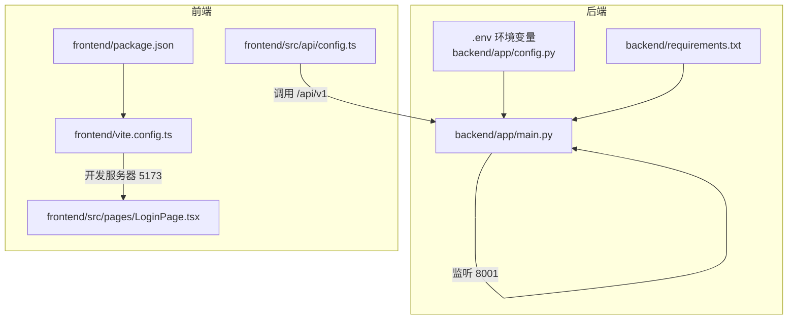
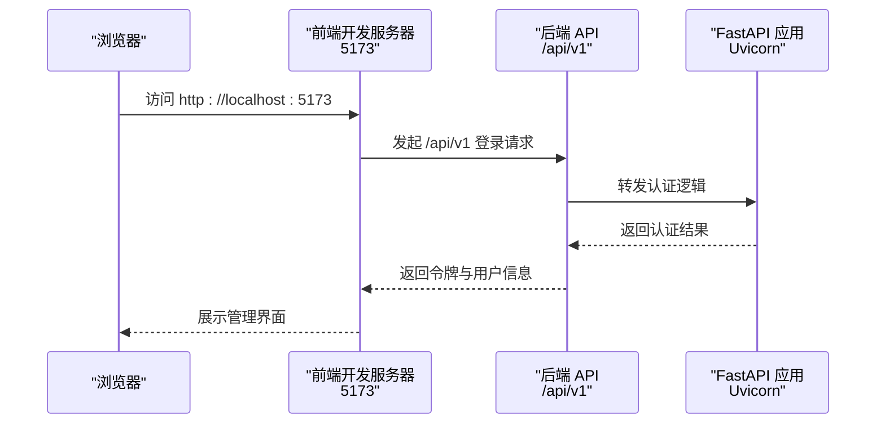
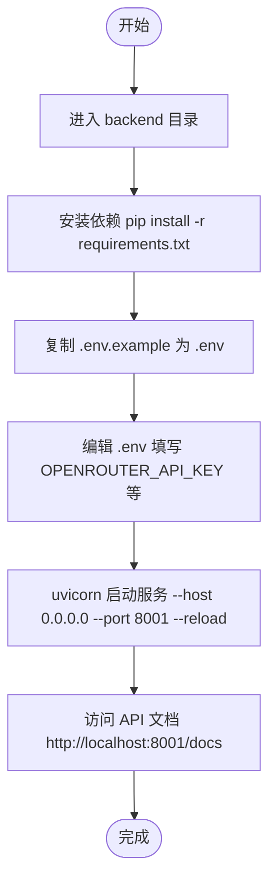
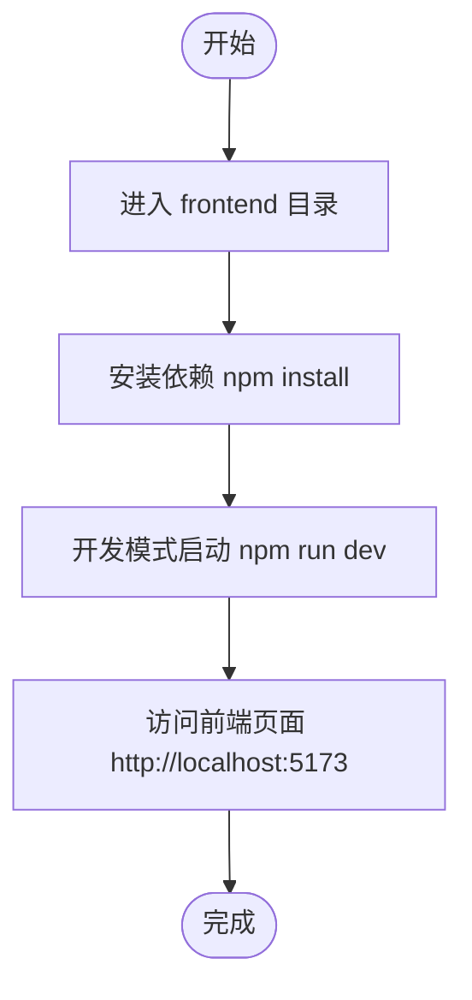
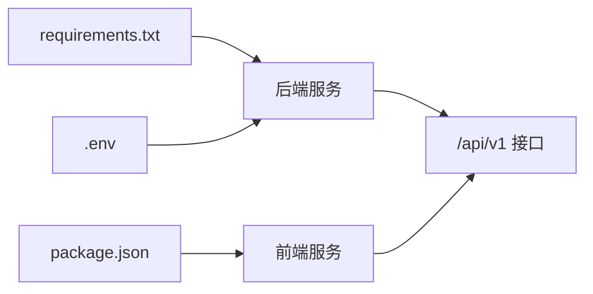

# 快速开始

<cite>
**本文引用的文件**
- [README.md](file://README.md)
- [backend/app/main.py](file://backend/app/main.py)
- [backend/app/config.py](file://backend/app/config.py)
- [backend/requirements.txt](file://backend/requirements.txt)
- [frontend/package.json](file://frontend/package.json)
- [frontend/vite.config.ts](file://frontend/vite.config.ts)
- [frontend/src/api/config.ts](file://frontend/src/api/config.ts)
- [frontend/src/pages/LoginPage.tsx](file://frontend/src/pages/LoginPage.tsx)
- [后端api.md](file://后端api.md)
- [前后端api交互.md](file://前后端api交互.md)
</cite>

## 目录
1. [简介](#简介)
2. [项目结构](#项目结构)
3. [核心组件](#核心组件)
4. [架构总览](#架构总览)
5. [详细组件分析](#详细组件分析)
6. [依赖分析](#依赖分析)
7. [性能考虑](#性能考虑)
8. [故障排除指南](#故障排除指南)
9. [结论](#结论)
10. [附录](#附录)

## 简介
本指南面向首次接触避风港(ASTRA)平台的新用户，帮助你在30分钟内完成本地开发环境的准备与启动，包括后端服务与前端界面的运行，以及默认管理员账号登录。你将获得完整的环境准备清单、启动步骤、访问地址说明、常见问题排查与最佳实践建议。

## 项目结构
ASTRA采用前后端分离架构：
- 后端位于 backend 目录，基于 Python 与 FastAPI/Uvicorn 提供 REST API 与后台处理能力。
- 前端位于 frontend 目录，基于 Vite + React/TypeScript 提供可视化管理界面。
- README.md 提供了整体说明与环境变量配置参考；后端API文档与前后端交互文档提供了接口与交互细节。

**图表来源**
- [backend/app/main.py](file://backend/app/main.py)
- [backend/app/config.py](file://backend/app/config.py)
- [backend/requirements.txt](file://backend/requirements.txt)
- [frontend/package.json](file://frontend/package.json)
- [frontend/vite.config.ts](file://frontend/vite.config.ts)
- [frontend/src/api/config.ts](file://frontend/src/api/config.ts)
- [frontend/src/pages/LoginPage.tsx](file://frontend/src/pages/LoginPage.tsx)

**章节来源**
- [README.md](file://README.md)
- [后端api.md](file://后端api.md)
- [前后端api交互.md](file://前后端api交互.md)

## 核心组件
- 后端服务入口与运行方式：通过 Uvicorn 启动 FastAPI 应用，监听 0.0.0.0:8001，并启用热重载便于开发。
- 前端开发服务器：通过 Vite 启动本地开发服务器，监听 0.0.0.0:5173。
- API 前缀：前端统一通过 /api/v1 访问后端接口。
- 默认管理员账号：admin/admin123，可在登录页进行验证。

**章节来源**
- [backend/app/main.py](file://backend/app/main.py)
- [frontend/src/api/config.ts](file://frontend/src/api/config.ts)
- [frontend/src/pages/LoginPage.tsx](file://frontend/src/pages/LoginPage.tsx)

## 架构总览
下图展示了从浏览器访问到后端处理的关键路径，以及前端如何通过 /api/v1 与后端交互。

**图表来源**
- [frontend/src/api/config.ts](file://frontend/src/api/config.ts)
- [frontend/src/pages/LoginPage.tsx](file://frontend/src/pages/LoginPage.tsx)
- [backend/app/main.py](file://backend/app/main.py)

## 详细组件分析

### 后端启动流程
- 进入后端目录，安装依赖：pip install -r requirements.txt
- 配置环境变量：复制 .env.example 为 .env，并按要求填写 OPENROUTER_API_KEY 等关键变量
- 启动服务：uvicorn app.main:app --host 0.0.0.0 --port 8001 --reload
- 访问 API 文档：http://localhost:8001/docs

**图表来源**
- [backend/requirements.txt](file://backend/requirements.txt)
- [backend/app/main.py](file://backend/app/main.py)
- [README.md](file://README.md)

**章节来源**
- [backend/requirements.txt](file://backend/requirements.txt)
- [backend/app/main.py](file://backend/app/main.py)
- [README.md](file://README.md)

### 前端启动流程
- 进入前端目录，安装依赖：npm install
- 开发模式启动：npm run dev
- 访问前端页面：http://localhost:5173

**图表来源**
- [frontend/package.json](file://frontend/package.json)
- [frontend/vite.config.ts](file://frontend/vite.config.ts)

**章节来源**
- [frontend/package.json](file://frontend/package.json)
- [frontend/vite.config.ts](file://frontend/vite.config.ts)

### API 与访问地址
- 前端页面：http://localhost:5173
- 后端 API：http://localhost:8001/api/v1
- API 文档：http://localhost:8001/docs
- 默认管理员账号：admin/admin123（可在登录页验证）

**章节来源**
- [frontend/src/api/config.ts](file://frontend/src/api/config.ts)
- [frontend/src/pages/LoginPage.tsx](file://frontend/src/pages/LoginPage.tsx)
- [后端api.md](file://后端api.md)
- [前后端api交互.md](file://前后端api交互.md)

## 依赖分析
- 后端依赖：通过 requirements.txt 管理，包含 FastAPI、Uvicorn、Pydantic 等核心库。
- 前端依赖：通过 package.json 管理，包含 Vite、React、TypeScript 等核心库。
- 环境变量：后端通过 .env 加载配置，部分 SDK 依赖的环境变量会注入到 os.environ。

**图表来源**
- [backend/requirements.txt](file://backend/requirements.txt)
- [frontend/package.json](file://frontend/package.json)
- [backend/app/config.py](file://backend/app/config.py)

**章节来源**
- [backend/requirements.txt](file://backend/requirements.txt)
- [frontend/package.json](file://frontend/package.json)
- [backend/app/config.py](file://backend/app/config.py)

## 性能考虑
- 使用 --reload 参数便于开发调试，但在生产环境中应关闭以减少文件监控开销。
- 前端开发服务器默认监听 0.0.0.0，确保局域网内其他设备可访问（如需联调）。
- 合理配置后端日志级别与中间件，避免在开发阶段产生过多 IO 压力。

## 故障排除指南
- 后端无法启动或端口占用
  - 检查 8001 端口是否被占用，必要时更换端口或终止占用进程。
  - 确认已正确安装 requirements.txt 中的依赖。
- 前端无法访问或热更新异常
  - 确认已执行 npm install，且 node 版本满足要求。
  - 检查防火墙或代理是否阻止 5173 端口。
- 登录失败或默认账号无效
  - 确认已正确配置 .env 并重启后端服务。
  - 在登录页使用 admin/admin123 进行验证。
- API 文档无法访问
  - 确认后端服务已启动且未报错。
  - 检查跨域与反向代理配置（如使用 Nginx）。

**章节来源**
- [backend/app/main.py](file://backend/app/main.py)
- [frontend/src/pages/LoginPage.tsx](file://frontend/src/pages/LoginPage.tsx)
- [README.md](file://README.md)

## 结论
按照本指南，你可以在约 30 分钟内完成避风港(ASTRA)平台的本地开发环境搭建与验证。建议在启动后先检查 API 文档与登录页，再逐步探索各功能模块。遇到问题时优先核对环境变量与端口占用情况。

## 附录
- 环境准备清单
  - Python 3.13+
  - Node.js 18+
  - 可选：ChromaDB 实例（用于知识库/检索增强）
- 关键文件与位置
  - 后端入口：backend/app/main.py
  - 环境变量：backend/.env
  - 前端入口：frontend/vite.config.ts
  - API 前缀：/api/v1
  - 默认账号：admin/admin123