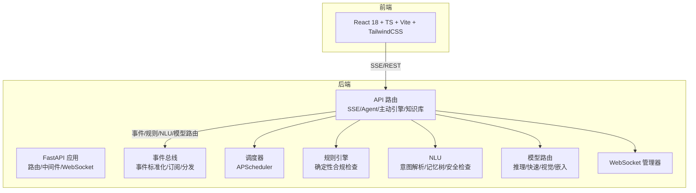
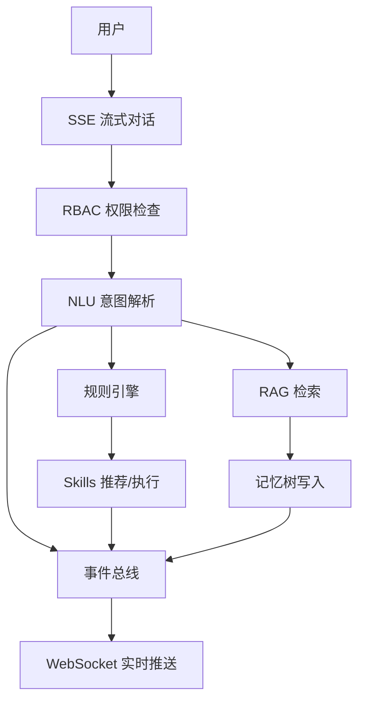
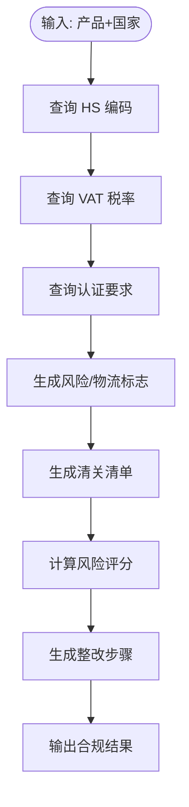
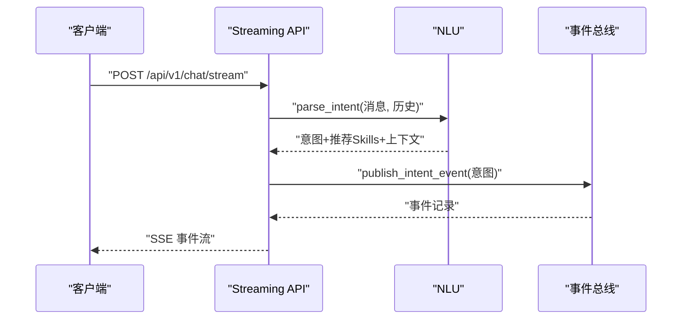
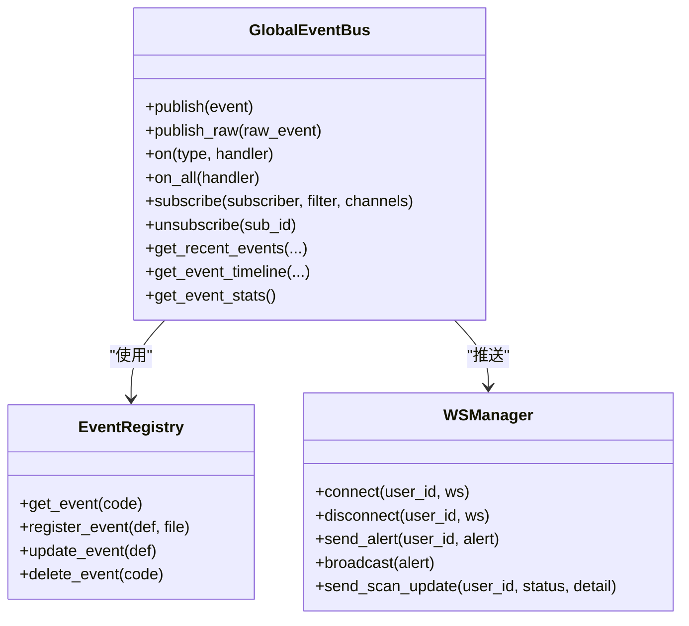
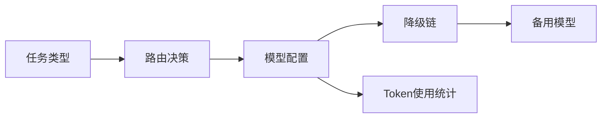
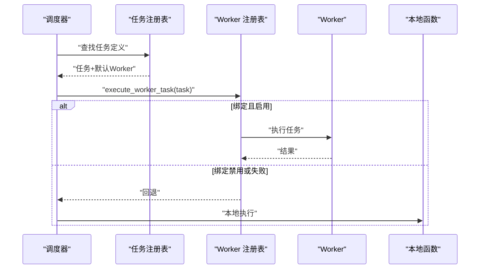
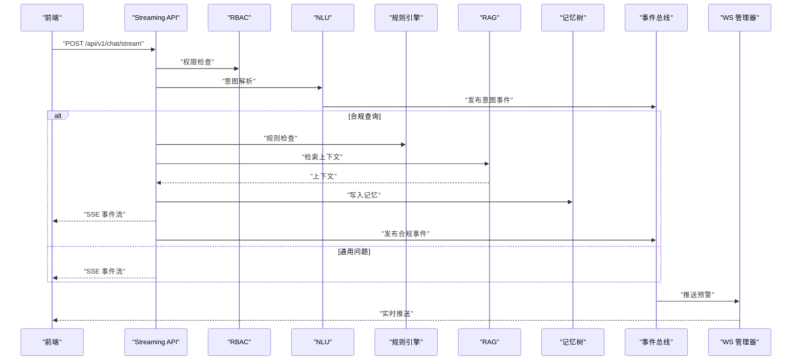
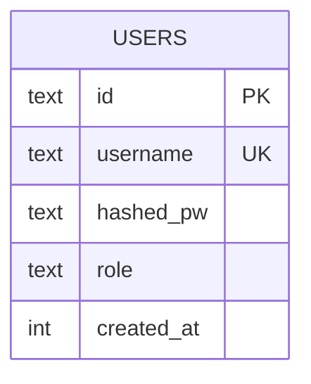
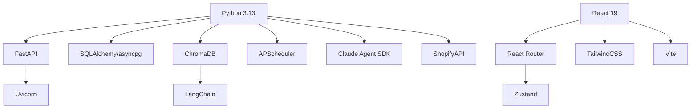

# 技术架构

<cite>
**本文引用的文件**
- [README.md](file://README.md)
- [backend/app/main.py](file://backend/app/main.py)
- [backend/requirements.txt](file://backend/requirements.txt)
- [frontend/package.json](file://frontend/package.json)
- [backend/app/core/rule_engine.py](file://backend/app/core/rule_engine.py)
- [backend/app/core/nlu.py](file://backend/app/core/nlu.py)
- [backend/app/core/model_router.py](file://backend/app/core/model_router.py)
- [backend/app/core/event_bus.py](file://backend/app/core/event_bus.py)
- [backend/app/core/scheduler.py](file://backend/app/core/scheduler.py)
- [backend/app/storage/user_store.py](file://backend/app/storage/user_store.py)
- [backend/app/api/streaming.py](file://backend/app/api/streaming.py)
- [backend/app/services/ws_manager.py](file://backend/app/services/ws_manager.py)
</cite>

## 目录
1. [引言](#引言)
2. [项目结构](#项目结构)
3. [核心组件](#核心组件)
4. [架构总览](#架构总览)
5. [详细组件分析](#详细组件分析)
6. [依赖分析](#依赖分析)
7. [性能考虑](#性能考虑)
8. [故障排查指南](#故障排查指南)
9. [结论](#结论)
10. [附录](#附录)

## 引言
避风港(ASTRA)平台采用“规则引擎 + LLM + 多Agent协同”的混合推理架构，结合事件驱动与定时任务，实现跨境电商合规的全生命周期管理。后端基于 Python 3.13 + FastAPI，前端基于 React 18 + TypeScript + Vite + TailwindCSS。核心技术包括：ChromaDB 用于 RAG 检索、SQLite 用于关系数据存储、OpenRouter 多模型路由、JWT 认证、WebSocket + SSE 实时通信、APScheduler 任务调度。

## 项目结构
- 后端
  - 应用入口与路由注册：FastAPI 应用、中间件、WebSocket 端点、定时任务启动/停止
  - 核心引擎：规则引擎、NLU、事件总线、模型路由、调度器、存储层
  - API 层：流式对话(SSE)、Agent 管理、主动引擎、认证、产品、事件、知识库等
  - 服务层：WebSocket 管理、合规服务、提示词加载、Shopify 集成、通知引擎
  - 存储层：用户、会话、产品、事件、全局/产品级记忆树
- 前端
  - 页面与组件：聊天工作区、产品列表、知识库、风险中心、系统合规页、用户管理等
  - 上下文与 Hooks：认证、通知、WebSocket、SSE Hook
  - 构建与样式：Vite + TailwindCSS + TypeScript

图表来源
- [backend/app/main.py:40-104](file://backend/app/main.py#L40-L104)
- [backend/app/api/streaming.py:171-265](file://backend/app/api/streaming.py#L171-L265)
- [backend/app/core/event_bus.py:115-187](file://backend/app/core/event_bus.py#L115-L187)
- [backend/app/core/scheduler.py:224-298](file://backend/app/core/scheduler.py#L224-L298)

章节来源
- [README.md:37-64](file://README.md#L37-L64)
- [backend/app/main.py:1-215](file://backend/app/main.py#L1-L215)
- [frontend/package.json:1-28](file://frontend/package.json#L1-L28)

## 核心组件
- 规则引擎：基于 L0 原始数据（HS 编码、VAT、认证矩阵），执行确定性合规检查，输出风险评分与整改建议。
- NLU：事件感知的意图解析，映射业务阶段与推荐 Skills，结合记忆树增强上下文。
- 事件总线：事件标准化、跨产品广播、订阅分发（WebSocket/Webhook/通知引擎）。
- 模型路由：按任务类型（推理/快速/视觉/嵌入）自动选择模型，支持降级链与 Token 统计。
- 调度器：APScheduler 驱动的定时任务，绑定 Worker 执行，支持产品级任务。
- 存储层：SQLite 用户表、会话与产品事件链、全局事件总线持久化。
- SSE + WebSocket：流式对话与实时预警推送。
- 前端：React 18 + TypeScript + Vite + TailwindCSS，统一 API 客户端与类型安全。

章节来源
- [backend/app/core/rule_engine.py:1-247](file://backend/app/core/rule_engine.py#L1-L247)
- [backend/app/core/nlu.py:1-394](file://backend/app/core/nlu.py#L1-L394)
- [backend/app/core/event_bus.py:115-290](file://backend/app/core/event_bus.py#L115-L290)
- [backend/app/core/model_router.py:27-202](file://backend/app/core/model_router.py#L27-L202)
- [backend/app/core/scheduler.py:224-393](file://backend/app/core/scheduler.py#L224-L393)
- [backend/app/storage/user_store.py:22-133](file://backend/app/storage/user_store.py#L22-L133)
- [backend/app/api/streaming.py:171-265](file://backend/app/api/streaming.py#L171-L265)
- [backend/app/services/ws_manager.py:20-95](file://backend/app/services/ws_manager.py#L20-L95)

## 架构总览
混合推理架构将高频确定性逻辑（规则引擎）与低频模糊理解（LLM+NLU）解耦，通过事件总线与调度器串联多 Agent 协同，形成“感知—通知—推荐—对话—执行—回写”的六步流水线。实时通信保障用户与系统之间的即时反馈。

图表来源
- [backend/app/api/streaming.py:171-265](file://backend/app/api/streaming.py#L171-L265)
- [backend/app/core/nlu.py:113-172](file://backend/app/core/nlu.py#L113-L172)
- [backend/app/core/rule_engine.py:197-247](file://backend/app/core/rule_engine.py#L197-L247)
- [backend/app/core/event_bus.py:150-187](file://backend/app/core/event_bus.py#L150-L187)
- [backend/app/services/ws_manager.py:46-68](file://backend/app/services/ws_manager.py#L46-L68)

## 详细组件分析

### 规则引擎
- 数据来源：L0 原始数据（HS 编码、VAT、认证矩阵）
- 处理流程：产品+国家输入 → HS/VAT/认证查询 → 风险标志/物流提示/清关清单 → 风险评分与整改建议
- 输出：合规结果结构，供前端展示与后续事件发布

图表来源
- [backend/app/core/rule_engine.py:197-247](file://backend/app/core/rule_engine.py#L197-L247)

章节来源
- [backend/app/core/rule_engine.py:1-247](file://backend/app/core/rule_engine.py#L1-L247)

### NLU 意图解析
- 关键能力：关键词匹配、动作分类、实体抽取、历史增强、业务阶段映射、事件发布、Skills 推荐、记忆树上下文、安全检查
- 事件驱动：解析结果发布到事件总线，驱动下游流水线

图表来源
- [backend/app/api/streaming.py:171-265](file://backend/app/api/streaming.py#L171-L265)
- [backend/app/core/nlu.py:113-212](file://backend/app/core/nlu.py#L113-L212)
- [backend/app/core/event_bus.py:184-211](file://backend/app/core/event_bus.py#L184-L211)

章节来源
- [backend/app/core/nlu.py:1-394](file://backend/app/core/nlu.py#L1-L394)

### 事件总线
- 职责：事件标准化、跨产品广播、订阅分发（WebSocket/Webhook/通知引擎）、持久化（全局/产品级）
- 订阅：精准/批量/全局/条件四种订阅方式，支持安全条件表达式

图表来源
- [backend/app/core/event_bus.py:115-290](file://backend/app/core/event_bus.py#L115-L290)
- [backend/app/services/ws_manager.py:20-95](file://backend/app/services/ws_manager.py#L20-L95)

章节来源
- [backend/app/core/event_bus.py:1-817](file://backend/app/core/event_bus.py#L1-L817)
- [backend/app/services/ws_manager.py:1-95](file://backend/app/services/ws_manager.py#L1-L95)

### 模型路由
- 任务分类：推理/快速/视觉/嵌入
- 路由策略：配置驱动、降级链、超时与 Token 预算
- 配置持久化：支持动态更新路由与降级链

图表来源
- [backend/app/core/model_router.py:107-134](file://backend/app/core/model_router.py#L107-L134)
- [backend/app/core/model_router.py:177-188](file://backend/app/core/model_router.py#L177-L188)

章节来源
- [backend/app/core/model_router.py:1-202](file://backend/app/core/model_router.py#L1-L202)

### 调度器（APScheduler）
- 任务绑定：任务名 → Worker 编码，支持启用/禁用
- 产品级任务：为每个产品自动注册认证到期与法规扫描任务
- 执行回退：Worker 分发失败时回退到本地执行

图表来源
- [backend/app/core/scheduler.py:315-354](file://backend/app/core/scheduler.py#L315-L354)
- [backend/app/core/scheduler.py:408-440](file://backend/app/core/scheduler.py#L408-L440)

章节来源
- [backend/app/core/scheduler.py:1-602](file://backend/app/core/scheduler.py#L1-L602)

### SSE 流式对话与实时通信
- SSE：统一的流式对话入口，事件类型覆盖 token/skill_start/skill_end/thinking/plan/action_card/error/done
- WebSocket：实时预警推送，支持广播与按用户推送
- RBAC：查询级权限控制，区分 viewer/auditor/admin

图表来源
- [backend/app/api/streaming.py:171-265](file://backend/app/api/streaming.py#L171-L265)
- [backend/app/api/streaming.py:272-407](file://backend/app/api/streaming.py#L272-L407)
- [backend/app/services/ws_manager.py:46-68](file://backend/app/services/ws_manager.py#L46-L68)

章节来源
- [backend/app/api/streaming.py:1-744](file://backend/app/api/streaming.py#L1-L744)
- [backend/app/services/ws_manager.py:1-95](file://backend/app/services/ws_manager.py#L1-L95)

### 存储层（SQLite）
- 用户表：id/username/role/created_at，密码哈希存储
- 会话与产品事件链：持久化到 data/global/events 与 data/products/{pid}/events
- 初始化：启动时创建默认管理员账户

图表来源
- [backend/app/storage/user_store.py:22-33](file://backend/app/storage/user_store.py#L22-L33)

章节来源
- [backend/app/storage/user_store.py:1-133](file://backend/app/storage/user_store.py#L1-L133)

## 依赖分析
- 后端依赖
  - FastAPI + Uvicorn：Web 框架与 ASGI 服务器
  - SQLAlchemy + asyncpg：异步 ORM 与 PostgreSQL 驱动（注：实际使用 SQLite）
  - ChromaDB + LangChain：向量检索与 RAG
  - APScheduler：异步调度器
  - Claude Agent SDK：官方 Python SDK，提供会话、子代理、工具、技能、沙箱能力
  - ShopifyAPI：Shopify 集成
  - Pydantic + python-dotenv：配置与环境变量
- 前端依赖
  - React 19 + React Router + Zustand：组件化与状态管理
  - TailwindCSS：原子化样式
  - Vite：构建工具

图表来源
- [backend/requirements.txt:1-27](file://backend/requirements.txt#L1-L27)
- [frontend/package.json:11-26](file://frontend/package.json#L11-L26)

章节来源
- [backend/requirements.txt:1-27](file://backend/requirements.txt#L1-L27)
- [frontend/package.json:1-28](file://frontend/package.json#L1-L28)

## 性能考虑
- 规则引擎确定性路径优先，降低 LLM 调用频率，提升响应速度与成本可控性
- SSE 流式输出与 WebSocket 实时推送减少轮询开销
- 调度器异步执行与回退机制，保证系统稳定性
- 事件总线内存保留最近事件并归档，兼顾查询效率与磁盘占用
- 模型路由按任务类型选择最优模型，支持降级链与 Token 统计，优化成本与质量平衡

## 故障排查指南
- SSE/WS 连接问题
  - 检查 CORS 配置与 WebSocket 端点
  - 确认 ws_manager 是否持有活跃连接
- 事件总线异常
  - 查看事件持久化文件是否存在与可写
  - 检查订阅过滤条件与通道配置
- 调度器任务失败
  - 查看任务绑定与 Worker 状态
  - 检查回退到本地执行的日志
- 认证与权限
  - 确认 JWT 令牌有效与 RBAC 角色配置
  - 检查匿名用户与 viewer/auditor/admin 权限差异

章节来源
- [backend/app/main.py:46-52](file://backend/app/main.py#L46-L52)
- [backend/app/services/ws_manager.py:30-44](file://backend/app/services/ws_manager.py#L30-L44)
- [backend/app/core/event_bus.py:294-331](file://backend/app/core/event_bus.py#L294-L331)
- [backend/app/core/scheduler.py:330-354](file://backend/app/core/scheduler.py#L330-L354)
- [backend/app/api/streaming.py:515-549](file://backend/app/api/streaming.py#L515-L549)

## 结论
避风港(ASTRA)平台通过规则引擎与 LLM 的混合推理、事件驱动与多 Agent 协同、以及 SSE + WebSocket 的实时交互，构建了面向中小出海企业的低成本、全链路、可解释的合规基础设施。前后端分离架构清晰，技术栈选择兼顾性能与可维护性，具备良好的扩展性与生产落地能力。

## 附录
- 快速启动与访问
  - 后端：uvicorn 启动，端口 8001，Swagger 文档 /docs
  - 前端：Vite 开发服务器，端口 5173
  - 默认账号：admin / admin123（登录后立即修改密码）

章节来源
- [README.md:68-110](file://README.md#L68-L110)
- [backend/app/main.py:106-117](file://backend/app/main.py#L106-L117)