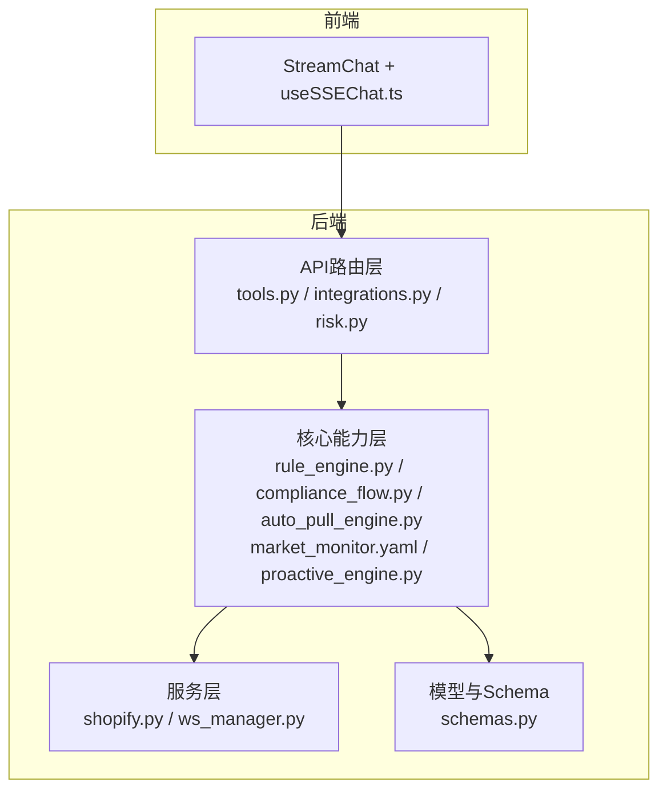
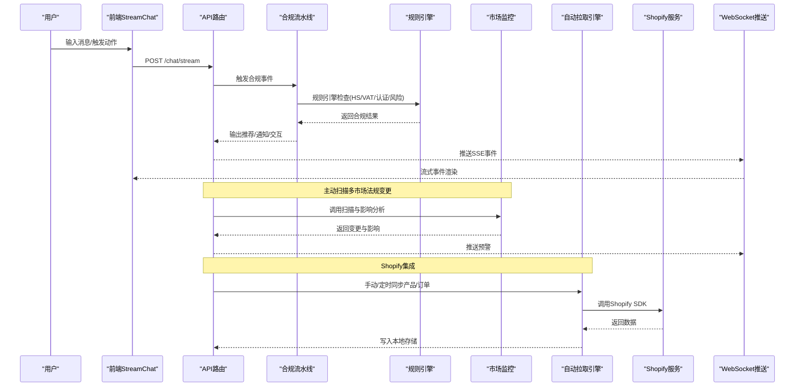
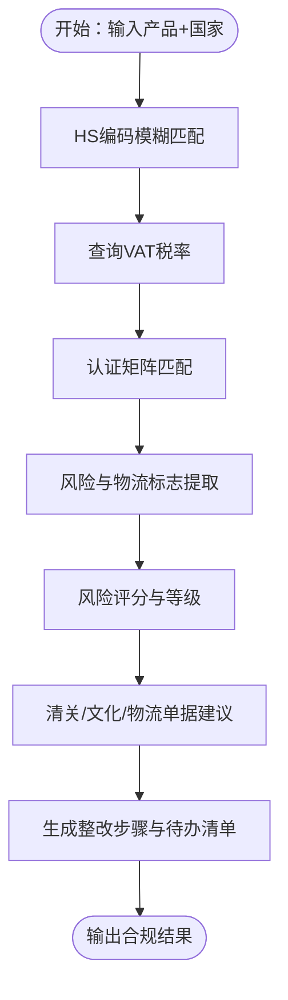
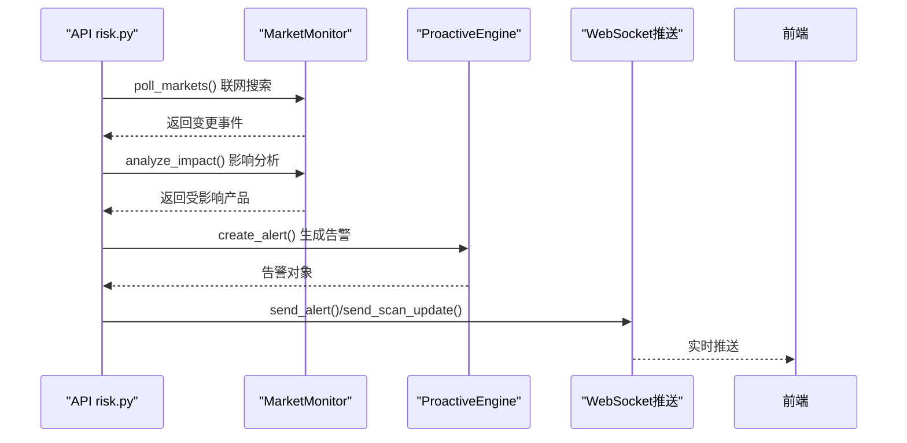
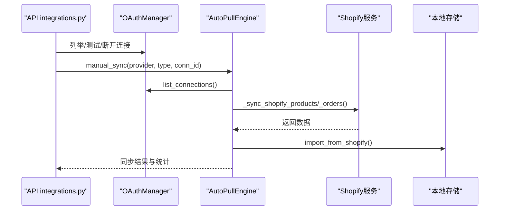
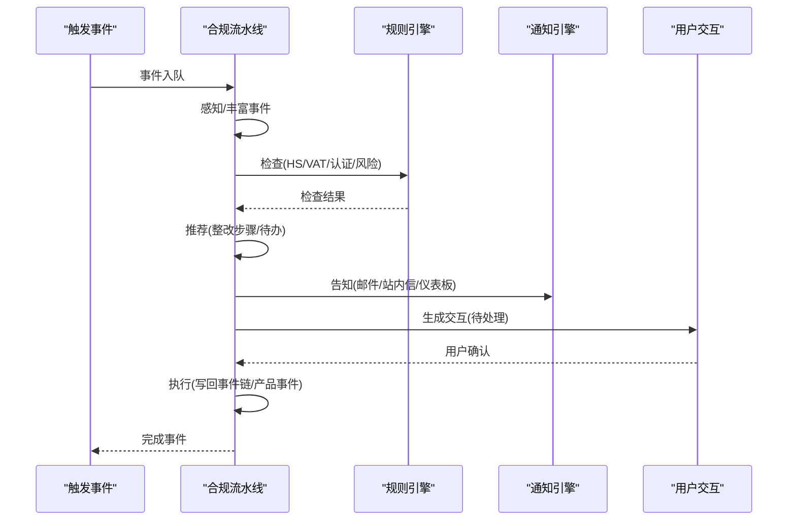
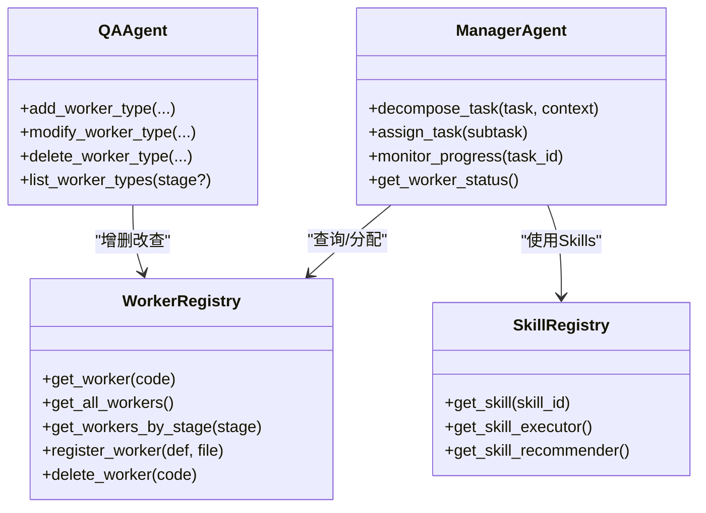
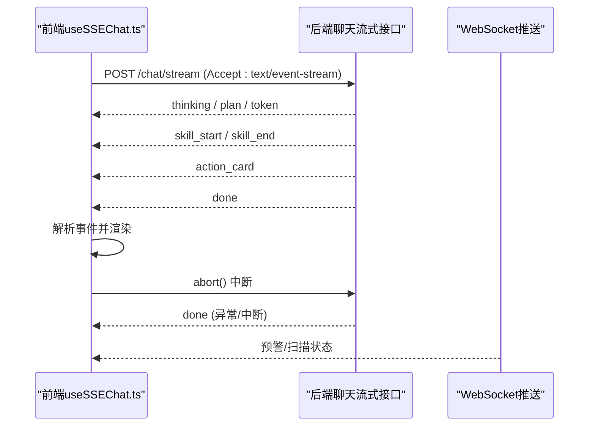
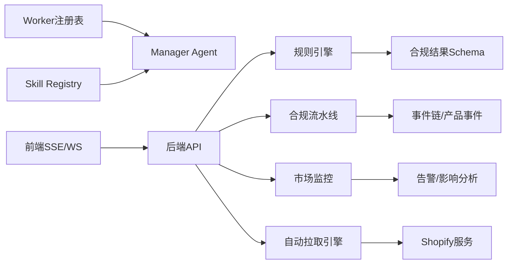

# 核心能力

<cite>
**本文引用的文件**   
- [rule_engine.py](file://backend/app/core/rule_engine.py)
- [schemas.py](file://backend/app/models/schemas.py)
- [chain_f04facccc133.json](file://backend/data/chains/actions/chain_f04facccc133.json)
- [chain_952a28a3a132.json](file://backend/data/chains/actions/chain_952a28a3a132.json)
- [chain_7f9aba697202.json](file://backend/data/chains/actions/chain_7f9aba697202.json)
- [chain_bb6bb16bdc43.json](file://backend/data/chains/actions/chain_bb6bb16bdc43.json)
- [test_rule_engine.py](file://backend/tests/test_rule_engine.py)
- [tools.py](file://backend/app/api/tools.py)
- [tools.json](file://backend/data/config/tools.json)
- [auto_pull_engine.py](file://backend/app/core/auto_pull_engine.py)
- [shopify.py](file://backend/app/services/shopify.py)
- [integrations.py](file://backend/app/api/integrations.py)
- [oauth_manager.py](file://backend/app/core/oauth_manager.py)
- [compliance_flow.py](file://backend/app/core/compliance_flow.py)
- [market_monitor.yaml](file://backend/data/prompts/market_monitor.yaml)
- [proactive_engine.py](file://backend/app/core/proactive_engine.py)
- [risk.py](file://backend/app/api/risk.py)
- [manager_agent.py](file://backend/app/core/manager_agent.py)
- [worker_registry.py](file://backend/app/core/worker_registry.py)
- [qa_agent.py](file://backend/app/core/qa_agent.py)
- [skill_registry.py](file://backend/app/core/skill_registry.py)
- [useSSEChat.ts](file://frontend/src/hooks/useSSEChat.ts)
- [前端api.md](file://前端api.md)
- [前后端api交互.md](file://前后端api交互.md)
</cite>

## 目录
1. [引言](#引言)
2. [项目结构](#项目结构)
3. [核心组件](#核心组件)
4. [架构总览](#架构总览)
5. [详细组件分析](#详细组件分析)
6. [依赖分析](#依赖分析)
7. [性能考虑](#性能考虑)
8. [故障排查指南](#故障排查指南)
9. [结论](#结论)
10. [附录](#附录)

## 引言
本文件面向避风港(ASTRA)平台的使用者与实施团队，系统化梳理六大核心能力模块：1) 产品合规预检能力（HS编码识别、VAT计算、认证矩阵匹配、风险标记），2) 多市场法规监控能力（EU/US/JP/KR法规跟踪与实时预警），3) Shopify集成能力（OAuth认证、产品数据同步、自动化合规检查），4) 六步执行流水线（感知→通知→推荐→对话→执行→回写），5) 多Agent调度与Skills扩展体系，6) SSE流式AI对话与WebSocket实时推送。文档从技术架构、实现原理、数据流、性能特征与实际场景出发，辅以可视化图示与来源标注，帮助读者快速理解并高效落地。

## 项目结构
ASTRA后端采用“API层-核心能力层-存储与知识层”的分层设计，前端通过SSE与后端进行流式对话与事件推送。核心能力模块围绕合规规则引擎、事件驱动流水线、多市场监控、第三方集成、多Agent编排与流式对话展开。

**图表来源**
- [tools.py:80-116](file://backend/app/api/tools.py#L80-L116)
- [integrations.py:102-136](file://backend/app/api/integrations.py#L102-L136)
- [risk.py:70-98](file://backend/app/api/risk.py#L70-L98)
- [rule_engine.py:1-246](file://backend/app/core/rule_engine.py#L1-L246)
- [compliance_flow.py:42-108](file://backend/app/core/compliance_flow.py#L42-L108)
- [auto_pull_engine.py:250-325](file://backend/app/core/auto_pull_engine.py#L250-L325)
- [market_monitor.yaml:1-35](file://backend/data/prompts/market_monitor.yaml#L1-L35)
- [proactive_engine.py:453-478](file://backend/app/core/proactive_engine.py#L453-L478)
- [schemas.py:107-120](file://backend/app/models/schemas.py#L107-L120)

**章节来源**
- [tools.py:80-116](file://backend/app/api/tools.py#L80-L116)
- [integrations.py:102-136](file://backend/app/api/integrations.py#L102-L136)
- [risk.py:70-98](file://backend/app/api/risk.py#L70-L98)
- [rule_engine.py:1-246](file://backend/app/core/rule_engine.py#L1-L246)
- [compliance_flow.py:42-108](file://backend/app/core/compliance_flow.py#L42-L108)
- [auto_pull_engine.py:250-325](file://backend/app/core/auto_pull_engine.py#L250-L325)
- [market_monitor.yaml:1-35](file://backend/data/prompts/market_monitor.yaml#L1-L35)
- [proactive_engine.py:453-478](file://backend/app/core/proactive_engine.py#L453-L478)
- [schemas.py:107-120](file://backend/app/models/schemas.py#L107-L120)

## 核心组件
- 合规规则引擎：基于L0层结构化数据（HS编码、VAT、认证矩阵等）执行确定性检查，输出合规结果与整改建议。
- 事件驱动合规流水线：以事件为驱动，串联感知、检查、推荐、通知、交互、执行与回写，支持6/5阶段模式切换。
- 多市场法规监控：通过提示词模板定义市场与关键词，结合主动扫描与影响分析，生成实时预警并推送到前端。
- Shopify集成：提供OAuth授权、产品/订单同步与Webhook校验，打通外部平台数据与Astra合规能力。
- 多Agent调度与Skills扩展：通过Worker注册表与Manager Agent实现配置驱动的任务拆解与执行，支持Skills扩展。
- SSE流式对话与WebSocket推送：前端通过SSE接收Thinking/Plan/Token/Skill/ActionCard/Done等事件，实现端到端实时交互。

**章节来源**
- [rule_engine.py:1-246](file://backend/app/core/rule_engine.py#L1-L246)
- [compliance_flow.py:42-108](file://backend/app/core/compliance_flow.py#L42-L108)
- [market_monitor.yaml:1-35](file://backend/data/prompts/market_monitor.yaml#L1-L35)
- [proactive_engine.py:453-478](file://backend/app/core/proactive_engine.py#L453-L478)
- [auto_pull_engine.py:250-325](file://backend/app/core/auto_pull_engine.py#L250-L325)
- [shopify.py:1-41](file://backend/app/services/shopify.py#L1-L41)
- [manager_agent.py:968-1029](file://backend/app/core/manager_agent.py#L968-L1029)
- [worker_registry.py:840-964](file://backend/app/core/worker_registry.py#L840-L964)
- [qa_agent.py:1034-1104](file://backend/app/core/qa_agent.py#L1034-L1104)
- [skill_registry.py:949-966](file://backend/app/core/skill_registry.py#L949-L966)
- [useSSEChat.ts:1-114](file://frontend/src/hooks/useSSEChat.ts#L1-L114)
- [前端api.md:321-335](file://前端api.md#L321-L335)
- [前后端api交互.md:232-289](file://前后端api交互.md#L232-L289)

## 架构总览
下图展示了从用户输入到合规结果与实时推送的端到端流程，涵盖规则引擎、合规流水线、法规监控、Shopify集成与SSE推送。

**图表来源**
- [前后端api交互.md:232-289](file://前后端api交互.md#L232-L289)
- [rule_engine.py:197-246](file://backend/app/core/rule_engine.py#L197-L246)
- [compliance_flow.py:52-108](file://backend/app/core/compliance_flow.py#L52-L108)
- [market_monitor.yaml:1-35](file://backend/data/prompts/market_monitor.yaml#L1-L35)
- [proactive_engine.py:453-478](file://backend/app/core/proactive_engine.py#L453-L478)
- [auto_pull_engine.py:250-325](file://backend/app/core/auto_pull_engine.py#L250-L325)
- [shopify.py:1-41](file://backend/app/services/shopify.py#L1-L41)
- [risk.py:70-98](file://backend/app/api/risk.py#L70-L98)

## 详细组件分析

### 1) 产品合规预检能力
- 实现原理
  - 基于L0层结构化数据（HS编码、VAT、认证矩阵、风险与物流限制、清关单据、文化注意事项）执行确定性检查。
  - 规则引擎提供HS模糊匹配、VAT查询、认证矩阵检索、风险与物流标志提取、风险评分与整改建议生成。
- 技术架构
  - 数据源：L0 raw_store（HS/VAT/认证/法规片段）；写入L5事件链与产品事件。
  - 输出Schema：包含HS编码、VAT、认证、风险等级/分数、物流/清关/文化提示、整改步骤与待办清单。
- 性能特点
  - 确定性规则检查，延迟低、吞吐高；支持降级（L0缺失时返回空结果并标记）。
- 实际场景
  - 出口前自动预检：输入产品+国家，快速获得合规清单与风险提示，减少人工复核成本。
  - 供应链协同：将物流限制与清关单据提示同步至货代/承运商，提升通关效率。

**图表来源**
- [rule_engine.py:17-246](file://backend/app/core/rule_engine.py#L17-L246)
- [schemas.py:107-120](file://backend/app/models/schemas.py#L107-L120)

**章节来源**
- [rule_engine.py:1-246](file://backend/app/core/rule_engine.py#L1-L246)
- [schemas.py:107-120](file://backend/app/models/schemas.py#L107-L120)
- [test_rule_engine.py:1-93](file://backend/tests/test_rule_engine.py#L1-L93)
- [tools.json:1-52](file://backend/data/config/tools.json#L1-L52)
- [tools.py:80-116](file://backend/app/api/tools.py#L80-L116)

### 2) 多市场法规监控能力
- 实现原理
  - 通过提示词模板定义市场（EU/US/JP/KR）、权威来源与关键词，结合联网搜索与影响分析，识别变更并评估对产品的潜在影响。
  - 主动引擎定期扫描，匹配受影响产品，发布全局事件并通过WebSocket推送预警。
- 技术架构
  - MarketMonitor负责扫描与影响分析；ProactiveEngine封装扫描流程并维护告警历史；API risk路由负责触发扫描与推送。
- 性能特点
  - 扫描频率可配置，支持增量与去重；前端SSE实时接收，降低轮询开销。
- 实际场景
  - 新规发布预警：如GPSR、REACH、FCC等，自动匹配受影响品类并下发提醒。
  - 市场热点追踪：聚合多源信息，形成摘要与关键要点，辅助决策。

**图表来源**
- [risk.py:70-98](file://backend/app/api/risk.py#L70-L98)
- [proactive_engine.py:453-478](file://backend/app/core/proactive_engine.py#L453-L478)
- [market_monitor.yaml:1-35](file://backend/data/prompts/market_monitor.yaml#L1-L35)

**章节来源**
- [market_monitor.yaml:1-35](file://backend/data/prompts/market_monitor.yaml#L1-L35)
- [proactive_engine.py:453-478](file://backend/app/core/proactive_engine.py#L453-L478)
- [risk.py:70-98](file://backend/app/api/risk.py#L70-L98)

### 3) Shopify集成能力
- 实现原理
  - 基于Shopify官方SDK进行OAuth授权与数据同步，支持产品与订单的双向同步，并提供Webhook验证。
  - 自动拉取引擎统一管理同步作业，记录日志与统计指标。
- 技术架构
  - OAuth管理：Provider模板、连接状态与令牌管理。
  - 同步流程：手动/定时触发，按连接维度拉取数据，导入本地存储。
  - API集成：提供连接管理、测试、断开与手动同步接口。
- 性能特点
  - 异步HTTP客户端调用，失败重试与错误隔离；支持批量导入与增量更新。
- 实际场景
  - 电商出海：自动同步Shopify产品与订单，触发合规检查与风险预警。
  - 认证与清关：将产品属性与销售数据纳入合规预检，提升自动化水平。

**图表来源**
- [integrations.py:102-136](file://backend/app/api/integrations.py#L102-L136)
- [oauth_manager.py:101-112](file://backend/app/core/oauth_manager.py#L101-L112)
- [auto_pull_engine.py:250-325](file://backend/app/core/auto_pull_engine.py#L250-L325)
- [shopify.py:1-41](file://backend/app/services/shopify.py#L1-L41)

**章节来源**
- [integrations.py:102-136](file://backend/app/api/integrations.py#L102-L136)
- [oauth_manager.py:81-112](file://backend/app/core/oauth_manager.py#L81-L112)
- [auto_pull_engine.py:250-325](file://backend/app/core/auto_pull_engine.py#L250-L325)
- [shopify.py:1-41](file://backend/app/services/shopify.py#L1-L41)

### 4) 六步执行流水线
- 实现原理
  - 以事件为驱动，按阶段推进：感知→检查→推荐→告知→交互→执行→回写；支持6/5阶段模式切换（推荐+告知合并）。
  - 流水线结果包含阶段产物与数据血缘，便于审计与溯源。
- 技术架构
  - 入口：触发事件进入合规流水线。
  - 阶段：感知（事件丰富）、检查（规则引擎）、推荐（基于检查结果）、告知（通知渠道）、交互（待处理状态）、执行（用户确认后处理）。
  - 回写：事件链与产品事件记录，支撑后续审计与报表。
- 性能特点
  - 异步交互与待处理队列，避免阻塞；状态机清晰，易于扩展。
- 实际场景
  - 风险处置：当规则引擎提示高风险，流水线自动下发整改建议与通知，等待用户确认后执行。
  - 跨部门协作：交互阶段生成操作卡片，推动法务/供应链/财务协同处理。

**图表来源**
- [compliance_flow.py:52-108](file://backend/app/core/compliance_flow.py#L52-L108)
- [rule_engine.py:197-246](file://backend/app/core/rule_engine.py#L197-L246)

**章节来源**
- [compliance_flow.py:42-108](file://backend/app/core/compliance_flow.py#L42-L108)
- [前后端api交互.md:232-289](file://前后端api交互.md#L232-L289)

### 5) 多Agent调度与Skills扩展体系
- 实现原理
  - Worker注册表通过配置文件驱动，定义Worker编码、名称、业务阶段、可用Skills、优先级与资源限制。
  - Manager Agent负责任务拆解与Worker分配，QAAgent提供Worker类型的增删改查与状态管理。
  - Skill Registry提供技能注册、执行器与推荐器的全局访问。
- 技术架构
  - Worker定义：Markdown表格解析与内存缓存。
  - Manager Agent：按业务阶段与优先级选择Worker，实例化执行。
  - Skills扩展：通过技能注册中心统一管理，支持动态加载与推荐。
- 性能特点
  - 配置即代码，热更新友好；Worker优先级与资源限制保障负载均衡。
- 实际场景
  - 合规任务编排：将复杂合规任务拆分为子任务，分配给具备相应Skills的Worker执行。
  - 自我管理：系统管理员可通过QAAgent动态调整Worker类型与可用Skills，适应业务变化。

**图表来源**
- [worker_registry.py:840-964](file://backend/app/core/worker_registry.py#L840-L964)
- [manager_agent.py:968-1029](file://backend/app/core/manager_agent.py#L968-L1029)
- [qa_agent.py:1034-1104](file://backend/app/core/qa_agent.py#L1034-L1104)
- [skill_registry.py:949-966](file://backend/app/core/skill_registry.py#L949-L966)

**章节来源**
- [worker_registry.py:840-964](file://backend/app/core/worker_registry.py#L840-L964)
- [manager_agent.py:968-1029](file://backend/app/core/manager_agent.py#L968-L1029)
- [qa_agent.py:1034-1104](file://backend/app/core/qa_agent.py#L1034-L1104)
- [skill_registry.py:949-966](file://backend/app/core/skill_registry.py#L949-L966)

### 6) SSE流式AI对话与WebSocket实时推送
- 实现原理
  - 前端通过SSE订阅后端事件流，事件类型覆盖思考过程、计划、文本令牌、Skill开始/结束、操作卡片与完成。
  - 后端在聊天流式接口中按阶段推送事件，前端逐事件解析并渲染，支持中断与错误处理。
- 技术架构
  - 前端Hook：useSSEChat负责连接建立、事件解析、中断控制与空闲超时。
  - 后端API：遵循SSE协议，按顺序推送Thinking/Plan/Token/Skill/ActionCard/Done。
  - WebSocket：用于实时预警与扫描状态推送。
- 性能特点
  - 事件驱动、增量渲染，显著降低前端重绘压力；中断机制避免无效计算。
- 实际场景
  - 合规咨询：用户输入问题后，系统逐步输出思考、计划与最终建议，同时展示可执行的操作卡片。
  - 实时监控：法规扫描与预警通过WebSocket推送，前端即时呈现。

**图表来源**
- [useSSEChat.ts:1-114](file://frontend/src/hooks/useSSEChat.ts#L1-L114)
- [前端api.md:321-335](file://前端api.md#L321-L335)
- [前后端api交互.md:232-289](file://前后端api交互.md#L232-L289)

**章节来源**
- [useSSEChat.ts:1-114](file://frontend/src/hooks/useSSEChat.ts#L1-L114)
- [前端api.md:321-335](file://前端api.md#L321-L335)
- [前后端api交互.md:232-289](file://前后端api交互.md#L232-L289)

## 依赖分析
- 规则引擎依赖L0层raw_store（HS/VAT/认证/法规片段），输出标准化Schema，被合规流水线与API工具调用。
- 合规流水线依赖事件链与产品事件，串联通知与交互，最终回写数据血缘。
- 市场监控依赖提示词模板与联网搜索，ProactiveEngine负责扫描与告警聚合。
- Shopify集成依赖OAuthManager与Shopify SDK，AutoPullEngine统一调度同步作业。
- 多Agent体系依赖Worker注册表与Skill Registry，Manager Agent与QAAgent提供编排与管理。
- SSE与WebSocket依赖前端Hook与后端API，确保事件有序推送与前端实时渲染。

**图表来源**
- [rule_engine.py:1-246](file://backend/app/core/rule_engine.py#L1-L246)
- [schemas.py:107-120](file://backend/app/models/schemas.py#L107-L120)
- [compliance_flow.py:42-108](file://backend/app/core/compliance_flow.py#L42-L108)
- [market_monitor.yaml:1-35](file://backend/data/prompts/market_monitor.yaml#L1-L35)
- [proactive_engine.py:453-478](file://backend/app/core/proactive_engine.py#L453-L478)
- [auto_pull_engine.py:250-325](file://backend/app/core/auto_pull_engine.py#L250-L325)
- [shopify.py:1-41](file://backend/app/services/shopify.py#L1-L41)
- [worker_registry.py:840-964](file://backend/app/core/worker_registry.py#L840-L964)
- [manager_agent.py:968-1029](file://backend/app/core/manager_agent.py#L968-L1029)
- [skill_registry.py:949-966](file://backend/app/core/skill_registry.py#L949-L966)
- [useSSEChat.ts:1-114](file://frontend/src/hooks/useSSEChat.ts#L1-L114)

**章节来源**
- [rule_engine.py:1-246](file://backend/app/core/rule_engine.py#L1-L246)
- [schemas.py:107-120](file://backend/app/models/schemas.py#L107-L120)
- [compliance_flow.py:42-108](file://backend/app/core/compliance_flow.py#L42-L108)
- [market_monitor.yaml:1-35](file://backend/data/prompts/market_monitor.yaml#L1-L35)
- [proactive_engine.py:453-478](file://backend/app/core/proactive_engine.py#L453-L478)
- [auto_pull_engine.py:250-325](file://backend/app/core/auto_pull_engine.py#L250-L325)
- [shopify.py:1-41](file://backend/app/services/shopify.py#L1-L41)
- [worker_registry.py:840-964](file://backend/app/core/worker_registry.py#L840-L964)
- [manager_agent.py:968-1029](file://backend/app/core/manager_agent.py#L968-L1029)
- [skill_registry.py:949-966](file://backend/app/core/skill_registry.py#L949-L966)
- [useSSEChat.ts:1-114](file://frontend/src/hooks/useSSEChat.ts#L1-L114)

## 性能考虑
- 规则引擎：确定性检查，L0数据命中率高时延迟极低；建议缓存高频查询结果与热门产品组合。
- 合规流水线：异步交互与待处理队列避免阻塞；建议引入限流与重试策略，防止雪崩。
- 市场监控：扫描频率与并发度需平衡；建议对重复变更进行去重与增量更新。
- Shopify集成：异步HTTP客户端与批量导入；建议设置超时与指数退避，增强稳定性。
- 多Agent体系：Worker优先级与资源限制应结合负载监控动态调整；Skills扩展需控制加载成本。
- SSE/WS：前端idle超时与中断控制减少无效连接；后端事件序列化与压缩可降低带宽占用。

## 故障排查指南
- 规则引擎无结果或风险为默认值
  - 检查L0数据是否完整（HS/VAT/认证/法规片段）；查看事件链中的规则引擎动作节点输出。
  - 参考测试用例定位HS模糊匹配、VAT查询与认证矩阵的边界情况。
- 合规流水线卡在交互阶段
  - 检查待处理交互查询接口与交互状态；确认通知渠道是否成功发送。
- 市场监控未收到预警
  - 检查扫描任务配置与MarketMonitor提示词模板；确认WebSocket推送通道。
- Shopify同步失败
  - 检查OAuth连接状态与令牌；查看自动拉取引擎日志与错误统计。
- SSE/WS异常
  - 检查前端SSE连接状态与事件解析；关注中断与错误事件；核对后端SSE响应头与事件序列。

**章节来源**
- [test_rule_engine.py:1-93](file://backend/tests/test_rule_engine.py#L1-L93)
- [chain_f04facccc133.json:46-87](file://backend/data/chains/actions/chain_f04facccc133.json#L46-L87)
- [chain_952a28a3a132.json:44-80](file://backend/data/chains/actions/chain_952a28a3a132.json#L44-L80)
- [chain_7f9aba697202.json:46-87](file://backend/data/chains/actions/chain_7f9aba697202.json#L46-L87)
- [chain_bb6bb16bdc43.json:44-86](file://backend/data/chains/actions/chain_bb6bb16bdc43.json#L44-L86)
- [risk.py:70-98](file://backend/app/api/risk.py#L70-L98)
- [auto_pull_engine.py:250-325](file://backend/app/core/auto_pull_engine.py#L250-L325)
- [useSSEChat.ts:1-114](file://frontend/src/hooks/useSSEChat.ts#L1-L114)

## 结论
ASTRA平台通过六大核心能力实现了从“合规预检—法规监控—平台集成—执行闭环—智能编排—实时对话”的全链路能力沉淀。规则引擎提供确定性检查基座，合规流水线确保闭环执行，多市场监控与Shopify集成打通内外部数据，多Agent体系与Skills扩展支撑弹性编排，SSE/WS保证端到端实时体验。建议在生产环境中结合业务场景优化扫描频率、同步策略与Worker负载，持续迭代以提升合规效率与用户体验。

## 附录
- 使用案例与效果展示（示例）
  - 合规预检：输入“LED灯 出口 德国”，系统在秒级返回HS编码、VAT、认证清单、风险等级与整改步骤，显著缩短人工审核时间。
  - 多市场预警：扫描到欧盟GPSR新规更新后，自动匹配受影响产品并推送至仪表板，用户可在交互阶段一键生成整改计划。
  - Shopify集成：每日定时同步产品与订单，触发合规检查并将高风险订单拦截至人工复核。
  - 六步流水线：某批次产品因认证即将到期，流水线自动下发通知与操作卡片，用户确认后执行补救措施并回写事件链。
  - 多Agent编排：将复杂的合规任务拆分为“认证申请”“清关单据准备”“物流限制确认”等子任务，分配给对应Worker执行。
  - 实时对话：用户在聊天界面询问“如何应对美国FCC认证要求”，系统逐步输出思考、计划与可执行操作，实时展示SSE事件。