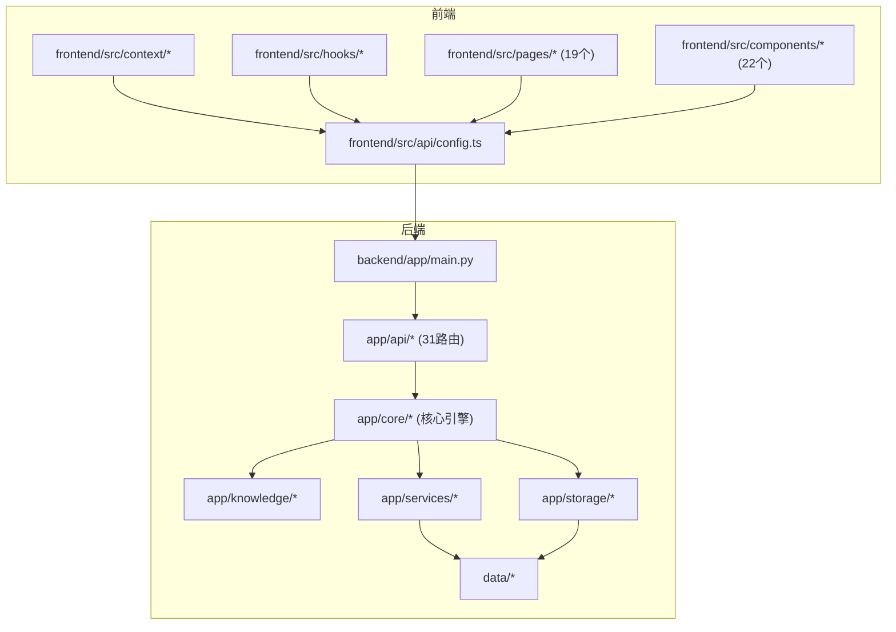
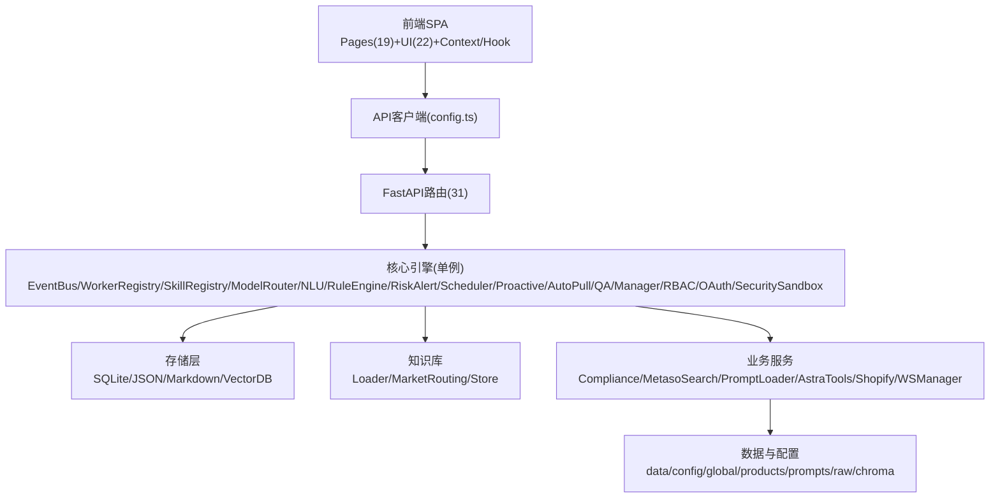
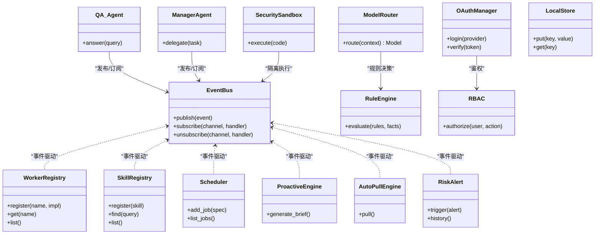
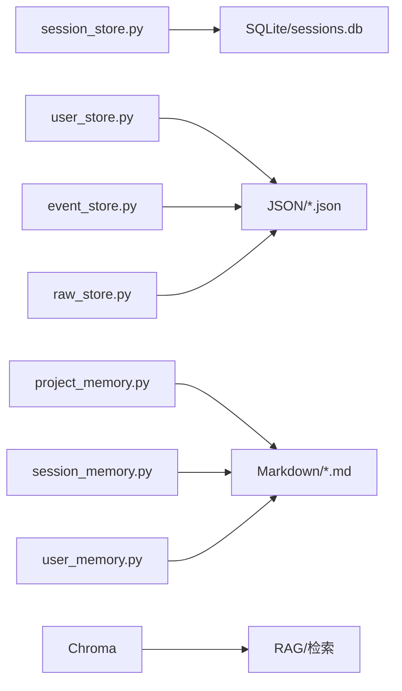
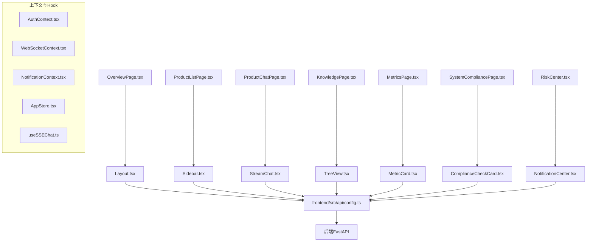
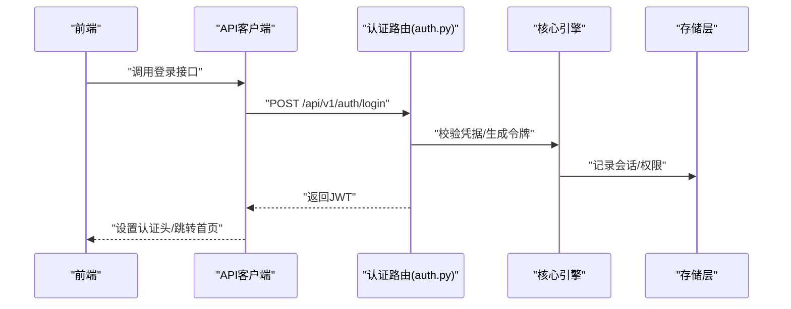
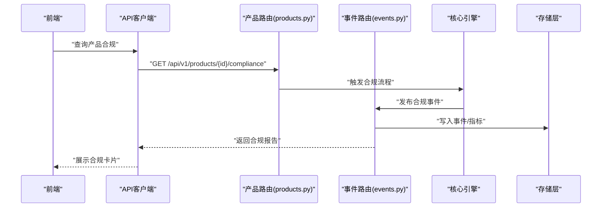
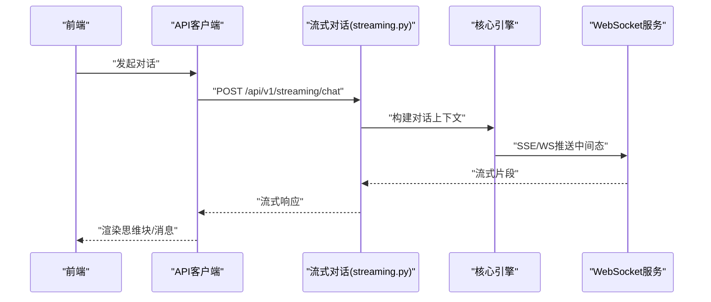
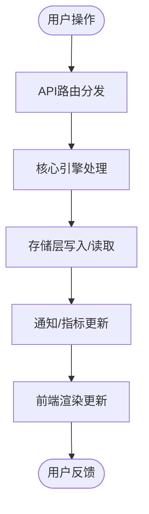
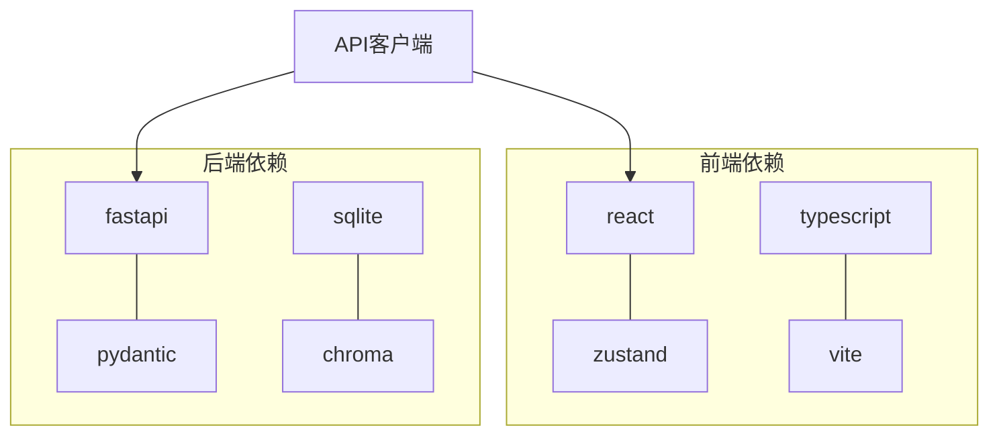

# 系统组件

<cite>
**本文引用的文件**
- [后端API文档.md](file://后端api.md)
- [前后端API交互.md](file://前后端api交互.md)
- [backend/app/main.py](file://backend/app/main.py)
- [backend/app/api/auth.py](file://backend/app/api/auth.py)
- [backend/app/api/users.py](file://backend/app/api/users.py)
- [backend/app/api/products.py](file://backend/app/api/products.py)
- [backend/app/api/events.py](file://backend/app/api/events.py)
- [backend/app/api/pipeline.py](file://backend/app/api/pipeline.py)
- [backend/app/api/notifications.py](file://backend/app/api/notifications.py)
- [backend/app/api/cli.py](file://backend/app/api/cli.py)
- [backend/app/api/rag.py](file://backend/app/api/rag.py)
- [backend/app/api/memory.py](file://backend/app/api/memory.py)
- [backend/app/api/metrics.py](file://backend/app/api/metrics.py)
- [backend/app/api/streaming.py](file://backend/app/api/streaming.py)
- [backend/app/api/skills.py](file://backend/app/api/skills.py)
- [backend/app/api/plugins.py](file://backend/app/api/plugins.py)
- [backend/app/api/integrations.py](file://backend/app/api/integrations.py)
- [backend/app/api/code_security.py](file://backend/app/api/code_security.py)
- [backend/app/api/knowledge.py](file://backend/app/api/knowledge.py)
- [backend/app/api/admin.py](file://backend/app/api/admin.py)
- [backend/app/api/scheduler_config.py](file://backend/app/api/scheduler_config.py)
- [backend/app/api/model_config.py](file://backend/app/api/model_config.py)
- [backend/app/api/sdk_sessions.py](file://backend/app/api/sdk_sessions.py)
- [backend/app/api/shopify.py](file://backend/app/api/shopify.py)
- [backend/app/api/event_config.py](file://backend/app/api/event_config.py)
- [backend/app/api/worker_config.py](file://backend/app/api/worker_config.py)
- [backend/app/api/sessions.py](file://backend/app/api/sessions.py)
- [backend/app/api/risk.py](file://backend/app/api/risk.py)
- [backend/app/core/event_bus.py](file://backend/app/core/event_bus.py)
- [backend/app/core/worker_registry.py](file://backend/app/core/worker_registry.py)
- [backend/app/core/skill_registry.py](file://backend/app/core/skill_registry.py)
- [backend/app/core/model_router.py](file://backend/app/core/model_router.py)
- [backend/app/core/nlu.py](file://backend/app/core/nlu.py)
- [backend/app/core/rule_engine.py](file://backend/app/core/rule_engine.py)
- [backend/app/core/risk_alert.py](file://backend/app/core/risk_alert.py)
- [backend/app/core/scheduler.py](file://backend/app/core/scheduler.py)
- [backend/app/core/proactive_engine.py](file://backend/app/core/proactive_engine.py)
- [backend/app/core/auto_pull_engine.py](file://backend/app/core/auto_pull_engine.py)
- [backend/app/core/manager_agent.py](file://backend/app/core/manager_agent.py)
- [backend/app/core/qa_agent.py](file://backend/app/core/qa_agent.py)
- [backend/app/core/oauth_manager.py](file://backend/app/core/oauth_manager.py)
- [backend/app/core/rbac.py](file://backend/app/core/rbac.py)
- [backend/app/core/security_sandbox.py](file://backend/app/core/security_sandbox.py)
- [backend/app/core/local_store.py](file://backend/app/core/local_store.py)
- [backend/app/storage/session_store.py](file://backend/app/storage/session_store.py)
- [backend/app/storage/user_store.py](file://backend/app/storage/user_store.py)
- [backend/app/storage/event_store.py](file://backend/app/storage/event_store.py)
- [backend/app/storage/raw_store.py](file://backend/app/storage/raw_store.py)
- [backend/app/storage/project_memory.py](file://backend/app/storage/project_memory.py)
- [backend/app/storage/session_memory.py](file://backend/app/storage/session_memory.py)
- [backend/app/storage/user_memory.py](file://backend/app/storage/user_memory.py)
- [backend/app/knowledge/store.py](file://backend/app/knowledge/store.py)
- [backend/app/knowledge/market_routing.py](file://backend/app/knowledge/market_routing.py)
- [backend/app/knowledge/loader.py](file://backend/app/knowledge/loader.py)
- [backend/app/services/compliance.py](file://backend/app/services/compliance.py)
- [backend/app/services/metaso_search.py](file://backend/app/services/metaso_search.py)
- [backend/app/services/prompt_loader.py](file://backend/app/services/prompt_loader.py)
- [backend/app/services/astra_tools.py](file://backend/app/services/astra_tools.py)
- [backend/app/services/shopify.py](file://backend/app/services/shopify.py)
- [backend/app/services/ws_manager.py](file://backend/app/services/ws_manager.py)
- [backend/data/config/events/README.md](file://backend/data/config/events/README.md)
- [backend/data/config/workers/README.md](file://backend/data/config/workers/README.md)
- [backend/data/regulations.md](file://backend/data/regulations.md)
- [backend/data/vat_rates.json](file://backend/data/vat_rates.json)
- [backend/data/products/p_E2E测_1d642ce3/product.json](file://backend/data/products/p_E2E测_1d642ce3/product.json)
- [backend/data/global/metrics/custom_metrics.json](file://backend/data/global/metrics/custom_metrics.json)
- [backend/data/global/notifications/history.json](file://backend/data/global/notifications/history.json)
- [backend/data/global/products_index.json](file://backend/data/global/products_index.json)
- [backend/data/global/memory/global_memory.json](file://backend/data/global/memory/global_memory.json)
- [backend/data/global/events/bus.json](file://backend/data/global/events/bus.json)
- [backend/data/chroma/...](file://backend/data/chroma/...)
- [frontend/src/api/config.ts](file://frontend/src/api/config.ts)
- [frontend/src/App.tsx](file://frontend/src/App.tsx)
- [frontend/src/main.tsx](file://frontend/src/main.tsx)
- [frontend/src/context/AuthContext.tsx](file://frontend/src/context/AuthContext.tsx)
- [frontend/src/context/WebSocketContext.tsx](file://frontend/src/context/WebSocketContext.tsx)
- [frontend/src/context/NotificationContext.tsx](file://frontend/src/context/NotificationContext.tsx)
- [frontend/src/context/AppStore.tsx](file://frontend/src/context/AppStore.tsx)
- [frontend/src/hooks/useSSEChat.ts](file://frontend/src/hooks/useSSEChat.ts)
- [frontend/src/pages/OverviewPage.tsx](file://frontend/src/pages/OverviewPage.tsx)
- [frontend/src/pages/ProductListPage.tsx](file://frontend/src/pages/ProductListPage.tsx)
- [frontend/src/pages/ProductChatPage.tsx](file://frontend/src/pages/ProductChatPage.tsx)
- [frontend/src/pages/KnowledgePage.tsx](file://frontend/src/pages/KnowledgePage.tsx)
- [frontend/src/pages/MetricsPage.tsx](file://frontend/src/pages/MetricsPage.tsx)
- [frontend/src/pages/SystemCompliancePage.tsx](file://frontend/src/pages/SystemCompliancePage.tsx)
- [frontend/src/pages/RiskCenter.tsx](file://frontend/src/pages/RiskCenter.tsx)
- [frontend/src/pages/IntegrationPage.tsx](file://frontend/src/pages/IntegrationPage.tsx)
- [frontend/src/pages/UserManagePage.tsx](file://frontend/src/pages/UserManagePage.tsx)
- [frontend/src/pages/AgentMonitorPage.tsx](file://frontend/src/pages/AgentMonitorPage.tsx)
- [frontend/src/pages/MemoryTreePage.tsx](file://frontend/src/pages/MemoryTreePage.tsx)
- [frontend/src/pages/LoginPage.tsx](file://frontend/src/pages/LoginPage.tsx)
- [frontend/src/components/Layout.tsx](file://frontend/src/components/Layout.tsx)
- [frontend/src/components/Sidebar.tsx](file://frontend/src/components/Sidebar.tsx)
- [frontend/src/components/StreamChat.tsx](file://frontend/src/components/StreamChat.tsx)
- [frontend/src/components/StreamMessageRenderer.tsx](file://frontend/src/components/StreamMessageRenderer.tsx)
- [frontend/src/components/ThinkingBlock.tsx](file://frontend/src/components/ThinkingBlock.tsx)
- [frontend/src/components/ActionSuggestionCard.tsx](file://frontend/src/components/ActionSuggestionCard.tsx)
- [frontend/src/components/ComplianceCheckCard.tsx](file://frontend/src/components/ComplianceCheckCard.tsx)
- [frontend/src/components/DailyBrief.tsx](file://frontend/src/components/DailyBrief.tsx)
- [frontend/src/components/EventTimeline.tsx](file://frontend/src/components/EventTimeline.tsx)
- [frontend/src/components/ExecutionResult.tsx](file://frontend/src/components/ExecutionResult.tsx)
- [frontend/src/components/NotificationCenter.tsx](file://frontend/src/components/NotificationCenter.tsx)
- [frontend/src/components/PipelineNav.tsx](file://frontend/src/components/PipelineNav.tsx)
- [frontend/src/components/PlanBlock.tsx](file://frontend/src/components/PlanBlock.tsx)
- [frontend/src/components/ProductCard.tsx](file://frontend/src/components/ProductCard.tsx)
- [frontend/src/components/SkillEventBlock.tsx](file://frontend/src/components/SkillEventBlock.tsx)
- [frontend/src/components/SkillPanel.tsx](file://frontend/src/components/SkillPanel.tsx)
- [frontend/src/components/ToolPanel.tsx](file://frontend/src/components/ToolPanel.tsx)
- [frontend/src/components/memory/TreeView.tsx](file://frontend/src/components/memory/TreeView.tsx)
- [frontend/src/components/memory/MarkdownViewer.tsx](file://frontend/src/components/memory/MarkdownViewer.tsx)
- [frontend/src/components/metrics/MetricCard.tsx](file://frontend/src/components/metrics/MetricCard.tsx)
- [frontend/src/components/metrics/TrendChart.tsx](file://frontend/src/components/metrics/TrendChart.tsx)
- [frontend/package.json](file://frontend/package.json)
</cite>

## 目录
1. [简介](#简介)
2. [项目结构](#项目结构)
3. [核心组件](#核心组件)
4. [架构总览](#架构总览)
5. [详细组件分析](#详细组件分析)
6. [依赖分析](#依赖分析)
7. [性能考虑](#性能考虑)
8. [故障排查指南](#故障排查指南)
9. [结论](#结论)
10. [附录](#附录)

## 简介
避风港(ASTRA)平台是一个面向合规与智能体协作的企业级系统，采用前后端分离架构：后端基于FastAPI提供31个API路由模块，覆盖认证、用户、产品、事件、流水线、通知、CLI、RAG、记忆树、指标、流式对话、技能、插件、集成、代码安全、知识库、管理员、定时任务、模型配置、SDK会话、Shopify、事件配置、工位配置、会话与风控等完整业务域；前端基于React + TypeScript，提供19个页面组件与22个UI组件，并通过统一API客户端与后端交互。系统通过事件总线、工作器注册表、技能注册表、模型路由等核心引擎实现事件驱动与插件化扩展，结合多层存储（SQLite、JSON、Markdown、向量数据库Chroma）支撑知识库与产品记忆。

## 项目结构
- 后端 backend
  - app/api：31个API路由模块，按阶段/功能分组注册
  - app/core：核心引擎（事件总线、工作器/技能注册表、模型路由、NLU、规则引擎、风险告警、调度、主动引擎、自动拉取引擎、QA/管理智能体、RBAC、OAuth、安全沙箱、本地存储）
  - app/knowledge：知识库加载、市场路由、存储
  - app/services：业务服务（合规、Metaso检索、提示词加载、工具集、Shopify、WebSocket管理）
  - app/storage：分层存储（会话、用户、事件、原始数据、项目/会话/用户记忆）
  - data：配置、事件链、全球指标/通知/产品索引/内存、产品知识与事件、法规与增值税率、Prompts、同步作业与日志、Chroma向量库等
  - scripts/tests：初始化脚本、迁移脚本、测试规范与用例
- 前端 frontend
  - src：API客户端、上下文、自定义Hook、页面与UI组件、类型定义
  - 构建配置：Vite + TailwindCSS + TypeScript

图表来源
- [前后端API交互.md](file://前后端api交互.md)
- [后端API文档.md](file://后端api.md)
- [backend/app/main.py](file://backend/app/main.py)

章节来源
- [后端API文档.md](file://后端api.md)
- [前后端API交互.md](file://前后端api交互.md)
- [backend/app/main.py](file://backend/app/main.py)

## 核心组件
- API路由层（31个模块）
  - 认证与用户：auth.py、users.py
  - 产品与事件：products.py、events.py
  - 流水线与通知：pipeline.py、notifications.py
  - CLI与RAG：cli.py、rag.py
  - 记忆树与指标：memory.py、metrics.py
  - 流式对话：streaming.py
  - 技能与插件：skills.py、plugins.py
  - 集成与代码安全：integrations.py、code_security.py
  - 知识库与管理员：knowledge.py、admin.py
  - 定时任务与模型配置：scheduler_config.py、model_config.py
  - SDK会话与Shopify：sdk_sessions.py、shopify.py
  - 事件配置与工位配置：event_config.py、worker_config.py
  - 会话与风控：sessions.py、risk.py
- 核心引擎（单例/注册表/路由）
  - 事件总线：event_bus.py
  - 工作器注册表：worker_registry.py
  - 技能注册表：skill_registry.py
  - 模型路由：model_router.py
  - NLU：nlu.py
  - 规则引擎：rule_engine.py
  - 风险告警：risk_alert.py
  - 调度：scheduler.py
  - 主动引擎：proactive_engine.py
  - 自动拉取引擎：auto_pull_engine.py
  - QA/管理智能体：qa_agent.py、manager_agent.py
  - RBAC/OAuth/安全沙箱：rbac.py、oauth_manager.py、security_sandbox.py
  - 本地存储：local_store.py
- 存储层
  - 会话/用户/事件/原始数据/项目/会话/用户记忆：session_store.py、user_store.py、event_store.py、raw_store.py、project_memory.py、session_memory.py、user_memory.py
- 知识库
  - store.py、market_routing.py、loader.py
- 业务服务
  - compliance.py、metaso_search.py、prompt_loader.py、astra_tools.py、shopify.py、ws_manager.py
- 数据与配置
  - data/config、data/global、data/products、data/prompts、data/raw、data/chroma 等

章节来源
- [后端API文档.md](file://后端api.md)
- [backend/app/api/auth.py](file://backend/app/api/auth.py)
- [backend/app/api/users.py](file://backend/app/api/users.py)
- [backend/app/api/products.py](file://backend/app/api/products.py)
- [backend/app/api/events.py](file://backend/app/api/events.py)
- [backend/app/api/pipeline.py](file://backend/app/api/pipeline.py)
- [backend/app/api/notifications.py](file://backend/app/api/notifications.py)
- [backend/app/api/cli.py](file://backend/app/api/cli.py)
- [backend/app/api/rag.py](file://backend/app/api/rag.py)
- [backend/app/api/memory.py](file://backend/app/api/memory.py)
- [backend/app/api/metrics.py](file://backend/app/api/metrics.py)
- [backend/app/api/streaming.py](file://backend/app/api/streaming.py)
- [backend/app/api/skills.py](file://backend/app/api/skills.py)
- [backend/app/api/plugins.py](file://backend/app/api/plugins.py)
- [backend/app/api/integrations.py](file://backend/app/api/integrations.py)
- [backend/app/api/code_security.py](file://backend/app/api/code_security.py)
- [backend/app/api/knowledge.py](file://backend/app/api/knowledge.py)
- [backend/app/api/admin.py](file://backend/app/api/admin.py)
- [backend/app/api/scheduler_config.py](file://backend/app/api/scheduler_config.py)
- [backend/app/api/model_config.py](file://backend/app/api/model_config.py)
- [backend/app/api/sdk_sessions.py](file://backend/app/api/sdk_sessions.py)
- [backend/app/api/shopify.py](file://backend/app/api/shopify.py)
- [backend/app/api/event_config.py](file://backend/app/api/event_config.py)
- [backend/app/api/worker_config.py](file://backend/app/api/worker_config.py)
- [backend/app/api/sessions.py](file://backend/app/api/sessions.py)
- [backend/app/api/risk.py](file://backend/app/api/risk.py)
- [backend/app/core/event_bus.py](file://backend/app/core/event_bus.py)
- [backend/app/core/worker_registry.py](file://backend/app/core/worker_registry.py)
- [backend/app/core/skill_registry.py](file://backend/app/core/skill_registry.py)
- [backend/app/core/model_router.py](file://backend/app/core/model_router.py)
- [backend/app/core/nlu.py](file://backend/app/core/nlu.py)
- [backend/app/core/rule_engine.py](file://backend/app/core/rule_engine.py)
- [backend/app/core/risk_alert.py](file://backend/app/core/risk_alert.py)
- [backend/app/core/scheduler.py](file://backend/app/core/scheduler.py)
- [backend/app/core/proactive_engine.py](file://backend/app/core/proactive_engine.py)
- [backend/app/core/auto_pull_engine.py](file://backend/app/core/auto_pull_engine.py)
- [backend/app/core/manager_agent.py](file://backend/app/core/manager_agent.py)
- [backend/app/core/qa_agent.py](file://backend/app/core/qa_agent.py)
- [backend/app/core/oauth_manager.py](file://backend/app/core/oauth_manager.py)
- [backend/app/core/rbac.py](file://backend/app/core/rbac.py)
- [backend/app/core/security_sandbox.py](file://backend/app/core/security_sandbox.py)
- [backend/app/core/local_store.py](file://backend/app/core/local_store.py)
- [backend/app/storage/session_store.py](file://backend/app/storage/session_store.py)
- [backend/app/storage/user_store.py](file://backend/app/storage/user_store.py)
- [backend/app/storage/event_store.py](file://backend/app/storage/event_store.py)
- [backend/app/storage/raw_store.py](file://backend/app/storage/raw_store.py)
- [backend/app/storage/project_memory.py](file://backend/app/storage/project_memory.py)
- [backend/app/storage/session_memory.py](file://backend/app/storage/session_memory.py)
- [backend/app/storage/user_memory.py](file://backend/app/storage/user_memory.py)
- [backend/app/knowledge/store.py](file://backend/app/knowledge/store.py)
- [backend/app/knowledge/market_routing.py](file://backend/app/knowledge/market_routing.py)
- [backend/app/knowledge/loader.py](file://backend/app/knowledge/loader.py)
- [backend/app/services/compliance.py](file://backend/app/services/compliance.py)
- [backend/app/services/metaso_search.py](file://backend/app/services/metaso_search.py)
- [backend/app/services/prompt_loader.py](file://backend/app/services/prompt_loader.py)
- [backend/app/services/astra_tools.py](file://backend/app/services/astra_tools.py)
- [backend/app/services/shopify.py](file://backend/app/services/shopify.py)
- [backend/app/services/ws_manager.py](file://backend/app/services/ws_manager.py)

## 架构总览
系统采用“API路由层 -> 核心引擎层 -> 存储层”的三层架构，配合前端SPA通过HTTP/SSE/WebSocket与后端交互。核心设计模式包括：
- 单例模式：事件总线、工作器/技能注册表、模型路由、各类智能体与管理器
- 依赖注入：通过主应用入口集中装配核心引擎与服务
- 事件驱动：以事件总线为核心的消息传递与编排
- 插件化架构：技能/插件/工作器注册表支持动态扩展

图表来源
- [前后端API交互.md](file://前后端api交互.md)
- [后端API文档.md](file://后端api.md)
- [frontend/src/api/config.ts](file://frontend/src/api/config.ts)
- [backend/app/main.py](file://backend/app/main.py)

## 详细组件分析

### API路由模块与职责
- 认证与用户：提供登录、令牌校验、用户信息管理
- 产品与事件：产品生命周期与事件编排
- 流水线与通知：工作流编排与通知下发
- CLI与RAG：命令行接口与检索增强生成
- 记忆树与指标：产品记忆树与全局指标
- 流式对话：SSE流式响应
- 技能与插件：技能管理与插件扩展
- 集成与代码安全：第三方集成与代码安全扫描
- 知识库与管理员：知识库维护与后台管理
- 定时任务与模型配置：任务调度与模型路由配置
- SDK会话与Shopify：SDK会话与电商集成
- 事件配置与工位配置：事件链与工作器绑定
- 会话与风控：会话管理与风险控制

章节来源
- [后端API文档.md](file://后端api.md)
- [backend/app/api/auth.py](file://backend/app/api/auth.py)
- [backend/app/api/users.py](file://backend/app/api/users.py)
- [backend/app/api/products.py](file://backend/app/api/products.py)
- [backend/app/api/events.py](file://backend/app/api/events.py)
- [backend/app/api/pipeline.py](file://backend/app/api/pipeline.py)
- [backend/app/api/notifications.py](file://backend/app/api/notifications.py)
- [backend/app/api/cli.py](file://backend/app/api/cli.py)
- [backend/app/api/rag.py](file://backend/app/api/rag.py)
- [backend/app/api/memory.py](file://backend/app/api/memory.py)
- [backend/app/api/metrics.py](file://backend/app/api/metrics.py)
- [backend/app/api/streaming.py](file://backend/app/api/streaming.py)
- [backend/app/api/skills.py](file://backend/app/api/skills.py)
- [backend/app/api/plugins.py](file://backend/app/api/plugins.py)
- [backend/app/api/integrations.py](file://backend/app/api/integrations.py)
- [backend/app/api/code_security.py](file://backend/app/api/code_security.py)
- [backend/app/api/knowledge.py](file://backend/app/api/knowledge.py)
- [backend/app/api/admin.py](file://backend/app/api/admin.py)
- [backend/app/api/scheduler_config.py](file://backend/app/api/scheduler_config.py)
- [backend/app/api/model_config.py](file://backend/app/api/model_config.py)
- [backend/app/api/sdk_sessions.py](file://backend/app/api/sdk_sessions.py)
- [backend/app/api/shopify.py](file://backend/app/api/shopify.py)
- [backend/app/api/event_config.py](file://backend/app/api/event_config.py)
- [backend/app/api/worker_config.py](file://backend/app/api/worker_config.py)
- [backend/app/api/sessions.py](file://backend/app/api/sessions.py)
- [backend/app/api/risk.py](file://backend/app/api/risk.py)

### 核心引擎与设计模式
- 事件总线：集中式事件分发与订阅
- 注册表：工作器/技能注册表实现插件化扩展
- 模型路由：根据场景选择合适模型
- NLU：自然语言理解与意图识别
- 规则引擎：业务规则编排与执行
- 风险告警：实时风险检测与预警
- 调度：定时任务与工作器绑定
- 主动引擎：基于策略的主动提醒
- 自动拉取引擎：周期性知识/数据拉取
- 智能体：QA/管理智能体负责对话与决策
- RBAC/OAuth/安全沙箱：权限与安全控制
- 本地存储：轻量数据持久化

图表来源
- [backend/app/core/event_bus.py](file://backend/app/core/event_bus.py)
- [backend/app/core/worker_registry.py](file://backend/app/core/worker_registry.py)
- [backend/app/core/skill_registry.py](file://backend/app/core/skill_registry.py)
- [backend/app/core/model_router.py](file://backend/app/core/model_router.py)
- [backend/app/core/rule_engine.py](file://backend/app/core/rule_engine.py)
- [backend/app/core/risk_alert.py](file://backend/app/core/risk_alert.py)
- [backend/app/core/scheduler.py](file://backend/app/core/scheduler.py)
- [backend/app/core/proactive_engine.py](file://backend/app/core/proactive_engine.py)
- [backend/app/core/auto_pull_engine.py](file://backend/app/core/auto_pull_engine.py)
- [backend/app/core/qa_agent.py](file://backend/app/core/qa_agent.py)
- [backend/app/core/manager_agent.py](file://backend/app/core/manager_agent.py)
- [backend/app/core/rbac.py](file://backend/app/core/rbac.py)
- [backend/app/core/oauth_manager.py](file://backend/app/core/oauth_manager.py)
- [backend/app/core/security_sandbox.py](file://backend/app/core/security_sandbox.py)
- [backend/app/core/local_store.py](file://backend/app/core/local_store.py)

章节来源
- [backend/app/core/event_bus.py](file://backend/app/core/event_bus.py)
- [backend/app/core/worker_registry.py](file://backend/app/core/worker_registry.py)
- [backend/app/core/skill_registry.py](file://backend/app/core/skill_registry.py)
- [backend/app/core/model_router.py](file://backend/app/core/model_router.py)
- [backend/app/core/nlu.py](file://backend/app/core/nlu.py)
- [backend/app/core/rule_engine.py](file://backend/app/core/rule_engine.py)
- [backend/app/core/risk_alert.py](file://backend/app/core/risk_alert.py)
- [backend/app/core/scheduler.py](file://backend/app/core/scheduler.py)
- [backend/app/core/proactive_engine.py](file://backend/app/core/proactive_engine.py)
- [backend/app/core/auto_pull_engine.py](file://backend/app/core/auto_pull_engine.py)
- [backend/app/core/manager_agent.py](file://backend/app/core/manager_agent.py)
- [backend/app/core/qa_agent.py](file://backend/app/core/qa_agent.py)
- [backend/app/core/oauth_manager.py](file://backend/app/core/oauth_manager.py)
- [backend/app/core/rbac.py](file://backend/app/core/rbac.py)
- [backend/app/core/security_sandbox.py](file://backend/app/core/security_sandbox.py)
- [backend/app/core/local_store.py](file://backend/app/core/local_store.py)

### 存储层与数据模型
- 会话/用户/事件/原始数据/项目/会话/用户记忆：统一的存储抽象，支持JSON/Markdown/SQLite/向量数据库
- 全球指标/通知/产品索引/内存：跨产品共享的数据
- 产品知识与事件：每个产品的独立知识与事件链
- Prompts与配置：提示词与系统配置
- 向量数据库：Chroma支撑RAG与检索

图表来源
- [backend/app/storage/session_store.py](file://backend/app/storage/session_store.py)
- [backend/app/storage/user_store.py](file://backend/app/storage/user_store.py)
- [backend/app/storage/event_store.py](file://backend/app/storage/event_store.py)
- [backend/app/storage/raw_store.py](file://backend/app/storage/raw_store.py)
- [backend/app/storage/project_memory.py](file://backend/app/storage/project_memory.py)
- [backend/app/storage/session_memory.py](file://backend/app/storage/session_memory.py)
- [backend/app/storage/user_memory.py](file://backend/app/storage/user_memory.py)
- [backend/data/chroma/...](file://backend/data/chroma/...)

章节来源
- [backend/app/storage/session_store.py](file://backend/app/storage/session_store.py)
- [backend/app/storage/user_store.py](file://backend/app/storage/user_store.py)
- [backend/app/storage/event_store.py](file://backend/app/storage/event_store.py)
- [backend/app/storage/raw_store.py](file://backend/app/storage/raw_store.py)
- [backend/app/storage/project_memory.py](file://backend/app/storage/project_memory.py)
- [backend/app/storage/session_memory.py](file://backend/app/storage/session_memory.py)
- [backend/app/storage/user_memory.py](file://backend/app/storage/user_memory.py)
- [backend/data/chroma/...](file://backend/data/chroma/...)

### 前端组件与交互
- 页面组件（19个）：概览、产品列表/聊天、知识库、指标、合规、风险中心、集成、用户管理、代理监控、记忆树、登录等
- UI组件（22个）：布局、侧边栏、聊天、思维块、建议卡片、合规检查、事件时间线、执行结果、通知中心、管道导航、计划块、产品卡片、技能面板、工具面板、指标卡、趋势图、记忆树视图、Markdown查看器等
- 上下文与Hook：认证、WebSocket、通知、应用状态、SSE聊天
- API客户端：统一请求封装与路由映射

图表来源
- [前后端API交互.md](file://前后端api交互.md)
- [frontend/src/pages/OverviewPage.tsx](file://frontend/src/pages/OverviewPage.tsx)
- [frontend/src/pages/ProductListPage.tsx](file://frontend/src/pages/ProductListPage.tsx)
- [frontend/src/pages/ProductChatPage.tsx](file://frontend/src/pages/ProductChatPage.tsx)
- [frontend/src/pages/KnowledgePage.tsx](file://frontend/src/pages/KnowledgePage.tsx)
- [frontend/src/pages/MetricsPage.tsx](file://frontend/src/pages/MetricsPage.tsx)
- [frontend/src/pages/SystemCompliancePage.tsx](file://frontend/src/pages/SystemCompliancePage.tsx)
- [frontend/src/pages/RiskCenter.tsx](file://frontend/src/pages/RiskCenter.tsx)
- [frontend/src/components/Layout.tsx](file://frontend/src/components/Layout.tsx)
- [frontend/src/components/Sidebar.tsx](file://frontend/src/components/Sidebar.tsx)
- [frontend/src/components/StreamChat.tsx](file://frontend/src/components/StreamChat.tsx)
- [frontend/src/components/TreeView.tsx](file://frontend/src/components/TreeView.tsx)
- [frontend/src/components/metrics/MetricCard.tsx](file://frontend/src/components/metrics/MetricCard.tsx)
- [frontend/src/components/ComplianceCheckCard.tsx](file://frontend/src/components/ComplianceCheckCard.tsx)
- [frontend/src/components/NotificationCenter.tsx](file://frontend/src/components/NotificationCenter.tsx)
- [frontend/src/context/AuthContext.tsx](file://frontend/src/context/AuthContext.tsx)
- [frontend/src/context/WebSocketContext.tsx](file://frontend/src/context/WebSocketContext.tsx)
- [frontend/src/context/NotificationContext.tsx](file://frontend/src/context/NotificationContext.tsx)
- [frontend/src/context/AppStore.tsx](file://frontend/src/context/AppStore.tsx)
- [frontend/src/hooks/useSSEChat.ts](file://frontend/src/hooks/useSSEChat.ts)
- [frontend/src/api/config.ts](file://frontend/src/api/config.ts)

章节来源
- [frontend/src/pages/OverviewPage.tsx](file://frontend/src/pages/OverviewPage.tsx)
- [frontend/src/pages/ProductListPage.tsx](file://frontend/src/pages/ProductListPage.tsx)
- [frontend/src/pages/ProductChatPage.tsx](file://frontend/src/pages/ProductChatPage.tsx)
- [frontend/src/pages/KnowledgePage.tsx](file://frontend/src/pages/KnowledgePage.tsx)
- [frontend/src/pages/MetricsPage.tsx](file://frontend/src/pages/MetricsPage.tsx)
- [frontend/src/pages/SystemCompliancePage.tsx](file://frontend/src/pages/SystemCompliancePage.tsx)
- [frontend/src/pages/RiskCenter.tsx](file://frontend/src/pages/RiskCenter.tsx)
- [frontend/src/components/Layout.tsx](file://frontend/src/components/Layout.tsx)
- [frontend/src/components/Sidebar.tsx](file://frontend/src/components/Sidebar.tsx)
- [frontend/src/components/StreamChat.tsx](file://frontend/src/components/StreamChat.tsx)
- [frontend/src/components/TreeView.tsx](file://frontend/src/components/TreeView.tsx)
- [frontend/src/components/metrics/MetricCard.tsx](file://frontend/src/components/metrics/MetricCard.tsx)
- [frontend/src/components/ComplianceCheckCard.tsx](file://frontend/src/components/ComplianceCheckCard.tsx)
- [frontend/src/components/NotificationCenter.tsx](file://frontend/src/components/NotificationCenter.tsx)
- [frontend/src/context/AuthContext.tsx](file://frontend/src/context/AuthContext.tsx)
- [frontend/src/context/WebSocketContext.tsx](file://frontend/src/context/WebSocketContext.tsx)
- [frontend/src/context/NotificationContext.tsx](file://frontend/src/context/NotificationContext.tsx)
- [frontend/src/context/AppStore.tsx](file://frontend/src/context/AppStore.tsx)
- [frontend/src/hooks/useSSEChat.ts](file://frontend/src/hooks/useSSEChat.ts)
- [frontend/src/api/config.ts](file://frontend/src/api/config.ts)

### 关键流程与时序图

#### 用户登录与会话建立

图表来源
- [frontend/src/api/config.ts](file://frontend/src/api/config.ts)
- [backend/app/api/auth.py](file://backend/app/api/auth.py)
- [backend/app/core/rbac.py](file://backend/app/core/rbac.py)
- [backend/app/storage/session_store.py](file://backend/app/storage/session_store.py)

#### 产品合规检查与事件编排

图表来源
- [frontend/src/api/config.ts](file://frontend/src/api/config.ts)
- [backend/app/api/products.py](file://backend/app/api/products.py)
- [backend/app/api/events.py](file://backend/app/api/events.py)
- [backend/app/core/rule_engine.py](file://backend/app/core/rule_engine.py)
- [backend/app/storage/event_store.py](file://backend/app/storage/event_store.py)

#### 流式对话与思维块渲染

图表来源
- [frontend/src/api/config.ts](file://frontend/src/api/config.ts)
- [frontend/src/components/StreamChat.tsx](file://frontend/src/components/StreamChat.tsx)
- [frontend/src/components/StreamMessageRenderer.tsx](file://frontend/src/components/StreamMessageRenderer.tsx)
- [frontend/src/components/ThinkingBlock.tsx](file://frontend/src/components/ThinkingBlock.tsx)
- [backend/app/api/streaming.py](file://backend/app/api/streaming.py)
- [backend/app/services/ws_manager.py](file://backend/app/services/ws_manager.py)

### 数据流图

图表来源
- [backend/app/main.py](file://backend/app/main.py)
- [backend/app/core/event_bus.py](file://backend/app/core/event_bus.py)
- [backend/app/storage/session_store.py](file://backend/app/storage/session_store.py)
- [frontend/src/api/config.ts](file://frontend/src/api/config.ts)

## 依赖分析
- 组件内聚与耦合
  - API路由模块相对独立，通过核心引擎进行解耦
  - 核心引擎内部通过事件总线低耦合交互
  - 存储层对上层透明，便于替换实现
- 外部依赖
  - 前端：React、Zustand、TailwindCSS、TypeScript、Vite
  - 后端：FastAPI、Pydantic、SQLite、Chroma、JSON/Markdown文件系统
- 配置与扩展点
  - 事件配置、工作器绑定、技能注册表、模型路由配置位于data/config
  - 事件链与系统事件位于data/chains与data/event_chain

图表来源
- [frontend/package.json](file://frontend/package.json)
- [前后端API交互.md](file://前后端api交互.md)

章节来源
- [frontend/package.json](file://frontend/package.json)
- [前后端API交互.md](file://前后端api交互.md)
- [backend/data/config/events/README.md](file://backend/data/config/events/README.md)
- [backend/data/config/workers/README.md](file://backend/data/config/workers/README.md)

## 性能考虑
- 事件驱动与异步：通过事件总线与SSE/WS降低阻塞，提升并发
- 缓存与索引：利用Chroma向量检索与JSON/Markdown索引加速查询
- 存储分层：会话/用户/事件等热点数据走SQLite，大文本走文件系统
- 规则与调度：规则引擎与调度器按需执行，避免全量扫描
- 前端状态：Zustand轻量状态管理，减少重渲染

## 故障排查指南
- API端点缺失或404
  - 使用测试用例验证前端声明的端点是否在后端注册
  - 参考测试用例中的端点清单与状态码断言
- 认证失败
  - 检查JWT令牌生成与校验逻辑，确认中间件配置
- 流式对话无响应
  - 检查WebSocket服务与SSE通道状态
- 存储异常
  - 核对JSON/Markdown文件权限与路径，确认Chroma可用性
- 事件链不生效
  - 检查事件配置与事件总线订阅关系

章节来源
- [backend/tests/test_full_business_flow.py](file://backend/tests/test_full_business_flow.py)
- [backend/app/api/auth.py](file://backend/app/api/auth.py)
- [backend/app/services/ws_manager.py](file://backend/app/services/ws_manager.py)
- [backend/app/storage/session_store.py](file://backend/app/storage/session_store.py)
- [backend/data/global/events/bus.json](file://backend/data/global/events/bus.json)

## 结论
ASTRA平台通过清晰的分层架构与事件驱动设计，实现了从API路由到核心引擎再到存储层的高内聚低耦合。前端以统一API客户端与后端交互，结合上下文与Hook实现状态与行为的解耦。系统支持插件化扩展（技能/插件/工作器），并通过配置与事件链实现灵活的业务编排。建议在扩展新能力时遵循现有模式（单例、依赖注入、事件驱动、插件化），并在数据流与存储策略上保持一致性。

## 附录
- 数据与配置要点
  - 全局指标/通知/产品索引/内存：位于global目录
  - 产品知识与事件：位于products/<pid>目录
  - 事件链与系统事件：位于chains与event_chain/system_events
  - 向量数据库：位于data/chroma
  - 法规与增值税率：位于data/regulations.md与data/vat_rates.json
- 扩展与定制化
  - 新增API路由：在app/api下新增模块并在main.py注册
  - 新增核心引擎：在app/core添加类并注入到主应用
  - 新增存储适配：在app/storage实现适配器并接入核心引擎
  - 新增前端页面/组件：在frontend/src/pages与components中添加，通过API客户端对接后端

章节来源
- [backend/data/global/metrics/custom_metrics.json](file://backend/data/global/metrics/custom_metrics.json)
- [backend/data/global/notifications/history.json](file://backend/data/global/notifications/history.json)
- [backend/data/global/products_index.json](file://backend/data/global/products_index.json)
- [backend/data/global/memory/global_memory.json](file://backend/data/global/memory/global_memory.json)
- [backend/data/global/events/bus.json](file://backend/data/global/events/bus.json)
- [backend/data/chroma/...](file://backend/data/chroma/...)
- [backend/data/regulations.md](file://backend/data/regulations.md)
- [backend/data/vat_rates.json](file://backend/data/vat_rates.json)
- [backend/data/products/p_E2E测_1d642ce3/product.json](file://backend/data/products/p_E2E测_1d642ce3/product.json)
- [backend/data/chains/actions/...](file://backend/data/chains/actions/...)
- [backend/data/event_chain/system_events/...](file://backend/data/event_chain/system_events/...)
- [backend/app/main.py](file://backend/app/main.py)