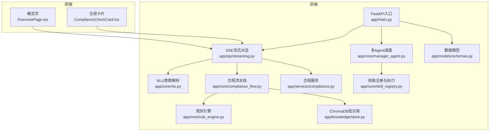
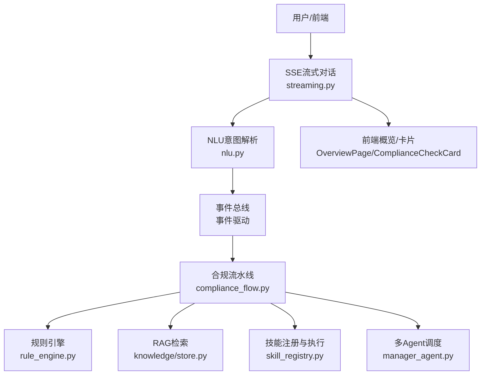
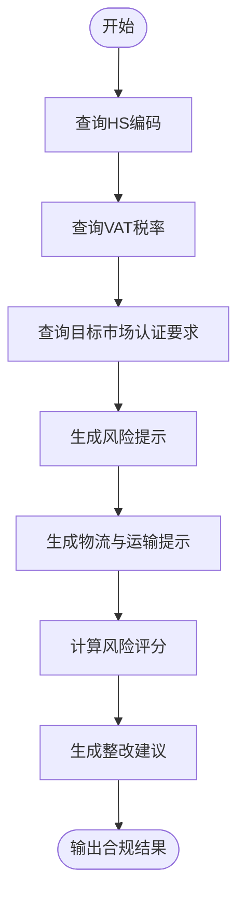
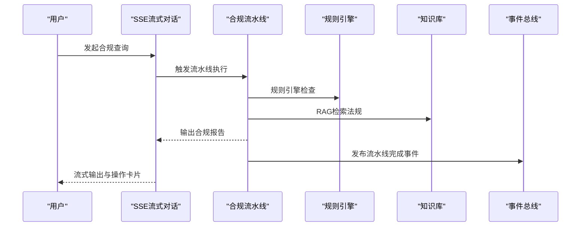
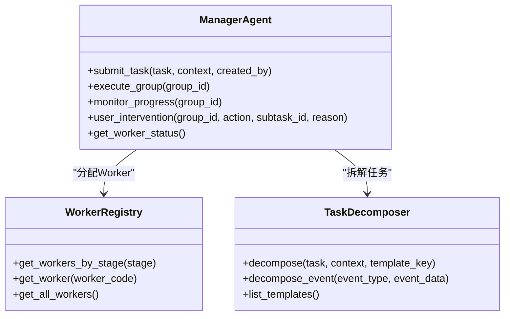
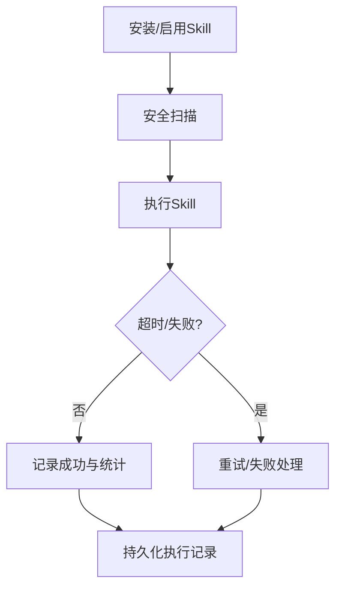
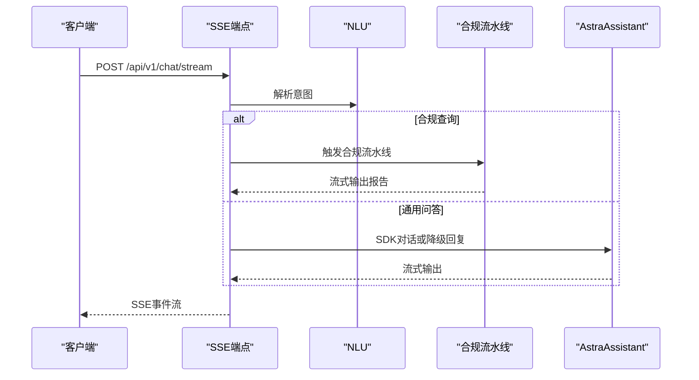
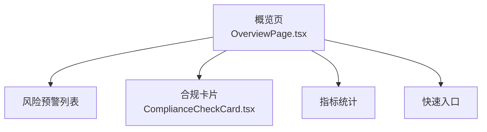
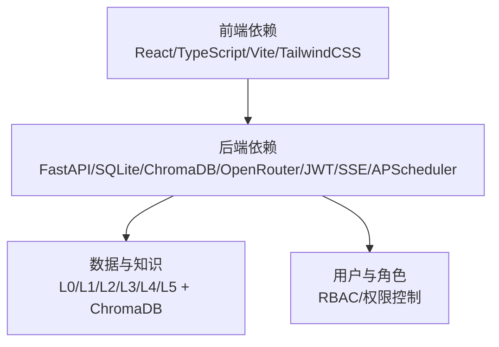

# 项目介绍

<cite>
**本文引用的文件**
- [README.md](file://README.md)
- [backend/app/main.py](file://backend/app/main.py)
- [backend/app/core/rule_engine.py](file://backend/app/core/rule_engine.py)
- [backend/app/core/compliance_flow.py](file://backend/app/core/compliance_flow.py)
- [backend/app/services/compliance.py](file://backend/app/services/compliance.py)
- [backend/app/core/nlu.py](file://backend/app/core/nlu.py)
- [backend/app/core/manager_agent.py](file://backend/app/core/manager_agent.py)
- [backend/app/core/skill_registry.py](file://backend/app/core/skill_registry.py)
- [backend/app/knowledge/store.py](file://backend/app/knowledge/store.py)
- [backend/data/regulations.md](file://backend/data/regulations.md)
- [frontend/src/pages/OverviewPage.tsx](file://frontend/src/pages/OverviewPage.tsx)
- [frontend/src/components/ComplianceCheckCard.tsx](file://frontend/src/components/ComplianceCheckCard.tsx)
- [backend/app/api/streaming.py](file://backend/app/api/streaming.py)
- [backend/app/models/schemas.py](file://backend/app/models/schemas.py)
</cite>

## 目录
1. [项目简介](#项目简介)
2. [项目结构](#项目结构)
3. [核心组件](#核心组件)
4. [架构总览](#架构总览)
5. [详细组件分析](#详细组件分析)
6. [依赖关系分析](#依赖关系分析)
7. [性能考量](#性能考量)
8. [故障排查指南](#故障排查指南)
9. [结论](#结论)
10. [附录](#附录)

## 项目简介
避风港（ASTRA）合规智能体平台面向中小出海企业，致力于将传统昂贵的跨境电商合规服务转化为低成本、全链路、可解释的数字化解决方案。平台通过“规则引擎 + 大模型（LLM）+ 多Agent协同”的混合推理架构，覆盖产品出海全生命周期的合规需求，帮助企业在合规成本高、专业人才稀缺、法规更新频繁的环境中实现降本增效。

- 核心价值主张
  - 低成本：将昂贵的人工合规服务转化为普惠型智能体平台
  - 全链路：从选品、上架、订单到清关、售后的全流程合规
  - 可解释：规则引擎提供确定性检查，LLM提供灵活问答，Agent协同保证可追溯
- 目标用户：中小跨境电商企业
- 解决痛点：合规成本高、专业合规人员短缺、法规频繁更新带来的不确定性
- 技术亮点：事件驱动 + 多Agent + 记忆树 + TokenJuice + QAAgent 的OS级合规流水线

**章节来源**
- [README.md:1-180](file://README.md#L1-L180)

## 项目结构
后端采用FastAPI，前端采用React 18 + TypeScript，核心模块包括：
- API层：27个REST路由模块，覆盖认证、对话、产品、事件、Shopify集成、Agent调度、技能扩展、RAG、记忆、调度、管理等
- 核心引擎：NLU、规则引擎、合规流水线、事件总线、调度器、通知引擎、OAuth、安全沙箱、技能注册表、Worker注册表等
- 业务服务：合规编排、Shopify对接、搜索与检索等
- 存储与知识：分层存储（L0-L5）、ChromaDB向量知识库、会话与项目记忆
- 前端SPA：概览、产品管理、合规总览、配置中心、风险中心等页面

**图表来源**
- [backend/app/main.py:1-215](file://backend/app/main.py#L1-L215)
- [backend/app/api/streaming.py:1-744](file://backend/app/api/streaming.py#L1-L744)
- [backend/app/core/rule_engine.py:1-247](file://backend/app/core/rule_engine.py#L1-L247)
- [backend/app/core/compliance_flow.py:1-473](file://backend/app/core/compliance_flow.py#L1-L473)
- [backend/app/services/compliance.py:1-296](file://backend/app/services/compliance.py#L1-L296)
- [backend/app/core/nlu.py:1-394](file://backend/app/core/nlu.py#L1-L394)
- [backend/app/core/manager_agent.py:1-729](file://backend/app/core/manager_agent.py#L1-L729)
- [backend/app/core/skill_registry.py:1-967](file://backend/app/core/skill_registry.py#L1-L967)
- [backend/app/knowledge/store.py:1-227](file://backend/app/knowledge/store.py#L1-L227)
- [frontend/src/pages/OverviewPage.tsx:1-316](file://frontend/src/pages/OverviewPage.tsx#L1-L316)
- [frontend/src/components/ComplianceCheckCard.tsx:1-91](file://frontend/src/components/ComplianceCheckCard.tsx#L1-L91)

**章节来源**
- [README.md:37-132](file://README.md#L37-L132)
- [backend/app/main.py:21-104](file://backend/app/main.py#L21-L104)

## 核心组件
- 规则引擎（RuleEngine）：基于L0层数据（HS编码、VAT、认证矩阵）进行确定性合规检查，提供风险评分与整改建议
- NLU意图解析：从用户消息中抽取产品、目标国家、动作类型，映射到业务阶段与事件类型，推荐可用Skills
- 合规流水线（6步闭环）：感知 → 检查（规则+RAG）→ 推荐 → 告知 → 交互 → 处理，支持5步/6步模式
- 多Agent调度（ManagerAgent）：任务拆解、Worker分配、并行执行、失败重试、用户干预与群聊式进度跟踪
- 技能注册与执行（SkillRegistry/SkillExecutor）：内置与自定义Skills生态，支持安全扫描与超时控制
- SSE流式对话（Streaming）：统一对话入口，支持合规查询与通用问答，事件驱动与Agent SDK联动
- ChromaDB知识库：按市场分集合的向量检索，支持多语言查询与降级容错
- 前端概览与合规卡片：展示合规通过率、风险预警、快速入口与合规检查卡片

**章节来源**
- [backend/app/core/rule_engine.py:197-247](file://backend/app/core/rule_engine.py#L197-L247)
- [backend/app/core/nlu.py:113-212](file://backend/app/core/nlu.py#L113-L212)
- [backend/app/core/compliance_flow.py:33-126](file://backend/app/core/compliance_flow.py#L33-L126)
- [backend/app/core/manager_agent.py:117-248](file://backend/app/core/manager_agent.py#L117-L248)
- [backend/app/core/skill_registry.py:239-400](file://backend/app/core/skill_registry.py#L239-L400)
- [backend/app/api/streaming.py:171-266](file://backend/app/api/streaming.py#L171-L266)
- [backend/app/knowledge/store.py:127-158](file://backend/app/knowledge/store.py#L127-L158)
- [frontend/src/pages/OverviewPage.tsx:41-124](file://frontend/src/pages/OverviewPage.tsx#L41-L124)
- [frontend/src/components/ComplianceCheckCard.tsx:15-80](file://frontend/src/components/ComplianceCheckCard.tsx#L15-L80)

## 架构总览
避风港采用“事件驱动 + 多Agent + 记忆树 + TokenJuice + QAAgent”的OS级合规流水线，结合规则引擎与LLM的混合推理，形成可解释、可扩展、可运维的合规基础设施。

**图表来源**
- [backend/app/core/nlu.py:175-212](file://backend/app/core/nlu.py#L175-L212)
- [backend/app/core/compliance_flow.py:52-116](file://backend/app/core/compliance_flow.py#L52-L116)
- [backend/app/core/rule_engine.py:197-247](file://backend/app/core/rule_engine.py#L197-L247)
- [backend/app/knowledge/store.py:127-158](file://backend/app/knowledge/store.py#L127-L158)
- [backend/app/core/skill_registry.py:413-479](file://backend/app/core/skill_registry.py#L413-L479)
- [backend/app/core/manager_agent.py:166-248](file://backend/app/core/manager_agent.py#L166-L248)
- [backend/app/api/streaming.py:171-266](file://backend/app/api/streaming.py#L171-L266)
- [frontend/src/pages/OverviewPage.tsx:41-124](file://frontend/src/pages/OverviewPage.tsx#L41-L124)
- [frontend/src/components/ComplianceCheckCard.tsx:15-80](file://frontend/src/components/ComplianceCheckCard.tsx#L15-L80)

## 详细组件分析

### 规则引擎：确定性合规检查
规则引擎负责高频、确定性的合规检查，基于L0层数据（HS编码、VAT、认证矩阵）进行匹配与评分，输出风险等级、整改建议与检查清单。当L0数据不可用时，系统返回空结果并降级，不阻断主流程。

**图表来源**
- [backend/app/core/rule_engine.py:17-247](file://backend/app/core/rule_engine.py#L17-L247)

**章节来源**
- [backend/app/core/rule_engine.py:197-247](file://backend/app/core/rule_engine.py#L197-L247)

### 合规流水线：六步闭环
合规流水线以事件驱动的方式串联感知、检查、推荐、告知、交互、处理六个阶段，支持5步/6步模式切换。检查阶段融合规则引擎与RAG检索，推荐阶段基于检查结果与认证缺失情况生成可执行操作，处理阶段将用户确认的操作写入动作链并回写结果。

**图表来源**
- [backend/app/api/streaming.py:272-407](file://backend/app/api/streaming.py#L272-L407)
- [backend/app/core/compliance_flow.py:52-116](file://backend/app/core/compliance_flow.py#L52-L116)
- [backend/app/core/rule_engine.py:197-247](file://backend/app/core/rule_engine.py#L197-L247)
- [backend/app/knowledge/store.py:127-158](file://backend/app/knowledge/store.py#L127-L158)

**章节来源**
- [backend/app/core/compliance_flow.py:33-126](file://backend/app/core/compliance_flow.py#L33-L126)
- [backend/app/api/streaming.py:272-407](file://backend/app/api/streaming.py#L272-L407)

### 多Agent调度：任务拆解与执行
ManagerAgent负责将高层任务拆解为子任务，基于Worker注册表分配最佳Worker，支持并行执行、失败重试与用户干预。支持SDK执行与Skill回退两种路径，具备群聊式进度跟踪与消息记录。

**图表来源**
- [backend/app/core/manager_agent.py:117-248](file://backend/app/core/manager_agent.py#L117-L248)
- [backend/app/core/manager_agent.py:448-546](file://backend/app/core/manager_agent.py#L448-L546)
- [backend/app/core/manager_agent.py:625-696](file://backend/app/core/manager_agent.py#L625-L696)

**章节来源**
- [backend/app/core/manager_agent.py:117-248](file://backend/app/core/manager_agent.py#L117-L248)

### 技能生态：注册、执行与安全
SkillRegistry维护内置与自定义Skills，支持安装、启用、禁用、配置与安全扫描；SkillExecutor负责执行、超时控制与统计；Cross-stage通用Skills覆盖所有业务阶段，事件动作映射矩阵提供三层动作推荐。

**图表来源**
- [backend/app/core/skill_registry.py:314-375](file://backend/app/core/skill_registry.py#L314-L375)
- [backend/app/core/skill_registry.py:413-479](file://backend/app/core/skill_registry.py#L413-L479)
- [backend/app/core/skill_registry.py:168-210](file://backend/app/core/skill_registry.py#L168-L210)

**章节来源**
- [backend/app/core/skill_registry.py:239-400](file://backend/app/core/skill_registry.py#L239-L400)

### SSE流式对话：统一入口与Agent SDK联动
SSE流式对话作为Cowork层入口，支持合规查询与通用问答。当用户消息包含合规关键词时，进入合规查询分支，经NLU解析、合规流水线、RAG补充、记忆树写入后流式输出报告与操作卡片；否则进入通用问答分支，可选择Agent SDK或降级回复。

**图表来源**
- [backend/app/api/streaming.py:171-266](file://backend/app/api/streaming.py#L171-L266)
- [backend/app/api/streaming.py:272-407](file://backend/app/api/streaming.py#L272-L407)
- [backend/app/api/streaming.py:413-509](file://backend/app/api/streaming.py#L413-L509)

**章节来源**
- [backend/app/api/streaming.py:171-266](file://backend/app/api/streaming.py#L171-L266)

### 前端概览与合规卡片：可视化与快速入口
前端概览页展示覆盖市场、活跃产品、合规通过率、待处理预警等关键指标，并提供快速入口与每日简报；合规卡片展示各业务阶段的通过率、风险数量与待办事项，支持按严重度筛选与忽略操作。

**图表来源**
- [frontend/src/pages/OverviewPage.tsx:41-124](file://frontend/src/pages/OverviewPage.tsx#L41-L124)
- [frontend/src/pages/OverviewPage.tsx:102-118](file://frontend/src/pages/OverviewPage.tsx#L102-L118)
- [frontend/src/components/ComplianceCheckCard.tsx:15-80](file://frontend/src/components/ComplianceCheckCard.tsx#L15-L80)

**章节来源**
- [frontend/src/pages/OverviewPage.tsx:41-124](file://frontend/src/pages/OverviewPage.tsx#L41-L124)
- [frontend/src/components/ComplianceCheckCard.tsx:15-80](file://frontend/src/components/ComplianceCheckCard.tsx#L15-L80)

## 依赖关系分析
- 后端依赖：Python 3.13 + FastAPI，向量数据库ChromaDB，关系存储SQLite，多模型路由OpenRouter，认证JWT，实时通信WebSocket + SSE，调度APScheduler
- 前端依赖：React 18 + TypeScript + Vite + TailwindCSS，统一API客户端，类型安全
- 数据与知识：L0层原始数据（HS编码、VAT、认证矩阵）、L1-L5分层存储、ChromaDB多市场集合、自然语言存储与事件链

**图表来源**
- [README.md:22-34](file://README.md#L22-L34)
- [backend/app/main.py:1-215](file://backend/app/main.py#L1-L215)

**章节来源**
- [README.md:22-34](file://README.md#L22-L34)
- [backend/app/main.py:1-215](file://backend/app/main.py#L1-L215)

## 性能考量
- SSE流式输出：前端按行流式渲染，降低首屏延迟，提升交互体验
- RAG检索超时保护：RAG检索设置超时（默认5秒），避免阻塞主流程
- 规则引擎确定性：高频检查走规则引擎，减少LLM调用次数，降低成本
- Worker负载均衡：ManagerAgent按优先级与负载选择Worker，支持并行执行与失败重试
- ChromaDB懒加载：嵌入模型按需加载，避免启动时阻塞
- TokenJuice压缩：对中间结果进行压缩，节省token与传输开销

**章节来源**
- [backend/app/api/streaming.py:232-245](file://backend/app/api/streaming.py#L232-L245)
- [backend/app/core/manager_agent.py:339-371](file://backend/app/core/manager_agent.py#L339-L371)
- [backend/app/knowledge/store.py:31-41](file://backend/app/knowledge/store.py#L31-L41)

## 故障排查指南
- SSE流式对话异常：检查RBAC权限、NLU解析、合规流水线与事件总线状态，查看错误事件与完成事件
- 规则引擎降级：当L0数据不可用时，系统返回空结果并降级，检查数据加载与配置
- RAG检索失败：ChromaDB不可用时返回空结果，检查ChromaDB实例与集合状态
- Agent执行失败：查看ManagerAgent任务组状态与消息历史，确认Worker负载与重试次数
- 前端概览异常：检查API连通性与自动刷新设置，确认后端健康检查端点

**章节来源**
- [backend/app/api/streaming.py:250-256](file://backend/app/api/streaming.py#L250-L256)
- [backend/app/core/rule_engine.py:10-11](file://backend/app/core/rule_engine.py#L10-L11)
- [backend/app/knowledge/store.py:171-173](file://backend/app/knowledge/store.py#L171-L173)
- [backend/app/core/manager_agent.py:437-447](file://backend/app/core/manager_agent.py#L437-L447)
- [frontend/src/pages/OverviewPage.tsx:83-100](file://frontend/src/pages/OverviewPage.tsx#L83-L100)

## 结论
避风港（ASTRA）合规智能体平台通过“规则引擎 + LLM + 多Agent协同”的混合推理架构，将传统昂贵的跨境电商合规服务转化为普惠型数字化解决方案。平台覆盖产品出海全生命周期，提供确定性检查、灵活问答、事件驱动与Agent协同，帮助中小出海企业实现合规降本增效。未来将持续完善法规知识库、优化Agent调度与技能生态、强化安全与可观测性，进一步提升系统的稳定性与可扩展性。

## 附录
- 快速启动与环境准备：后端Python 3.13+、前端Node.js 18+、可选ChromaDB实例
- API概览：200+端点，覆盖认证、对话、产品、事件、Shopify、Agent、Skills、风险、知识库、记忆、调度、管理等模块
- 开发指引：运行测试、前端类型检查、代码风格（Python类型注解、FastAPI依赖注入；TypeScript严格模式）

**章节来源**
- [README.md:68-180](file://README.md#L68-L180)