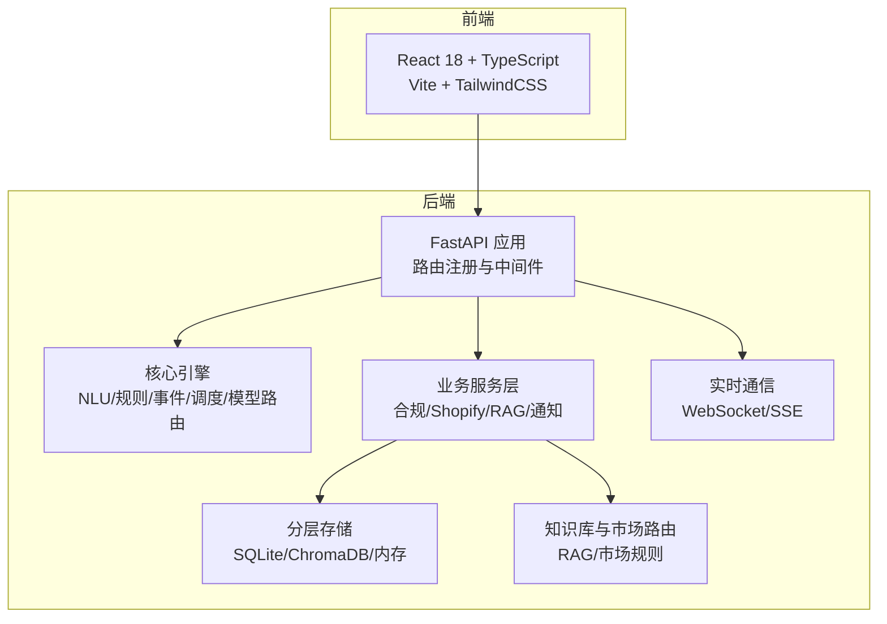
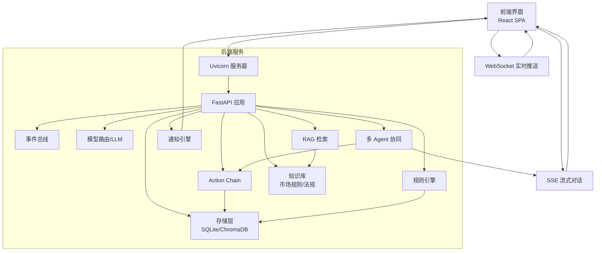
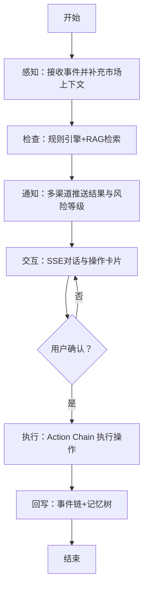
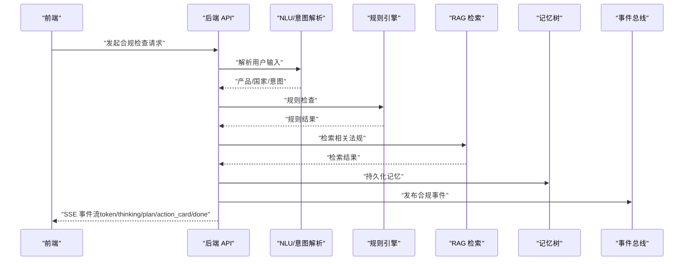
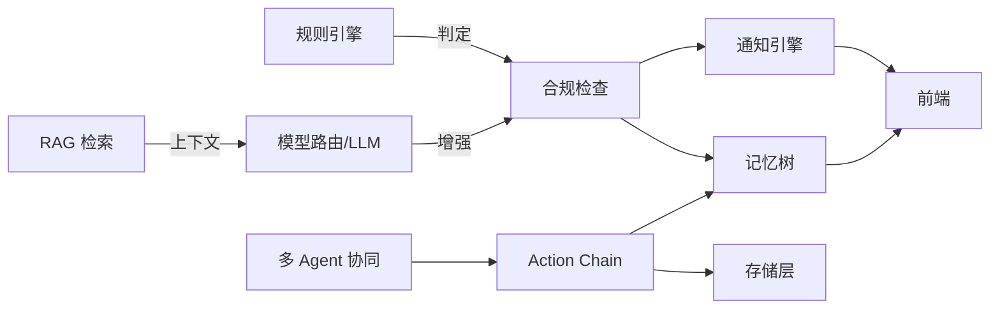

# 项目概述

<cite>
**本文引用的文件**
- [README.md](file://README.md)
- [backend/app/main.py](file://backend/app/main.py)
- [backend/app/services/compliance.py](file://backend/app/services/compliance.py)
- [backend/app/api/streaming.py](file://backend/app/api/streaming.py)
- [backend/app/storage/agent_config_store.py](file://backend/app/storage/agent_config_store.py)
- [backend/app/core/action_chain.py](file://backend/app/core/action_chain.py)
- [后端变更路线图.md](file://后端变更路线图.md)
</cite>

## 目录
1. [引言](#引言)
2. [项目结构](#项目结构)
3. [核心组件](#核心组件)
4. [架构总览](#架构总览)
5. [详细组件分析](#详细组件分析)
6. [依赖关系分析](#依赖关系分析)
7. [性能考量](#性能考量)
8. [故障排查指南](#故障排查指南)
9. [结论](#结论)
10. [附录](#附录)

## 引言
避风港（ASTRA）是一个面向中小出海企业的合规智能体平台，旨在以低成本、全链路、可解释的方式，将传统昂贵的人工合规服务转化为普惠型数字化解决方案。系统采用“规则引擎 + 大语言模型（LLM）+ 多 Agent 协同”的混合推理架构，覆盖产品出海全生命周期的合规需求，包括产品合规预检、多市场法规监控、Shopify 集成以及“六步执行流水线”等关键能力。

- 核心价值主张
  - 降本增效：通过自动化规则与智能体协作替代大量人工审核与重复劳动。
  - 全生命周期覆盖：从产品预检、法规监控、风险预警到执行闭环，形成稳定可解释的合规流程。
  - 可解释与可观测：SSE 流式对话与记忆树记录，使每一步决策与执行过程可追溯、可审计。
  - 可扩展与可运营：Skills 扩展体系、多渠道通知、RBAC 管理与工作流编排，满足企业持续演进需求。

- 目标用户群体
  - 中小跨境电商企业（卖家/运营团队）
  - 供应链与合规负责人
  - 需要快速响应多市场法规变化的产品/法务人员

- 核心能力矩阵
  - 产品合规预检：HS 编码、VAT、认证矩阵、风险标记
  - 多市场法规监控：欧盟/美国/日本/韩国等市场法规的实时扫描与预警
  - Shopify 集成：OAuth + 产品同步 + 自动化合规检查
  - 六步执行流水线：感知→通知→推荐→对话→执行→回写
  - 多 Agent 调度与 Skills 扩展体系
  - SSE 流式 AI 对话与 WebSocket 实时推送
  - 记忆树与指标监控（Phase 2+）

**章节来源**
- [README.md:1-180](file://README.md#L1-L180)

## 项目结构
后端采用 FastAPI 构建，按“API 层/核心引擎/服务层/存储层/知识库/模型路由/调度/通知/安全沙箱/RBAC”进行分层组织；前端为 React 18 + TypeScript 的单页应用，通过统一 API 客户端与后端交互。系统提供 200+ 个 REST 端点，覆盖认证、对话、产品、事件、Shopify、Agent、Skills、风险、知识库、记忆、调度、管理等模块。

**图表来源**
- [backend/app/main.py:40-104](file://backend/app/main.py#L40-L104)
- [README.md:37-64](file://README.md#L37-L64)

**章节来源**
- [README.md:37-64](file://README.md#L37-L64)
- [backend/app/main.py:40-104](file://backend/app/main.py#L40-L104)

## 核心组件
- 混合推理架构
  - 规则引擎：对确定性合规检查（如 HS 编码、VAT、强制认证）进行快速判定，确保可解释与低误判。
  - LLM：对不确定场景、复杂法规解读与生成式建议进行增强，结合 RAG 提供上下文检索。
  - 多 Agent 协同：Manager Agent 协调工作流，Worker Agent 执行具体动作，Astra Assistant 提供对话交互与技能执行。
- 六步执行流水线
  - 感知：事件总线接收触发事件，补充市场上下文。
  - 通知：多渠道推送检查结果与风险等级。
  - 推荐：基于规则与检索结果生成建议。
  - 对话：SSE 流式对话与交互卡片，支持用户确认与二次交互。
  - 执行：Action Chain 执行用户确认的操作。
  - 回写：将结果回写至事件链与记忆树，形成闭环。
- 记忆树与指标
  - 记忆树：按产品/时间维度的层级化摘要树，支持导出与搜索。
  - 指标监控：产品与全局健康度指标，配合通知中心与 WebSocket 实时推送。
- 第三方集成与安全
  - OAuth 管理器：统一管理 Shopify 等外部系统接入。
  - 安全沙箱：代码与工具执行的安全边界。
  - RBAC：权限控制与审批流程。

**章节来源**
- [README.md:11-19](file://README.md#L11-L19)
- [后端变更路线图.md:355-466](file://后端变更路线图.md#L355-L466)
- [后端变更路线图.md:2012-2064](file://后端变更路线图.md#L2012-L2064)
- [后端变更路线图.md:2180-2190](file://后端变更路线图.md#L2180-L2190)

## 架构总览
系统采用事件驱动与多 Agent 协同的架构，后端通过 FastAPI 提供统一 API，核心引擎负责 NLU、规则、事件、调度与模型路由，服务层封装业务逻辑并与存储、知识库、通知等模块交互。前端通过 SSE 与 WebSocket 实现流式对话与实时通知。

**图表来源**
- [backend/app/main.py:40-104](file://backend/app/main.py#L40-L104)
- [backend/app/api/streaming.py:343-379](file://backend/app/api/streaming.py#L343-L379)

**章节来源**
- [backend/app/main.py:40-104](file://backend/app/main.py#L40-L104)
- [backend/app/api/streaming.py:343-379](file://backend/app/api/streaming.py#L343-L379)

## 详细组件分析

### 混合推理与六步执行流水线
- 设计理念
  - 将确定性规则与不确定性智能相结合，既保证合规检查的稳定性与可解释性，又具备对复杂场景的适应能力。
  - 通过事件驱动与多 Agent 协同，实现从“感知→通知→推荐→对话→执行→回写”的闭环，确保流程可控、可追踪。
- 实现要点
  - 规则引擎：对产品属性与目标市场进行快速判定，输出合规状态与风险等级。
  - RAG：针对不确定或需要上下文的场景，检索相关法规与知识，辅助生成建议。
  - 通知引擎：将结果通过仪表盘与 WebSocket 推送给用户，支持多渠道广播。
  - Astra Assistant：提供对话式交互与技能卡片，支持用户确认下一步操作。
  - Action Chain：执行用户确认的操作，并将结果回写至事件链与记忆树。
- 流程图

**图表来源**
- [后端变更路线图.md:355-466](file://后端变更路线图.md#L355-L466)

**章节来源**
- [后端变更路线图.md:355-466](file://后端变更路线图.md#L355-L466)

### SSE 流式对话与事件序列
- SSE 流式对话
  - 后端通过 SSE 将对话过程拆分为多个事件类型（token、thinking、plan、action_card、done 等），前端按事件类型渲染与消费，实现边生成边展示的体验。
  - 在合规检查过程中，SSE 逐步输出解析意图、规则检查、RAG 检索、建议生成、记忆持久化与事件发布等步骤，确保过程透明。
- 事件序列

**图表来源**
- [backend/app/api/streaming.py:343-379](file://backend/app/api/streaming.py#L343-L379)

**章节来源**
- [backend/app/api/streaming.py:343-379](file://backend/app/api/streaming.py#L343-L379)

### 记忆树与产品级隔离
- 记忆树
  - 支持按产品与时间维度的层级化摘要树（L0→L1→L2→L3），并提供树浏览、节点详情、语义搜索与导出为 Obsidian Wiki 的能力。
  - 产品级记忆隔离：每个产品拥有独立的记忆空间，避免交叉污染。
- 产品 ID 生成
  - 使用稳定的本地产品 ID 生成策略，确保跨模块一致性与可追溯性。

**章节来源**
- [后端变更路线图.md:2012-2064](file://后端变更路线图.md#L2012-L2064)
- [backend/app/services/compliance.py:102-139](file://backend/app/services/compliance.py#L102-L139)

### 多 Agent 调度与 Skills 扩展
- 多 Agent 协同
  - Manager Agent 负责协调与编排，Worker Agent 池按业务阶段执行具体任务，Agent 间通过标准化消息格式通信。
- Skills 扩展
  - Skills 注册与推荐机制，支持按场景自动匹配与执行，提升系统可扩展性与可运营性。
- Agent 配置
  - 提供系统管理 Agent 与通用合规 Agent 的配置，明确权限边界与工作原则。

**章节来源**
- [后端变更路线图.md:2012-2064](file://后端变更路线图.md#L2012-L2064)
- [backend/app/storage/agent_config_store.py:48-73](file://backend/app/storage/agent_config_store.py#L48-L73)

### Action Chain 与执行轨迹
- Action Chain
  - 记录每一步操作的状态（成功/运行中/失败），并提供自然语言描述链（trail），便于回溯与审计。
  - 支持按时间排序获取整条操作链，计算整体状态（空/已完成/部分/失败）。

**章节来源**
- [backend/app/core/action_chain.py:143-185](file://backend/app/core/action_chain.py#L143-L185)

## 依赖关系分析
- 组件耦合与内聚
  - 核心引擎（NLU/规则/事件/调度/模型路由）与服务层（合规/Shopify/RAG/通知）之间通过清晰的接口耦合，降低内聚性差异带来的风险。
  - 存储层与知识库相对独立，通过统一的数据模型与检索接口对接，便于替换与扩展。
- 外部依赖与集成点
  - LLM：OpenRouter 多模型路由，支持按任务类型自动选择模型。
  - 向量数据库：ChromaDB 用于 RAG 检索。
  - 认证：JWT（HS256）。
  - 实时通信：WebSocket 与 SSE。
  - 调度：APScheduler。
- 差异化优势
  - 事件驱动 + 多 Agent + 记忆树 + TokenJuice + QAAgent 的组合，形成可解释、可观测、可扩展的合规智能体平台。
  - 六步执行流水线与 Skills 扩展体系，显著提升中小企业的合规效率与一致性。

**图表来源**
- [后端变更路线图.md:355-466](file://后端变更路线图.md#L355-L466)

**章节来源**
- [README.md:22-34](file://README.md#L22-L34)
- [后端变更路线图.md:355-466](file://后端变更路线图.md#L355-L466)

## 性能考量
- 混合推理优化
  - 优先使用规则引擎处理确定性场景，减少 LLM 调用次数，降低延迟与成本。
  - 对复杂场景启用 RAG 检索与多模型路由，平衡准确性与速度。
- 流式输出与并发
  - SSE 流式对话与 WebSocket 实时推送，降低前端等待时间，提升用户体验。
  - 合理设置并发与队列长度，避免阻塞关键路径。
- 存储与检索
  - 记忆树分层与产品级隔离，减少无关数据扫描；RAG 检索采用向量化索引，提高命中速度。
- 可观测性
  - 通过指标监控与日志采集，持续跟踪关键路径性能，及时发现瓶颈。

## 故障排查指南
- 健康检查
  - 后端提供系统健康检查端点，可用于快速诊断 QAAgent 与核心组件状态。
- 常见问题定位
  - SSE 无输出：检查后端是否正确生成事件类型与前端监听是否匹配。
  - 记忆树为空：确认产品 ID 生成与持久化流程是否正常。
  - 通知未送达：核对通知引擎配置与渠道适配器状态。
  - Action Chain 失败：查看 Action Chain 的状态与 trail 描述，定位失败步骤。
- 环境与依赖
  - 确认环境变量（如 OpenRouter API Key、JWT Secret、Shopify 凭据）已正确配置。
  - Windows 用户注意事件循环策略与子进程兼容性。

**章节来源**
- [backend/app/main.py:106-117](file://backend/app/main.py#L106-L117)
- [backend/app/main.py:141-215](file://backend/app/main.py#L141-L215)

## 结论
避风港（ASTRA）通过“规则引擎 + LLM + 多 Agent 协同”的混合推理架构，构建了面向中小出海企业的合规智能体平台。其核心在于以事件驱动与记忆树为基础，结合 SSE 流式对话与工作流编排，形成“感知→通知→推荐→对话→执行→回写”的六步闭环，显著降低合规成本并提升效率。平台在可解释性、可观测性与可扩展性方面具备差异化优势，能够持续演进以满足企业不断增长的合规需求。

## 附录
- 快速启动与访问
  - 后端：默认端口 8001，Swagger 文档位于 /docs。
  - 前端：默认端口 5173。
  - 默认账号：admin / admin123。
- API 概览（节选）
  - 认证：/api/v1/auth
  - 对话：/api/v1/chat/stream
  - 产品：/api/v1/products
  - 事件：/api/v1/events
  - Shopify：/api/v1/shopify
  - Agent：/api/v1/agents
  - Skills：/api/v1/skills
  - 风险：/api/v1/risk
  - 知识库：/api/v1/knowledge
  - 记忆：/api/v1/memory
  - 调度：/api/v1/scheduler
  - 管理：/api/v1/admin

**章节来源**
- [README.md:68-132](file://README.md#L68-L132)