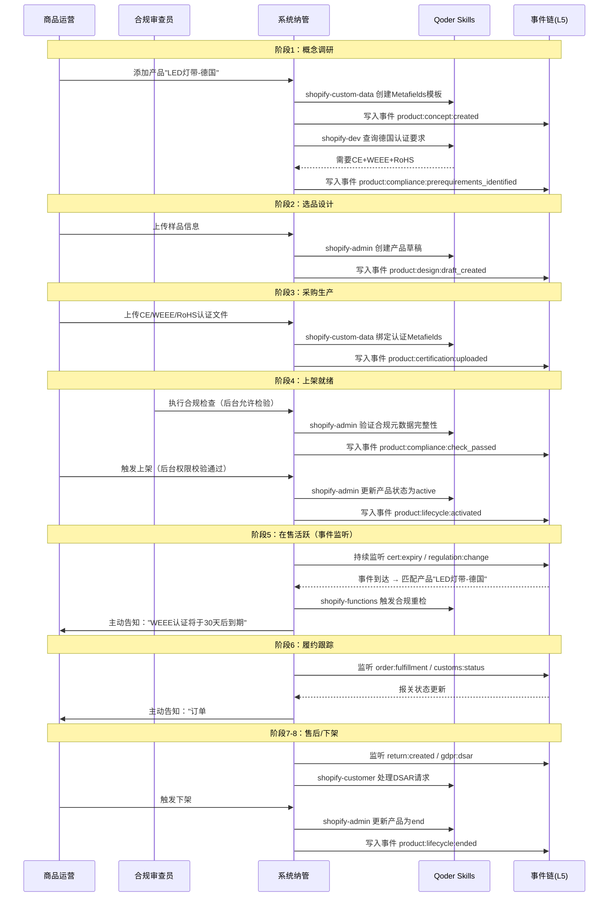

# Shopify跨境合规全事件流程与系统对接指南

> 基于2025-2026年全球跨境监管趋势，梳理Shopify独立站从建站到财务结算的全生命周期合规事件流，并推荐各环节关键对接系统。

---

## 一、全事件流程概览

Shopify独立站跨境业务可划分为 **10大阶段**，每个阶段包含「常规业务事件」与「合规检查事件」两条并行线：

| 阶段 | 业务环节 | 合规聚焦 | 关键系统对接 | 开源Skills支持 |
|------|----------|----------|--------------|----------------|
| 1 | 建站与基础环境搭建 | 账号风控、法律页面、SSL加密 | Shopify后台（内置GDPR工具） | `shopify-onboarding-merchant` `shopify-liquid` |
| 2 | 选品与样品设计 | 知识产权、EPR/GPSR/UKCA/REACH、DPP | USPTO/EUIPO数据库、第三方认证平台 | `shopify-custom-data` `shopify-dev` `shopify-partner` |
| 3 | 供应商审核与采购 | 税务合规、供应链溯源、强迫劳动法规 | ERP系统、供应商管理平台 | `shopify-admin` `shopify-custom-data` |
| 4 | 商品上架与内容合规 | 广告法、数据追踪合规 | Shopify后台、Shopify Email、GA4 | `shopify-admin` `shopify-custom-data` `shopify-liquid` |
| 5 | 支付与收款配置 | KYC、反洗钱、资金链路 | Shopify Payments（内置）、PayPal | `shopify-payments-apps` `shopify-functions` |
| 6 | 订单处理与境内物流 | 三单一致性 | Shopify Shipping（内置）、Admin API | `shopify-admin` `shopify-functions` |
| 7 | 出口报关（跨境干线） | 9610报关、HS编码 | 货代系统、报关行对接 | `shopify-custom-data` `shopify-admin` |
| 8 | 进口清关与境外派送 | IOSS/VAT、关税、EPR清关 | Shopify Fulfillment Network、17TRACK | `shopify-admin` `shopify-functions` `shopify-storefront-graphql` |
| 9 | 交付、售后与退货 | 消费者权益、GDPR、Right to Repair | Shopify内置退货管理、17TRACK | `shopify-customer` `shopify-admin` `shopify-liquid` |
| 10 | 财务结算与税务申报 | 境外收入申报、出口退税 | Shopify内置报表、PayPal导出 | `shopify-admin` `shopify-custom-data` `shopify-payments-apps` `shopify-partner` |

---

## 二、分阶段事件流程详解

### 阶段1：建站与基础环境搭建

**业务描述：** 注册Shopify店铺、购买域名、配置主题与基础信息，搭建可承接流量的独立站。

**常规事件：**
- 注册Shopify账号，选择套餐
- 购买并绑定自定义域名
- 挑选/装修店铺主题
- 配置店铺基本信息（货币、时区、地址等）

**【合规检查事件】：**

| 检查项 | 风险描述 | 合规要求 |
|--------|----------|----------|
| 账号风控合规 | 使用虚假信息或代理IP注册可能导致封店 | 使用真实企业/个体户信息注册；确保登录IP与注册地一致；避免频繁变动VPN |
| 法律页面配置 | 缺少隐私政策/服务条款/退换货政策，面临法律风险 | 在店铺底部展示《隐私政策》《服务条款》《退换货政策》；面向欧美市场配置GDPR/CCPA Cookie同意弹窗 |
| SSL安全加密 | 未加密网站被浏览器标记为"不安全" | Shopify默认提供HTTPS；如用境内服务器需强制部署SSL证书 |

**推荐对接系统：**

| 系统 | 类型 | 用途 | 对接方式 |
|------|------|------|----------|
| Shopify后台 | 平台原生 | 账号管理、店铺配置 | 原生 |
| Shopify Magic | AI工具（免费） | 生成法律页面模板 | Shopify App Store |
| Shopify内置GDPR工具 | 合规（免费） | Cookie同意弹窗、隐私政策生成 | Shopify内置 |

---

### 阶段2：选品与样品设计

**业务描述：** 市场调研、竞品分析、确定选品方向、样品设计打样。

**常规事件：**
- 市场调研与趋势分析
- 竞品分析
- 确定选品方向
- 样品设计与打样

**【合规检查事件】：**

| 检查项 | 风险描述 | 合规要求 |
|--------|----------|----------|
| 知识产权（IP）风险 | 外观专利、商标侵权是Shopify封店最常见原因 | 上架前通过USPTO（美国）、EUIPO（欧盟）官方数据库查询；严禁销售仿牌或未经授权IP产品 |
| 产品准入与认证风险 | 产品不符合目标国强制认证，面临扣押或罚款 | 确认目标国认证要求：美国FDA/FCC、欧盟CE/RoHS等 |
| 文化与局势风险 | 产品触犯宗教、文化禁忌或涉及受制裁地区 | 排查目标市场文化敏感点；确认非受制裁地区产品 |
| 管控风险 | 中国禁止出口两用物品、欧盟禁用新疆长绒棉 | 确认产品非管制物项；核查供应链原材料来源 |
| EU EPR（生产者延伸责任） | 未在目标国注册EPR号导致产品被禁售/罚款 | 确认产品/包装是否涉及EPR类别（电子产品、电池、包装、纺织）；在目标国注册EPR号并填写于店铺资料 |
| EU GPSR（通用产品安全法规） | 缺少制造商信息/安全标签/CE标志被下架 | 产品标签包含制造商名称地址、CE标志、警告语、批次号；电商Listing同步展示完整信息 |
| UKCA认证（英国市场） | 脱欧后CE认证不被英国完全认可 | 英国市场产品需申请UKCA认证（2027年起强制执行） |
| EU REACH法规 | 产品含SVHC清单禁限用化学物质 | 确认产品成分符合EU REACH法规要求；定期核对SVHC更新清单 |
| EU数字产品护照（DPP） | 电子产品/电池未提供DPP二维码无法准入 | 准备产品生命周期数据，生成数字护照二维码；2026年起分阶段实施 |

**推荐对接系统：**

| 系统 | 类型 | 用途 | 对接方式 |
|------|------|------|----------|
| USPTO商标数据库 | 官方工具 | 美国商标/专利查询 | 官网检索 |
| EUIPO数据库 | 官方工具 | 欧盟商标/外观专利查询 | 官网检索 |
| Google Trends | 市场调研 | 趋势分析、选品判断 | 网页端 |
| Google Trends | 选品分析（免费） | 趋势分析、品类热度判断 | 网页端 |
| Shopify内置报表 | 数据分析（免费） | 店铺销售数据分析、品类表现 | Shopify内置 |

---

### 阶段3：供应商审核与采购

**业务描述：** 寻找供应商、审核资质、采购样品、批量进货。

**常规事件：**
- 1688或线下找工厂
- 采购样品
- 资质审核
- 批量进货

**【合规检查事件】：**

| 检查项 | 风险描述 | 合规要求 |
|--------|----------|----------|
| 税务合规（有票 vs 无票） | 供应商无法开票导致无法做出口退税 | 确认能否开具增值税专用发票；若不能开票，确认是否备案"跨境电商综试区无票免征"政策 |
| 欧盟强迫劳动法规（Forced Labour Regulation） | 使用涉及强迫劳动供应链的产品将被禁止入境 | 核查供应链原材料来源，排除受关注地区风险；保留供应链尽职调查文件以备审查 |
| 供应链溯源要求 | 无法提供产品溯源信息导致合规审查不通过 | 建立从原材料→工厂→成品→出口的全链路溯源记录；要求供应商提供生产批次信息 |

**推荐对接系统：**

| 系统 | 类型 | 用途 | 对接方式 |
|------|------|------|----------|
| 1688 | 采购平台 | 国内工厂采购 | 网页端/API |
| 企查查/天眼查 | 资质审核 | 供应商背景调查 | 网页端 |
| Shopify Admin API | 采购管理（免费） | 通过GraphQL管理供应商/采购订单 | Shopify内置 |
| Odoo Community | 开源ERP（免费） | 采购订单、供应商管理、库存同步 | 自部署/API对接 |

---

### 阶段4：商品上架与内容合规

**业务描述：** 撰写产品标题与详情、上传图片、设置SKU与价格，完成商品上架。

**常规事件：**
- 撰写英文标题与详情页
- 上传产品图片与视频
- 设置SKU与价格
- 产品分类与标签

**【合规检查事件】：**

| 检查项 | 风险描述 | 合规要求 |
|--------|----------|----------|
| 广告法与营销合规 | 虚假宣传、绝对化用语导致FTC或平台处罚 | 严禁"Best""No.1""100%有效"等夸大用语；产品描述诚实透明 |
| 数据追踪合规（埋点） | 违规收集用户敏感数据违反隐私法 | 安装Facebook Pixel、Google GA4时确保符合目标市场隐私法 |
| EPR注册号标注 | 未在后台填写EPR注册号被Shopify限制销售 | 在Shopify后台「商店设置→合规」中填写目标国EPR注册号 |
| GPSR安全标签与可追溯信息 | 缺少制造商信息和安全标签面临罚款 | 产品标签包含制造商名称地址、CE标志、警告语、批次号；Listing同步展示 |

**推荐对接系统：**

| 系统 | 类型 | 用途 | 对接方式 |
|------|------|------|----------|
| Shopify后台 | 平台原生 | 商品上架管理 | 原生 |
| Shopify Email | 邮件营销（免费） | EDM合规发送、双重确认订阅、打开率追踪 | Shopify内置 |
| Facebook Pixel | 广告追踪（免费） | 转化追踪、受众管理 | 代码嵌入 |
| Google Analytics 4 | 分析工具（免费） | 流量分析、行为追踪 | 代码嵌入 |

---

### 阶段5：支付与收款配置

**业务描述：** 配置支付网关，确保资金链路通畅合规。

**常规事件：**
- 开通Shopify Payments
- 接入PayPal
- 接入PayPal等其他收款通道

**【合规检查事件】：**

| 检查项 | 风险描述 | 合规要求 |
|--------|----------|----------|
| 反洗钱与KYC审核 | 身份认证不符导致支付通道冻结 | 提交真实企业/个人资料；确保收款账户主体与Shopify店铺主体一致 |
| PCI DSS支付安全 | 明文存储信用卡信息导致安全事件 | 确保支付网关通过PCI DSS认证；严禁私自存储客户信用卡信息 |
| 拒付率与风控 | 拒付率超标导致支付账号资金冻结 | 控制拒付率<0.8%；高客单价订单开启3D Secure验证 |
| 资金链路透明化 | 个人银行卡直接收汇触发税务稽查 | 通过持牌第三方支付机构结汇回国；确保资金流、票据流、订单信息匹配 |

**推荐对接系统：**

| 系统 | 类型 | 用途 | 对接方式 |
|------|------|------|----------|
| Shopify Payments | 平台原生 | 信用卡收款 | 原生集成 |
| PayPal | 支付网关 | 国际收款 | Shopify App Store |
| Shopify Payments | 平台原生（免费） | 多币种收款、自动结汇 | 原生集成 |
| Shopify内置欺诈分析 | 反欺诈（免费） | 订单风险评分、欺诈检测 | Shopify内置 |
| Shopify Flow | 自动化规则（免费） | 自定义反欺诈规则触发 | Shopify内置 |
| 3D Secure | 验证服务（免费） | 高客单价订单验证 | 支付网关内置 |

---

### 阶段6：订单处理与境内物流

**业务描述：** 客户下单、ERP抓取订单、仓库打包贴单、国内快递发往货代仓库。

**常规事件：**
- 客户下单付款
- ERP系统抓取订单
- 仓库打包贴国际面单
- 国内快递发往货代仓库

**【合规检查事件】：**

| 检查项 | 风险描述 | 合规要求 |
|--------|----------|----------|
| 三单一致性 | 订单/支付/物流信息不匹配导致报关失败 | 确保订单信息、支付信息、物流信息真实且匹配 |

**推荐对接系统：**

| 系统 | 类型 | 用途 | 对接方式 |
|------|------|------|----------|
| Shopify Admin API | 订单管理（免费） | 订单抓取、状态同步、批量操作 | Shopify内置 |
| Shopify Shipping | 发货平台（免费） | 批量打印标签、承运商运费折扣 | Shopify内置 |
| 17TRACK | 物流追踪（免费层） | 物流单号追踪、自动通知 | Shopify App Store |

---

### 阶段7：出口报关（跨境干线）

**业务描述：** 货代接收包裹、安排国际运输、完成出口报关。

**常规事件：**
- 货代接收包裹
- 安排国际航班/轮船
- 干线运输

**【合规检查事件】：**

| 检查项 | 风险描述 | 合规要求 |
|--------|----------|----------|
| 9610清单核放 | 非合规报关模式导致清关延误 | 确认货代支持"9610跨境电商B2C直邮"报关模式 |
| HS编码与申报要素 | 归类错误导致关税税率差异或被扣押 | 核对申报品名、HS编码、申报价值准确性；避免低申报 |
| 单证不符 | 发票/装货单/提单/合同信息不一致 | 确保发票、装货单/提单、合同等文件信息一致 |

**推荐对接系统：**

| 系统 | 类型 | 用途 | 对接方式 |
|------|------|------|----------|
| 货代系统（如4PX递四方） | 货代平台 | 国际干线运输、报关服务 | API/文件对接 |
| 报关行系统 | 报关服务 | 单次委托报关（约150RMB/次） | 线下/线上对接 |

---

### 阶段8：进口清关与境外派送

**业务描述：** 货物抵达目的国口岸、海关查验放行、末端派送。

**常规事件：**
- 货物抵达目的国口岸
- 当地海关查验放行
- 当地物流末端派送（USPS、DHL、Royal Mail等）

**【合规检查事件】：**

| 检查项 | 风险描述 | 合规要求 |
|--------|----------|----------|
| 关税与IOSS/VAT | 买家二次缴税引发拒收和投诉 | 面向欧盟注册IOSS号并在结账时预收VAT；关注美国各州Sales Tax起征点 |
| 进口申报时效 | 超期申报导致罚款 | 货物到港后14日内向当地海关申报 |
| EPR合规清关 | 未在目的国完成EPR注册导致清关延误 | 向货代/清关行提供EPR注册号；确保包装、电子、电池类产品完成EPR合规登记 |

**推荐对接系统：**

| 系统 | 类型 | 用途 | 对接方式 |
|------|------|------|----------|
| Shopify Fulfillment Network | 仓储履约（免费层） | 多仓库库存同步、智能分仓 | Shopify内置 |
| Shopify Inventory API | 库存管理（免费） | 仓库库存实时同步、多仓管理 | Shopify内置 |
| Odoo Inventory | 开源WMS（免费） | 轻量海外仓管理、多仓库支持 | 自部署/API对接 |

---

### 阶段9：交付、售后与退货

**业务描述：** 买家签收、客户咨询处理、退换货申请处理。

**常规事件：**
- 买家签收
- 客户邮件/在线咨询处理
- 退换货申请处理

**【合规检查事件】：**

| 检查项 | 风险描述 | 合规要求 |
|--------|----------|----------|
| 消费者权益保护 | 违反当地退货政策导致投诉/处罚 | 遵守欧盟14天无理由退货；提供清晰退货地址和退款流程 |
| 数据删除请求（DSAR） | 未合规处理GDPR数据请求遭巨额罚款 | 在规定时间内（24-48h响应）处理数据访问/更正/删除请求 |
| 物流轨迹透明 | 物流信息不透明导致WISMO客诉 | 提供真实可追踪物流单号；延误时主动通知客户 |
| 售后纠纷率 | PayPal投诉率>3%导致资金冻结 | 控制纠纷率；及时处理售后问题 |
| EU维修权（Right to Repair） | 拒绝提供维修服务违反欧盟消费者法规 | 电子产品需提供维修信息和备件供应；告知消费者法定维修期限（2-10年不等） |

**推荐对接系统：**

| 系统 | 类型 | 用途 | 对接方式 |
|------|------|------|----------|
| Shopify内置退货管理 | 退货（免费） | 退货申请、退款处理、退货标签 | Shopify内置 |
| 17TRACK | 物流追踪（免费层） | 3100+承运商、一站式查询 | Shopify App Store |
| Tidio | 客服系统（免费层） | 实时聊天、自动回复、工单 | Shopify App Store |
| Freshdesk Free | 工单管理（免费） | 客户咨询工单管理 | Shopify App Store |

---

### 阶段10：财务结算与税务申报

**业务描述：** 结汇回国、利润核算、税务申报。

**常规事件：**
- 第三方支付平台结汇为人民币
- 利润核算
- 税务申报

**【合规检查事件】：**

| 检查项 | 风险描述 | 合规要求 |
|--------|----------|----------|
| 境外收入申报 | 隐匿收入触发CRS信息交换和税务稽查 | 如实申报境外收入；Shopify按季度向税务机关报送卖家收入数据 |
| 出口退税/免税申报 | 未及时申报损失退税款或无票未做免税申报 | 有进项票→定期申请出口退税；无票→按期进行免税申报（综试区政策） |
| 目的国税务合规 | 未注册IOSS导致清关问题 | 注册IOSS税号；结账时预收VAT；关注美国Sales Tax起征点 |

**推荐对接系统：**

| 系统 | 类型 | 用途 | 对接方式 |
|------|------|------|----------|
| Shopify内置报表 | 财务导出（免费） | 订单/交易数据导出、多币种报表 | Shopify内置 |
| Shopify Payments结算 | 结汇服务（免费） | 多币种收款、自动结汇 | Shopify内置 |

---

## 三、关键事件系统对接矩阵

以下按**使用场景**梳理各推荐系统的对接方式与适用阶段：

### 3.1 仓储与库存管理（免费方案）

| 系统名称 | 核心优势 | 适用场景 | 对接阶段 | Shopify对接方式 |
|----------|----------|----------|----------|----------------|
| Shopify Fulfillment Network | 多仓库存同步、智能分仓、Shopify深度集成 | 全部卖家 | 阶段6/8 | Shopify内置 |
| Shopify Inventory API | GraphQL直接操作库存、多仓库管理 | 开发者/技术团队 | 阶段6/8 | Shopify内置 |
| Odoo Inventory | 开源WMS、自部署、无订阅费 | 需要自建海外仓的卖家 | 阶段6/8 | API对接 |

### 3.2 物流发货与订单管理（免费方案）

| 系统名称 | 核心优势 | 适用场景 | 对接阶段 | Shopify对接方式 |
|----------|----------|----------|----------|----------------|
| Shopify Shipping | 承运商运费折扣、批量打印标签、内置发货流程 | 全部卖家 | 阶段6/7 | Shopify内置 |
| 17TRACK | 3100+运输商追踪、一站式查询（免费层） | 自发货卖家 | 阶段6/8/9 | Shopify App Store |
| Shopify Admin API | GraphQL查询/更新订单、批量操作 | 开发者/技术团队 | 阶段6/7 | Shopify内置 |
| Odoo Shipping | 开源物流管理、自部署 | 自建物流体系卖家 | 阶段8 | API对接 |

### 3.3 找仓与物流资源整合平台

| 系统名称 | 核心优势 | 适用场景 | 对接阶段 |
|----------|----------|----------|----------|
| 递四方 (4PX) | 全球20+国家仓网、全平台对接成熟 | 全球布局卖家 | 阶段7/8 |
| Ship24 | 1500+快递公司、AI优化物流操作 | 多物流商数据统一管理 | 阶段6/8 |

### 3.4 合规与营销类应用（免费方案）

| 系统名称 | 类型 | 核心用途 | 对接阶段 | Shopify对接方式 |
|----------|------|----------|----------|----------------|
| Shopify内置GDPR工具 | 合规（免费） | Cookie同意弹窗、隐私政策生成 | 阶段1 | Shopify内置 |
| Shopify Email | 邮件营销（免费） | EDM合规发送、双重确认订阅、打开率追踪 | 阶段4/9 | Shopify内置 |
| Shopify内置欺诈分析 | 反欺诈（免费） | 订单风险评分、欺诈检测 | 阶段5 | Shopify内置 |
| Shopify Flow | 自动化规则（免费） | 自定义反欺诈/合规规则触发 | 阶段5/9 | Shopify内置 |
| Tidio | 客服系统（免费层） | 实时聊天、自动回复、工单 | 阶段9 | Shopify App Store |
| Freshdesk Free | 工单管理（免费） | 客户咨询工单管理 | 阶段9 | Shopify App Store |
| Shopify内置退货管理 | 退货（免费） | 退货申请、退款处理、退货标签 | 阶段9 | Shopify内置 |

---

### 3.5 开源高Star方案推荐（各功能组件）

> 调研时间：2026年6月 ｜ 数据来源：GitHub ｜ ⭐ = GitHub Stars

#### 3.5.1 客服/工单系统

| 项目 | ⭐ Stars | 技术栈 | 亮点 | 许可证 | 对标商业产品 |
|------|:--------:|--------|------|--------|------------|
| [Chatwoot](https://github.com/chatwoot/chatwoot) | **29.9k** | Ruby + Vue | 全渠道（邮件/WhatsApp/Telegram/社交）、AI Agent Captain、知识库、工单系统 | MIT | Intercom / Zendesk |
| [Zammad](https://github.com/zammad/zammad) | **5.7k** | Ruby + Vue | 邮件/电话/社交/聊天统一工单、LDAP/SSO、灵活SLA | AGPL-3.0 | Zendesk / Freshdesk |
| [FreeScout](https://github.com/freescout-hq/freescout) | **3.5k** | PHP (Laravel) | 超轻量帮助台、邮件转工单、模块化扩展 | AGPL-3.0 | Help Scout |

**推荐选型**：Chatwoot 功能最全、社区最活跃，适合跨境电商多语言多渠道场景。

#### 3.5.2 邮件营销/EDM

| 项目 | ⭐ Stars | 技术栈 | 亮点 | 许可证 | 对标商业产品 |
|------|:--------:|--------|------|--------|------------|
| [Listmonk](https://github.com/knadh/listmonk) | **21.2k** | Go + Vue | 单二进制文件、高性能、模板引擎、订阅管理、SMTP/Transactional | AGPL-3.0 | Mailchimp / Brevo |
| [BillionMail](https://github.com/Billionmail/BillionMail) | **5k+** | 全栈 | 完整邮件服务器+Newsletter+营销自动化，开箱即用 | GPL-3.0 | Mailchimp |
| [Mailtrain](https://github.com/Mailtrain-org/mailtrain) | **5.1k** | Node.js | 列表管理、邮件模板、A/B测试、自动化工作流 | GPL-3.0 | Mailchimp |

**推荐选型**：Listmonk 单二进制部署、PostgreSQL后端，运维成本最低，适合快速启动。

#### 3.5.3 ERP/采购管理

| 项目 | ⭐ Stars | 技术栈 | 亮点 | 许可证 | 对标商业产品 |
|------|:--------:|--------|------|--------|------------|
| [ERPNext](https://github.com/frappe/erpnext) | **35.2k** | Python + JS (Frappe) | 会计/库存/采购/制造/CRM全模块、REST API、移动端 | GPL-3.0 | SAP / Odoo |
| [Odoo Community](https://github.com/odoo/odoo) | **41.5k** | Python + JS | 40+模块、开发者生态庞大、模块化架构 | LGPL-3.0 | SAP / NetSuite |
| [Dolibarr](https://github.com/Dolibarr/dolibarr) | **5.3k** | PHP | 轻量级ERP+CRM、插件市场、快速部署 | GPL-3.0 | QuickBooks |

**推荐选型**：ERPNext 采购/库存/财务三合一且API完整，与Shopify对接有成熟社区方案；Odoo 模块更丰富但社区版与企业版功能有分叉。

#### 3.5.4 WMS仓储管理

| 项目 | ⭐ Stars | 技术栈 | 亮点 | 许可证 | 对标商业产品 |
|------|:--------:|--------|------|--------|------------|
| [GreaterWMS](https://github.com/GreaterWMS/GreaterWMS) | **4.3k** | Django + Vue (Quasar) | 出入库/盘点/多仓库/ASN/DN、福特亚太供应链经验 | Apache-2.0 | 易仓WMS |
| [OpenWMS](https://github.com/openwms/org.openwms) | **1.2k** | Java (Spring Boot) | MFC物料流控制、自动仓库接口、多仓库管理 | Apache-2.0 | ShipHero |

**推荐选型**：GreaterWMS 中文文档齐全、Django生态与现有项目技术栈兼容度高。

#### 3.5.5 物流追踪

| 项目 | ⭐ Stars | 技术栈 | 亮点 | 许可证 | 对标商业产品 |
|------|:--------:|--------|------|--------|------------|
| [Courier](https://github.com/tborychowski/courier) | **150+** | Node.js | 自托管包裹追踪、支持多家承运商、Docker部署 | MIT | AfterShip |
| [17TRACK API](https://www.17track.net) | — | REST API | 3100+承运商、免费层支持500单/月 | 免费层 | — |

**推荐选型**：跨境物流追踪建议直接使用 17TRACK 免费API层（500单/月），自建方案成熟度较低；高量级再考虑集成 Courier 或自研。Shopify Shipping 已内置主流承运商追踪。

#### 3.5.6 反欺诈/风控

| 项目 | ⭐ Stars | 技术栈 | 亮点 | 许可证 | 对标商业产品 |
|------|:--------:|--------|------|--------|------------|
| [AI4Risk/antifraud](https://github.com/AI4Risk/antifraud) | **2.2k** | Python | 图神经网络反欺诈、Amazon/Yelp数据集、可训练模型 | Apache-2.0 | Riskified |
| [PyOD](https://github.com/yzhao062/pyod) | **8.5k** | Python | 50+异常检测算法统一接口、可直接用于订单异常检测 | MIT | — |
| Shopify Flow | — | 低代码 | 内置触发器+条件+动作，可视化规则配置 | Shopify内置 | — |

**推荐选型**：轻量级直接用 Shopify Flow 配置规则（订单金额异常、地址风险等）；需深度风控模型时引入 PyOD/antifraud 作为后端推理引擎。

#### 3.5.7 GDPR/合规工具

| 项目 | ⭐ Stars | 技术栈 | 亮点 | 许可证 | 对标商业产品 |
|------|:--------:|--------|------|--------|------------|
| [Osano CookieConsent](https://github.com/osano/cookieconsent) | **3.5k** | JavaScript | 轻量JS插件、GDPR/CCPA支持、每月20亿次展示 | BSD-2-Clause | CookieYes / Cookiebot |
| [Complianz](https://github.com/complianz/complianz) | **600+** | PHP (WordPress) | 自动Cookie扫描、多语言、IAB TCF v2.3 | GPL-3.0 | CookieYes |

**推荐选型**：Osano CookieConsent 直接嵌入Shopify Liquid主题即可，无需后端服务，最轻量。

#### 3.5.8 工作流/事件编排引擎（Workflow层）

| 项目 | ⭐ Stars | 技术栈 | 亮点 | 许可证 | 对标商业产品 |
|------|:--------:|--------|------|--------|------------|
| [n8n](https://github.com/n8n-io/n8n) | **191k** | TypeScript | 400+集成、可视化编排、AI Agent工作流、自托管 | Sustainable Use | Zapier / Make |
| [Temporal](https://github.com/temporalio/temporal) | **14k** | Go | 微服务编排、确定性执行、故障自动重试、超时管理 | MIT | — |
| [Apache Airflow](https://github.com/apache/airflow) | **41k** | Python | 数据管道编排、定时调度、丰富的Operator生态 | Apache-2.0 | — |

**推荐选型**：n8n 可视化拖拽适合非技术人员配置通知流和跨系统集成；Temporal 适合需要强确定性和故障恢复的核心业务流程（如Section 6.15 Workflow层）。

#### 3.5.9 指标监控/Dashboard（指标展示层）

| 项目 | ⭐ Stars | 技术栈 | 亮点 | 许可证 | 对标商业产品 |
|------|:--------:|--------|------|--------|------------|
| [Grafana](https://github.com/grafana/grafana) | **74.1k** | Go + TypeScript | 时序数据可视化、丰富图表类型、多数据源融合、告警 | AGPL-3.0 | Datadog |
| [Apache Superset](https://github.com/apache/superset) | **68k+** | Python + React | SQL IDE、丰富图表、数据集管理、嵌入式仪表盘 | Apache-2.0 | Tableau |
| [Metabase](https://github.com/metabase/metabase) | **40k+** | Clojure + React | 5分钟上手、自动图表、SQL/可视化双模式、嵌入式 | AGPL-3.0 | Looker |

**推荐选型**：指标Dashboard首选 Grafana（实时监控指标趋势/告警阈值），BI分析首选 Metabase（非技术人员自助分析）。结合使用：Grafana 实时指标 + Metabase 报表分析。

#### 3.5.10 向量知识库/RAG（知识层）

| 项目 | ⭐ Stars | 技术栈 | 亮点 | 许可证 | 对标商业产品 |
|------|:--------:|--------|------|--------|------------|
| [Qdrant](https://github.com/qdrant/qdrant) | **31.7k** | Rust | 高性能、丰富的过滤支持、多语言客户端、免费云层 | Apache-2.0 | Pinecone |
| [ChromaDB](https://github.com/chroma-core/chroma) | **19k+** | Python | 极简API、嵌入式模式、LangChain原生集成 | Apache-2.0 | — |
| [Weaviate](https://github.com/weaviate/weaviate) | **13k+** | Go | 内置向量化模块、多模态搜索、GraphQL API | BSD-3-Clause | Pinecone |

**推荐选型**：本项目已用 ChromaDB，轻量场景无需更换；法规知识量增大后迁移 Qdrant 可获更高检索性能（Rust实现，百万级文档无压力）。

#### 3.5.11 对话界面/AI入口（Cowork层）

| 项目 | ⭐ Stars | 技术栈 | 亮点 | 许可证 | 对标商业产品 |
|------|:--------:|--------|------|--------|------------|
| [Open WebUI](https://github.com/open-webui/open-webui) | **139k** | Python + Svelte | 多模型支持、RAG集成、离线运行、插件系统 | MIT | ChatGPT UI |
| [Chatwoot](https://github.com/chatwoot/chatwoot) | **29.9k** | Ruby + Vue | 全渠道客服、Captain AI Agent、Shopify集成 | MIT | Intercom |

**推荐选型**：用户侧对话入口用 Open WebUI（支持接入本地/API模型、可扩展RAG），客服侧用 Chatwoot（全渠道接入飞书/铉钉/Slack）。

---

## 四、Qoder Skills开源技能映射

> 以下将各阶段合规事件映射到已有的开源Qoder Skills，实现「事件驱动 → 技能调用」的自动化合规工作流。所有技能均通过 `/skill-name` 斜杠命令或 `Skill` 工具直接调用，无需额外对接商业SaaS系统即可完成大部分合规检查与操作。

### 4.1 Skills调用方式总览

| 调用方式 | 说明 | 示例 |
|----------|------|------|
| 斜杠命令 | 在对话中直接输入 `/skill-name` 触发 | `/shopify-admin` |
| Skill工具 | 通过代码调用Skill工具，传入参数 | `Skill({skill: "shopify-admin", args: "..."})` |
| 组合编排 | 多个Skills按事件流顺序串联 | `shopify-onboarding` → `shopify-custom-data` → `shopify-admin` |

---

### 4.2 阶段 × Skills 映射矩阵

#### 阶段1：建站与基础环境搭建

| 合规事件 | 推荐Skills | 技能用途 |
|----------|-----------|----------|
| Shopify账号注册与风控 | `shopify-onboarding-merchant` | 引导完成店铺注册、资料提交、IP一致性检查 |
| 法律页面配置（隐私/服务/退货政策） | `shopify-onboarding-merchant` | 生成并配置法律页面模板 |
| GDPR/CCPA Cookie弹窗 | `shopify-dev` | 查询Cookie合规开发文档，辅助配置 |
| 店铺主题配置 | `shopify-liquid` | Liquid模板定制、主题装修 |
| 安装Skills安全审查 | `skill-vetter` | 安装开源Skills前进行安全审查，检查权限范围和风险模式 |

---

#### 阶段2：选品与样品设计

| 合规事件 | 推荐Skills | 技能用途 |
|----------|-----------|----------|
| 知识产权（IP）排查 | `shopify-dev` | 查询USPTO/EUIPO对接方案，获取IP检查最佳实践 |
| 产品数据建模（元字段） | `shopify-custom-data` | 定义Metafields/Metaobjects存储认证信息、HS编码等合规元数据 |
| 选品趋势分析 | `shopify-storefront-graphql` | 通过Storefront API分析在售产品数据 |
| Partner数据查询（App/合作伙伴） | `shopify-partner` | 查询Partner Dashboard数据，查看App性能、合作伙伴账单 |

---

#### 阶段3：供应商审核与采购

| 合规事件 | 推荐Skills | 技能用途 |
|----------|-----------|----------|
| 供应商产品信息导入 | `shopify-admin` | Admin GraphQL批量导入产品与供应商数据 |
| 税务属性标记（有票/无票） | `shopify-custom-data` | 在供应商/产品元数据中标记税务属性 |

---

#### 阶段4：商品上架与内容合规

| 合规事件 | 推荐Skills | 技能用途 |
|----------|-----------|----------|
| 商品上架与管理 | `shopify-admin` | 通过Admin API创建/更新产品、SKU、价格 |
| 合规元数据绑定 | `shopify-custom-data` | 为产品绑定认证信息、HS编码、原产地等Metafields |
| 广告合规检查（标题/描述） | `shopify-dev` | 查询FTC广告合规要求与最佳实践 |
| 自定义前端展示 | `shopify-storefront-graphql` | 构建合规的产品详情页前端查询 |
| 产品描述Liquid模板 | `shopify-liquid` | 渲染合规的产品描述模板 |
| Hydrogen前端深度定制（可选） | `shopify-hydrogen` | 若使用Headless架构，通过Hydrogen构建合规的前端展示层 |

---

#### 阶段5：支付与收款配置

| 合规事件 | 推荐Skills | 技能用途 |
|----------|-----------|----------|
| 支付网关配置 | `shopify-payments-apps` | Payments Apps API集成第三方支付 |
| KYC认证资料提交 | `shopify-admin` | 查询商户资质配置接口 |
| 拒付风控配置 | `shopify-functions` | 开发支付验证Function（3D Secure等） |
| 结汇配置文档 | `shopify-dev` | 查询支付结算相关开发文档 |

---

#### 阶段6：订单处理与境内物流

| 合规事件 | 推荐Skills | 技能用途 |
|----------|-----------|----------|
| 订单抓取与管理 | `shopify-admin` | Admin GraphQL查询/更新订单状态 |
| 物流配送定制 | `shopify-functions` | 配送自定义Function（运费计算、配送限制） |
| 三单一致性校验 | `shopify-admin` + `shopify-custom-data` | 比对订单/支付/物流元数据 |
| 面单打印与发货 | `shopify-admin` | Fulfillment API创建发货 |

---

#### 阶段7：出口报关（跨境干线）

| 合规事件 | 推荐Skills | 技能用途 |
|----------|-----------|----------|
| 9610报关模式确认 | `shopify-dev` | 查询跨境电商报关相关开发资源 |
| HS编码绑定 | `shopify-custom-data` | 在Metafields中维护HS编码与申报要素 |
| 报关单证生成 | `shopify-admin` | 查询订单/产品数据生成报关文件 |

---

#### 阶段8：进口清关与境外派送

| 合规事件 | 推荐Skills | 技能用途 |
|----------|-----------|----------|
| IOSS/VAT配置 | `shopify-admin` | 配置税费设置、Tax API管理 |
| 多市场税务合规 | `shopify-functions` | 开发税费计算Function（按市场差异化） |
| 海外仓库存同步 | `shopify-admin` | Inventory API仓库库存管理 |
| 物流追踪对接 | `shopify-storefront-graphql` | 前端展示物流追踪信息 |

---

#### 阶段9：交付、售后与退货

| 合规事件 | 推荐Skills | 技能用途 |
|----------|-----------|----------|
| 客户账户管理 | `shopify-customer` | Customer Account API管理客户数据 |
| 退换货处理 | `shopify-admin` | Admin API处理退款/退货订单 |
| GDPR数据请求（DSAR）响应 | `shopify-customer` | 客户数据访问/导出/删除 |
| 售后客户通知 | `shopify-storefront-graphql` | 查询订单状态推送更新 |
| 退货政策展示 | `shopify-liquid` | 渲染退货政策页面模板 |

---

#### 阶段10：财务结算与税务申报

| 合规事件 | 推荐Skills | 技能用途 |
|----------|-----------|----------|
| 订单财务数据导出 | `shopify-admin` | Admin GraphQL查询订单/交易数据 |
| 出口退税资料整理 | `shopify-admin` + `shopify-custom-data` | 汇总进项票数据+产品元数据 |
| 多币种结算配置 | `shopify-payments-apps` | 支付API多币种支持 |
| Partner财务数据查询 | `shopify-partner` | 通过Partner API查询APP订阅收入、合作伙伴佣金 |

---

### 4.3 跨阶段通用Skills

| Skill名称 | 通用用途 | 适用阶段 |
|-----------|---------|----------|
| `shopify-dev` | Shopify全栈开发文档查询、API参考、最佳实践获取 | 全部阶段 |
| `shopify-admin` | Admin GraphQL操作所有后台数据（产品/订单/客户/库存） | 阶段2-10 |
| `shopify-custom-data` | Metafields/Metaobjects定义与管理，合规元数据绑定 | 阶段2-8 |
| `shopify-storefront-graphql` | 自定义前端数据查询、合规信息展示 | 阶段4/8/9 |
| `shopify-liquid` | 主题/页面模板渲染、合规内容展示 | 阶段1/4/9 |
| `shopify-functions` | 结账/配送/验证自定义逻辑 | 阶段5/6/8 |
| `shopify-use-shopify-cli` | Shopify CLI操作（配置验证、数据查询、本地开发） | 全部阶段 |
| `skill-vetter` | 安装开源Skills前的安全审查，检查权限、可疑模式、恶意代码 | 全部阶段 |
| `shopify-partner` | Partner API查询APP/主题/合作伙伴Dashboard数据、合作伙伴佣金 | 阶段2/5/10 |
| `shopify-hydrogen` | Hydrogen Headless前端框架实施，构建合规的自定义前端展示 | 阶段4/9 |

---

### 4.4 典型合规场景技能编排示例

**场景：新品上架合规检查**
```yaml
sequence:
  - skill: shopify-custom-data
    args: "定义新产品Metafields模板（认证、HS编码、原产地）"
  - skill: shopify-admin
    args: "通过Admin API创建产品并绑定合规元数据"
  - skill: shopify-dev
    args: "查询目标市场FTC广告合规要求"
  - skill: shopify-storefront-graphql
    args: "验证前端合规信息展示是否正确"
```

**场景：欧盟订单VAT合规处理**
```yaml
sequence:
  - skill: shopify-functions
    args: "开发结账VAT计算Function（按欧盟国家税率）"
  - skill: shopify-admin
    args: "配置IOSS税号与税费设置"
  - skill: shopify-storefront-graphql
    args: "前端展示含VAT的订单明细"
```

**场景：GDPR DSAR请求响应**
```yaml
sequence:
  - skill: shopify-customer
    args: "通过Customer Account API查询客户全部数据"
  - skill: shopify-admin
    args: "验证订单/支付数据一致性，准备导出文件"
  - skill: shopify-dev
    args: "确认GDPR 30天响应时限合规要求"
```

---

## 五、事件动作推荐清单

> 以下针对各阶段每个合规事件，给出具体的可执行动作。动作分为三层：**Skill调用**（通过Qoder开源Skills执行）、**CLI操作**（通过shopify CLI直接执行）、**API调用**（GraphQL/Mutation），可按需选择执行方式。

---

### 5.1 建站与基础环境搭建

| 合规事件 | 执行层级 | 推荐动作 | 预期结果 |
|----------|----------|----------|----------|
| 账号风控合规 | Skill | 调用 `shopify-onboarding-merchant` → 引导填写真实企业资料 → 检测登录IP一致性 | 完成合规注册，账号风险评估通过 |
| 法律页面配置 | Skill | 调用 `shopify-onboarding-merchant` → 生成隐私/服务/退货政策模板 → 底部菜单部署 | 店铺底部展示完整法律页面 |
| 法律页面配置 | CLI | `shopify store execute --query "mutation { shopPolicyCreate(type: PRIVACY_POLICY, body: \"隐私政策正文...\") { shopPolicy { id url } } }"` → 配置Shopify政策页面 | 政策页面API生效 |
| GDPR Cookie弹窗 | Skill | 调用 `shopify-dev` → 查询Cookie合规方案 → 使用Shopify内置GDPR工具配置 | Cookie同意弹窗上线运行 |
| 店铺主题配置 | Skill | 调用 `shopify-liquid` → 定制主题模板 → 嵌入法律链接和Cookie脚本 | 主题合规改造完成 |

---

### 5.2 选品与样品设计

| 合规事件 | 执行层级 | 推荐动作 | 预期结果 |
|----------|----------|----------|----------|
| IP风险排查 | Skill | 调用 `shopify-dev` → 获取USPTO/EUIPO查询方法 → 逐品比对专利/商标 | 确认产品无IP侵权风险 |
| IP风险排查 | API | 调用USPTO `https://developer.uspto.gov/api/` 搜索专利 → 比对产品外观/名称 | 输出IP风险报告 |
| 产品数据建模 | Skill | 调用 `shopify-custom-data` → 定义认证/HS编码/原产地 Metafields → 配置Validation | 合规元数据Schema就绪 |
| 认证需求确认 | Skill | 调用 `shopify-dev` → 查询目标国认证清单 → 确认CE/FDA/FCC/ROHS等要求 | 认证需求清单输出 |
| 选品趋势分析 | Skill | 调用 `shopify-storefront-graphql` → 查询在售产品数据 → 分析价格/品类分布 | 选品决策数据支撑 |
| IP风险排查 | CLI | `shopify store execute --query "query { products(first:20) { edges { node { id title productType } } } }"` → 导出产品清单用于IP比对 | 产品清单导出，逐品IP比对 |

---

### 5.3 供应商审核与采购

| 合规事件 | 执行层级 | 推荐动作 | 预期结果 |
|----------|----------|----------|----------|
| 供应商信息导入 | Skill | 调用 `shopify-admin` → 通过Admin GraphQL创建供应商元数据 → 批量导入产品 | 供应商/产品数据入库 |
| 供应商信息导入 | API | `mutation { productCreate(input: { title: "New Product", status: DRAFT, vendor: "SupplierName", metafields: [{namespace: "custom", key: "tax_type", value: "invoiced", type: "single_line_text_field"}] }) { product { id title } } }` → 附带税务属性元数据 | 产品+元数据一次写入 |
| 税务属性标记 | Skill | 调用 `shopify-custom-data` → 创建"有无进项票"Metafield定义 → 绑定到供应商 | 供应商税务属性可查询/过滤 |
| 供应商信息导入 | CLI | `shopify store execute --query "mutation { productCreate(input: { title: \"Supplier Product\", status: DRAFT, metafields: [{namespace: \"custom\", key: \"tax_type\", value: \"invoiced\", type: \"single_line_text_field\"}] }) { product { id } } }"` | CLI方式创建供应商草稿产品 |

---

### 5.4 商品上架与内容合规

| 合规事件 | 执行层级 | 推荐动作 | 预期结果 |
|----------|----------|----------|----------|
| 产品创建上架 | Skill | 调用 `shopify-admin` → 编写Admin API Mutation → 创建产品+SKU+价格+图片 | 产品成功上架到店铺 |
| 产品创建上架 | CLI | `shopify store execute --query "mutation { productCreate(input: { title: \"产品名称\", descriptionHtml: \"<p>描述</p>\", status: ACTIVE, vendor: \"供应商\" }) { product { id title status } } }"` | CLI方式创建产品成功 |
| 合规元数据绑定 | Skill | 调用 `shopify-custom-data` → 为产品绑定认证/HS编码/原产地 Metafields | 产品元数据完整可查 |
| 合规元数据绑定 | API | `mutation { productUpdate(id: "gid://shopify/Product/123", metafields: [{namespace: "custom", key: "hs_code", value: "85414100"}, {namespace: "custom", key: "origin_country", value: "CN"}]) { product { id } } }` → 批量写入合规数据 | 元数据批量写入完成 |
| 广告合规审查 | Skill | 调用 `shopify-dev` → 查询FTC合规规则 → 逐条审查标题/描述 | 产品描述合规通过 |
| 前端合规展示 | Skill | 调用 `shopify-storefront-graphql` → 编写查询合规元数据的Storefront Query | 前端页面展示认证/HS信息 |
| 产品描述模板 | Skill | 调用 `shopify-liquid` → 编写Liquid模板渲染合规标签和认证图标 | 产品页合规展示区完成 |

---

### 5.5 支付与收款配置

| 合规事件 | 执行层级 | 推荐动作 | 预期结果 |
|----------|----------|----------|----------|
| 支付网关接入 | Skill | 调用 `shopify-payments-apps` → 接入Shopify Payments/PayPal → 配置Webhook | 支付通道上线可用 |
| 支付网关接入 | CLI | `shopify store execute --query "mutation { paymentGatewayCreate( Gateway: { name: \"Stripe\", enabled: true } ) { gateway { id } } }"` | 支付网关API配置成功 |
| KYC提交 | Skill | 调用 `shopify-admin` → 查询商户资质配置端点 → 上传认证材料 | KYC审核通过 |
| 拒付风控 | Skill | 调用 `shopify-functions` → 开发3D Secure验证Function → 部署到结账流程 | 高风险订单触发3D验证 |
| 结汇渠道配置 | Skill | 调用 `shopify-dev` → 查询Shopify Payments多币种配置文档 → 完成结汇设置 | 结汇链路畅通 |
| 结汇渠道配置 | CLI | `shopify store execute --query "query { shop { billingAddress { country } paymentSettings { supportedDigitalWallets } } }"` → 查询店铺支付配置基础状态 | 支付配置状态确认 |

---

### 5.6 订单处理与境内物流

| 合规事件 | 执行层级 | 推荐动作 | 预期结果 |
|----------|----------|----------|----------|
| 订单抓取 | Skill | 调用 `shopify-admin` → 编写订单查询GraphQL → 同步到ERP/WMS | 订单自动抓取入库 |
| 订单抓取 | CLI | `shopify store execute --query "query { orders(first: 50) { edges { node { id name createdAt displayFinancialStatus displayFulfillmentStatus totalPriceSet { shopMoney { amount } } } } } }"` | CLI查询订单成功 |
| 配送逻辑定制 | Skill | 调用 `shopify-functions` → 开发运费计算/配送限制Function | 配送规则按业务定制完成 |
| 三单一致性校验 | Skill | 调用 `shopify-admin` + `shopify-custom-data` → 比对订单/支付/物流元数据 → 输出校验报告 | 三单匹配/不匹配项清单 |
| 发货履约 | Skill | 调用 `shopify-admin` → 调用Fulfillment API → 创建发货并回传物流单号 | 订单状态更新为已发货 |
| 发货履约 | API | `mutation { fulfillmentCreateV2( orderId: "gid://shopify/Order/12345", trackingInfo: { company: "DHL", number: "1234567890", url: "https://tracking.dhl.com/1234567890" } ) { fulfillment { id status } } }` → 批量创建发货 | 批量发货完成 |

---

### 5.7 出口报关（跨境干线）

| 合规事件 | 执行层级 | 推荐动作 | 预期结果 |
|----------|----------|----------|----------|
| 9610报关确认 | Skill | 调用 `shopify-dev` → 查询9610报关对接方案 → 确认货代支持情况 | 9610报关方案确认 |
| HS编码绑定 | Skill | 调用 `shopify-custom-data` → 维护HS编码Metafield → 逐品核对准确性 | 所有产品HS编码完整 |
| HS编码绑定 | API | `mutation { productUpdate(metafields: [{namespace: "custom", key: "hs_code", value: "85414100"}, {namespace: "custom", key: "origin_country", value: "CN"}]) }` | HS编码批量绑定 |
| 报关单证生成 | Skill | 调用 `shopify-admin` → 查询订单/产品/支付数据 → 组装报关文件 | 报关文件（发票/箱单）就绪 |
| HS编码绑定 | CLI | `shopify store execute --query "query { product(id: \"gid://shopify/Product/123\") { metafields(namespace: \"custom\", first:10) { edges { node { key value } } } } }"` → 查询指定产品的HS编码元数据 | CLI查询HS编码绑定状态 |

---

### 5.8 进口清关与境外派送

| 合规事件 | 执行层级 | 推荐动作 | 预期结果 |
|----------|----------|----------|----------|
| IOSS注册配置 | Skill | 调用 `shopify-admin` → 配置税费设置 → 输入IOSS税号 | IOSS税号在结账生效 |
| 多市场税率配置 | Skill | 调用 `shopify-functions` → 开发欧盟各国VAT计算Function → 部署到结账 | 结账时按国家自动计算VAT |
| 多市场税率配置 | API | `mutation { taxSettingsUpdate(settings: {taxCountries: [{countryCode: DE, taxRate: 0.19}, {countryCode: FR, taxRate: 0.20}]}) }` → 配置多国税率 | 税率配置API生效 |
| 海外仓库存同步 | Skill | 调用 `shopify-admin` → 使用Inventory API → 同步多仓库存数据 | 库存实时同步到Shopify |
| 物流追踪展示 | Skill | 调用 `shopify-storefront-graphql` → 编写追踪信息查询 → 前端渲染物流进度 | 买家可查看物流轨迹 |
| IOSS注册配置 | CLI | `shopify store execute --query "query { shop { taxSettings { taxRegistrations { countryCode registrationType } } } }"` → 查询税号注册状态 | 税号注册状态确认 |

---

### 5.9 交付、售后与退货

| 合规事件 | 执行层级 | 推荐动作 | 预期结果 |
|----------|----------|----------|----------|
| 客户账户管理 | Skill | 调用 `shopify-customer` → 查询客户数据 → 管理地址/订单历史 | 客户数据标准化管理 |
| 退换货处理 | Skill | 调用 `shopify-admin` → 创建退货/退款 → 更新订单状态 | 退货流程完成 |
| 退换货处理 | CLI | `shopify store execute --query "mutation { orderUpdate(input: { id: \"gid://shopify/Order/12345\", note: \"退货处理中\" }) { order { id displayFulfillmentStatus } } }"` → 标记退货状态 | CLI退货操作完成 |
| GDPR DSAR响应 | Skill | 调用 `shopify-customer` → 导出客户全量数据 → 打包发送给客户 | 数据请求24h内响应 |
| GDPR DSAR响应 | CLI | `shopify store execute --query "{ customer(id: \"gid://shopify/Customer/67890\") { email firstName lastName orders(first: 50) { edges { node { id name createdAt totalPriceSet { shopMoney { amount currencyCode } } } } } } }"` | CLI导出客户全量数据 |
| 售后客户通知 | Skill | 调用 `shopify-storefront-graphql` → 查询订单状态 → 触发通知推送 | 客户收到状态更新通知 |
| 退货政策展示 | Skill | 调用 `shopify-liquid` → 渲染退货政策页面 → 页脚/订单确认页嵌入链接 | 退货政策全站可访问 |

---

### 5.10 财务结算与税务申报

| 合规事件 | 执行层级 | 推荐动作 | 预期结果 |
|----------|----------|----------|----------|
| 财务数据导出 | Skill | 调用 `shopify-admin` → 查询交易/订单数据 → 导出为报表 | 月度/季度财务报表就绪 |
| 财务数据导出 | CLI | `shopify store execute --query "{ orders(first: 250, query: \"created_at:>=2026-01-01\") { edges { node { id name createdAt totalPriceSet { shopMoney { amount currencyCode } } displayFinancialStatus transactions { id kind status } } } } }"` | CLI批量导出订单/交易数据 |
| 出口退税资料整理 | Skill | 调用 `shopify-admin` + `shopify-custom-data` → 汇总进项票/产品元数据 → 生成退税资料包 | 出口退税申报资料完整 |
| 多币种结算 | Skill | 调用 `shopify-payments-apps` → 配置多币种支付 → Webhook处理汇率 | 多币种收款/结汇正常 |
| 境外收入申报 | Skill | 调用 `shopify-admin` → 导出年度交易汇总 → 配合税务代理申报 | 年度税务申报合规完成 |

---

### 5.11 通用运维动作

| 动作场景 | 推荐方式 | 具体操作 | 频率 |
|----------|----------|----------|------|
| 合规性例行检查 | CLI | `shopify-use-shopify-cli` → 定期检查店铺配置/API状态 → 输出合规报告 | 每周 |
| 元数据Schema审计 | Skill | 调用 `shopify-custom-data` → 审核所有Metafields定义 → 更新过期字段 | 每月 |
| 日志与错误排查 | Skill | 调用 `shopify-dev` → 查询API错误码/最佳实践 → 修复不合规配置 | 按需 |
| 新市场准入评估 | Skill | 调用 `shopify-dev` + `shopify-custom-data` → 新市场合规需求分析 → 元数据扩展 | 新市场进入前 |

---

## 六、商品全生命周期事件纳管体系

> 基于现有L5事件链（EventChain）+ 指标监控（Metrics）+ 风险预警（RiskAlert）架构，构建商品从「概念调研→选品→采购→上架→在售→履约→售后→下架」的全生命周期事件纳管系统，实现「后台允许、事件感知、主动告知、事件监听、个性指标监听」五大能力。

---

### 6.1 产品全生命周期阶段定义

| 阶段 | 编码 | 业务含义 | 状态标志位 | 触发事件 |
|------|------|----------|-----------|----------|
| 概念调研 | `lifecycle:concept` | 市场调研、选品分析、合规预审 | `product.status = "concept"` | 选品添加、IP风险扫描、认证预检 |
| 选品设计 | `lifecycle:design` | 样品打样、供应商寻源 | `product.status = "design"` | 样品确认、供应商资质审核 |
| 采购生产 | `lifecycle:sourcing` | 批量采购、质量检验 | `product.status = "sourcing"` | 采购单创建、质检报告上传 |
| 上架就绪 | `lifecycle:ready` | 商品信息录入、合规元数据绑定 | `product.status = "ready"` | Metafields完整、认证附件齐全 |
| 在售活跃 | `lifecycle:active` | 前台可售、订单接收 | `product.status = "active"` | 上架完成、首单确认 |
| 履约跟踪 | `lifecycle:fulfilling` | 订单履行、跨境物流 | `product.status = "fulfilling"` | 发货回传、报关状态更新 |
| 售后跟踪 | `lifecycle:aftersale` | 退货/换货/客户投诉 | `product.status = "aftersale"` | 退货创建、纠纷升级、DSAR请求 |
| 下架退市 | `lifecycle:end` | 产品停售、库存清空 | `product.status = "end"` | 下架触发、库存归零 |

---

### 6.2 事件分类与感知模型

#### 6.2.1 事件源分类

| 事件源 | 编码 | 感知方式 | 示例 |
|--------|------|----------|------|
| Shopify平台 | `source:shopify` | Webhook轮询/API拉取 | 产品创建/更新/删除、订单状态变更 |
| 规则引擎 | `source:rule_engine` | 定时规则检查触发 | 认证到期、HS编码不一致、风险评分变更 |
| 市场监控 | `source:market_monitor` | Codex Agent联网搜索 | 法规更新、关税调整、市场趋势变化 |
| 用户操作 | `source:user_action` | 前端操作拦截 | 手动添加产品、修改合规状态、确认检查 |
| 外部API | `source:external_api` | 定时调度轮询 | 递四方物流状态、USPTO专利更新、汇率变动 |
| 系统内部 | `source:system` | 组件间事件广播 | 检查完成、指标阈值触发、调度任务完成 |

#### 6.2.2 事件感知机制

```
┌─────────────────────────────────────────────────────────┐
│                    事件感知层                              │
├─────────────┬──────────────┬───────────────┬────────────┤
│  Webhook    │   API轮询     │  规则触发      │  用户操作   │
│  监听器     │   调度器      │  引擎          │  拦截器     │
├─────────────┴──────────────┴───────────────┴────────────┤
│                   事件标准化管道                           │
│  raw_event → 类型归类 → 元数据提取 → 格式化 → EventRecord │
├─────────────────────────────────────────────────────────┤
│                  L5 EventChain 存储                       │
│  chain_id: "product:{product_id}" → 按产品维度组织事件链  │
└─────────────────────────────────────────────────────────┘
```

#### 6.2.3 感知策略配置

| 策略类型 | 配置项 | 默认值 | 说明 |
|----------|--------|--------|------|
| 轮询间隔 | `listener.poll_interval` | 300s | Webhook/API轮询周期 |
| 重试次数 | `listener.retry_count` | 3 | 事件获取失败重试次数 |
| 敏感度阈值 | `listener.sensitivity` | 0.7 | 事件关联产品匹配敏感度 |
| 批量大小 | `listener.batch_size` | 50 | 单次轮询最大事件数 |

---

### 6.3 事件监听架构

#### 6.3.1 监听器注册与路由

```python
# 监听器注册示例（概念设计）
listener_bus = EventListenerBus()

# 注册产品级监听器
listener_bus.register(
    event_type="product:created",
    handler=ProductCreatedHandler(
        actions=["auto_bind_metafields", "trigger_compliance_check"]
    )
)

listener_bus.register(
    event_type="certification:expiring",
    handler=CertExpiryHandler(
        severity="high",
        notify_channels=["dashboard", "email", "websocket"],
        advance_days=30  # 提前30天预警
    )
)

listener_bus.register(
    event_type="market:regulation_change",
    handler=RegulationChangeHandler(
        affected_products="auto_match",  # 自动匹配受影响产品
        actions=["recheck_compliance", "generate_impact_report"]
    )
)
```

#### 6.3.2 事件订阅机制

| 订阅方式 | 适用范围 | 实现方式 |
|----------|----------|----------|
| 精准订阅 | 单个产品 | `subscribe(product_id, event_types[])` |
| 批量订阅 | 产品集合（按市场/品类） | `subscribe_by_filter(tags=["欧盟","电子产品"], event_types[])` |
| 全局订阅 | 所有产品 | `subscribe_all(event_types[])` |
| 条件订阅 | 按规则条件 | `subscribe_by_rule(condition_expr, event_types[])` |

#### 6.3.3 事件匹配与分发

```
事件到达 → 事件类型匹配 → 产品关联计算 → 监听器路由 → 并行分发
                │
                ├─ 精准匹配：event.product_id in subscriber.product_ids
                ├─ 标签匹配：event.tags ∩ subscriber.tags ≠ ∅
                ├─ 规则匹配：evaluate(condition_expr, event.payload)
                └─ 全局匹配：subscriber.type == "wildcard"
```

---

### 6.4 后台权限控制体系（后台允许）

#### 6.4.1 权限模型

| 角色 | 编码 | 权限范围 | 生命周期操作 |
|------|------|----------|-------------|
| 超级管理员 | `role:super_admin` | 全部 | 产品创建/修改/删除/下架/恢复、事件配置、指标定义 |
| 运营管理员 | `role:ops_admin` | 运营维度 | 产品上架/下架、供应商管理、认证配置 |
| 合规审查员 | `role:compliance_officer` | 合规维度 | 合规检查执行、风险确认、整改追踪 |
| 商品运营 | `role:product_manager` | 产品维度 | 产品信息编辑、分类、标签维护、元数据管理 |
| 只读用户 | `role:viewer` | 查看 | 查看产品数据、事件 timeline、仪表盘 |

#### 6.4.2 操作允许规则

| 操作 | 允许条件 | 拦截示例 |
|------|----------|----------|
| 产品上架 | 合规检查通过 + 元数据完整 + 有权限角色 | 未绑HS编码 → 上架拦截 |
| 产品下架 | 无未完成订单 + 有权限角色 | 有履约中订单 → 下架拦截 + 提示 |
| 信息修改 | 变更类型在允许范围内 + 有权限角色 | 修改HS编码 → 触发重新合规检查 |
| 批量导入 | 文件格式校验通过 + 有权限角色 | 缺少必填字段 → 整批拒绝 |
| 事件配置 | 超级管理员/运营管理员 | 非授权用户 → 操作拒绝 |

#### 6.4.3 审批流配置

| 事件类型 | 是否需要审批 | 审批人角色 | 超时处理 |
|----------|-------------|-----------|----------|
| 产品批量上架 | 是 | 合规审查员 | 24h未审批→自动升级通知 |
| 高风险品上架 | 是 | 合规审查员 + 运营管理员 | 72h未审批→自动驳回 |
| 认证豁免申请 | 是 | 超级管理员 | 48h未审批→自动升级 |
| 产品信息修改（非合规字段） | 否 | — | — |
| 下架操作 | 否（但需二次确认） | — | — |

---

### 6.5 主动告知与通知体系（主动告知）

#### 6.5.1 通知通道

| 通道 | 适用场景 | 时效性 | 实现方式 |
|------|----------|--------|----------|
| Dashboard弹窗 | 实时预警、操作反馈 | 即时 | WebSocket推送 |
| 邮件通知 | 合规报告、日/周报 | 定时/批量 | SMTP/邮件API |
| 系统站内信 | 审批通知、状态变更 | 即时 | 数据库消息队列 |
| Webhook回调 | 第三方系统集成 | 即时 | HTTP POST |
| Skills主动推送 | Agent对话中主动告知 | 按策略 | Skill调用 + 会话注入 |

#### 6.5.2 通知触发策略

| 触发事件 | 通知内容 | 通知通道 | 优先级 |
|----------|----------|----------|--------|
| 认证即将到期（30天） | 认证名称+产品+到期日+建议行动 | Dashboard + 邮件 | 高 |
| 认证已过期 | 认证名称+产品+过期天数+紧急建议 | Dashboard + 邮件 + Skills | 紧急 |
| 法规变更影响产品 | 法规摘要+受影响产品列表+检查建议 | Dashboard + 站内信 | 高 |
| 合规检查失败 | 检查项+风险等级+整改步骤 | Dashboard + 站内信 | 中 |
| 产品状态变更 | 变更内容+操作人+时间 | Dashboard | 低 |
| 批量导入完成 | 成功/失败数量+失败原因摘要 | 邮件 + Dashboard | 中 |
| 拒付率超阈值 | 当前拒付率+阈值+高风险订单清单 | Dashboard + 邮件 + Skills | 高 |

#### 6.5.3 通知规则配置

```yaml
# 通知规则配置示例（概念设计）
notifications:
  rules:
    event: "certification:expiring"
      condition: "remaining_days <= 30"
      channels: ["dashboard", "email"]
      template: "cert_expiry_template"
      receivers: ["compliance_officer", "product_manager"]
    
    - event: "compliance:check_failed"
      condition: "risk_level in ['high', 'critical']"
      channels: ["dashboard", "email", "skills_push"]
      template: "compliance_failed_alert"
      receivers: ["compliance_officer"]
      # Skills主动告知：下次对话自动推送
      skills_push:
        skill: "shopify-admin"
        context: "当前有高风险合规问题待处理"
```

---

### 6.6 个性指标监听与预警（个性指标监听）

#### 6.6.1 内置指标模板

| 指标名称 | 编码 | 计算方式 | 预警阈值（默认） |
|----------|------|----------|-----------------|
| 合规健康度 | `metric:health_score` | 合规通过产品/总产品 × 100% | < 80% 预警 |
| 认证到期密度 | `metric:cert_expiry_density` | 30天内到期的认证数 | >= 3 预警 |
| 风险产品占比 | `metric:risk_product_ratio` | 高风险产品/总在售产品 | > 10% 预警 |
| 三单一致率 | `metric:order_consistency_rate` | 三单匹配订单/总订单 | < 95% 预警 |
| 平均检查响应时间 | `metric:avg_check_latency` | 合规检查平均耗时 | > 5s 预警 |
| 拒付率 | `metric:chargeback_rate` | 拒付订单/总订单 | > 0.8% 预警 |
| 退货率 | `metric:return_rate` | 退货订单/总订单 | > 5% 预警 |
| 申诉响应时效 | `metric:dsar_response_time` | DSAR请求平均响应时间 | > 24h 预警 |

#### 6.6.2 自定义指标引擎

用户可通过以下维度自定义个性指标：

```yaml
# 自定义指标配置示例（概念设计）
custom_metrics:
  - name: "德国市场LED灯带合规率"
    key: "metric:custom:de_led_compliance"
    scope:
      products:
        filter:
          market: "德国"
          category: "LED灯带"
      type: "compliance_pass_rate"
    calculation: "SUM(passed)/COUNT(total) * 100"
    threshold:
      warning: 85
      critical: 70
    notify:
      on_warning: true
      on_critical: true
      channels: ["dashboard", "email"]

  - name: "欧盟电子产品质量投诉趋势"
    key: "metric:custom:eu_electronics_complaints"
    scope:
      products:
        filter:
          market: "欧盟"
          category: "电子产品"
      type: "complaint_trend"
      time_range: "7d"
    calculation: "(today_complaints - avg_7d_complaints) / avg_7d_complaints"
    threshold:
      warning: 0.3   # 上升30%
      critical: 0.5  # 上升50%
    notify:
      on_warning: true
      on_critical: true
      channels: ["dashboard", "email", "skills_push"]
```

#### 6.6.3 指标监听器生命周期

```
定义指标 → 注册监听器 → 数据采集 → 指标计算 → 阈值比对 → 触发预警
                                                      │
                                          ┌───────────┴───────────┐
                                          ↓                       ↓
                                    写入L5事件链             通知推送
                                    (event_type: "metric_alert")  (按通道)
```

---

### 6.7 与现有Skills集成

| 纳管能力 | 关联Skill | 集成方式 |
|----------|-----------|----------|
| 生命周期状态变更 | `shopify-admin` | 通过Admin API更新产品Metafield `lifecycle_stage` |
| 合规元数据绑定 | `shopify-custom-data` | 生命周期各阶段的合规数据写入Metafields |
| 事件感知与监听 | `shopify-dev` | 查询Webhook配置文档、事件处理最佳实践 |
| 主动告知推送 | 全部Skills | Skill调用时注入上下文通知（如 "📢 你有3条未读合规预警"） |
| 个性指标定义 | `shopify-admin` + `shopify-storefront-graphql` | 查询产品/订单数据用于指标计算 |
| 权限控制 | `shopify-use-shopify-cli` | CLI验证配置变更权限 |

---

### 6.8 典型场景：全生命周期事件流

以下以 **LED灯带出口德国** 为例，展示商品全生命周期的事件纳管流程：



---

### 6.9 后台配置界面概念

| 配置面板 | 功能描述 | 对应能力 |
|----------|----------|----------|
| 产品生命周期仪表盘 | 按阶段展示产品分布、流转状态、卡点统计 | 纳管总览 |
| 角色权限管理 | 配置用户角色、操作白名单、审批流规则 | 后台允许 |
| 事件规则引擎 | 配置事件源接入、感知策略、事件-产品匹配规则 | 事件感知/监听 |
| 通知模板管理 | 配置通知通道、模板、接收人、触发条件 | 主动告知 |
| 指标监控中心 | 配置内置/自定义指标、阈值、预警策略 | 个性指标监听 |

---

### 6.10 事件流分类与数据源标识

#### 6.10.1 事件分类体系

| 事件类别 | 类别编码 | 子类 | 数据源（读取） | 数据源（写入） | 作用域 |
|----------|----------|------|---------------|---------------|--------|
| **生命周期事件** | `lifecycle` | `product:created` / `product:status_changed` / `product:ended` | L2(产品档案)、Shopify API | L2(产品状态)、L5(事件链)、Product Events | 产品级 |
| **合规检查事件** | `compliance` | `compliance:check_started` / `compliance:check_passed` / `compliance:check_failed` | L0(原始数据)、L1(知识库)、L2(产品记忆) | L2(产品记忆)、L5(事件链)、Product Events | 产品级 |
| **认证管理事件** | `certification` | `certification:uploaded` / `certification:expiring` / `certification:expired` / `certification:renewed` | L2(产品元数据) | Product Events、L5(事件链) | 产品级 |
| **市场法规事件** | `regulation` | `regulation:updated` / `regulation:new` / `regulation:repealed` | 外部API(Codex Agent)、L1(知识库) | L1(知识库增量)、L5(事件链)、Global Events | 全局 |
| **订单履约事件** | `fulfillment` | `order:created` / `order:shipped` / `order:delivered` / `order:returned` | Shopify API、L3(用户) | L5(事件链)、Product Events | 产品级 |
| **风险预警事件** | `risk_alert` | `risk:threshold_breached` / `risk:metric_alert` / `risk:chargeback_alert` | Product Metrics、Global Metrics | L5(事件链)、Global Events、通知通道 | 产品级+全局 |
| **系统运维事件** | `system` | `system:sync_failed` / `system:api_health` / `system:scheduler_tick` | 系统组件状态 | L5(事件链)、Global Events | 全局 |
| **用户操作事件** | `user_action` | `user:login` / `user:config_changed` / `user:product_added` | L3(用户记忆) | L3(用户记忆)、L5(事件链) | 用户级 |

#### 6.10.2 事件流分类图谱

```
┌────────────────────────────────────────────────────────────────────┐
│                        事件流分类图谱                                 │
├──────────────┬──────────────────┬──────────────────┬────────────────┤
│   生命周期类   │    合规检查类      │    认证管理类      │   市场法规类    │
│  (产品级)     │   (产品级)        │   (产品级)        │   (全局)       │
│              │                  │                  │                │
│  L2←→Product │  L0+L1+L2→L2+L5 │  L2→Product+ L5  │  External→L1+L5│
│  +L5          │  +Product Events │  +Product Events │  +Global Events│
├──────────────┼──────────────────┼──────────────────┼────────────────┤
│   订单履约类   │    风险预警类      │    系统运维类      │   用户操作类    │
│  (产品级)     │   (产品级+全局)    │   (全局)          │   (用户级)     │
│              │                  │                  │                │
│  API→L5      │  Metrics→L5     │  System→L5      │  L3→L3+L5     │
│  +Product    │  +Global Events  │  +Global Events  │                │
│  Events      │                  │                  │                │
└──────────────┴──────────────────┴──────────────────┴────────────────┘
```

#### 6.10.3 事件数据源标识规范

每个事件记录需明确标识其使用的数据源：

```json
{
  "event_id": "evt_a1b2c3d4",
  "type": "compliance:check_passed",
  "source": "rule_engine",
  "scope": "product",  // "product" | "global" | "user"
  "product_id": "p_led_de_001",
  "data_sources": {
    "read": ["L0:hs_codes", "L0:cert_matrix", "L2:product_meta"],
    "write": ["L2:product_memory", "L5:event_chain", "product:events"]
  },
  "description_nl": "LED灯带-德国 合规检查通过，风险等级 low",
  "severity": "low"
}
```

---

### 6.11 产品级隔离存储架构

每个产品在系统内拥有 **独立的存储空间**，维护自身的「事件链 · 指标池 · 记忆库 · 知识库」四类数据。

#### 6.11.1 产品级存储结构

```
data/
├── products/
│   └── {product_id}/              # 以产品ID隔离
│       ├── events/                # 产品专属事件链
│       │   └── chain.json         # 该产品的全部生命周期事件
│       ├── metrics/               # 产品专属指标池
│       │   ├── metrics.json       # 当前指标快照
│       │   └── history.json       # 指标历史趋势
│       ├── memory/                # 产品专属记忆库 (原L2增强)
│       │   ├── compliance.json    # 合规检查历史
│       │   ├── issues.json        # 问题/整改记录
│       │   └── notes.json         # 人工备注/标签
│       └── knowledge/             # 产品专属知识库
│           ├── regulations.md     # 该产品相关的法规摘要
│           ├── certifications.md  # 该产品相关认证要求
│           └── chroma/            # 产品级向量索引（可选，按需建立）
│
├── global/                        # 全局共享数据
│   ├── events/                    # 全局事件总线
│   ├── knowledge/                 # 全局知识库（ChromaDB）
│   ├── raw/                       # 全局原始数据（L0）
│   ├── memory/                    # 全局共享记忆
│   └── metrics/                   # 全局聚合指标
│
├── users/                         # 用户层数据 (不变)
├── sessions/                      # 会话层数据 (不变)
└── chains/                        # 操作链 (不变)
```

#### 6.11.2 产品事件链（Product Event Chain）

| 属性 | 说明 |
|------|------|
| 存储路径 | `data/products/{product_id}/events/chain.json` |
| 结构 | 基于 EventChain 模型扩展，增加 scope/product_id/data_sources 字段 |
| 写入者 | 全部产品级事件处理器（lifecycle/compliance/certification/fulfillment） |
| 读取者 | Dashboard产品详情页 · 事件时间线 · 审计回溯 · AI推理上下文 |
| 隔离粒度 | 产品级：每个产品独立文件，互不干扰 |
| 生命周期 | 与产品生命周期一致：concept时创建，end时归档 |

```json
// data/products/p_led_de_001/events/chain.json（示例）
{
  "product_id": "p_led_de_001",
  "product_name": "LED灯带-德国",
  "created_at": "2026-06-01T08:00:00Z",
  "status": "active",
  "total_events": 24,
  "events": [
    {
      "event_id": "evt_001",
      "type": "product:created",
      "scope": "product",
      "data_sources": {"read": ["user:input"], "write": ["product:events"]},
      "description_nl": "产品LED灯带-德国 纳入系统管理",
      "severity": "low",
      "timestamp": "2026-06-01T08:00:00Z"
    },
    {
      "event_id": "evt_015",
      "type": "compliance:check_passed",
      "scope": "product",
      "data_sources": {"read": ["L0:hs_codes", "L0:cert_matrix"], "write": ["product:memory"]},
      "description_nl": "合规检查通过，需CE+WEEE认证，风险等级 low",
      "severity": "low",
      "timestamp": "2026-06-01T09:30:00Z"
    },
    {
      "event_id": "evt_022",
      "type": "certification:expiring",
      "scope": "product",
      "data_sources": {"read": ["product:memory"], "write": ["product:events", "global:events"]},
      "description_nl": "WEEE认证将于30天后到期（2026-07-15），请及时续期",
      "severity": "high",
      "timestamp": "2026-06-15T00:00:00Z"
    }
  ],
  "timeline": [
    "🟢 [Low] 2026-06-01 产品纳入系统管理",
    "🟢 [Low] 2026-06-01 合规检查通过",
    "🔴 [High] 2026-06-15 WEEE认证30天后到期"
  ]
}
```

#### 6.11.3 产品指标池（Product Metrics）

产品指标池是产品维度的量化健康监控层，将合规状态、认证时效、运营表现等抽象为可计算的数值指标，供Dashboard展示、AI推理和预警决策使用。与事件链的「发生了什么」互补，指标池回答的是「当前状态如何」。

产品指标池分为两层：**通用指标**与**个性化指标**。

- **通用指标**：每个产品自动采集的标准指标集，反映合规健康、认证时效、运营表现三个维度。所有产品拥有相同的通用指标结构，便于跨产品对比和全局聚合。
- **个性化指标**：用户根据具体市场、品类、时间窗口自由定义的指标。通过YAML配置声明，系统自动计算并纳入快照。

| 属性 | 说明 |
|------|------|
| 存储路径 | `data/products/{product_id}/metrics/metrics.json` + `history.json` |
| 通用指标 | 合规健康度、认证到期天数、合规通过率、订单量、退货率、拒付率（与6.6.1对齐） |
| 个性化指标 | 用户通过YAML配置，按市场/品类/时间窗口自由组合（与6.6.2对齐） |
| 趋势标识 | `improving`（上升中）/ `declining`（下降中）/ `stable`（稳定） — 基于最近3个快照周期的变化方向计算 |
| 状态标识 | `normal`（正常）/ `warning`（接近阈值）/ `critical`（超阈值） — 与预警系统联动 |
| 快照频率 | 每次合规检查完成后 + 每6小时定时刷新 + 指标变更时即时更新 |
| 历史存储 | `history.json` 保留最近90天的指标时间序列，支持趋势图渲染 |
| 读取者 | Dashboard产品卡片 · AI推理上下文 · 预警引擎 · 全局指标聚合 |

每个指标项包含三层语义：**当前值**（`value`）、**变化趋势**（`trend`）、**阈值状态**（`status`）。当指标进入 `warning` 或 `critical` 状态时，自动写入产品事件链（`risk:metric_alert`）并触发通知。

**通用指标 vs 个性化指标对照：**

| 分类 | 指标名称 | 是否所有产品标配 | 说明 |
|------|----------|:----------:|------|
| 通用 | `health_score` | ✅ | 合规健康度综合评分（0-100） |
| 通用 | `cert_expiry_days` | ✅ | 最近认证到期天数 |
| 通用 | `compliance_pass_rate` | ✅ | 合规检查通过率（%） |
| 通用 | `order_count_30d` | ✅ | 近30天订单量 |
| 通用 | `return_rate_30d` | ✅ | 近30天退货率（%） |
| 通用 | `chargeback_rate_30d` | ✅ | 近30天拒付率（%） |
| 个性化 | `de_led_compliance_score` | ❌ | 德国市场LED专属合规评分 |
| 个性化 | `eu_packaging_epr_status` | ❌ | 欧盟EPR包装合规状态 |
| 个性化 | `uk_ukca_progress` | ❌ | 英国UKCA认证进度 |

```json
// data/products/p_led_de_001/metrics/metrics.json（示例）
{
  "product_id": "p_led_de_001",
  "snapshot_time": "2026-06-15T00:00:00Z",
  "metrics": {
    "health_score": {
      "value": 92,
      "trend": "stable",        // "improving" | "declining" | "stable"
      "last_updated": "2026-06-15T00:00:00Z"
    },
    "cert_expiry_days": {
      "value": 30,
      "threshold": 30,
      "status": "warning"       // "normal" | "warning" | "critical"
    },
    "compliance_pass_rate": {
      "value": 100,
      "trend": "stable"
    },
    "order_count_30d": {
      "value": 156,
      "trend": "improving"
    },
    "return_rate_30d": {
      "value": 2.3,
      "threshold": 5.0,
      "status": "normal"
    },
    "chargeback_rate_30d": {
      "value": 0.2,
      "threshold": 0.8,
      "status": "normal"
    }
  },
  "custom_metrics": {
    "de_led_compliance_score": {
      "value": 95,
      "formula": "SUM(passed_checks)/COUNT(total_checks)*100",
      "status": "normal"
    }
  }
}
```

#### 6.11.4 产品记忆库（Product Memory — 原L2增强）

在现有L2项目记忆基础上，扩展为结构化的产品记忆库：

| 维度 | 存储文件 | 内容 | 用途 |
|------|----------|------|------|
| 合规历史 | `memory/compliance.json` | 每次合规检查的完整结果 + 风险评分 | 历史回溯、审计追踪 |
| 问题跟踪 | `memory/issues.json` | 待整改问题、已关闭问题、整改步骤 | 行动追踪、Dashboard展示 |
| 人工备注 | `memory/notes.json` | 运营/合规人员的人工标注和备注 | 团队协作、上下文共享 |
| 产品元数据 | `memory/metadata.json` | HS编码、认证列表、原产地、供应商信息 | AI推理上下文、规则引擎 |

#### 6.11.5 产品知识库（Product Knowledge）

每个产品可维护与之强相关的法规/认证知识摘要，加速合规检查：

| 存储项 | 示例内容 | 来源 |
|--------|----------|------|
| 法规摘要 | `knowledge/regulations.md` — 与LED灯带出口德国相关的GPSR、EMC、LVD指令摘要 | 从全局L1知识库裁剪 |
| 认证要求 | `knowledge/certifications.md` — CE、WEEE、RoHS在德国的具体要求 | 从全局L0认证矩阵派生 |
| 产品级向量 | `knowledge/chroma/` — （可选）该产品专属的小型向量索引 | 按需建立，用于快速语义检索 |

**产品知识库与全局知识库的关系：**

```
全局知识库（L1 ChromaDB）
  │
  ├── 按市场/品类组织
  ├── 全体产品共享
  └── 定期由Scheduler更新
        │
        ▼
产品知识库（裁剪+定制）
  ├── 仅包含与该产品相关的片段
  ├── 加速检索：不需要全库搜索
  ├── 人工可编辑：运营可添加产品专属备注
  └── 定期从全局同步更新
```

---

### 6.12 系统全局共享存储

#### 6.12.1 全局事件总线（Global Events）

用于跨产品、跨用户、跨模块的系统级事件广播：

```
data/
├── global/
│   └── events/
│       ├── bus.json              # 全局事件总线（近期的全局事件）
│       └── archive/              # 归档：按月的全局事件归档
│
事件类型：regulation:updated / market:change / system:health / risk:global_alert
作用范围：全部产品均可感知
写入者：MarketMonitor / Scheduler / System
读取者：Dashboard全局视图 / AI推理全局上下文 / 通知引擎
```

#### 6.12.2 全局知识库（L1 — 现有扩展）

| 维度 | 内容 | 来源 | 更新频率 |
|------|------|------|----------|
| 市场法规 | 按市场分的法规文档（EU/US/JP/KR等） | `fetch_regulations.py` + Codex Agent | 定期调度 |
| HS编码库 | 完整HS编码分类与品名对照 | 海关数据导入 | 按需 |
| 认证矩阵 | 产品×市场×认证的交叉矩阵 | 专家维护 + AI辅助 | 月度 |
| VAT税率 | 各国VAT税率及特殊规则 | 官方数据源 | 季度 |
| 文化风险库 | 各国文化禁忌、标签要求、消费者保护规则 | Codex Agent采集 | 持续 |

#### 6.12.3 全局共享记忆（Global Memory）

全局共享记忆是跨产品、跨模块的上下文层，用于在AI推理和决策时提供全局视野。它包含三个核心组件：

| 组件 | 作用 | 更新时机 | 读取者 |
|------|------|----------|--------|
| **活跃市场/品类快照** | 记录当前在运营的市场和品类分布 | 产品上下架时自动更新 | AI推理上下文、Dashboard概览 |
| **近期法规变更** | 缓存最近的市场法规变更及其影响等级 | MarketMonitor采集后立即写入 | 规则引擎、通知引擎、合规检查 |
| **系统健康状态** | 记录各组件同步状态和错误信息 | 每次Scheduler任务完成后更新 | 运维Dashboard、告警 |
| **跨产品洞察** | AI分析跨产品的共同风险和趋势 | 定期分析生成（每日/每周） | AI推理、合规建议、Dashboard |

跨产品洞察（`cross_product_insights`）是全局记忆的核心价值——例如系统发现多个产品同时面临WEEE认证到期风险时，自动生成「批量续期建议」，避免重复处理。

```json
// data/global/memory/global_memory.json（示例）
{
  "version": "1.0",
  "last_updated": "2026-06-15T00:00:00Z",
  "shared_context": {
    "active_markets": ["德国", "法国", "美国", "欧盟"],
    "active_categories": ["LED灯", "电子产品", "玩具", "人造花"],
    "recent_regulation_changes": [
      {
        "market": "欧盟",
        "summary": "GPSR新增电子产品附加安全要求",
        "effective_date": "2026-07-01",
        "impact_level": "high"
      }
    ],
    "system_health": {
      "status": "normal",
      "last_sync": "2026-06-15T00:00:00Z",
      "sync_errors": []
    }
  },
  "cross_product_insights": {
    "common_risks": [
      {
        "risk": "WEEE认证即将到期",
        "affected_products": ["p_led_de_001", "p_led_eu_002"],
        "suggestion": "建议批量办理WEEE续期"
      }
    ]
  }
}
```

#### 6.12.4 全局指标（Global Metrics）

全局指标是对所有产品级**通用指标**的聚合视图，从「单产品健康度」上升到「系统整体健康度」。全局指标**不独立采集**，也不包含个性化指标——仅由Scheduler从各产品通用指标池汇总计算后写入，确保数据一致性。因此全局指标天然是「通用指标」：一套标准度量覆盖所有产品、所有市场。

| 属性 | 说明 |
|------|------|
| 存储路径 | `data/global/metrics/` |
| 指标类型 | 仅通用指标（由各产品通用指标聚合而来，无个性化指标） |
| 聚合方式 | 由Scheduler定期从各产品指标池拉取后计算，支持 SUM/AVG/COUNT/MAX/MIN |
| 刷新频率 | 每12小时自动聚合 + 产品指标变更时触发增量更新 |
| 预警阈值 | 系统级预警（如全系统健康度<75%）触发全局通知 |
| 读取者 | Dashboard系统概览 · 管理报表 · AI全局推理上下文 |

**全局通用指标清单：**

| 指标 | 聚合来源（产品通用指标） | 计算方式 | 用途 |
|------|--------------------------|----------|------|
| 纳管产品总数 | — | COUNT(所有处于concept→active阶段的产品) | 规模概览 |
| 全系统合规健康度 | `health_score` | AVG(各产品health_score) | 系统整体健康评分 |
| 高风险产品占比 | `health_score` | COUNT(health_score<60)/COUNT(active) | 风险分布总览 |
| 待处理预警数 | — | COUNT(未读risk_alert) | 工作负载指示 |
| 认证到期分布 | `cert_expiry_days` | 按月的认证到期数量统计 | 资源规划 |
| 平均退货率 | `return_rate_30d` | AVG(各产品return_rate_30d) | 产品质量总览 |
| 平均拒付率 | `chargeback_rate_30d` | AVG(各产品chargeback_rate_30d) | 支付风险总览 |
| 市场覆盖率 | — | COUNT(去重目标市场) | 业务拓展进度 |

---

### 6.13 数据读写路由规则

#### 6.13.1 路由原则

```
操作请求
  │
  ├─ 是否涉及特定产品？
  │   ├─ 是 → 路由到 产品级存储 (data/products/{product_id}/)
  │   │      ├─ 事件 → product:events
  │   │      ├─ 指标 → product:metrics
  │   │      ├─ 记忆 → product:memory
  │   │      └─ 知识 → product:knowledge
  │   │
  │   └─ 否 → 路由到 全局存储 (data/global/)
  │          ├─ 事件 → global:events
  │          ├─ 指标 → global:metrics
  │          ├─ 知识 → global:knowledge
  │          └─ 记忆 → global:memory
  │
  └─ 是否需要同时写入两级？（如合规检查结果：结果→产品级，预警→全局）
      └─ 是 → 双写策略：同时写入 product + global
```

#### 6.13.2 读写矩阵

| 数据类型 | 读取策略 | 写入策略 | 示例 |
|----------|----------|----------|------|
| 产品事件 | 优先读产品级，必要时关联全局事件 | 写产品级，全局事件可选同步 | 产品合规检查结果→产品事件链 |
| 产品指标 | 读产品级指标池 | 写产品级指标池 + 汇总到全局 | 产品健康度评分 |
| 产品记忆 | 读产品级记忆库 | 写产品级记忆库 | 合规历史、问题跟踪 |
| 产品知识 | 读产品级（裁剪后） + 回退到全局 | 写产品级（裁剪/定制） | 产品相关法规摘要 |
| 全局事件 | 直接读全局事件总线 | 全局事件 + 可选推送到受影响产品 | 法规变更→全局事件+受影响产品事件 |
| 全局指标 | 读全局聚合指标 | 由产品级指标汇总计算 | 全系统健康度 |
| 全局知识 | 读L1 ChromaDB | Scheduler定期更新 | 法规库 |
| 全局记忆 | 读global/memory | 由系统组件写入 | 共享上下文、跨产品洞察 |

#### 6.13.3 双写策略（示例：合规检查事件）

```
合规检查完成
  │
  ├─→ [写入] 产品级: data/products/p_led_de_001/events/chain.json
  │     └─ 事件: compliance:check_passed
  │     └─ payload: {hs_code, vat_rate, risk_level, certifications}
  │
  ├─→ [写入] 产品级: data/products/p_led_de_001/memory/compliance.json
  │     └─ 追加检查历史
  │
  ├─→ [更新] 产品级: data/products/p_led_de_001/metrics/metrics.json
  │     └─ 更新 health_score 等指标
  │
  └─→ [可选写入] 全局: data/global/metrics/
        └─ 触发全局指标重新聚合
```

#### 6.13.4 热点感知→数据条目自动变更映射

> 以下映射表定义：当某类热点事件被感知后，系统自动对哪些数据/记忆条目执行「添加」或「更改」操作。每行对应一个事件类型与其触发的条目级变更。

| 热点事件 | 触发条件 | 变更目标（产品级） | 变更目标（全局级） | 操作类型 |
|----------|----------|-------------------|-------------------|----------|
| `product:created` | 新产品纳入管理 | events: 追加创建事件；memory/metadata: 初始化产品元数据 | global/memory: 更新活跃市场/品类快照 | ✅添加 |
| `product:status_changed` | 产品状态变更（active→paused→ended） | events: 追加状态变更事件；metrics: 更新health_score | global/metrics: 触发产品数重算 | ✏️更改 |
| `compliance:check_passed` | 合规检查通过 | events: 追加事件；memory/compliance: 追加检查记录；metrics: compliance_pass_rate=100 | global/metrics: 触发合规健康度聚合 | ✅添加 |
| `compliance:check_failed` | 合规检查未通过 | events: 追加事件；memory/compliance: 追加失败记录；memory/issues: **添加**新整改项；metrics: health_score下降 | global/metrics: 合规健康度下降；global/memory: 可能触发跨产品洞察 | ✅添加 ✏️更改 |
| `certification:expiring` | 认证N天内到期（规则引擎触发） | events: 追加预警事件；metrics: cert_expiry_days更新status=warning | global/metrics: 更新认证到期分布 | ✏️更改 |
| `certification:expired` | 认证已过期 | events: 追加过期事件；metrics: cert_expiry_days=0, status=critical；memory/issues: **添加**「续期」整改项 | global/metrics: 高风险产品占比增加 | ✅添加 ✏️更改 |
| `certification:renewed` | 认证已续期 | events: 追加续期事件；metrics: cert_expiry_days恢复、status=normal；memory/compliance: 追加续期记录 | global/metrics: 认证到期分布更新 | ✅添加 |
| `regulation:updated` | 法规内容更新（全局） | memory/compliance: 追加法规变更影响评估 | global/events: **添加**全局法规变更事件；global/memory: 更新近期法规变更；global/knowledge: **增量更新**法规文档 | ✅添加 ✏️更改 |
| `regulation:new` | 新法规生效（全局） | knowledge/regulations.md: **添加**新法规摘要；memory/compliance: 追加新法规检查记录 | global/events: **添加**全局事件；global/knowledge: **添加**新法规条目；global/memory: 更新活跃法规清单 | ✅添加 |
| `order:created` | 新订单产生 | events: 追加订单事件；metrics: order_count_30d+1 | global/metrics: 更新总订单数 | ✅添加 |
| `order:returned` | 退货完成 | events: 追加退货事件；metrics: return_rate_30d重新计算；memory/issues: **添加**退货原因跟踪 | global/metrics: 平均退货率更新 | ✅添加 ✏️更改 |
| `risk:metric_alert` | 指标超阈值（warning/critical） | events: 追加风险预警事件；metrics: 对应指标status更新；memory/issues: **添加**风险整改项 | global/events: 可选同步；global/metrics: 待处理预警数+1 | ✅添加 |
| `risk:chargeback_alert` | 拒付率超阈值 | events: 追加拒付预警事件；metrics: chargeback_rate_30d status=critical；memory/issues: **添加**拒付调查项 | global/metrics: 平均拒付率更新 | ✅添加 |
| `user:product_added` | 用户添加新产品 | memory/notes: 初始化备注；knowledge: 初始化知识库目录结构 | global/memory: 更新活跃市场/品类快照 | ✅添加 |
| `system:sync_failed` | 外部系统同步失败 | — | global/memory/system_health: 更新sync_errors | ✏️更改 |

**条目变更类型图例：**
- ✅添加：该条目此前不存在或需要新增一条记录
- ✏️更改：该条目已存在，对其字段值进行更新

**热点感知→条目变更完整流程（以 `certification:expiring` 为例）：**

```
规则引擎检测到 cert_expiry_days ≤ 30
  │
  ├─→ [添加] 产品事件链
  │     条目: data/products/p_led_de_001/events/chain.json
  │     操作: events[] 追加一条 {type: "certification:expiring", severity: "high"}
  │
  ├─→ [更改] 产品指标池
  │     条目: data/products/p_led_de_001/metrics/metrics.json
  │     操作: cert_expiry_days.status = "warning"
  │           health_score = max(0, old - 10)  // 到期预警扣分
  │
  ├─→ [添加] 产品记忆
  │     条目: data/products/p_led_de_001/memory/compliance.json
  │     操作: history[] 追加 {check: "expiry_warning", days_left: 30}
  │
  └─→ [更改] 全局指标（Scheduler下次聚合时）
        条目: data/global/metrics/agg_metrics.json
        操作: cert_expiry_distribution["≤30天"] += 1
```

---

### 6.14 与现有数据层的映射关系

| 现有层 | 现有位置 | 映射到新架构 | 变化说明 |
|--------|----------|-------------|----------|
| L0 Raw | `data/raw/` | `data/global/raw/` | 保持全局不变，路径可软链 |
| L1 Knowledge | `data/knowledge/` | `data/global/knowledge/` | 保持全局不变，新增`products/{id}/knowledge/`作为裁剪 |
| L2 Project Memory | `data/project_memory/{product}/` | `data/products/{product_id}/memory/` | 迁移到产品级隔离，结构增强 |
| L3 User Memory | `data/user_memory/` | 保持不变 | 用户级，不涉及产品隔离 |
| L4 Session | `data/session_memory/` | 保持不变 | 会话级，不涉及产品隔离 |
| L5 Event Chain | `data/event_chain/` | 拆分为 `products/{id}/events/` + `global/events/` | 产品事件与全局事件分离 |
| Metrics | 运行时计算 | `products/{id}/metrics/` + `global/metrics/` | 新增持久化指标池 |
| Risk Alerts | `data/risk_alerts/` | 保持不变 + 关联产品ID | 增强产品关联 |

---

### 6.15 事件驱动执行流水线（Event-Driven Pipeline）

> 将事件感知、用户通知、操作推荐、对话交互、技能执行串联为完整的闭环。核心设计原则：**MCP 给数据、Skill 给规则、Cowork 给入口、Workflow 给确定性。**

#### 6.15.1 四大支柱

| 支柱 | 职责 | 提供什么 | 对接组件 |
|------|------|----------|----------|
| **MCP（数据层）** | 连接外部数据源，获取实时/静态数据 | 法规文本、HS编码、认证矩阵、订单数据、物流状态 | L0 Raw · L1 Knowledge · Shopify API · 外部API |
| **Skill（规则层）** | 封装合规规则与操作逻辑，可复用 | 合规检查规则、Metafield模板、GraphQL查询、广告法检查 | Qoder Skills（shopify-admin/custom-data/functions等） |
| **Cowork（入口层）** | 提供用户交互入口，支持多端协同 | Dashboard界面、对话窗口、飞书/铉钉/Slack消息卡片、审批流 | WebSocket · 飞书开放平台 · 铉钉机器人 · Slack App |
| **Workflow（确定性层）** | 编排多步骤执行，确保结果可预测 | 事件处理流程、合规检查顺序、审批流程、回滚策略 | EventChain · Scheduler · ActionChain · 状态机 |

```
┌─────────────────────────────────────────────────────────────────┐
│                     四大支柱协作关系                               │
│                                                                 │
│   MCP ──提供数据──▶ Skill ──封装规则──▶ Workflow ──编排执行   │
│     ↑                                    │                        │
│     │                                    ▼                        │
│     │                              Cowork ◀──用户交互            │
│     │                               │                             │
│     └───结果回写──┘             │                             │
│                                   ▼                             │
│                            用户决策                             │
└─────────────────────────────────────────────────────────────────┘
```

#### 6.15.2 六步执行流水线

```
事件感知 → 用户通知 → 推荐操作 → 对话明细操作 → 动态Skills流执行 → 结果回写
  (Step1)    (Step2)     (Step3)      (Step4)          (Step5)          (Step6)
```

| 步骤 | 名称 | 支柱 | 输入 | 输出 | 执行方式 |
|------|------|------|------|------|----------|
| **Step 1** | 事件感知 | MCP | Webhook/API轮询/规则触发/用户操作 | 标准化EventRecord | 自动 |
| **Step 2** | 用户通知 | Cowork | EventRecord + 通知规则 | 多端消息推送 | 自动（按策略） |
| **Step 3** | 推荐操作 | Skill | EventRecord + 规则库 | 操作建议列表（含置信度） | 自动（AI生成） |
| **Step 4** | 对话明细操作 | Cowork | 用户确认/修改/补充 | 执行指令（含用户参数） | 人机交互 |
| **Step 5** | 动态Skills流 | Workflow | 执行指令 + Skill编排 | 操作结果 | 自动（确定性流程） |
| **Step 6** | 结果回写 | MCP | 操作结果 | 事件链/指标/记忆更新 | 自动 |

#### 6.15.3 各步骤详解

**Step 1：事件感知（MCP 提供数据）**

事件来源通过 MCP（Model Context Protocol）层统一接入，MCP 负责连接外部数据源并将原始数据标准化为 EventRecord：

```json
{
  "event_id": "evt_auto_20260615_001",
  "type": "certification:expiring",
  "source": "rule_engine",
  "scope": "product",
  "product_id": "p_led_de_001",
  "data_sources": {
    "read": ["MCP:shopify_api:product_metafields",
             "MCP:knowledge_base:certification_matrix"],
    "write": ["product:events", "product:metrics"]
  },
  "description_nl": "WEEE认证将于30天后到期（2026-07-15），请及时续期",
  "severity": "high",
  "raw_data": { "cert_name": "WEEE", "expiry_date": "2026-07-15", "days_remaining": 30 }
}
```

**Step 2：用户通知（Cowork 提供入口）**

根据事件严重度 + 通知规则，将事件推送到用户配置的交互入口：

| 入口类型 | 适用场景 | 消息格式 | 交互能力 |
|----------|----------|----------|----------|
| **系统Dashboard** | 实时预警、日常监控 | WebSocket弹窗 + 事件时间线 | 点击查看详情、一键操作 |
| **飞书/铉钉消息** | 团队协作、审批通知 | 富文本消息卡片 + 操作按钮 | 卡片内审批、跳转详情 |
| **Slack消息** | 海外团队协作 | Block Kit消息 + Action按钮 | 按钮确认、Slack Modal表单 |
| **对话窗口** | AI助手主动告知 | 自然语言消息 + 操作建议 | 对话式操作、参数补充 |
| **邮件** | 合规报告、周报 | HTML模板邮件 | 链接跳转、确认按钮 |

飞书消息卡片示例：
```json
{
  "msg_type": "interactive",
  "card": {
    "header": { "title": "⚠️ 合规预警：WEEE认证30天后到期" },
    "elements": [
      { "tag": "div", "text": "产品：LED灯带-德国\n认证：WEEE\n到期日：2026-07-15\n风险等级：高" },
      {
        "tag": "action",
        "actions": [
          { "tag": "button", "text": "查看续期指南", "type": "primary", "url": "..." },
          { "tag": "button", "text": "委派处理", "value": "delegate" },
          { "tag": "button", "text": "暂不处理", "value": "dismiss" }
        ]
      }
    ]
  }
}
```

**Step 3：推荐操作（Skill 提供规则）**

Skill 根据事件类型 + 规则库生成操作建议列表，每条建议包含置信度和预期结果：

```yaml
recommended_actions:
  - action: "续期WEEE认证"
    confidence: 0.95
    skill: "shopify-custom-data"
    description: "更新产品Metafields中的WEEE认证到期日，上传新认证文件"
    expected_result: "认证状态恢复为valid，预警解除"
    
  - action: "查看受影响产品清单"
    confidence: 0.80
    skill: "shopify-admin"
    description: "查询所有WEEE认证即将到期的产品"
    expected_result: "输出受影响产品列表，便于批量处理"
    
  - action: "生成续期费用评估"
    confidence: 0.60
    skill: "shopify-dev"
    description: "查询WEEE续期流程和费用参考"
    expected_result: "续期方案与费用估算"
```

**Step 4：对话明细操作（Cowork 人机交互）**

用户在对话窗口中对推荐操作进行确认、修改或补充参数：

```
用户: “帮我续期WEEE认证”
系统: “好的，请确认以下信息：
  产品：LED灯带-德国 (p_led_de_001)
  当前到期日：2026-07-15
  新到期日：____（请输入）
  新认证文件：____（请上传）
  
  确认后我将执行：
  1. 更新Metafield「weee_expiry」
  2. 更新Metafield「weee_cert_file」
  3. 写入合规事件 certification:renewed
  
  确认执行？[确认] [修改] [取消]”

用户: “新到期日2027-07-15，文件已上传到OSS”
系统: “收到，开始执行...”
```

**Step 5：动态Skills流执行（Workflow 确保确定性）**

Workflow 将用户确认的操作编排为确定性执行流，每步有状态、可回滚：

```yaml
workflow:
  id: "wf_renew_weee_20260615"
  trigger: "user_confirmed"
  steps:
    - step: 1
      skill: "shopify-custom-data"
      action: "update_metafield"
      params: { product_id: "p_led_de_001", key: "weee_expiry", value: "2027-07-15" }
      on_failure: "rollback_and_notify"
      
    - step: 2
      skill: "shopify-admin"
      action: "update_product_tags"
      params: { product_id: "p_led_de_001", add_tags: ["weee-renewed-2027"] }
      on_failure: "rollback_step_1_and_notify"
      
    - step: 3
      skill: "shopify-custom-data"
      action: "trigger_compliance_recheck"
      params: { product_id: "p_led_de_001" }
      on_failure: "mark_for_manual_review"
      
    - step: 4
      type: "system"
      action: "write_event"
      params: { type: "certification:renewed", description_nl: "WEEE认证已续期至2027-07-15" }
```

**Step 6：结果回写（MCP 回写数据）**

执行结果通过 MCP 层回写到各存储层：

```
Workflow执行完成
  │
  ├─→ [MCP写] 产品事件链: certification:renewed
  │     └─ description_nl: "WEEE认证已续期至2027-07-15"
  │
  ├─→ [MCP写] 产品指标池: cert_expiry_days = 395
  │     └─ status: "normal" (阈值30天，当前远大于阈值)
  │
  ├─→ [MCP写] 产品记忆: compliance.json 追加续期记录
  │
  ├─→ [Cowork通知] Dashboard: "✅ WEEE认证续期完成"
  │
  └─→ [Cowork通知] 飞书: "LED灯带-德国 WEEE认证已续期至2027-07-15"
```

#### 6.15.4 多端协同入口配置

| 入口平台 | 对接方式 | 消息能力 | 操作能力 | 适用场景 |
|----------|----------|----------|----------|----------|
| **系统Dashboard** | WebSocket实时推送 | 弹窗、事件时间线、仪表盘 | 一键确认、表单操作、对话交互 | 日常合规监控 |
| **飞书开放平台** | 飞书机器人 + 消息卡片 | 富文本卡片、操作按钮、审批流 | 卡片内审批、跳转操作、机器人对话 | 国内团队协作审批 |
| **铉钉开放平台** | 铉钉机器人 + 互动卡片 | 互动卡片、工作通知 | 卡片操作、审批流程 | 国内团队协作 |
| **Slack** | Slack App + Block Kit | Block消息、Modal表单 | 按钮确认、Modal表单提交 | 海外团队协作 |
| **对话窗口（AI助手）** | Qoder Skill调用 | 自然语言、操作建议 | 对话式参数补充、确认执行 | AI辅助操作 |

#### 6.15.5 典型场景：法规变更全链路

```
事件到达                    系统自动                    用户交互                    系统执行
─────────────────────────────────────────────────────────────────────────────────────
[MCP]                     [Workflow]                   [Cowork]                   [Skill]
法规变更采集 →      匹配受影响产品 →    飞书推送消息卡片 →    用户点击"查看影响"
regulation:updated   p_led_de_001等3个   + 3条推荐操作         ↓
                     ↓                                      用户选择"执行重检"
                 生成影响报告                                ↓
                 ↓                                      对话补充参数
                 写入全局事件                             （确认目标市场）
                     ↓                                      ↓
                 触发重检Workflow                       Skill编排执行
                                                        ├ shopify-admin 查询产品
                                                        ├ shopify-custom-data 检查元数据
                                                        └ shopify-dev 查询新规要求
                     ↓                                      ↓
                 结果回写                                 通知用户结果
                 事件链+指标+记忆                         Dashboard + 飞书
```

---

## 七、合规清单（自查速查表）

### 7.1 平台与账号基础合规
- [ ] 使用真实企业/个体户信息注册Shopify账号
- [ ] 登录IP与注册主体所在地一致，不使用频繁变动VPN
- [ ] 店铺底部展示《隐私政策》《服务条款》《退换货政策》
- [ ] 面向欧美市场配置GDPR/CCPA Cookie同意弹窗
- [ ] 确保店铺已部署HTTPS安全加密

### 7.2 数据隐私与用户合规
- [ ] 配置Cookie同意弹窗，提供"同意"与"拒绝"选项
- [ ] 通过SSL证书加密客户数据传输
- [ ] 建立用户数据请求（DSAR）处理机制（24-48h响应）
- [ ] 邮件营销使用双重确认订阅，邮件底部含退订链接
- [ ] 不购买非许可邮箱列表进行群发

### 7.3 产品与知识产权合规
- [ ] 上架前通过USPTO/EUIPO查询知识产权
- [ ] 严禁销售仿牌（LV、Nike等）或未经授权IP产品
- [ ] 自有品牌尽早注册马德里国际商标
- [ ] 确认产品符合目标国安全标准（FDA、CE、FCC、RoHS）
- [ ] 准确匹配HS编码，避免归类错误
- [ ] 英国市场产品申请UKCA认证（2027年起强制执行）
- [ ] 确认产品成分符合EU REACH法规SVHC清单要求

### 7.4 支付与资金链路合规
- [ ] 支付网关已通过PCI DSS认证
- [ ] 禁止明文存储客户信用卡信息
- [ ] 关注拒付率（建议<0.8%）
- [ ] 高客单价订单开启3D Secure验证
- [ ] 通过持牌支付机构结汇回国
- [ ] 收款账户主体与Shopify店铺主体一致

### 7.5 税务与进出口报关合规
- [ ] 出口报关采用"9610跨境电商直邮"模式
- [ ] 确保订单、支付、物流"三单对碰"信息一致
- [ ] 进口报关在货物到港后14日内完成申报
- [ ] 面向欧盟市场注册IOSS税号并预收VAT
- [ ] 关注美国各州Sales Tax起征点
- [ ] 如实申报境外收入
- [ ] 有进项票→申请出口退税；无票→做免税申报

### 7.6 物流与售后履约合规
- [ ] 提供真实、可追踪的物流单号
- [ ] 物流延误时主动通知客户
- [ ] 遵守欧盟14天无理由退货政策
- [ ] 提供清晰退货地址和退款流程
- [ ] 控制PayPal投诉率<3%
- [ ] 电子产品提供维修信息和备件供应（EU Right to Repair）
- [ ] 告知消费者法定维修期限（2-10年不等）

### 7.7 EU EPR/GPSR/DPP专项合规
- [ ] 确认产品/包装是否涉及EPR类别（电子、电池、包装、纺织）
- [ ] 在目标国注册EPR号并在Shopify后台填写
- [ ] 产品标签包含制造商名称地址、CE标志、警告语、批次号
- [ ] 电商Listing同步展示GPSR安全标签与可追溯信息
- [ ] 电子产品/电池类产品准备数字产品护照（DPP）二维码
- [ ] 建立从原材料→工厂→成品→出口的全链路溯源记录
- [ ] 保留供应链尽职调查文件以备审查（Forced Labour Regulation）

---

## 八、阶段启动建议

### 8.1 起步期推荐组合（0-6个月）

**免费系统组合：**
```
Shopify Shipping（打单发货） + 17TRACK（物流追踪） + Shopify内置GDPR工具
+ Shopify Email（邮件营销） + Shopify Payments（收款/结汇）
```

**开源Skills组合：**
```
shopify-onboarding-merchant（店铺搭建）+ shopify-custom-data（合规元数据）
+ shopify-dev（文档辅助）+ shopify-admin（基础管理）
+ skill-vetter（安装Skills前安全审查）
```

### 8.2 成长期推荐扩展（6-18个月）

**免费系统扩展：**
```
↑ 起步期基础上增加：
Shopify Fulfillment Network（仓储） + Shopify Shipping（物流）
+ Shopify Flow（自动化规则） + Tidio（客服免费层）
```

**开源Skills扩展：**
```
+ shopify-functions（支付/配送自定义逻辑）
+ shopify-storefront-graphql（前端合规展示）
+ shopify-liquid（主题合规定制）
+ shopify-customer（客户数据管理）
+ shopify-partner（Partner Dashboard数据查询）
```

### 8.3 成熟期推荐完善（18个月以上）

**免费系统完善：**
```
↑ 成长期基础上增加：
Odoo Inventory（开源WMS） + Shopify内置退货管理
+ Shopify Email高级功能 + 全面IOSS/VAT税务合规体系
```

**开源Skills完善：**
```
+ shopify-payments-apps（深度支付集成）
+ shopify-use-shopify-cli（CLI自动化合规检查）
+ shopify-hydrogen（Headless Hydrogen前端合规展示）
+ 技能编排自动化工作流（多技能串联）
+ 自定义Function体系（全场景覆盖）
```

---

> **维护建议：** 建议至少每年进行一次全面合规审计。进入新市场或相关法规发生重大更新时（如欧盟DSA、金税四期更新等），需立即开展专项自查与系统调整。
